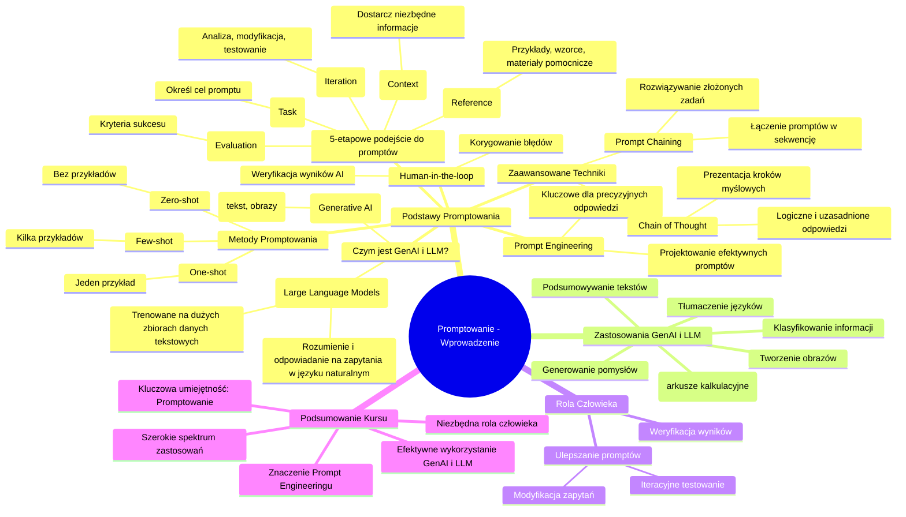

# Materiały dodatkowe - 1. Podsumowanie

# 💡 Diagram

___

# 🗒️ Notatka

# Podsumowanie Kursu: Wprowadzenie do Promptowania

## Wprowadzenie

Poniższe notatki stanowią podsumowanie kluczowych informacji i wskazówek z kursu wprowadzającego do **promptowania**, czyli projektowania efektywnych zapytań dla modeli językowych (LLM) i generatywnej sztucznej inteligencji (GenAI). Celem tego podsumowania jest ułatwienie zrozumienia omawianych zagadnień i ich praktycznego zastosowania w projektach.

## Najważniejsze punkty z podstaw promptowania

### Czym jest GenAI i LLM?

* **GenAI (Generative AI)**, czyli generatywna sztuczna inteligencja, to rodzaj sztucznej inteligencji, która tworzy nowe treści, takie jak tekst i obrazy.
* GenAI wykorzystuje **LLM (Large Language Models)**, czyli duże modele językowe, do generowania treści.
* **LLM** są trenowane na ogromnych zbiorach danych tekstowych, co umożliwia im rozumienie i odpowiadanie na zapytania w języku naturalnym.

### Prompt Engineering - Projektowanie Efektywnych Promptów

* **Prompt engineering**, czyli inżynieria promptów, to proces projektowania efektywnych zapytań (promptów), które pozwalają osiągnąć pożądane rezultaty przy użyciu LLM.
* Efektywne prompty są kluczowe dla uzyskania precyzyjnych i użytecznych odpowiedzi od modeli językowych.

### Pięcioetapowe podejście do tworzenia efektywnych promptów

Materiały kursu rekomendują pięcioetapowe podejście do tworzenia skutecznych promptów:

1. **Zadanie (Task):** Jasno określ, jakie zadanie ma wykonać model językowy. Co chcesz osiągnąć za pomocą promptu?
2. **Kontekst (Context):** Dostarcz modelowi niezbędny kontekst, aby właściwie zrozumiał zadanie. Jakie informacje są istotne dla poprawnego wykonania zadania?
3. **Odniesienie (Reference):** Możesz dostarczyć przykłady, wzorce lub dodatkowe materiały, które pomogą modelowi zrozumieć oczekiwany rezultat.
4. **Ocena (Evaluation):** Określ, w jaki sposób będziesz oceniać wyniki generowane przez model. Jakie kryteria sukcesu zastosujesz?
5. **Iteracja (Iteration):** Proces tworzenia promptów jest iteracyjny. Analizuj wyniki, modyfikuj prompty i testuj ponownie, aby stale ulepszać jakość odpowiedzi.

### Kluczowa rola człowieka (Human-in-the-loop)

* Podejście **human-in-the-loop** jest kluczowe, ponieważ sztuczna inteligencja, w tym LLM, może czasami generować niedokładne lub niepożądane wyniki.
* Człowiek jest niezbędny do weryfikacji wyników generowanych przez AI i korygowania ewentualnych błędów.

### Metody tworzenia promptów

* **Zero-shot:** Model językowy wykonuje zadanie bez żadnych przykładów w prompcie.
* **One-shot:** Model językowy otrzymuje jeden przykład zadania i oczekiwanego wyniku w prompcie.
* **Few-shot:** Model językowy otrzymuje kilka przykładów zadania i oczekiwanych wyników w prompcie.

### Zaawansowane techniki promptowania

* **Prompt chaining (Łańcuch promptów):** Polega na łączeniu kilku promptów w sekwencję, gdzie wynik jednego promptu staje się wejściem dla kolejnego. Umożliwia to rozwiązywanie bardziej złożonych zadań.
* **Chain of thought (Łańcuch myślenia):** Technika, w której prompt zachęca model do przedstawienia kroków myślowych prowadzących do odpowiedzi. Pomaga to modelowi w bardziej logicznym i uzasadnionym generowaniu odpowiedzi, szczególnie w zadaniach wymagających rozumowania.

### Zastosowania GenAI i LLM

GenAI i LLM mają szerokie zastosowanie, w tym:

* **Podsumowywanie tekstów:** Automatyczne generowanie skrótów i streszczeń tekstów.
* **Tłumaczenie języków:** Automatyczne tłumaczenie tekstu z jednego języka na inny.
* **Generowanie pomysłów:** Wykorzystanie LLM do burzy mózgów i generowania nowych idei.
* **Tworzenie obrazów:** Generowanie obrazów na podstawie opisów tekstowych.
* **Generowanie formuł do arkuszy kalkulacyjnych:** Automatyczne tworzenie formuł na podstawie opisów zadań w arkuszach kalkulacyjnych.
* **Klasyfikowanie informacji:** Automatyczne przypisywanie informacji do określonych kategorii.

### Rola człowieka w ulepszaniu wyników i promptów

* Ludzie są niezbędni do **weryfikacji wyników** generowanych przez GenAI i LLM.
* Ludzie odgrywają kluczową rolę w **tworzeniu lepszych promptów** poprzez iteracyjne testowanie i modyfikowanie zapytań.

## Podsumowanie

Kurs wprowadza w podstawy `promptowania`, kluczowej umiejętności w efektywnym wykorzystaniu generatywnej sztucznej inteligencji (GenAI) i dużych modeli językowych (LLM). Podkreślono znaczenie **prompt engineeringu** w projektowaniu zapytań, które prowadzą do pożądanych rezultatów. Przedstawiono pięcioetapowe podejście do tworzenia promptów (zadanie, kontekst, odniesienie, ocena, iteracja) oraz różne metody promptowania (zero-shot, one-shot, few-shot) i zaawansowane techniki (`prompt chaining`, `chain of thought`). Kurs akcentuje również **niezbędną rolę człowieka** w procesie, zarówno w weryfikacji wyników, jak i w ciągłym ulepszaniu promptów. GenAI i LLM mają szerokie spektrum zastosowań, od podsumowywania i tłumaczenia tekstów, po generowanie obrazów i formuł, co czyni umiejętność promptowania niezwykle wartościową w wielu dziedzinach.

___

# 🔉 Transcript
File: Materiały dodatkowe - 1. Podsumowanie.png 
**Podsumowanie Kursu**

Below you will find key information and tips from individual course lessons.  We've compiled the most important points to help you understand the topics discussed and put them into practice. This summary will make it easier for you to remember the main principles and quickly implement the acquired knowledge in your projects.

**Most important points from the basics of prompting**

* GenAI is a type of artificial intelligence that creates new content, such as text and images, using LLMs.
* LLMs are trained on large text datasets, allowing them to understand and respond to natural language queries.
* Prompt engineering involves designing effective prompts that allow you to achieve desired results with LLMs.
* The materials recommend a five-step approach to creating effective prompts: task, context, reference, evaluation, and iteration.
* A human-in-the-loop approach is crucial, as AI can sometimes generate inaccurate results.
* Prompt creation methods include zero-shot, one-shot, and few-shot approaches.
* Advanced techniques include prompt chaining and chain of thought.
* GenAI and LLMs can be used for summarizing texts, translating languages, and generating ideas.
* Other applications include creating images, generating formulas for spreadsheets, and classifying information.
* Humans are needed to verify results and create better prompts.

___
# 🏷️ Tags
#promptowanie #GenAI #generative_AI #LLM #large_language_models #prompt_engineering #efektywne_prompty #zadanie #kontekst #odniesienie #ocena #iteracja #human-in-the-loop #zero-shot #one-shot #few-shot #prompt_chaining #chain_of_thought #podsumowywanie_tekstów #tłumaczenie_języków #generowanie_pomysłów #tworzenie_obrazów #arkusze_kalkulacyjne #klasyfikowanie_informacji #weryfikacja_wyników #ulepszanie_promptów
