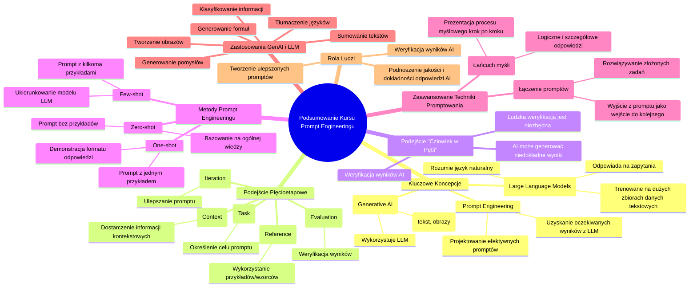

# Materiały dodatkowe - 1. Podsumowanie

# 💡 Diagram

___

# 🗒️ Notatka

# Podsumowanie Kursu

Poniżej znajdziesz kluczowe informacje i wskazówki z poszczególnych lekcji kursu. Zebraliśmy najważniejsze punkty, aby ułatwić Ci zrozumienie omawianych tematów i ich praktyczne zastosowanie. To podsumowanie pomoże Ci utrwalić główne zasady i sprawnie wdrożyć zdobytą wiedzę w Twoich projektach.

## Kluczowe Punkty z Podstaw Promptowania

* **GenAI** (Generative AI): to rodzaj sztucznej inteligencji, która, wykorzystując **LLM** (Large Language Models), generuje nowe treści, takie jak teksty i obrazy.
* **LLM**:  modele językowe trenowane na ogromnych zbiorach danych tekstowych, umożliwiające rozumienie zapytań w języku naturalnym i odpowiadanie na nie.
* **Prompt engineering**: proces projektowania efektywnych `promptów`, które pozwalają na uzyskanie oczekiwanych rezultatów z modeli LLM.
* Kurs zaleca **pięcioetapowe podejście** do tworzenia skutecznych `promptów`:
    - **Zadanie (task)**: Jasne określenie celu, który chcesz osiągnąć za pomocą `promptu`.
    - **Kontekst (context)**: Dostarczenie modelowi LLM niezbędnych informacji kontekstowych.
    - **Odniesienie (reference)**: Wykorzystanie przykładów lub wzorców w `prompcie`, aby ukierunkować odpowiedź.
    - **Ocena (evaluation)**: Weryfikacja, czy uzyskany wynik spełnia oczekiwania.
    - **Iteracja (iteration)**: Ulepszanie `promptu` na podstawie oceny uzyskanych wyników.
* Podejście **"człowiek w pętli" (human-in-the-loop)**: kluczowe ze względu na możliwość generowania niedokładnych wyników przez AI. Weryfikacja przez człowieka jest niezbędna.
* **Metody prompt engineeringu** obejmują podejścia:
    - **Zero-shot**: `Prompt` bez przykładów; model LLM generuje odpowiedź bazując na ogólnej wiedzy.
    - **One-shot**: `Prompt` z jednym przykładem, demonstrującym oczekiwany format odpowiedzi.
    - **Few-shot**: `Prompt` z kilkoma przykładami,  lepiej ukierunkowującymi model LLM.
* **Zaawansowane techniki promptowania**:
    - **Prompt chaining (łączenie promptów)**: Wykorzystanie wyjścia z jednego `promptu` jako wejścia do kolejnego, co umożliwia rozwiązywanie bardziej złożonych zadań.
    - **Chain of thought (łańcuch myśli)**:  `Promptowanie` modelu LLM do prezentowania procesu myślowego krok po kroku, w celu uzyskania bardziej logicznych i szczegółowych odpowiedzi.
* **Zastosowania GenAI i LLM**:
    - Sumowanie tekstów
    - Tłumaczenie języków
    - Generowanie pomysłów
    - Tworzenie obrazów
    - Generowanie formuł do arkuszy kalkulacyjnych
    - Klasyfikowanie informacji
* **Rola ludzi**:
    - Weryfikacja wyników generowanych przez AI.
    - Tworzenie ulepszonych `promptów`,  podnoszących jakość i dokładność odpowiedzi AI.

## Podsumowanie

Ten dokument to zwięzłe podsumowanie najważniejszych zagadnień z kursu `prompt engineeringu`. Kurs wprowadza koncepcje **GenAI** i **LLM**, wyjaśniając, w jaki sposób te technologie kreują nowe treści i jak efektywnie nimi sterować za pomocą `prompt engineeringu`.  Podkreślono znaczenie **pięcioetapowego podejścia** do tworzenia `promptów` oraz kluczową rolę **ludzkiej weryfikacji**. Omówiono zarówno podstawowe, jak i zaawansowane **metody promptowania**, prezentując szerokie spektrum **zastosowań GenAI i LLM**, od streszczania tekstów po generowanie grafik i formuł.  Kluczowym wnioskiem jest nieodzowność **ludzkiej interwencji i umiejętności formułowania efektywnych promptów** dla pełnego wykorzystania potencjału sztucznej inteligencji.

___

# 🔉 Transcript
File: Materiały dodatkowe - 1. Podsumowanie.png 
**Podsumowanie Kursu**

Below you will find key information and tips from individual course lessons. We have compiled the most important points to help you understand the topics discussed and apply them in practice. Thanks to this summary, you will more easily remember the main principles and quickly implement the acquired knowledge in your projects.

**Most important points from the basics of prompting**

* GenAI is a type of artificial intelligence that creates new content, such as texts and images, using LLMs.
* LLMs are trained on large datasets of text, allowing them to understand and respond to natural language queries.
* Prompt engineering involves designing effective prompts that allow you to get the desired results from LLMs.
* The materials recommend a five-step approach to creating effective prompts: task, context, reference, evaluation, and iteration.
* A human-in-the-loop approach is crucial because AI can sometimes generate inaccurate results.
* Prompt engineering methods include zero-shot, one-shot, and few-shot approaches.
* Advanced techniques include prompt chaining and chain of thought.
* GenAI and LLMs can be used for summarizing texts, translating languages, and generating ideas.
* Other applications include creating images, generating formulas for spreadsheets, and classifying information.
* Humans are needed to verify results and create better prompts.

___
# 🏷️ Tags
#GenAI #Generative_AI #LLM #Large_Language_Models #prompt_engineering #prompt #task #context #reference #evaluation #iteration #human-in-the-loop #zero-shot #one-shot #few-shot #prompt_chaining #chain_of_thought #text_summarization #language_translation #idea_generation #image_creation #spreadsheet_formulas #information_classification #AI_verification #AI_accuracy #effective_prompts #five-step_approach #ludzka_weryfikacja #metody_promptowania #zastosowania_GenAI_i_LLM #ludzka_interwencja
