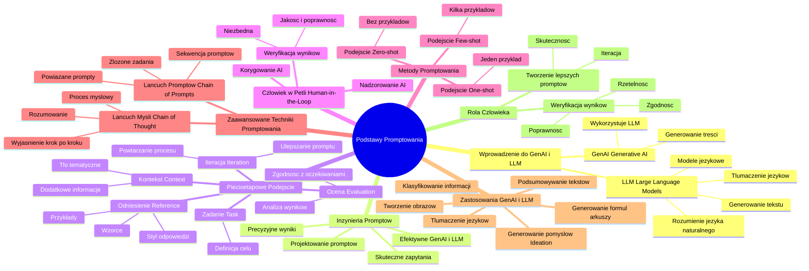

# Materiały dodatkowe - 1. Podsumowanie

# 💡 Diagram

___

# 🗒️ Notatka

# Podsumowanie Kursu: Podstawy Promptowania

Ten dokument zawiera szczegółowe notatki i podsumowanie kluczowych informacji z kursu "Podstawy Promptowania". Kurs koncentruje się na zrozumieniu **GenAI** i **LLM**, oraz na efektywnym tworzeniu `promptów`, aby osiągnąć pożądane rezultaty. Poniższe notatki pomogą Ci utrwalić wiedzę i zastosować ją w praktyce.

## Kluczowe Aspekty Podstaw Promptowania

### Wprowadzenie do GenAI i LLM

* **GenAI (Generative AI)**: To rodzaj sztucznej inteligencji, który generuje nowe treści – teksty, obrazy, muzykę, kod i inne dane. **GenAI** wykorzystuje **LLM (Large Language Models)** do tworzenia tych treści.
* **LLM (Large Language Models)**: To rozbudowane modele językowe, trenowane na ogromnych zbiorach danych tekstowych. Dzięki temu **LLM** rozumieją język naturalny i potrafią generować tekst, tłumaczyć języki oraz wykonywać inne zadania językowe, odpowiadając na zapytania w języku naturalnym.

### Inżynieria Promptów

* **Inżynieria promptów**: To proces projektowania skutecznych `promptów` (zapytań) dla **LLM**. Celem jest tworzenie `promptów`, które pozwolą uzyskać precyzyjne i pożądane wyniki z modeli językowych. Dobrze skonstruowany `prompt` jest kluczowy dla efektywnego wykorzystania **GenAI** i **LLM**.

### Pięcioetapowe Podejście do Tworzenia Efektywnych Promptów

Materiały kursu rekomendują pięcioetapowe podejście do tworzenia efektywnych `promptów`:

1. **Zadanie (Task)**: Zdefiniuj jasno zadanie, które ma wykonać model językowy. Określ cel `promptu`.
2. **Kontekst (Context)**: Dostarcz modelowi niezbędny kontekst, aby ułatwić mu zrozumienie zadania. Kontekst może obejmować dodatkowe informacje, tło tematyczne lub ograniczenia.
3. **Odniesienie (Reference)**: Wprowadź przykłady, wzorce lub preferowany styl odpowiedzi. Jest to szczególnie przydatne w podejściach `one-shot` i `few-shot`.
4. **Ocena (Evaluation)**: Przeanalizuj wyniki wygenerowane przez model. Sprawdź, czy odpowiedź jest zgodna z oczekiwaniami i czy realizuje cel zadania.
5. **Iteracja (Iteration)**: Na podstawie oceny, ulepsz `prompt` i powtórz proces. Iteracja jest kluczowa dla optymalizacji `promptów` i uzyskiwania coraz lepszych wyników.

### Człowiek w Pętli (Human-in-the-Loop)

* **Podejście z człowiekiem w pętli**: Jest niezwykle istotne, ponieważ **GenAI** i **LLM**, pomimo zaawansowania, mogą generować wyniki nieprecyzyjne, nieprawdziwe lub niepożądane. **Weryfikacja wyników przez człowieka jest niezbędna**, aby zapewnić jakość i poprawność generowanych treści. Człowiek odgrywa kluczową rolę w nadzorowaniu i korygowaniu pracy **AI**.

### Metody Tworzenia Promptów

* **Podejście Zero-shot**: Model jest pytany o coś, czego nie widział wcześniej w kontekście treningowym. Oczekuje się poprawnej odpowiedzi bez przykładów.
* **Podejście One-shot**: Dostarcza się jeden przykład zadania i oczekiwanej odpowiedzi, a następnie model jest proszony o wykonanie podobnego zadania.
* **Podejście Few-shot**: Dostarcza się kilka przykładów zadania i oczekiwanych odpowiedzi, aby model lepiej zrozumiał wzorzec i generował bardziej precyzyjne wyniki.

### Zaawansowane Techniki Promptowania

* **Łańcuch Promptów (Chain of Prompts)**: Metoda polegająca na dzieleniu złożonego zadania na sekwencję mniejszych, powiązanych `promptów`. Wynik jednego `promptu` staje się kontekstem dla kolejnego, co umożliwia modelowi bardziej skomplikowane i logiczne rozumowanie.
* **Łańcuch Myśli (Chain of Thought)**: Technika zachęcająca model do ujawnienia procesu myślowego prowadzącego do odpowiedzi. `Prompt` prosi model nie tylko o odpowiedź, ale także o krok po kroku wyjaśnienie, jak do niej doszedł. To poprawia jakość odpowiedzi w zadaniach wymagających rozumowania.

### Zastosowania GenAI i LLM

**GenAI** i **LLM** znajdują zastosowanie w wielu obszarach, w tym:

* **Podsumowywanie tekstów**: Automatyczne generowanie skrótów i streszczeń długich tekstów.
* **Tłumaczenie języków**: Przekład tekstu z jednego języka na drugi.
* **Generowanie pomysłów (Ideation)**: Wspomaganie kreatywności poprzez generowanie nowych koncepcji i inspiracji.
* **Tworzenie obrazów**: Generowanie grafik i ilustracji na podstawie opisów tekstowych.
* **Generowanie formuł do arkuszy kalkulacyjnych**: Automatyczne tworzenie formuł w programach typu Excel lub Google Sheets.
* **Klasyfikowanie informacji**: Automatyczne przypisywanie danych do odpowiednich kategorii.

### Rola Człowieka w Kontekście GenAI i LLM

* **Weryfikacja wyników**: Człowiek jest niezbędny do oceny i weryfikacji wyników generowanych przez **GenAI** i **LLM**, aby zapewnić ich poprawność, rzetelność i zgodność z oczekiwaniami.
* **Tworzenie lepszych promptów**: Doświadczenie i wiedza człowieka są kluczowe w iteracyjnym procesie ulepszania `promptów`. Analizując wyniki i identyfikując niedoskonałości, człowiek może tworzyć coraz skuteczniejsze zapytania, co przekłada się na lepszą wydajność modeli językowych.

## Podsumowanie

Kurs "Podstawy Promptowania" wprowadza w świat Generatywnej Sztucznej Inteligencji (**GenAI**) i Dużych Modeli Językowych (**LLM**). Kluczowym elementem efektywnego wykorzystania tych technologii jest inżynieria `promptów`, czyli umiejętność tworzenia skutecznych zapytań. Kurs podkreśla pięcioetapowe podejście do tworzenia `promptów`, metody `promptowania` (`zero-shot`, `one-shot`, `few-shot`) oraz zaawansowane techniki, takie jak łańcuch `promptów` i łańcuch myśli. Niezwykle istotna jest rola człowieka w pętli, który weryfikuje wyniki i udoskonala `prompty`. **GenAI** i **LLM** mają szerokie spektrum zastosowań, od podsumowywania tekstów po generowanie obrazów, a ich potencjał jest ogromny, pod warunkiem umiejętnego `promptowania` i ludzkiego nadzoru.

___

# 🔉 Transcript
File: Materiały dodatkowe - 1. Podsumowanie.png 
**Podsumowanie Kursu**

Poniżej znajdziesz kluczowe informacje i wskazówki z poszczególnych lekcji kursu. Zebraliśmy najważniejsze punkty, które pomogą Ci zrozumieć omawiane tematy oraz zastosować je w praktyce. Dzięki temu podsumowaniu łatwiej zapamiętasz główne zasady i szybciej wdrożysz zdobytą wiedzę w swoich projektach.

**Najważniejsze punkty z podstaw promptowania**

* GenAI to rodzaj sztucznej inteligencji, która tworzy nowe treści, takie jak teksty i obrazy, wykorzystując LLM.
* LLM są trenowane na dużych zbiorach danych tekstowych, co pozwala im rozumieć i odpowiadać na naturalne językowe zapytania.
* Inżynieria promptów polega na projektowaniu skutecznych promptów, które pozwalają uzyskać pożądane wyniki z LLM.
* Materiały rekomendują pięcioetapowe podejście do tworzenia skutecznych promptów: zadanie, kontekst, odniesienie, ocena i iteracja.
* Podejście z człowiekiem w pętli (human-in-the-loop) jest kluczowe, ponieważ AI może czasem generować nieprecyzyjne wyniki.
* Metody tworzenia promptów obejmują podejście zero-shot, one-shot i few-shot.
* Zaawansowane techniki obejmują łańcuch promptów i łańcuch myśli.
* GenAI i LLM mogą być wykorzystywane do podsumowywania tekstów, tłumaczenia języków i generowania pomysłów.
* Inne zastosowania to tworzenie obrazów, generowanie formuł do arkuszy i klasyfikowanie informacji.
* Człowiek jest potrzebny do weryfikacji wyników i tworzenia lepszych promptów.

___
# 🏷️ Tags
#podsumowanie_kursu #promptowanie #GenAI #LLM #sztuczna_inteligencja #modele_językowe #inżynieria_promptów #prompt #zadanie #kontekst #odniesienie #ocena #iteracja #podejście_pięcioetapowe #człowiek_w_pętli #human-in-the-loop #weryfikacja_wyników #metody_promptowania #zero-shot #one-shot #few-shot #techniki_promptowania #łańcuch_promptów #chain_of_prompts #łańcuch_myśli #chain_of_thought #zastosowania_GenAI #zastosowania_LLM #podsumowywanie_tekstów #tłumaczenie_języków #generowanie_pomysłów #ideation #tworzenie_obrazów #generowanie_formuł #arkusze_kalkulacyjne #klasyfikowanie_informacji #rola_człowieka #ulepszanie_promptów #efektywne_promptowanie #nadzór_ludzki
