# Materiały dodatkowe - 1. Podsumowanie

# 💡 Diagram

```mermaid
mindmap
  root((Podsumowanie Kursu: Podstawy Promptowania))
    GenAI & LLM
      GenAI
        Generative AI
        Creates Content (Text, Images)
        Uses LLMs
      LLM
        Large Language Models
        Trained on Text Data
        Understands Natural Language
    Prompt Engineering
      Designing Effective Prompts
      Desired Results from LLM
    5-etapowe podejście (5-Step Approach)
      Zadanie (Task)
        Define Goal
      Kontekst (Context)
        Provide Info
      Odniesienie (Reference)
        Examples, Formats
      Ocena (Evaluation)
        Quality Criteria
      Iteracja (Iteration)
        Improve Prompt
    Człowiek w pętli (Human-in-the-loop)
      AI Inaccuracy Possible
      Human Verification Needed
      Ensure Quality
    Metody Prompt Engineeringu (Prompt Engineering Methods)
      Zero-shot
      One-shot
      Few-shot
      Prompt Chaining
      Chain of Thought
    Zastosowania GenAI/LLM (Applications)
      Podsumowywanie Tekstów (Summarizing Texts)
      Tłumaczenie Języków (Translating Languages)
      Generowanie Pomysłów (Generating Ideas)
      Tworzenie Obrazów (Creating Images)
      Generowanie Formuł (Generating Formulas)
      Klasyfikowanie Informacji (Classifying Information)
    Rola Człowieka (Role of Human)
      Weryfikacja Wyników AI (Verify AI Results)
      Tworzenie Lepszych Promptów (Create Better Prompts)
      Doskonalenie Prompt Engineeringu (Improve Prompt Engineering)
```

___

# 🗒️ Notatka

# Podsumowanie Kursu: Kluczowe Punkty z Podstaw Promptowania

Niniejsze notatki to podsumowanie kluczowych informacji i wskazówek z kursu podstaw promptowania. Zebraliśmy najważniejsze punkty, aby ułatwić zrozumienie i praktyczne zastosowanie omawianych zagadnień. To podsumowanie pomoże utrwalić główne zasady i sprawniej wdrożyć zdobytą wiedzę w projektach.

## Najważniejsze punkty z podstaw promptowania:

* **GenAI (Generative AI):**
    * Rodzaj sztucznej inteligencji, która tworzy nowe treści, takie jak teksty i obrazy.
    * Wykorzystuje do tego **LLM (Large Language Models)**, czyli duże modele językowe.

* **LLM (Large Language Models - Duże Modele Językowe):**
    * Trenowane na ogromnych zbiorach danych tekstowych.
    * Dzięki temu rozumieją język naturalny i potrafią na niego odpowiadać.

* **Prompt engineering (Inżynieria promptów):**
    * Polega na projektowaniu efektywnych promptów (zapytań).
    * Celem jest uzyskanie pożądanych rezultatów od LLM.

* **Pięcioetapowe podejście do tworzenia efektywnych promptów:**
    * **Zadanie (Task):** Jasne określenie celu, który chcemy osiągnąć.
    * **Kontekst (Context):** Dostarczenie modelowi niezbędnych informacji i tła.
    * **Odniesienie (Reference):** Wskazanie przykładów, wzorców lub formatów oczekiwanej odpowiedzi.
    * **Ocena (Evaluation):** Kryteria oceny jakości odpowiedzi modelu.
    * **Iteracja (Iteration):** Proces ulepszania promptu na podstawie oceny wyników.

* **Podejście "człowiek w pętli" (Human-in-the-loop):**
    * Jest kluczowe, ponieważ AI może generować niedokładne wyniki.
    * Weryfikacja ludzka jest niezbędna dla zapewnienia jakości i poprawności treści.

* **Metody prompt engineeringu:**
    * **Zero-shot:** Model generuje odpowiedź bez przykładów.
    * **One-shot:** Model otrzymuje jeden przykład wejściowy i oczekiwaną odpowiedź.
    * **Few-shot:** Model otrzymuje kilka przykładów wejściowych i oczekiwanych odpowiedzi.
    * **Prompt chaining (Łańcuch promptów):** Wykorzystanie wyjścia z jednego promptu jako wejścia do kolejnego, aby rozwiązywać złożone zadania.
    * **Chain of thought (Łańcuch myśli):** Technika zachęcająca model do przedstawienia kroków rozumowania prowadzących do odpowiedzi, co poprawia jakość i przejrzystość generowanych treści.

* **Zastosowania GenAI i LLM:**
    * Podsumowywanie tekstów
    * Tłumaczenie języków
    * Generowanie pomysłów
    * Tworzenie obrazów
    * Generowanie formuł do arkuszy kalkulacyjnych
    * Klasyfikowanie informacji

* **Rola człowieka:**
    * Weryfikacja wyników generowanych przez AI.
    * Tworzenie lepszych i bardziej efektywnych promptów.
    * Ciągłe doskonalenie procesu prompt engineeringu.

---

**Podsumowanie:**

Kurs podstaw promptowania koncentruje się na zrozumieniu i efektywnym wykorzystaniu GenAI i LLM, kładąc nacisk na **inżynierię promptów** – kluczową umiejętność tworzenia zapytań generujących pożądane rezultaty z modeli językowych. Podkreślono znaczenie pięcioetapowego podejścia (zadanie, kontekst, odniesienie, ocena, iteracja) oraz koncepcji "człowiek w pętli" w kontekście potencjalnych niedoskonałości AI. Kurs prezentuje różnorodne metody **prompt engineeringu**, takie jak zero-shot, one-shot, few-shot, **prompt chaining** i **chain of thought**, i omawia szerokie spektrum zastosowań GenAI i LLM, od podsumowywania i tłumaczenia po generowanie obrazów i formuł. Podsumowując, kurs akcentuje niezastąpioną rolę człowieka w weryfikacji i ciągłym doskonaleniu promptów, co jest fundamentem efektywnego wykorzystania potencjału generatywnej sztucznej inteligencji.

___

# 🔉 Transcript
File: Materiały dodatkowe - 1. Podsumowanie.png 
**Podsumowanie Kursu**

Below you will find key information and tips from individual course lessons. We have collected the most important points to help you understand the topics discussed and put them into practice. Thanks to this summary, you will more easily remember the main principles and quickly implement the acquired knowledge in your projects.

**Most important points from the basics of prompting**

* GenAI is a type of artificial intelligence that creates new content, such as texts and images, using LLMs.
* LLMs are trained on large datasets of text, allowing them to understand and respond to natural language queries.
* Prompt engineering involves designing effective prompts that allow you to achieve desired results with LLMs.
* The materials recommend a five-step approach to creating effective prompts: task, context, reference, evaluation, and iteration.
* A human-in-the-loop approach is crucial, as AI can sometimes generate inaccurate results.
* Prompt engineering methods include zero-shot, one-shot, and few-shot approaches.
* Advanced techniques include prompt chaining and chain of thought.
* GenAI and LLMs can be used for summarizing texts, translating languages, and generating ideas.
* Other applications include creating images, generating formulas for spreadsheets, and classifying information.
* Humans are needed to verify results and create better prompts.

___
# 🏷️ Tags
#GenAI #Generative_AI #LLM #Large_Language_Models #Prompt_engineering #Prompt #Task #Context #Reference #Evaluation #Iteration #Human-in-the-loop #Zero-shot #One-shot #Few-shot #Prompt_chaining #Chain_of_thought #Sztuczna_inteligencja #Modele_językowe #Inżynieria_promptów #Weryfikacja_ludzka #Zastosowania_GenAI #Zastosowania_LLM #Podsumowywanie_tekstów #Tłumaczenie_języków #Generowanie_pomysłów #Tworzenie_obrazów #Formuły_arkuszy_kalkulacyjnych #Klasyfikowanie_informacji
