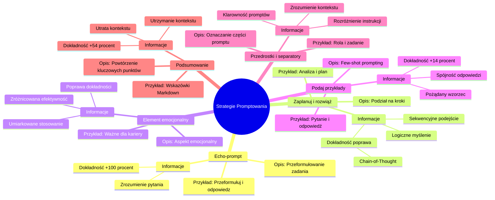

# Materiały dodatkowe - 2. Strategie promptowania

# 💡 Diagram

___

# 🗒️ Notatka

# Notatki i Podsumowanie Strategii Promptowania 🚀

## Wprowadzenie

Ten dokument zawiera szczegółowe notatki i podsumowanie strategii **promptowania**, przedstawionych w dalszej części. Strategie te mają na celu podniesienie jakości i precyzji odpowiedzi generowanych przez modele językowe, poprzez umiejętne formułowanie zapytań (promptów).  Niniejsze notatki bazują na tabeli, która omawia różnorodne strategie, prezentuje przykładowe elementy promptów oraz dostarcza dodatkowych informacji dotyczących ich efektywności.

## Szczegółowe Notatki Strategii Promptowania

### Echo-prompt 🗣️

#### Opis
Strategia **Echo-prompt** polega na zleceniu modelowi językowemu przeformułowania i rozwinięcia otrzymanego zadania, a następnie powtórzenia go na początku generowanej odpowiedzi.  Działa to jako mechanizm weryfikujący, czy model poprawnie zrozumiał intencję zapytania.

#### Przykładowy element prompta
`\"Przeformułuj i rozwiń pytanie, a następnie na nie odpowiedz.\"`

#### Dodatkowe informacje
*   Ułatwia modelowi **pełniejsze zrozumienie** zadanego pytania.
*   **Zwiększa dokładność** odpowiedzi nawet o **+100%**. 💯
*   Stanowi efektywną metodę upewnienia się, że model właściwie interpretuje intencje użytkownika.

### Zaplanuj i rozwiąż (Plan and Solve) ✍️

#### Opis
Strategia **Zaplanuj i rozwiąż** koncentruje się na skłonieniu modelu do rozbicia złożonego zadania na mniejsze, logicznie powiązane kroki. Model w pierwszej kolejności opracowuje plan działania, a następnie systematycznie go realizuje, często uwzględniając określone parametry.

#### Przykładowy element prompta
`\"Zacznijmy od analizy problemu i opracowania planu rozwiązania. Następnie, krok po kroku, zrealizujmy ten plan.\"`

#### Dodatkowe informacje
*   Gwarantuje **poprawę dokładności o +5-15.8%** w porównaniu do metody `zero-shot` (bez przykładów) `Chain-of-Thought`.
*   Sama metoda `Chain-of-Thought`  przynosi **wzrost dokładności o +13% do 41%** w stosunku do standardowego promptowania.
*   Strategia ta jest szczególnie wartościowa przy rozwiązywaniu problemów wymagających **logicznego myślenia** i **sekwencyjnego podejścia**.

### Element emocjonalny ❤️

#### Opis
Strategia **Element emocjonalny** polega na subtelnym wpleceniu aspektów emocjonalnych w prompt, aby zmotywować model do generowania odpowiedzi o wyższej jakości. Sugeruje się, że dodanie elementu emocjonalnego może pozytywnie wpłynąć na zaangażowanie modelu w zadanie.

#### Przykładowy element prompta
`\"To zadanie ma kluczowe znaczenie dla mojego rozwoju zawodowego.\"`

#### Dodatkowe informacje
*   Może skutkować **poprawą dokładności odpowiedzi** w zakresie **od +8% do +115%**.
*   Efektywność elementu emocjonalnego może być **zróżnicowana** i zależeć od specyfiki zadania oraz wykorzystywanego modelu.
*   Kluczowe jest **umiarkowane i rozważne** stosowanie elementów emocjonalnych.

### Podaj przykłady (Few-shot prompting) 💡

#### Opis
Strategia **Podaj przykłady**, znana również jako `few-shot prompting`, opiera się na włączeniu do promptu 3-5 przykładów pytań wraz z oczekiwanymi, prawidłowymi odpowiedziami.  Jej celem jest ukierunkowanie modelu na pożądany styl i format generowanych odpowiedzi.

#### Przykładowy element prompta
`P: \"Jaka jest stolica Włoch?\" O: \"Rzym.\"` (i kolejne przykłady)

#### Dodatkowe informacje
*   Zapewnia **+14% wzrost dokładności odpowiedzi**.
*   **Zwiększa spójność** odpowiedzi z oczekiwaniami użytkownika pod względem stylu i formatu.
*   Przykłady skutecznie pomagają modelowi **zrozumieć pożądany wzorzec odpowiedzi**.

### Przedrostki i separatory 🗂️

#### Opis
Strategia **Przedrostki i separatory** wykorzystuje przedrostki (np. `\"Rola:\"`) lub separatory (np. `###`, `\"\"\"`) w strukturze promptu.  Służy to **jasnemu oznaczaniu** poszczególnych części promptu i **poprawie jego czytelności**.

#### Przykładowy element prompta
`\"Rola: analityk ### Zadanie: Przeanalizuj poniższe dane\"`

#### Dodatkowe informacje
*   **Zwiększają klarowność** formułowanych promptów.
*   Pomagają modelowi w **lepszym zrozumieniu kontekstu** i poszczególnych elementów zadania.
*   Ułatwiają modelowi **rozróżnienie** między różnymi instrukcjami lub informacjami zawartymi w prompcie.

### Podsumowanie (Summarization) 📝

#### Opis
Strategia **Podsumowanie** polega na zwięzłym powtórzeniu kluczowych aspektów promptu, ze szczególnym uwzględnieniem ograniczeń i oczekiwanego formatu odpowiedzi. Jest to szczególnie istotne w przypadku dłuższych promptów, gdzie model może stracić orientację w kontekście.

#### Przykładowy element prompta
`\"Nie udzielaj odpowiedzi, zamiast tego przedstaw wskazówki. Sformatuj swoją odpowiedź w formacie Markdown.\"`

#### Dodatkowe informacje
*   Model może **stracić kontekst**, zwłaszcza gdy kluczowe informacje znajdują się w środkowej części rozbudowanego promptu.
*   Strategia podsumowania pomaga w **utrzymaniu kontekstu** i przypomnieniu modelowi najważniejszych instrukcji.
*   Poprawa dokładności może sięgać **+54%**.

## Podsumowanie Strategii Promptowania 🎯

Przedstawione strategie **promptowania** stanowią zbiór sześciu efektywnych metod, które mogą znacząco wpłynąć na jakość i dokładność odpowiedzi generowanych przez modele językowe.  Strategie te obejmują:

*   **Echo-prompt:**  Weryfikacja zrozumienia zadania przez model poprzez jego przeformułowanie.
*   **Zaplanuj i rozwiąż:**  Podział zadania na logiczne etapy i planowanie procesu rozwiązania.
*   **Element emocjonalny:**  Motywowanie modelu poprzez subtelne wplecenie aspektów emocjonalnych.
*   **Podaj przykłady:**  Dostarczanie modelowi przykładów oczekiwanych odpowiedzi.
*   **Przedrostki i separatory:**  Strukturyzacja promptu w celu zwiększenia jego klarowności.
*   **Podsumowanie:**  Powtarzanie kluczowych instrukcji w rozbudowanych promptach.

Wykorzystanie tych strategii może znacząco **udoskonalić interakcję** z modelami językowymi i umożliwić uzyskiwanie **bardziej precyzyjnych i satysfakcjonujących rezultatów**. Wybór optymalnej strategii powinien być podyktowany specyfiką konkretnego zadania i oczekiwanymi efektami.

___

# 🔉 Transcript
File: Materiały dodatkowe - 2. Strategie promptowania.jpg 
Oto transkrypcja tekstu z załączonych obrazów w języku polskim:

| Nazwa strategii | Opis | Przykładowy element prompta | Dodatkowe informacje |
|---|---|---|---|
| Echo-prompt | Model ma przeformułować i rozwinąć otrzymane zadanie, a następnie powtórzyć je na początku swojej wypowiedzi. | "Przeformułuj i rozwiń pytanie, a potem na nie odpowiedź." | Poprawia zrozumienie pytania, zwiększa dokładność odpowiedzi o nawet +100% |
| Zaplanuj i rozwiąż | Model dzieli zadanie na kroki, realizuje je zgodnie z przygotowanym planem i (opcjonalnie) określonymi parametrami. | "Zacznijmy od zrozumienia problemu i stworzenia planu rozwiązania. Następnie, krok po kroku, realizujemy ten plan." | +5-15.8% lepsza dokładność niż zero-shot (bez przykładów) Chain-of-Thought, który sam daje +13% to 41% większą dokładność. |
| Element emocjonalny | Delikatny aspekt emocjonalny w promptcie motywuje model do wyższej jakości pracy. | "To zadanie jest bardzo ważne dla mojej kariery." | Między +8% a +115% poprawy w dokładności odpowiedzi. |
| Podaj przykłady | Uwzględnienie 3-5 przykładów pytań i prawidłowych odpowiedzi, aby uzyskać odpowiedź w oczekiwanym stylu i formacie. | P: "Jaka jest stolica Francji?" O: "Paryż." | +14% poprawa w dokładności odpowiedzi, większa spójność z oczekiwaniami |
| Przedrostki i separatory | Używanie przedrostków (np. "Rola:") lub separatorów (np. ###, """), aby oznaczać kolejne części promptów. | "Rola: analityk ### Zadanie: Przeanalizuj poniższe dane" | Poprawia klarowność promptów i pomaga w lepszym zrozumieniu kontekstu przez model. |
| Podsumowanie | Zwięzłe powtórzenie kluczowych punktów promptu, szczególnie ograniczeń i formatu odpowiedzi | "Nie podawaj odpowiedzi i zamiast tego udzielaj wskazówek. Formatuj swoją odpowiedź w formacie Markdown." | Model może zgubić kontekst, gdy kluczowe informacje znajdują się w środku dłuższego kontekstu. Poprawa dokładności +54% |

___
# 🏷️ Tags
#promptowanie #modele_językowe #echo-prompt #pełniejsze_zrozumienie #dokładność #plan_and_solve #zero-shot #Chain-of-Thought #logiczne_myślenie #sekwencyjne_podejście #element_emocjonalny #few-shot_prompting #spójność_odpowiedzi #przedrostki_i_separatory #klarowność_promptów #podsumowanie #utrzymanie_kontekstu #udoskonalenie_interakcji #satysfakcjonujące_rezultaty #precyzyjne_rezultaty #strategie_promptowania
