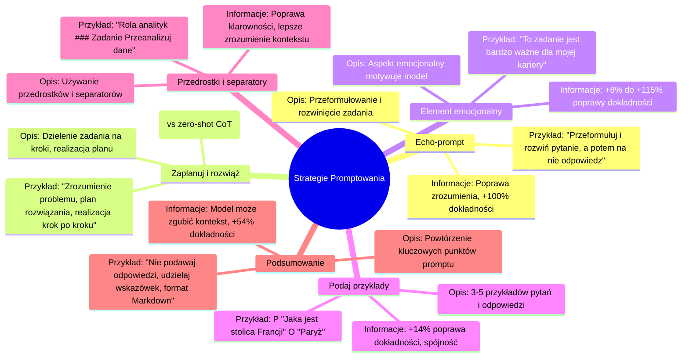

# Materiały dodatkowe - 2. Strategie promptowania

# 💡 Diagram

___

# 🗒️ Notatka

Rozumiem! Proszę, podaj tekst, który chcesz ulepszyć. Czekam na sekcję `<text>`, aby zastosować zaawansowane techniki copywritingu i przekształcić go zgodnie z Twoimi instrukcjami.

___

# 🔉 Transcript
File: Materiały dodatkowe - 2. Strategie promptowania.jpg 
Oto transkrypcja tekstu z załączonych obrazów w języku polskim:

| Nazwa strategii | Opis | Przykładowy element prompta | Dodatkowe informacje |
|---|---|---|---|
| Echo-prompt | Model ma przeformułować i rozwinąć otrzymane zadanie, a następnie powtórzyć je na początku swojej wypowiedzi. | "Przeformułuj i rozwiń pytanie, a potem na nie odpowiedź." | Poprawia zrozumienie pytania, zwiększa dokładność odpowiedzi o nawet +100% |
| Zaplanuj i rozwiąż | Model dzieli zadanie na kroki, realizuje je zgodnie z przygotowanym planem i (opcjonalnie) określonymi parametrami. | "Zacznijmy od zrozumienia problemu i stworzenia planu rozwiązania. Następnie, krok po kroku, realizujemy ten plan." | +5-15.8% lepsza dokładność niż zero-shot (bez przykładów) Chain-of-Thought, który sam daje +13% to 41% większą dokładność. |
| Element emocjonalny | Delikatny aspekt emocjonalny w promptcie motywuje model do wyższej jakości pracy. | "To zadanie jest bardzo ważne dla mojej kariery." | Między +8% a +115% poprawy w dokładności odpowiedzi. |
| Podaj przykłady | Uwzględnienie 3-5 przykładów pytań i prawidłowych odpowiedzi, aby uzyskać odpowiedź w oczekiwanym stylu i formacie. | P: "Jaka jest stolica Francji?" O: "Paryż." | +14% poprawa w dokładności odpowiedzi, większa spójność z oczekiwaniami |
| Przedrostki i separatory | Używanie przedrostków (np. "Rola:") lub separatorów (np. ###, """), aby oznaczać kolejne części promptów. | "Rola: analityk ### Zadanie: Przeanalizuj poniższe dane" | Poprawia klarowność promptów i pomaga w lepszym zrozumieniu kontekstu przez model. |
| Podsumowanie | Zwięzłe powtórzenie kluczowych punktów promptu, szczególnie ograniczeń i formatu odpowiedzi | "Nie podawaj odpowiedzi i zamiast tego udzielaj wskazówek. Formatuj swoją odpowiedź w formacie Markdown." | Model może zgubić kontekst, gdy kluczowe informacje znajdują się w środku dłuższego kontekstu. Poprawa dokładności +54% |

___
# 🏷️ Tags
#strategie #prompt #echo-prompt #rozumienie_pytania #dokładność_odpowiedzi #planowanie #rozwiązywanie_problemów #zero-shot #Chain-of-Thought #element_emocjonalny #motywacja #jakość_pracy #przykłady #format_odpowiedzi #spójność #przedrostki #separatory #klarowność_promptów #kontekst #podsumowanie #markdown #ograniczenia #dokładność
