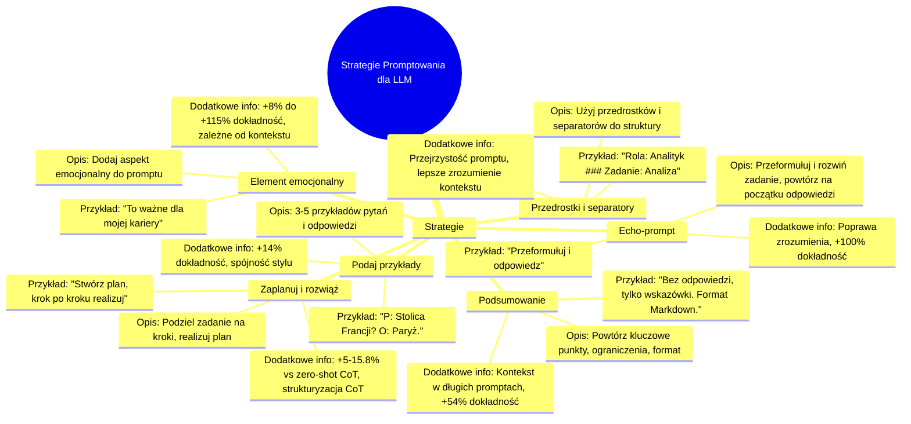

# Materiały dodatkowe - 2. Strategie promptowania

# 💡 Diagram

___

# 🗒️ Notatka

# Strategie Promptowania dla Dużych Modeli Językowych - Szczegółowe Notatki i Podsumowanie

Ten dokument zawiera szczegółowe notatki i podsumowanie strategii promptowania dla dużych modeli językowych. Przedstawione strategie mają na celu poprawę jakości i dokładności odpowiedzi generowanych przez te modele.

## Notatki Szczegółowe

### Wprowadzenie do Strategii Promptowania

W niniejszym dokumencie omówiono strategie promptowania, które można zastosować, aby efektywniej korzystać z dużych modeli językowych.  Poniżej znajduje się opis strategii, ich charakterystyka, przykładowe elementy promptów oraz informacje dotyczące skuteczności każdej z nich.

### 1. Echo-prompt

* **Nazwa strategii:** `Echo-prompt`
* **Opis:** Model powinien przeformułować i rozwinąć otrzymane zadanie, a następnie powtórzyć je na początku swojej odpowiedzi. Ta strategia ma na celu upewnienie się, że model prawidłowo zrozumiał zadanie oraz skupienie jego uwagi na kluczowych aspektach.
* **Przykładowy element prompta:** "Przeformułuj i rozwiń pytanie, a następnie na nie odpowiedz."
* **Dodatkowe informacje:**
    * Poprawia zrozumienie pytania przez model.
    * Zwiększa dokładność odpowiedzi nawet o +100%.
    * Sugeruje się, że powtórzenie zadania na początku odpowiedzi pomaga modelowi utrzymać kontekst i cel zadania podczas generowania odpowiedzi.

### 2. Zaplanuj i rozwiąż (`Plan and Solve`)

* **Nazwa strategii:** `Zaplanuj i rozwiąż` (`Plan and Solve`)
* **Opis:** Model dzieli zadanie na mniejsze kroki i realizuje je zgodnie z przygotowanym planem oraz (opcjonalnie) określonymi parametrami. Ta strategia symuluje proces myślowy krok po kroku, co jest szczególnie przydatne w bardziej złożonych zadaniach.
* **Przykładowy element prompta:** "Zacznij od zrozumienia problemu i stworzenia planu rozwiązania. Następnie, krok po kroku, zrealizuj ten plan."
* **Dodatkowe informacje:**
    * Zapewnia o +5-15.8% lepszą dokładność w porównaniu do `zero-shot Chain-of-Thought` (bez przykładów).
    * `Zero-shot Chain-of-Thought` samo w sobie daje +13% do 41% większą dokładność w porównaniu do standardowego promptowania `zero-shot`.
    * Strategia `Zaplanuj i rozwiąż` jest zaawansowaną formą `Chain-of-Thought`, która dodatkowo strukturyzuje proces rozwiązywania problemu.

### 3. Element emocjonalny (`Emotional Element`)

* **Nazwa strategii:** `Element emocjonalny` (`Emotional Element`)
* **Opis:** Delikatne wprowadzenie aspektu emocjonalnego do promptu może zmotywować model do generowania odpowiedzi wyższej jakości. Sugeruje się, że modele językowe reagują na subtelne wskazówki emocjonalne w promptach, co wpływa na ich wydajność.
* **Przykładowy element prompta:** "To zadanie jest bardzo ważne dla mojej kariery."
* **Dodatkowe informacje:**
    * Poprawa dokładności odpowiedzi w zakresie od +8% do +115%.
    * Szeroki zakres poprawy sugeruje, że skuteczność elementu emocjonalnego może być silnie zależna od kontekstu zadania i specyficznego modelu.
    * Dodanie elementu emocjonalnego może zwiększyć zaangażowanie modelu w zadanie.

### 4. Podaj przykłady (`Provide Examples`)

* **Nazwa strategii:** `Podaj przykłady` (`Provide Examples`)
* **Opis:** Dołączenie 3-5 przykładów pytań i poprawnych odpowiedzi pomaga uzyskać odpowiedź w oczekiwanym stylu i formacie. Ta strategia stanowi formę uczenia `few-shot`, gdzie model uczy się na podstawie dostarczonych przykładów.
* **Przykładowy element prompta:** P: "Jaka jest stolica Francji?" O: "Paryż."
* **Dodatkowe informacje:**
    * +14% poprawy dokładności odpowiedzi.
    * Zwiększona spójność z oczekiwaniami co do stylu i formatu odpowiedzi.
    * Przykłady działają jako "wzorce", które kierują model w stronę pożądanych wyników.

### 5. Przedrostki i separatory (`Prefixes and Separators`)

* **Nazwa strategii:** `Przedrostki i separatory` (`Prefixes and Separators`)
* **Opis:** Używanie przedrostków (np. "Rola:") lub separatorów (np. `###`, `"""`) do oznaczania poszczególnych części promptów. Strategia ta ma na celu strukturyzację promptu i ułatwienie modelowi zrozumienia jego różnych komponentów.
* **Przykładowy element prompta:** "Rola: analityk ### Zadanie: Przeanalizuj następujące dane"
* **Dodatkowe informacje:**
    * Poprawia przejrzystość promptu.
    * Pomaga modelowi w lepszym zrozumieniu kontekstu.
    * Separatory i przedrostki działają jako znaczniki, które pomagają modelowi rozróżnić typy informacji w promtpie.

### 6. Podsumowanie (`Summary`)

* **Nazwa strategii:** `Podsumowanie` (`Summary`)
* **Opis:** Zwięzłe powtórzenie kluczowych punktów promptu, w szczególności ograniczeń i formatu odpowiedzi. Ta strategia jest szczególnie ważna w dłuższych promptach, gdzie model może stracić kontekst.
* **Przykładowy element prompta:** "Nie podawaj odpowiedzi, a zamiast tego dostarcz wskazówki. Sformatuj swoją odpowiedź w `Markdown`."
* **Dodatkowe informacje:**
    * Model może stracić kontekst, gdy kluczowe informacje znajdują się w środkowej części dłuższego kontekstu.
    * Poprawa dokładności +54%.
    * Podsumowanie na końcu promptu wzmacnia kluczowe instrukcje i ograniczenia dla modelu.

## Podsumowanie

Niniejszy dokument przedstawia sześć skutecznych strategii promptowania dla dużych modeli językowych. Strategie te obejmują techniki takie jak `echo-prompt`, `planowanie i rozwiązywanie`, dodawanie `elementu emocjonalnego`, `dostarczanie przykładów`, używanie `przedrostków i separatorów` oraz `podsumowywanie` kluczowych instrukcji. Każda z tych strategii ma na celu poprawę konkretnych aspektów generowanych odpowiedzi, takich jak dokładność, spójność, zrozumienie kontekstu i formatowanie.  Implementacja tych strategii może znacząco zwiększyć efektywność interakcji z dużymi modelami językowymi i przyczynić się do uzyskania lepszych wyników w różnorodnych zadaniach. Kluczowe jest dostosowanie strategii do specyfiki zadania i modelu, aby osiągnąć optymalną wydajność.

___

# 🔉 Transcript
File: Materiały dodatkowe - 2. Strategie promptowania.jpg 
The image presents a table detailing different prompting strategies for large language models. Here's a breakdown of the table's contents:

| Nazwa strategii (Strategy Name) | Opis (Description) | Przykładowy element prompta (Example Prompt Element) | Dodatkowe informacje (Additional Information) |
|---|---|---|---|
| Echo-prompt | The model should rephrase and expand the received task, then repeat it at the beginning of its response. | "Rephrase and expand the question, and then answer it." | Improves question understanding, increases response accuracy by up to +100%. |
| Zaplanuj i rozwiąż (Plan and Solve) | The model divides the task into steps, carries them out according to a prepared plan, and (optionally) specified parameters. | "Let's start by understanding the problem and creating a solution plan. Next, step by step, we implement this plan." | +5-15.8% better accuracy than zero-shot (without examples) Chain-of-Thought, which itself gives +13% to 41% greater accuracy. |
| Element emocjonalny (Emotional Element) | A delicate emotional aspect in the prompt motivates the model to higher quality work. | "This task is very important for my career." | Between +8% and +115% improvement in response accuracy. |
| Podaj przykłady (Provide Examples) | Including 3-5 examples of questions and correct answers helps to obtain a response in the expected style and format. | Q: "What is the capital of France?" A: "Paris." | +14% improvement in response accuracy, greater consistency with expectations. |
| Przedrostki i separatory (Prefixes and Separators) | Using prefixes (e.g., "Role:") or separators (e.g., ###, """) to mark subsequent parts of prompts. | "Role: analyst ### Task: Analyze the following data" | Improves prompt clarity and helps in better understanding of the context by the model. |
| Podsumowanie (Summary) | Concise repetition of the key points of the prompt, especially limitations and response format. | "Do not provide an answer and instead provide hints. Format your response in Markdown." | The model can lose context when key information is in the middle of a longer context. Accuracy improvement +54%. |
