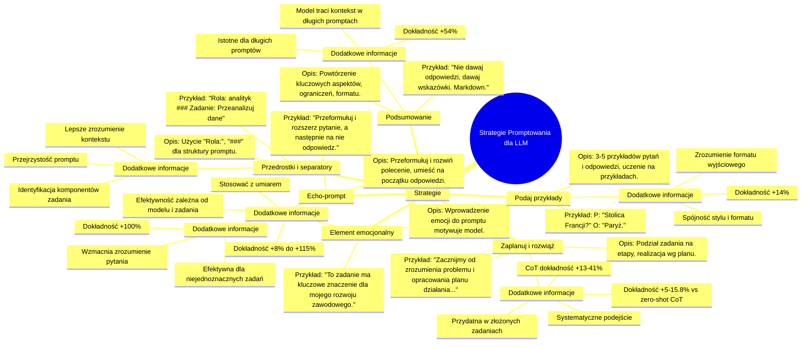

# Materiały dodatkowe - 2. Strategie promptowania

# 💡 Diagram

___

# 🗒️ Notatka

# Strategie Promptowania dla Dużych Modeli Językowych - Notatki i Podsumowanie

Poniższe notatki stanowią podsumowanie strategii promptowania (ang. prompting strategies) dla dużych modeli językowych (LLM). Ich celem jest poprawa jakości i dokładności generowanych odpowiedzi. Dokument ten bazuje na tabeli systematyzującej te strategie, opisuje je, prezentuje przykładowe elementy promptów oraz omawia ich skuteczność.

## Przegląd Strategii Promptowania

W tabeli wyszczególniono sześć kluczowych strategii promptowania, które umożliwiają efektywniejszą komunikację z modelami językowymi i pozwalają na uzyskanie lepszych wyników. Te strategie różnią się podejściem i zamierzeniem, ale każda z nich dąży do optymalizacji procesu generowania tekstu przez model.

## Szczegółowe Omówienie Strategii

### 1. Echo-prompt

- **Nazwa strategii:** Echo-prompt
- **Opis:** Model językowy ma za zadanie przeformułować i rozwinąć otrzymane polecenie, a następnie umieścić je na początku swojej odpowiedzi. Celem tej strategii jest upewnienie się, że model prawidłowo zrozumiał intencję zadania i jego kontekst.
- **Przykładowy element prompta:** \"Przeformułuj i rozszerz pytanie, a następnie na nie odpowiedz.\"
- **Dodatkowe informacje:**
    - Wzmacnia zrozumienie pytania przez model.
    - Zwiększa dokładność odpowiedzi nawet o **+100%**.
    - Jest szczególnie efektywna, gdy zadanie jest niejednoznaczne lub wymaga dogłębnej analizy kontekstu.

### 2. Zaplanuj i rozwiąż (Plan and Solve)

- **Nazwa strategii:** Zaplanuj i rozwiąż
- **Opis:** Strategia polega na podziale zadania na mniejsze, logiczne etapy. Model realizuje te etapy zgodnie z przygotowanym planem i, opcjonalnie, zdefiniowanymi parametrami. Ta metoda odzwierciedla ludzki proces rozwiązywania problemów, w którym planowanie odgrywa kluczową rolę.
- **Przykładowy element prompta:** \"Zacznijmy od zrozumienia problemu i opracowania planu działania. Następnie, krok po kroku, zrealizujmy ten plan.\"
- **Dodatkowe informacje:**
    - Umożliwia bardziej systematyczne i logiczne podejście do złożonych zadań.
    - Poprawia dokładność o **+5-15.8%** w porównaniu do metody `zero-shot` Chain-of-Thought (bez przykładów).
    - Sama metoda `Chain-of-Thought` podnosi dokładność o **+13% do 41%**.
    - Jest szczególnie przydatna w zadaniach wymagających wieloetapowego rozumowania.

### 3. Element emocjonalny (Emotional Element)

- **Nazwa strategii:** Element emocjonalny
- **Opis:** Wprowadzenie subtelnego aspektu emocjonalnego do promptu może zmotywować model do generowania odpowiedzi wyższej jakości. Sugeruje się, że modele językowe reagują na delikatne sygnały emocjonalne zawarte w promptach.
- **Przykładowy element prompta:** \"To zadanie ma kluczowe znaczenie dla mojego rozwoju zawodowego.\"
- **Dodatkowe informacje:**
    - Poprawia dokładność odpowiedzi w zakresie od **+8% do +115%**.
    - Efektywność może różnić się w zależności od modelu i rodzaju zadania.
    - Należy stosować ją rozważnie i z umiarem, aby uniknąć przesadnej emocjonalności promptu.

### 4. Podaj przykłady (Provide Examples)

- **Nazwa strategii:** Podaj przykłady
- **Opis:** Strategia polega na dołączaniu 3-5 przykładów pytań i prawidłowych odpowiedzi, co ma na celu ukierunkowanie modelu na generowanie odpowiedzi w oczekiwanym stylu i formacie. Uczenie na przykładach (ang. few-shot learning) jest efektywną techniką kształtowania odpowiedzi modelu.
- **Przykładowy element prompta:** P: \"Jaka jest stolica Francji?\" O: \"Paryż.\" (gdzie P oznacza Pytanie, a O oznacza Odpowiedź)
- **Dodatkowe informacje:**
    - Zwiększa dokładność odpowiedzi o **+14%**.
    - Zapewnia większą spójność odpowiedzi z oczekiwaniami dotyczącymi stylu i formatu.
    - Pomaga modelowi zrozumieć preferowany format wyjściowy.

### 5. Przedrostki i separatory (Prefixes and Separators)

- **Nazwa strategii:** Przedrostki i separatory
- **Opis:** Wykorzystanie przedrostków (np. \"Rola:\") lub separatorów (np. `###`, `\"\"\"`) do wyraźnego oznaczania poszczególnych części promptów. Ułatwia to strukturyzację i organizację promptu.
- **Przykładowy element prompta:** \"Rola: analityk ### Zadanie: Przeanalizuj następujące dane\"
- **Dodatkowe informacje:**
    - Zwiększa przejrzystość promptu.
    - Pomaga modelowi lepiej zrozumieć kontekst instrukcji.
    - Ułatwia modelowi identyfikację różnych komponentów zadania.

### 6. Podsumowanie (Summary)

- **Nazwa strategii:** Podsumowanie
- **Opis:** Zwięzłe powtórzenie kluczowych aspektów promptu, w szczególności istotnych ograniczeń i preferowanego formatu odpowiedzi. Strategia ta ma na celu upewnienie się, że model nie przeoczy kluczowych instrukcji, zwłaszcza w przypadku rozbudowanych promptów.
- **Przykładowy element prompta:** \"Nie udzielaj odpowiedzi, zamiast tego dawaj wskazówki. Sformatuj odpowiedź w Markdown.\"
- **Dodatkowe informacje:**
    - Model może utracić kontekst, gdy istotne informacje znajdują się w dalszej części obszernego promptu.
    - Poprawia dokładność o **+54%**.
    - Jest szczególnie istotna w przypadku długich i złożonych promptów.

## Podsumowanie

Przedstawione strategie promptowania oferują różnorodne metody optymalizacji interakcji z dużymi modelami językowymi. Od prostego powtarzania i rozwijania zadania (`Echo-prompt`), poprzez planowanie etapów rozwiązania (`Zaplanuj i rozwiąż`), uwzględnianie elementu emocjonalnego, uczenie na przykładach (`Podaj przykłady`), strukturyzację promptów za pomocą przedrostków i separatorów (`Przedrostki i separatory`), aż po streszczanie kluczowych wytycznych (`Podsumowanie`). Każda z tych strategii może znacząco wpłynąć na jakość i precyzję odpowiedzi generowanych przez model. Wybór odpowiedniej strategii, lub ich kombinacji, jest kluczowy dla efektywnego wykorzystania potencjału dużych modeli językowych i powinien być podyktowany specyfiką zadania oraz oczekiwanymi rezultatami.

___

# 🔉 Transcript
File: Materiały dodatkowe - 2. Strategie promptowania.jpg 
The image presents a table detailing various prompting strategies for large language models. Here's a breakdown of the table's contents:

| Nazwa strategii (Strategy Name) | Opis (Description) | Przykładowy element prompta (Example Prompt Element) | Dodatkowe informacje (Additional Information) |
|---|---|---|---|
| Echo-prompt | The model should rephrase and expand the received task, then repeat it at the beginning of its response. | "Rephrase and expand the question, and then answer it." | Improves question understanding, increases response accuracy by up to +100%. |
| Zaplanuj i rozwiąż (Plan and Solve) | The model divides the task into steps, executes them according to a prepared plan and (optionally) specified parameters. | "Let's start by understanding the problem and creating a solution plan. Next, step by step, we implement this plan." | +5-15.8% better accuracy than zero-shot (without examples) Chain-of-Thought, which itself gives +13% to 41% greater accuracy. |
| Element emocjonalny (Emotional Element) | A delicate emotional aspect in the prompt motivates the model to higher quality work. | "This task is very important for my career." | Between +8% and +115% improvement in response accuracy. |
| Podaj przykłady (Provide Examples) | Including 3-5 examples of questions and correct answers to obtain a response in the expected style and format. | P: "What is the capital of France?" A: "Paris." | +14% improvement in response accuracy, greater consistency with expectations. |
| Przedrostki i separatory (Prefixes and Separators) | Using prefixes (e.g., "Role:") or separators (e.g., ###, """) to mark subsequent parts of prompts. | "Role: analyst ### Task: Analyze the following data" | Improves prompt clarity and helps in better understanding of the context by the model. |
| Podsumowanie (Summary) | Concise repetition of key points of the prompt, especially constraints and response format. | "Do not provide answers and instead provide hints. Format your response in Markdown." | The model may lose context when key information is in the middle of a longer context. Accuracy improvement +54%. |
