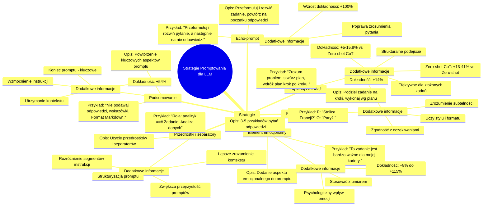

# Materiały dodatkowe - 2. Strategie promptowania

# 💡 Diagram

___

# 🗒️ Notatka

# Strategie Promptowania dla Dużych Modeli Językowych - Szczegółowe Notatki i Podsumowanie

Poniższe notatki stanowią szczegółowe podsumowanie strategii `promptowania` dla dużych modeli językowych, opartych na tabeli omawiającej różnorodne techniki i ich wpływ na jakość odpowiedzi modelu.  Dokument ten ma na celu kompleksowe przedstawienie informacji zawartych w tabeli, umożliwiając pełne zrozumienie tematu bez konieczności odwoływania się do oryginalnego materiału.

## Przegląd Strategii Promptowania

Tabela analizuje sześć różnych strategii `promptowania`, które można zastosować w celu poprawy jakości i dokładności odpowiedzi generowanych przez duże modele językowe. Każda strategia została opisana, wraz z przykładowym elementem `promptu` oraz informacjami o potencjalnych korzyściach i wzroście dokładności.

## Szczegółowe Notatki dotyczące Strategii

### 1. Echo-prompt

- **Opis:** Model powinien przeformułować i rozwinąć otrzymane zadanie, a następnie powtórzyć je na początku swojej odpowiedzi.
- **Przykładowy element promptu:** \"Przeformułuj i rozwiń pytanie, a następnie na nie odpowiedz.\"
- **Dodatkowe informacje:**
    - Poprawia zrozumienie pytania przez model.
    - Zwiększa dokładność odpowiedzi nawet o **+100%**.
    - Strategia ta pomaga upewnić się, że model prawidłowo zinterpretował zadanie przed jego realizacją.

### 2. Zaplanuj i rozwiąż

- **Opis:** Model dzieli zadanie na mniejsze kroki i wykonuje je zgodnie z przygotowanym planem i (opcjonalnie) określonymi parametrami.
- **Przykładowy element promptu:** \"Zacznij od zrozumienia problemu i stworzenia planu rozwiązania. Następnie, krok po kroku, wdróż ten plan.\"
- **Dodatkowe informacje:**
    - Zapewnia bardziej strukturalne i przemyślane podejście do rozwiązywania zadań.
    - Oferuje poprawę dokładności o **+5-15.8%** w porównaniu do metody Zero-shot Chain-of-Thought (bez przykładów).
    - Metoda Zero-shot Chain-of-Thought sama w sobie zapewnia od **+13% do 41%** większą dokładność w porównaniu do standardowego podejścia zero-shot.
    - Strategia \"Zaplanuj i rozwiąż\" jest szczególnie efektywna w przypadku złożonych zadań wymagających wieloetapowego rozwiązania.

### 3. Element emocjonalny

- **Opis:** Dodanie subtelnego aspektu emocjonalnego do `promptu` może zmotywować model do generowania odpowiedzi wyższej jakości.
- **Przykładowy element promptu:** \"To zadanie jest bardzo ważne dla mojej kariery.\"
- **Dodatkowe informacje:**
    - Wykorzystuje psychologiczny wpływ emocji na wydajność modelu.
    - Może przynieść poprawę dokładności odpowiedzi w zakresie od **+8% do +115%**.
    - Należy stosować elementy emocjonalne z umiarem i rozwagą, adekwatnie do charakteru zadania.

### 4. Podaj przykłady

- **Opis:** Dołączenie 3-5 przykładów pytań i poprawnych odpowiedzi, demonstrujących oczekiwany styl i format odpowiedzi.
- **Przykładowy element promptu:** P: \"Jaka jest stolica Francji?\" O: \"Paryż.\"
- **Dodatkowe informacje:**
    - Uczy model oczekiwanego formatu i stylu odpowiedzi poprzez demonstrację.
    - Zapewnia **+14%** poprawę dokładności odpowiedzi.
    - Zwiększa zgodność odpowiedzi modelu z oczekiwaniami użytkownika.
    - Przykłady pomagają modelowi zrozumieć subtelności zadania i preferowany sposób formułowania odpowiedzi.

### 5. Przedrostki i separatory

- **Opis:** Użycie przedrostków (np. \"Rola:\") lub separatorów (np. ###, \"\"\") w celu wyraźnego oznaczenia poszczególnych części `promptu`.
- **Przykładowy element promptu:** \"Rola: analityk ### Zadanie: Przeanalizuj następujące dane\"
- **Dodatkowe informacje:**
    - Zwiększa przejrzystość `promptów`.
    - Ułatwia modelowi lepsze zrozumienie kontekstu.
    - Pomaga modelowi rozróżnić różne segmenty instrukcji w `prompcie`.
    - Separatory i przedrostki strukturyzują `prompt`, co jest szczególnie istotne w przypadku bardziej złożonych zapytań.

### 6. Podsumowanie

- **Opis:** Zwięzłe powtórzenie kluczowych aspektów `promptu`, w szczególności ograniczeń i oczekiwanego formatu odpowiedzi.
- **Przykładowy element promptu:** \"Nie podawaj odpowiedzi, zamiast tego przedstaw wskazówki. Sformatuj swoją odpowiedź w `Markdown`.\"
- **Dodatkowe informacje:**
    - Pomaga modelowi utrzymać kontekst, zwłaszcza w przypadku dłuższych `promptów`.
    - Model może stracić kontekst, gdy istotne informacje znajdują się w dalszej części obszernego `promptu`; podsumowanie na końcu jest kluczowe.
    - Poprawia dokładność odpowiedzi o **+54%**.
    - Podsumowanie na końcu `promptu` wzmacnia kluczowe instrukcje i zapewnia, że model ich nie pominie.

## Podsumowanie

Niniejsze opracowanie przedstawia efektywny przegląd różnorodnych strategii `promptowania`, które można wykorzystać do optymalizacji interakcji z dużymi modelami językowymi. Strategie te, od prostego echo-`promptu` po bardziej zaawansowane techniki planowania i angażowania emocjonalnego, oferują szeroki wachlarz metod na poprawę dokładności, spójności i ogólnej jakości odpowiedzi generowanych przez modele. Wybór odpowiedniej strategii powinien być podyktowany specyfiką zadania i oczekiwanymi rezultatami. Zrozumienie i umiejętne stosowanie tych technik może znacząco zwiększyć efektywność pracy z dużymi modelami językowymi.

___

# 🔉 Transcript
File: Materiały dodatkowe - 2. Strategie promptowania.jpg 
The image presents a table detailing prompting strategies for large language models. Here's a breakdown of the table's contents:

| Nazwa strategii (Strategy Name) | Opis (Description) | Przykładowy element prompta (Example Prompt Element) | Dodatkowe informacje (Additional Information) |
|---|---|---|---|
| Echo-prompt | The model should rephrase and expand the received task, then repeat it at the beginning of its response. | "Rephrase and expand the question, and then answer it." | Improves understanding of the question, increases response accuracy by up to +100%. |
| Zaplanuj i rozwiąż (Plan and Solve) | The model divides the task into steps and executes them according to a prepared plan and (optionally) specified parameters. | "Let's start by understanding the problem and creating a solution plan. Next, step by step, we implement this plan." | +5-15.8% better accuracy than zero-shot (without examples) Chain-of-Thought, which itself gives +13% to 41% greater accuracy. |
| Element emocjonalny (Emotional Element) | A delicate emotional aspect in the prompt motivates the model to higher quality work. | "This task is very important for my career." | Between +8% and +115% improvement in response accuracy. |
| Podaj przykłady (Provide Examples) | Including 3-5 examples of questions and correct answers to obtain a response in the expected style and format. | P: "What is the capital of France?" A: "Paris." | +14% improvement in response accuracy, greater consistency with expectations. |
| Przedrostki i separatory (Prefixes and Separators) | Using prefixes (e.g., "Role:") or separators (e.g., ###, """) to mark subsequent parts of prompts. | "Role: analyst ### Task: Analyze the following data" | Improves the clarity of prompts and helps in better understanding of the context by the model. |
| Podsumowanie (Summary) | Concise repetition of the key points of the prompt, especially the limitations and format of the response. | "Do not provide answers and instead provide hints. Format your response in Markdown." | The model can lose context when key information is in the middle of a longer context. Accuracy improvement +54%. |

___
# 🏷️ Tags
#promptowanie #duże_modele_językowe #strategie_promptowania #echo-prompt #rozumienie_pytań #dokładność_odpowiedzi #planuj_i_rozwiąż #strukturalne_podejście #zero-shot_chain-of-thought #element_emocjonalny #motywacja_modelu #jakość_odpowiedzi #przykłady #format_odpowiedzi #styl_odpowiedzi #przedrostki_i_separatory #przejrzystość_promptów #kontekst_promptu #podsumowanie #utrzymanie_kontekstu #markdown #optymalizacja_interakcji #spójność_odpowiedzi
