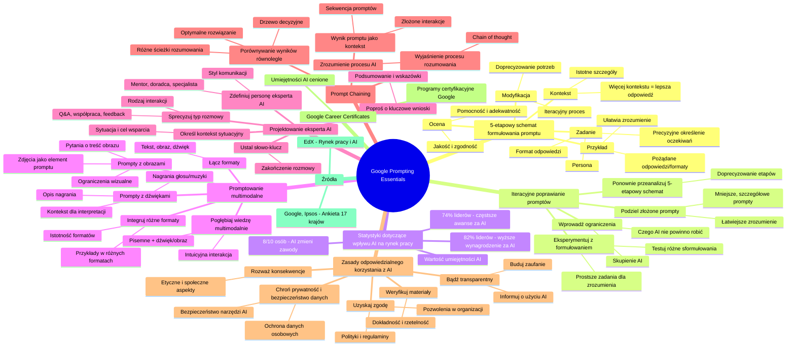

# Materiały dodatkowe - 3. Google Prompting Essentials

# 💡 Diagram

___

# 🗒️ Notatka

# Google Prompting Essentials: Twórz skuteczne prompty

Poniższe notatki stanowią podsumowanie kluczowych aspektów tworzenia efektywnych **promptów** dla generatywnej sztucznej inteligencji (AI), zgodnie z materiałami Google Prompting Essentials. Dokument ten omawia 5-etapowy schemat formułowania **promptów**, iteracyjne ich doskonalenie, **prompty multimodalne**, projektowanie ekspertów AI, łączenie **promptów** (`prompt chaining`) oraz zasady odpowiedzialnego korzystania z AI.

## 5-etapowy schemat formułowania promptu

Skuteczne formułowanie **promptów** opiera się na pięciu kluczowych etapach, które pomagają w uzyskaniu satysfakcjonujących odpowiedzi od narzędzi generatywnej AI.

- **Zadanie:**
    - Precyzyjnie określ, czego oczekujesz od narzędzia AI.
    - Wskaż **personę**, do której ma przemawiać AI (np. ekspert, dziecko, profesjonalista).
    - Zdefiniuj **format** odpowiedzi (np. esej, lista, kod).

- **Kontekst:**
    - Dostarcz wszelkie istotne szczegóły, które pomogą narzędziu AI zrozumieć Twoje oczekiwania.
    - Pamiętaj, im więcej kontekstu, tym odpowiedź będzie bardziej precyzyjna i trafna.

- **Przykład:**
    - Jeśli to możliwe, podaj przykłady pożądanych odpowiedzi lub formatów.
    - Przykłady znacząco ułatwiają AI zrozumienie preferowanego typu odpowiedzi.

- **Ocena:**
    - Po otrzymaniu odpowiedzi, oceń jej jakość i zgodność z oczekiwaniami.
    - Zastanów się, czy odpowiedź jest pomocna i adekwatna do zadanego zadania.

- **Modyfikacja:**
    - Jeśli odpowiedź nie spełnia oczekiwań, doprecyzuj swoje potrzeby.
    - Wprowadź poprawki do **promptu** i spróbuj ponownie, aż uzyskasz pożądany rezultat.
    - Pamiętaj, że proces formułowania **promptów** jest iteracyjny.

## Iteracyjne poprawianie promptów

Tworzenie efektywnych **promptów** to proces iteracyjny, wymagający udoskonalania. W przypadku wątpliwości, warto zastosować cykl iteracyjny, aby podnieść jakość **promptów**.

- **Wprowadź ograniczenia dla narzędzia generatywnej AI:**
    - Sprecyzuj, czego narzędzie **nie powinno** robić lub jakie aspekty ma pominąć.
    - Ograniczenia pomagają skupić AI na kluczowych elementach.

- **Ponownie przeanalizuj 5-etapowy schemat:**
    - Powróć do 5-etapowego schematu i upewnij się, że wszystkie etapy zostały dokładnie przemyślane i zastosowane.
    - Rozważ, czy można doprecyzować zadanie, kontekst, przykłady, ocenę lub modyfikację.

- **Podziel złożone prompty:**
    - Jeśli **prompt** jest zbyt złożony, rozbij go na mniejsze, bardziej szczegółowe **prompty**.
    - Mniejsze **prompty** ułatwiają AI zrozumienie poszczególnych aspektów zadania.

- **Eksperymentuj z formułowaniem:**
    - Testuj różne sformułowania **promptu**.
    - W przypadku trudności, spróbuj podobnego, prostszego zadania, aby lepiej zrozumieć możliwości narzędzia AI.

## Statystyki dotyczące wpływu AI na rynek pracy

Poniższe statystyki podkreślają rosnące znaczenie umiejętności związanych z AI w kontekście zawodowym.

- **8 na 10 osób na świecie** uważa, że sztuczna inteligencja znacząco zmieni większość zawodów lub branż w ciągu najbliższych 5 lat (źródło: Google, Ipsos).
- **82% liderów** jest zdania, że pracownicy z biegłością w AI powinni otrzymywać **wyższe wynagrodzenie** (źródło: EdX).
- **74% liderów** uważa, że pracownicy posiadający umiejętności w zakresie AI powinni być **częściej awansowani** (źródło: EdX).

Te dane wyraźnie wskazują na **wartość inwestycji w rozwój umiejętności związanych z AI** w kontekście rozwoju kariery.

## Promptowanie multimodalne (`Multimodal prompting`)

**Promptowanie multimodalne** to zaawansowana technika, która łączy różne typy danych wejściowych w jednym **prompcie**, umożliwiając bogatszą i bardziej wszechstronną interakcję z AI.

- **Łącz różnorodne formaty:** Tekst, obraz i dźwięk mogą być używane jednocześnie w jednym **prompcie**.

- **Twórz prompty z obrazami:**
    - **Wykorzystaj zdjęcie** jako element **promptu**.
    - **Zadawaj pytania** dotyczące treści obrazu.
    - **Wprowadź ograniczenia**, aby skupić się na konkretnych elementach wizualnych.

- **Twórz prompty z dźwiękami:**
    - **Użyj nagrania głosu lub muzyki** jako części **promptu**.
    - **Poproś o opis** nagrania.
    - **Zapewnij odpowiedni kontekst**, aby narzędzie AI mogło właściwie zinterpretować nagranie.

- **Integruj różne formaty:**
    - **Udostępniaj przykłady** w formie tekstu, obrazu lub dźwięku.
    - **Wyjaśnij istotność każdego formatu** dla uzyskania pożądanego rezultatu.

- **Pogłębiaj wiedzę multimodalnie:**
    - **Łącz pisemne prompty z dźwiękiem lub obrazami**, aby lepiej zrozumieć odbierane informacje.
    - Multimodalność naturalizuje i intuicyjnie wzbogaca interakcję z AI.

## Projektowanie eksperta AI

Możesz zaprojektować eksperta AI, definiując jego cechy i rolę, aby uzyskać spersonalizowane wsparcie i pomoc.

- **Zdefiniuj personę eksperta AI:**
    - Określ, kim ma być ekspert AI (np. mentor, doradca, specjalista w danej dziedzinie).
    - Persona eksperta wpływa na styl komunikacji i rodzaj odpowiedzi.

- **Określ kontekst sytuacyjny i szczegóły konwersacji:**
    - Opisz sytuację, w której potrzebujesz wsparcia eksperta AI.
    - Zdefiniuj cel rozmowy i oczekiwany rezultat.

- **Sprecyzuj typ rozmowy i interakcji:**
    - Czy ma to być sesja pytań i odpowiedzi, współpraca projektowa, czy feedback?
    - Określ rodzaj interakcji, aby AI mogła dostosować swoje zachowanie.

- **Ustal słowo-klucz do zakończenia rozmowy:**
    - Zdefiniuj komendę lub słowo-klucz, które pozwoli na kontrolowane zakończenie interakcji z ekspertem AI.

- **Poproś o kluczowe wnioski i wskazówki:**
    - Na zakończenie rozmowy, poproś eksperta AI o podsumowanie i wskazówki dotyczące dalszego rozwoju.
    - To umożliwia refleksję i dalsze doskonalenie.

## Realizacja zadań wieloetapowych poprzez łączenie promptów (`Prompt chaining`)

`Prompt chaining` to technika umożliwiająca realizację złożonych zadań poprzez sekwencję połączonych **promptów**, gdzie wynik jednego **promptu** staje się kontekstem dla kolejnego.

- **Wykorzystaj wynik promptu jako kontekst:**
    - Stwórz ciąg **promptów**, w którym odpowiedź z poprzedniego jest wejściem dla następnego.
    - Umożliwia to budowanie bardziej złożonych i rozbudowanych interakcji z AI.

- **Poproś AI o wyjaśnienie procesu rozumowania:**
    - Wykorzystaj metodę `chain of thought`, aby poprosić AI o wyjaśnienie swojego procesu myślowego.
    - Pomaga to zrozumieć, jak AI doszła do danej odpowiedzi i zidentyfikować potencjalne niejasności.

- **Porównuj wyniki równolegle:**
    - Poproś AI o przedstawienie różnych opcji rozważanych podczas generowania wyniku.
    - Użyj schematu rozumowania opartego na drzewie decyzyjnym, aby zobaczyć różne ścieżki rozumowania AI.
    - Pozwala to na porównanie różnych podejść i wybór optymalnego rozwiązania.

## Zasady odpowiedzialnego korzystania z AI

Odpowiedzialne korzystanie z AI jest kluczowe dla minimalizacji potencjalnych negatywnych skutków i maksymalizacji korzyści.

- **Rozważ konsekwencje użycia AI:**
    - Zastanów się nad potencjalnymi skutkami korzystania z AI w danej sytuacji.
    - Uwzględnij etyczne i społeczne aspekty.

- **Uzyskaj zgodę na korzystanie z AI:**
    - Upewnij się, że posiadasz odpowiednie pozwolenia na korzystanie z narzędzi AI w organizacji.
    - Przestrzegaj polityk i regulaminów dotyczących używania AI.

- **Chroń prywatność i bezpieczeństwo danych:**
    - Zwróć szczególną uwagę na ochronę danych osobowych i poufnych informacji.
    - Upewnij się, że narzędzie AI jest bezpieczne i zgodne z przepisami o ochronie danych.

- **Weryfikuj materiały przed użyciem:**
    - Dokładnie sprawdź i zweryfikuj odpowiedzi generowane przez AI przed ich wykorzystaniem.
    - Upewnij się, że informacje są dokładne, rzetelne i wolne od błędów.

- **Bądź transparentny w korzystaniu z AI:**
    - Informuj współpracowników i klientów o wykorzystaniu narzędzi generatywnej AI.
    - Otwarcie komunikuj, w jakim celu korzystasz z AI.
    - Buduj zaufanie poprzez transparentność.

## Google Career Certificates

Materiał wspomina o **Google Career Certificates**, co sugeruje, że umiejętności związane z **promptowaniem** i AI są cenione i rozwijane w ramach programów certyfikacyjnych Google.

## Źródła

Podane źródła potwierdzają wiarygodność statystyk i informacji przedstawionych w materiale.

1. Google, Ipsos. *Our life with AI: The reality of today and the promise of tomorrow*. Google and Ipsos, styczeń 2024. (Ankieta przeprowadzona w 17 krajach.)
2. EdX. *Navigating the Workplace in the Age of AI*. EdX, 2023.

## Podsumowanie

Ten dokument przedstawia kluczowe aspekty efektywnego formułowania **promptów** dla narzędzi generatywnej AI. Podkreśla znaczenie 5-etapowego schematu, iteracyjnego doskonalenia **promptów**, multimodalności, projektowania ekspertów AI, łączenia **promptów** oraz odpowiedzialnego korzystania z AI. Umiejętności te zyskują na znaczeniu na rynku pracy, co potwierdzają przedstawione statystyki. Zrozumienie i zastosowanie tych zasad pozwala na pełne wykorzystanie potencjału generatywnej AI i osiągnięcie satysfakcjonujących rezultatów.

___

# 🔉 Transcript
File: Materiały dodatkowe - 3. Google Prompting Essentials.jpg 
**Google Prompting Essentials**

**Twórz prompty, które działają**

Poznaj 5-etapowy schemat formułowania promptu i zacznij korzystać ze sztucznej inteligencji.

**Zadanie:** Dokładnie określ, w czym ma pomóc narzędzie generatywnej AI, wskazując personę (do kogo mówisz) i format, w jakim ma zostać przygotowana odpowiedź.

**Kontekst:** Przekaż wszystkie najważniejsze szczegóły, dzięki którym narzędzie AI zrozumie, czego od niego oczekujesz.

**Przykład:** Jeśli to możliwe, podaj przykłady, które narzędzie generatywnej AI może wykorzystać przy tworzeniu odpowiedzi.

**Ocena:** Określ, czy odpowiedź stworzona przez narzędzie generatywnej AI jest wystarczająca.

**Modyfikacja:** Jeśli odpowiedź nie jest pomocna, doprecyzuj swoje potrzeby i wprowadzaj poprawki tak długo, aż rezultat będzie satysfakcjonujący.

**W razie wątpliwości — poprawiaj i próbuj dalej**

Diagram przedstawia cykl iteracyjny z czterema krokami do poprawy promptów:

1. Wprowadź ograniczenia dla narzędzia generatywnej AI.
2. Ponownie przeanalizuj schemat powyżej (5-etapowy schemat).
3. Podziel swoje prompty na mniejsze części.
4. Zmień sposób, w jaki formułujesz swoje podpowiedzi lub przejdź do podobnego zadania.

**8 do 10** osób na świecie uważa, że sztuczna inteligencja zmieni większość zawodów lub branż w ciągu najbliższych 5 lat.

**82%** liderów uważa, że pracownicy biegli w korzystaniu z AI powinni dostawać wyższe wynagrodzenie.

**74%** liderów uważa, że pracownicy posiadający umiejętności w zakresie AI powinni otrzymywać awanse częściej.

**Multimodal prompting**

Połącz różne typy formatów, takie jak tekst, obraz i dźwięk, w jednym prompcie.

**Twórz prompty z obrazami:** Zrób zdjęcie i zadaj pytania dotyczące jego treści. Wprowadź ograniczenia, aby skupić się na najważniejszych elementach obrazu.

**Twórz podpowiedzi z dźwiękami:** Nagraj głos lub muzykę i poproś o ich opis. Zadbaj o odpowiedni kontekst, aby nagranie zostało jak najlepiej zrozumiane przez narzędzie generatywnej AI.

**Łącz różne formaty:** Podziel się przykładami w formie tekstu, obrazu lub dźwięku, które pomogą ukierunkować wynik, i wyjaśnij, dlaczego każdy z nich jest istotny.

**Pogłębiaj swoją wiedzę:** Połącz pisemne prompty z dźwiękiem lub obrazami, aby lepiej zrozumieć to, co widzisz lub słyszysz.

**Zaprojektuj eksperta AI**

Stwórz eksperta AI, który pomoże tobie rozwijać umiejętności, współpracować przy projekcie, otrzymywać feedback i wiele więcej.

**Określ personę, którą ma przyjąć narzędzie generatywnej AI.**
**Podaj kontekst sytuacyjny oraz szczegóły rozwoju konwersacji.**
**Sprecyzuj typ rozmowy oraz rodzaje interakcji, które ma wspierać narzędzie generatywnej AI.**
**Określ słowo-klucz, którego możesz użyć, aby zakończyć rozmowę.**
**Poproś narzędzie o kluczowe wnioski z rozmowy oraz o wskazówki dotyczące obszarów wymagających poprawy.**

**Zrealizuj zadania wieloetapowe, tworząc ciąg promptów poprzez prompt chaining**

Wykorzystaj wynik jednego promptu jako kontekst w kolejnym prompcie.

**Poproś narzędzie generatywnej AI o wyjaśnienie, jak doszło do danego wyniku.** Potrzebujesz pomocy przy rozwiązywaniu problemu? Poproś narzędzie AI, aby wyjaśniło swoje rozumowanie za pomocą metody *chain of thought*.

**Porównuj jednocześnie wyniki:** Poproś narzędzie generatywnej AI, aby przedstawiło różne opcje, które rozważa podczas generowania wyniku, używając schematu rozumowania opartego na drzewie decyzyjnym.

**Zasady odpowiedzialnego korzystania z AI**

* Weź pod uwagę skutki korzystania ze sztucznej inteligencji w swojej sytuacji.
* Zdobądź zgodę na korzystanie z narzędzia generatywnej AI od osób decyzyjnych w twojej organizacji zanim zaczniesz go używać przy projektach lub w pracy z klientami.
* Rozważ kwestie prywatności i bezpieczeństwa związane z narzędziem AI, z którego korzystasz.
* Oceń cały materiał przed jego wykorzystaniem w swojej pracy lub udostępnieniem go innym.
* Poinformuj swoich współpracowników i klientów o korzystaniu z narzędzi generatywnej AI oraz mów otwarcie o tym, do czego ci służą.

**Google Career Certificates**

**Źródła:**

1. Jak wynika z ankiety przeprowadzonej w 17 krajach. Google, Ipsos. *Our life with AI: The reality of today and the promise of tomorrow*. Google and Ipsos, January 2024.
2. EdX. *Navigating the Workplace in the Age of AI*. EdX, 2023.

___
# 🏷️ Tags
#google_prompting_essentials #prompt #generatywna_AI #sztuczna_inteligencja #AI #formułowanie_promptów #persona #format_odpowiedzi #kontekst #przykłady #ocena #modyfikacja #iteracyjne_poprawianie_promptów #ograniczenia_AI #dzielenie_promptów #eksperymentowanie_z_promptami #rynek_pracy #umiejętności_AI #wynagrodzenie #awans #wartość_inwestycji_w_AI #promptowanie_multimodalne #multimodal_prompting #tekst #obraz #dźwięk #prompty_z_obrazami #prompty_z_dźwiękami #integracja_formatów #wiedza_multimodalna #projektowanie_eksperta_AI #kontekst_sytuacyjny #szczegóły_konwersacji #typ_rozmowy #interakcja #słowo_klucz #wnioski #wskazówki #prompt_chaining #wynik_promptu_jako_kontekst #wyjaśnienie_procesu_rozumowania #chain_of_thought #porównywanie_wyników #drzewo_decyzyjne #odpowiedzialne_korzystanie_z_AI #konsekwencje_użycia_AI #zgoda_na_korzystanie_z_AI #prywatność #bezpieczeństwo_danych #weryfikacja_materiałów #transparentność #google_career_certificates #źródła #ipsos #edx #5-etapowy_schemat_promptu
