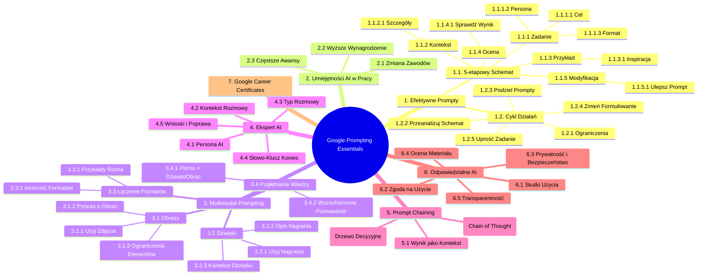

# Materiały dodatkowe - 3. Google Prompting Essentials

# 💡 Diagram

___

# 🗒️ Notatka

# Google Prompting Essentials: Twórz prompty, które działają - Notatki i Podsumowanie

Niniejszy dokument zawiera szczegółowe notatki i podsumowanie transkryptu dotyczącego tworzenia efektywnych promptów dla generatywnej sztucznej inteligencji (AI), w oparciu o materiał \"Google Prompting Essentials\". Materiał ten przedstawia kluczowe zasady i techniki, które pomogą użytkownikom w pełni wykorzystać potencjał narzędzi AI.

## 1. Podstawy Tworzenia Efektywnych Promptów

### 1.1. 5-etapowy Schemat Formułowania Promptu

Ten schemat stanowi kluczowy element w tworzeniu promptów, które przynoszą oczekiwane rezultaty. Składa się z pięciu kroków, które należy przejść, aby skutecznie komunikować się z narzędziem generatywnej AI:

- **Zadanie (Zdefiniuj cel):**
    - Dokładnie określ, **czego oczekujesz** od narzędzia AI.
    - Wskaż **personę**, do której ma mówić AI (np. ekspert, dziecko, profesjonalista).
    - Określ **format** odpowiedzi (np. esej, lista, kod, wiersz).
    - *Przykład:* \"Wciel się w rolę doświadczonego dietetyka i stwórz listę 5 przepisów na zdrowe śniadania bogate w białko.\"

- **Kontekst (Dodaj szczegóły):**
    - Przekaż **wszystkie istotne informacje**, które pomogą AI zrozumieć Twoje oczekiwania.
    - Im więcej kontekstu, tym lepsza i bardziej precyzyjna odpowiedź.
    - *Przykład:* \"Mam 30 lat, trenuję 3 razy w tygodniu i chcę zwiększyć masę mięśniową. Nie jem mięsa, ale spożywam nabiał i jajka.\"

- **Przykład (Dostarcz inspiracji):**
    - Jeśli to możliwe, podaj **przykłady** pożądanych odpowiedzi lub formatów.
    - Przykłady mogą znacząco ułatwić AI zrozumienie Twojej wizji.
    - *Przykład:* \"Chciałbym, aby przepisy były podobne do tych z bloga [nazwa bloga], czyli krótkie, z listą składników i prostymi instrukcjami.\"

- **Ocena (Sprawdź wynik):**
    - Po otrzymaniu odpowiedzi, **oceń**, czy jest ona wystarczająca i spełnia Twoje oczekiwania.
    - Czy odpowiedź jest trafna, pomocna i zgodna z zadaniem?

- **Modyfikacja (Ulepsz prompt):**
    - Jeśli odpowiedź **nie jest satysfakcjonująca**, doprecyzuj prompt.
    - Wprowadź **poprawki**, dodaj więcej kontekstu, zmień format, aż uzyskasz pożądany rezultat.
    - To iteracyjny proces - **poprawiaj i próbuj dalej**.

### 1.2. Cykl Działań - W razie Wątpliwości, Poprawiaj i Próbuj Dalej

Diagram przedstawia cykliczne podejście do formułowania promptów, podkreślając iteracyjny charakter procesu:

- **Wprowadź ograniczenia** dla narzędzia AI, aby zawęzić zakres odpowiedzi.
- **Ponownie przeanalizuj schemat** 5-etapowy, aby upewnić się, że każdy krok został uwzględniony.
- **Podziel swoje prompty na mniejsze części**, jeśli są zbyt złożone.
- **Zmień sposób formułowania** podpowiedzi, użyj synonimów, innej struktury zdań.
- Jeśli problem nadal występuje, **przejdź do podobnego zadania** lub uprość obecne.

**W centrum diagramu znajduje się ikona żarówki** 💡, symbolizująca kreatywność i poszukiwanie nowych rozwiązań w procesie formułowania promptów.

## 2. Znaczenie Umiejętności AI w Przyszłości Pracy

Statystyki podkreślają rosnące znaczenie umiejętności związanych ze sztuczną inteligencją na rynku pracy:

- **8 do 10 osób na świecie** uważa, że sztuczna inteligencja **zmieni większość zawodów lub branż** w ciągu najbliższych 5 lat.1
- **82% liderów** uważa, że pracownicy **biegli w korzystaniu z AI powinni otrzymywać wyższe wynagrodzenie**.2
- **74% liderów** uważa, że pracownicy **posiadający umiejętności w zakresie AI powinni otrzymywać awanse częściej**.2

Te dane wskazują, że **inwestycja w naukę efektywnego korzystania z AI jest kluczowa dla rozwoju kariery zawodowej**.

## 3. Multimodal Prompting - Łączenie Różnych Formatów

`Multimodal prompting` to technika, która polega na **łączeniu różnych typów formatów danych** w jednym prompcie, takich jak tekst, obraz i dźwięk. Pozwala to na bardziej bogatą i kompleksową interakcję z narzędziami AI.

### 3.1. Tworzenie Promptów z Obrazami

- **Zrób zdjęcie** i użyj go jako części promptu.
- **Zadaj pytania dotyczące treści obrazu**.
- **Wprowadź ograniczenia**, aby skupić się na najważniejszych elementach obrazu.
- *Przykład:* \"Co przedstawia to zdjęcie? Skoncentruj się na elementach architektonicznych i opisz styl budynku.\"

### 3.2. Tworzenie Promptów z Dźwiękami

- **Nagraj głos lub muzykę** i użyj nagrania w prompcie.
- **Poproś o opis nagrania**.
- **Zadbaj o odpowiedni kontekst**, aby AI mogło jak najlepiej zrozumieć nagranie.
- *Przykład:* \"Opisz nastrój tej muzyki. Czy jest radosna, smutna, czy może tajemnicza? Jaki instrument dominuje?\"

### 3.3. Łączenie Różnych Formatów

- **Podziel się przykładami** w formie tekstu, obrazu lub dźwięku, aby ukierunkować wynik.
- **Wyjaśnij, dlaczego każdy z formatów jest istotny** dla pożądanego rezultatu.
- *Przykład:* \"Na podstawie tego zdjęcia [obraz] i opisu dźwięku [dźwięk], stwórz krótki opis miejsca, w którym mogło zostać zrobione zdjęcie i nagrany dźwięk.\"

### 3.4. Pogłębianie Wiedzy

- **Połącz pisemne prompty z dźwiękiem lub obrazami**, aby lepiej zrozumieć to, co widzisz lub słyszysz.
- Multimodalność może pomóc w **bardziej wszechstronnym poznawaniu świata** za pomocą AI.

## 4. Zaprojektuj Eksperta AI - Personalizacja Interakcji

Ta technika pozwala na stworzenie **spersonalizowanego eksperta AI**, który może wspierać rozwój umiejętności, współpracę przy projektach, udzielać feedbacku i wiele więcej.

- **Określ personę**, którą ma przyjąć narzędzie generatywnej AI (np. mentor, coach, ekspert branżowy).
- **Podaj kontekst sytuacyjny** oraz **szczegóły rozwoju konwersacji** (np. temat rozmowy, cel).
- **Sprecyzuj typ rozmowy** oraz **rodzaje interakcji**, które ma wspierać AI (np. burza mózgów, rozwiązywanie problemów, nauka).
- **Określ słowo-klucz**, którego można użyć, aby **zakończyć rozmowę** (np. \"koniec sesji\", \"dziękuję\").
- **Poproś narzędzie o kluczowe wnioski z rozmowy** oraz o **wskazówki dotyczące obszarów wymagających poprawy**.

## 5. Prompt Chaining - Realizacja Zadań Wieloetapowych

`Prompt chaining` to technika polegająca na **wykorzystaniu wyniku jednego promptu jako kontekstu w kolejnym prompcie**. Umożliwia to realizację bardziej złożonych i wieloetapowych zadań.

- **Poproś narzędzie generatywnej AI o wyjaśnienie, jak doszło do danego wyniku**.
    - Można użyć metody **\"chain of thought\"**, aby AI wyjaśniło swoje rozumowanie krok po kroku.
- **Porównuj jednocześnie wyniki**:
    - Poproś AI o przedstawienie **różnych opcji**, które rozważa podczas generowania wyniku.
    - Można użyć schematu rozumowania opartego na **drzewie decyzyjnym**, aby zobaczyć proces myślowy AI.

## 6. Zasady Odpowiedzialnego Korzystania z AI

Korzystanie z AI powinno być **odpowiedzialne i etyczne**. Należy wziąć pod uwagę następujące zasady:

- **Weź pod uwagę skutki korzystania ze sztucznej inteligencji** w swojej sytuacji (potencjalne ryzyko, wpływ na innych).
- **Zdobądź zgodę na korzystanie z narzędzia generatywnej AI** od osób decyzyjnych w Twojej organizacji, zanim zaczniesz go używać przy projektach lub w pracy z klientami.
- **Rozważ kwestie prywatności i bezpieczeństwa** związane z narzędziem AI, z którego korzystasz (ochrona danych, poufność informacji).
- **Oceń cały materiał** wygenerowany przez AI **przed jego wykorzystaniem** w swojej pracy lub udostępnieniem go innym (sprawdzenie faktów, unikanie plagiatu).
- **Poinformuj swoich współpracowników i klientów o korzystaniu z narzędzi generatywnej AI** oraz **mów otwarcie o tym, do czego ci służą** (transparentność i uczciwość).

## 7. Google Career Certificates

Materiał jest powiązany z programem **Google Career Certificates**, co sugeruje jego edukacyjny i praktyczny charakter w kontekście rozwoju zawodowego.

## Podsumowanie

Materiał \"Google Prompting Essentials\" przedstawia **kompleksowy przewodnik po tworzeniu efektywnych promptów dla generatywnej AI**. Kluczowe elementy to:

- **5-etapowy schemat formułowania promptu** (`Zadanie`, `Kontekst`, `Przykład`, `Ocena`, `Modyfikacja`).
- **Iteracyjny proces poprawiania promptów**.
- **Znaczenie umiejętności AI na rynku pracy**.
- `Multimodal prompting` - wykorzystanie różnych formatów danych.
- **Projektowanie spersonalizowanych ekspertów AI**.
- `Prompt chaining` - realizacja zadań wieloetapowych.
- **Zasady odpowiedzialnego korzystania z AI**.

Zrozumienie i zastosowanie tych zasad i technik pozwoli użytkownikom **maksymalnie wykorzystać potencjał narzędzi generatywnej AI** w różnych dziedzinach życia zawodowego i osobistego.

**Źródła:**

1. Google, Ipsos. *Our life with AI: The reality of today and the promise of tomorrow*. Google and Ipsos, January 2024.
2. EdX. *Navigating the Workplace in the Age of AI*. EdX, 2023.

___

# 🔉 Transcript
File: Materiały dodatkowe - 3. Google Prompting Essentials.jpg 
**Google Prompting Essentials**

**Twórz prompty, które działają**

Poznaj 5-etapowy schemat formułowania promptu i zacznij korzystać ze sztucznej inteligencji.

**Zadanie:** Dokładnie określ, w czym ma pomóc narzędzie generatywnej AI, wskazując personę (do kogo mówisz) i format, w jakim ma zostać przygotowana odpowiedź.

**Kontekst:** Przekaż wszystkie najważniejsze szczegóły, dzięki którym narzędzie AI zrozumie, czego od niego oczekujesz.

**Przykład:** Jeśli to możliwe, podaj przykłady, które narzędzie generatywnej AI może wykorzystać przy tworzeniu odpowiedzi.

**Ocena:** Określ, czy odpowiedź stworzona przez narzędzie generatywnej AI jest wystarczająca.

**Modyfikacja:** Jeśli odpowiedź nie jest pomocna, doprecyzuj swoje potrzeby i wprowadzaj poprawki tak długo, aż rezultat będzie satysfakcjonujący.

**W razie wątpliwości - poprawiaj i próbuj dalej**

Diagram przedstawia cykl działań:

* Wprowadź ograniczenia dla narzędzia generatywnej AI.
* Ponownie przeanalizuj schemat powyżej.
* Podziel swoje prompty na mniejsze części.
* Zmień sposób, w jaki formułujesz swoje podpowiedzi lub przejdź do podobnego zadania.
* Diagram pokazuje strzałki wskazujące na kolejne kroki, a w centrum znajduje się ikona żarówki.

**8 do 10** osób na świecie uważa, że sztuczna inteligencja zmieni większość zawodów lub branż w ciągu najbliższych 5 lat.1

**82%** liderów uważa, że pracownicy biegli w korzystaniu z AI powinni dostawać wyższe wynagrodzenie.2

**74%** liderów uważa, że pracownicy posiadający umiejętności w zakresie AI powinni otrzymywać awanse częściej.2

**Multimodal prompting**

Połącz różne typy formatów, takie jak tekst, obraz i dźwięk, w jednym promptcie.

**Twórz prompty z obrazami:** Zrób zdjęcie i zadaj pytania dotyczące jego treści. Wprowadź ograniczenia, aby skupić się na najważniejszych elementach obrazu.

**Twórz podpowiedzi z dźwiękami:** Nagraj głos lub muzykę i poproś o ich opis. Zadbaj o odpowiedni kontekst, aby nagranie zostało jak najlepiej zrozumiane przez narzędzie generatywnej AI.

**Łącz różne formaty:** Podziel się przykładami w formie tekstu, obrazu lub dźwięku, które pomogą ukierunkować wynik i wyjaśnij, dlaczego każdy z nich jest istotny.

**Pogłębiaj swoją wiedzę:** Połącz pisemne prompty z dźwiękiem lub obrazami, aby lepiej zrozumieć to, co widzisz lub słyszysz.

**Zaprojektuj eksperta AI**

Stwórz eksperta AI, który pomoże tobie rozwijać umiejętności, współpracować przy projekcie, otrzymywać feedback i wiele więcej.

**Określ personę, którą ma przyjąć narzędzie generatywnej AI.**

**Podaj kontekst sytuacyjny oraz szczegóły rozwoju konwersacji.**

**Sprecyzuj typ rozmowy oraz rodzaje interakcji, które ma wspierać narzędzie generatywnej AI.**

**Określ słowo-klucz, którego możesz użyć, aby zakończyć rozmowę.**

**Poproś narzędzie o kluczowe wnioski z rozmowy oraz o wskazówki dotyczące obszarów wymagających poprawy.**

**Zrealizuj zadania wieloetapowe, tworząc ciąg promptów poprzez prompt chaining**

Wykorzystaj wynik jednego promptu jako kontekst w kolejnym promptcie.

**Poproś narzędzie generatywnej AI o wyjaśnienie, jak doszło do danego wyniku.** Potrzebujesz pomocy przy rozwiązywaniu problemu? Poproś narzędzie AI, aby wyjaśniło swoje rozumowanie za pomocą metody *chain of thought*.

**Porównuj jednocześnie wyniki:** Poproś narzędzie generatywnej AI, aby przedstawiło różne opcje, które rozważa podczas generowania wyniku, używając schematu rozumowania opartego na drzewie decyzyjnym.

**Zasady odpowiedzialnego korzystania z AI**

* Weź pod uwagę skutki korzystania ze sztucznej inteligencji w swojej sytuacji.
* Zdobądź zgodę na korzystanie z narzędzia generatywnej AI od osób decyzyjnych w twojej organizacji, zanim zaczniesz go używać przy projektach lub w pracy z klientami.
* Rozważ kwestie prywatności i bezpieczeństwa związane z narzędziem AI, z którego korzystasz.
* Oceń cały materiał przed jego wykorzystaniem w swojej pracy lub udostępnieniem go innym.
* Poinformuj swoich współpracowników i klientów o korzystaniu z narzędzi generatywnej AI oraz mów otwarcie o tym, do czego ci służą.

**Google Career Certificates**

**Źródła:**

1. Jak wynika z ankiety przeprowadzonej w 17 krajach. Google, Ipsos. *Our life with AI: The reality of today and the promise of tomorrow*. Google and Ipsos, January 2024.
2. EdX. *Navigating the Workplace in the Age of AI*. EdX, 2023.
