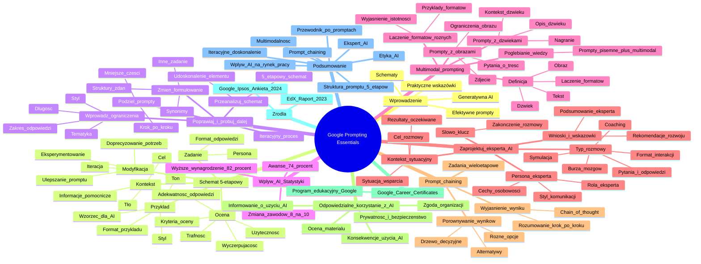

# Materiały dodatkowe - 3. Google Prompting Essentials

# 💡 Diagram

___

# 🗒️ Notatka

# Google Prompting Essentials: Twórz prompty, które działają

## Wprowadzenie

Ta prezentacja koncentruje się na fundamentalnych zasadach tworzenia efektywnych promptów dla generatywnej sztucznej inteligencji (AI).  Podkreśla kluczową rolę jasnego formułowania zapytań, dostarczania kontekstu oraz iteracyjnego ulepszania promptów w celu osiągnięcia zamierzonych rezultatów. Materiał ten oferuje praktyczne wskazówki i schematy, które wspierają użytkowników w efektywnym wykorzystaniu narzędzi AI.

## 5-etapowy schemat formułowania promptu

Ten schemat stanowi podstawowy przewodnik w procesie tworzenia efektywnych promptów. Jego celem jest zapewnienie, że prompty są zrozumiałe, konkretne i prowadzą do satysfakcjonujących odpowiedzi generowanych przez narzędzia AI.

- **Zadanie:** Precyzyjnie określ, w czym narzędzie generatywnej AI ma Ci pomóc.
    - Wskaż **personę**, do której ma się zwracać AI (np. ekspert, dziecko, profesjonalista).
    - Zdefiniuj **format** odpowiedzi (np. esej, lista, kod, wiersz).
- **Kontekst:** Dostarcz wszelkie istotne informacje, które pomogą narzędziu AI zrozumieć Twoje oczekiwania.
    - Pamiętaj, że im więcej kontekstu dostarczysz, tym lepsze zrozumienie i odpowiedź AI.
    - Uwzględnij tło, cel i wszelkie kluczowe informacje.
- **Przykład:** Jeśli to możliwe, załącz przykłady, które narzędzie AI może wykorzystać jako wzorzec podczas generowania odpowiedzi.
    - Przykłady ułatwiają AI zrozumienie pożądanego stylu, tonu i formatu odpowiedzi.
    - Mogą to być zarówno krótkie frazy, zdania, jak i dłuższe fragmenty tekstu.
- **Ocena:** Ustal, czy odpowiedź wygenerowana przez narzędzie AI jest adekwatna i spełnia Twoje oczekiwania.
    - Zastanów się, czy odpowiedź jest trafna, wyczerpująca i użyteczna.
    - Określ kryteria oceny odpowiedzi.
- **Modyfikacja:** Jeśli odpowiedź nie jest satysfakcjonująca, doprecyzuj swoje potrzeby i modyfikuj prompt, aż uzyskasz pożądany rezultat.
    - Pamiętaj o iteracyjnym procesie – ulepszaj prompt i testuj ponownie.
    - Eksperymentuj z różnymi sformułowaniami, dodając więcej kontekstu lub przykładów.

## W razie wątpliwości – poprawiaj i próbuj dalej

Ten schemat kołowy podkreśla iteracyjny charakter procesu tworzenia promptów i zachęca do ciągłego doskonalenia. Centralnym punktem jest **„W razie wątpliwości - poprawiaj i próbuj dalej”**. Otaczające go punkty przedstawiają strategie, które można zastosować, gdy odpowiedź AI nie spełnia oczekiwań:

- **Wprowadź ograniczenia dla narzędzia generatywnej AI.**
    - Sprecyzuj zakres odpowiedzi, np. długość, styl, tematykę.
    - Użyj fraz takich jak „Odpowiedz w maksymalnie trzech zdaniach” lub „Skup się na aspektach historycznych”.
- **Ponownie przeanalizuj schemat opisany powyżej.**
    - Powróć do 5-etapowego schematu i upewnij się, czy wszystkie kroki zostały dokładnie wykonane.
    - Zastanów się, który element schematu można udoskonalić (Zadanie, Kontekst, Przykład, Ocena, Modyfikacja).
- **Podziel złożone prompty na mniejsze części.**
    - Zamiast tworzyć jeden skomplikowany prompt, spróbuj rozbić zadanie na kilka mniejszych, prostszych promptów.
    - Buduj odpowiedź krok po kroku.
- **Zmień sposób formułowania promptów lub przejdź do innego zadania.**
    - Eksperymentuj z synonimami i różnymi strukturami zdań.
    - Jeśli dany prompt sprawia trudności, spróbuj sformułować zadanie inaczej lub tymczasowo przejdź do innego zadania i wróć do niego później.

## Statystyki dotyczące wpływu AI

Prezentacja zwraca uwagę na powszechne przekonanie o transformacyjnym wpływie sztucznej inteligencji na rynek pracy i wynagrodzenia.

- **8 na 10** osób na świecie uważa, że sztuczna inteligencja znacząco zmieni większość zawodów lub branż w ciągu najbliższych 5 lat.1
    - To odzwierciedla globalne przekonanie o szybkim tempie zmian wywołanych przez AI.
- **82%** liderów jest zdania, że pracownicy z biegłością w korzystaniu z AI powinni otrzymywać wyższe wynagrodzenie.2
    - Umiejętności związane z AI są coraz bardziej cenione i poszukiwane na rynku pracy.
- **74%** liderów uważa, że pracownicy posiadający kompetencje w zakresie AI powinni częściej otrzymywać awanse.2
    - Kompetencje AI są postrzegane jako kluczowe dla rozwoju kariery.

## Multimodal prompting

`Multimodal prompting` to technika polegająca na łączeniu różnorodnych typów danych wejściowych (formatów) w jednym prompcie, co umożliwia bogatsze i bardziej złożone interakcje z AI.

- **Definicja:** Polega na łączeniu różnych formatów, takich jak **tekst, obraz i dźwięk**, w ramach jednego promptu.

- **Tworzenie promptów z obrazami:**
    - Wykonaj zdjęcie i zadaj pytania dotyczące jego zawartości.
    - Wprowadź ograniczenia, aby skoncentrować się na kluczowych elementach obrazu.
    - Przykład: „Co znajduje się na tym zdjęciu? Skup się tylko na zwierzętach.”
- **Tworzenie promptów z dźwiękami:**
    - Nagraj dźwięk lub muzykę i poproś o ich opisanie.
    - Zapewnij odpowiedni kontekst, aby nagranie zostało jak najlepiej zrozumiane przez narzędzie generatywnej AI.
    - Przykład: „Opisz dźwięk na tym nagraniu. Jest to dźwięk tła z kawiarni.”
- **Łączenie różnych formatów:**
    - Udostępnij przykłady w formie tekstu, obrazu lub dźwięku, które pomogą ukierunkować pożądany wynik.
    - Wyjaśnij, dlaczego każdy z formatów jest istotny dla właściwego zrozumienia promptu.
    - Przykład: „Na tym zdjęciu jest budynek (obraz). Opisz jego styl architektoniczny (tekst).”
- **Pogłębianie wiedzy:**
    - Łącz pisemne prompty z dźwiękiem lub obrazami, aby lepiej zrozumieć to, co widzisz lub słyszysz.
    - Wykorzystaj multimodalność do eksploracji i pełniejszego zrozumienia otaczającego świata.

## Zaprojektuj eksperta AI

Wykorzystaj narzędzia AI do stworzenia wirtualnego eksperta, który może wspierać rozwój umiejętności, współpracę, udzielanie informacji zwrotnej i wiele innych aspektów.

- **Zdefiniuj personę, którą ma przyjąć narzędzie generatywnej AI.**
    - Wybierz rolę eksperta, np. mentor, trener, konsultant, specjalista.
    - Określ cechy osobowości i styl komunikacji eksperta.
- **Dostarcz kontekst sytuacyjny oraz szczegóły dotyczące przebiegu konwersacji.**
    - Opisz sytuację, w której potrzebujesz wsparcia eksperta.
    - Określ cel rozmowy i oczekiwane rezultaty.
- **Sprecyzuj typ rozmowy oraz rodzaje interakcji, które ma wspierać narzędzie generatywnej AI.**
    - Czy ma to być sesja pytań i odpowiedzi, burza mózgów, symulacja, czy coaching?
    - Określ preferowany format interakcji.
- **Ustal słowo-klucz, którego użycie zakończy rozmowę.**
    - Zdefiniuj frazę kończącą interakcję, np. „koniec sesji”, „podsumuj”, „dziękuję”.
    - Ułatwi to kontrolę nad przebiegiem rozmowy.
- **Poproś narzędzie o przedstawienie kluczowych wniosków z rozmowy oraz wskazówek dotyczących obszarów wymagających poprawy.**
    - Na zakończenie poproś eksperta AI o podsumowanie i rekomendacje.
    - Wykorzystaj uzyskane informacje zwrotne do dalszego rozwoju.

## Zrealizuj zadania wieloetapowe, tworząc ciąg promptów poprzez `prompt chaining`

`Prompt chaining` to technika polegająca na wykorzystaniu wyniku jednego promptu jako kontekstu dla kolejnego, co umożliwia realizację złożonych, wieloetapowych zadań.

- **Poproś narzędzie generatywnej AI o wyjaśnienie, w jaki sposób doszło do uzyskanego wyniku.**
    - Zastosuj metodę `chain of thought` (łańcuch myślowy), aby AI przedstawiło swoje rozumowanie krok po kroku.
    - Jest to pomocne w rozwiązywaniu problemów i zrozumieniu procesu myślowego AI.
    - *(Ikona sztalugi z kartką)*
- **Porównuj wyniki równolegle.**
    - Poproś narzędzie AI, aby zaprezentowało różne opcje, które rozważa podczas generowania odpowiedzi.
    - Wykorzystaj schemat rozumowania oparty na **drzewie decyzyjnym**, aby zobaczyć różne ścieżki i możliwości.
    - Pomaga to w wyborze najlepszego rozwiązania i zrozumieniu dostępnych alternatyw.
    - *(Ikona wagi szalkowej)*

## Zasady odpowiedzialnego korzystania z AI

Lista zasad etycznego i odpowiedzialnego korzystania z narzędzi generatywnej AI.

- [x] **Rozważ konsekwencje korzystania ze sztucznej inteligencji w kontekście Twojej sytuacji.**
    - Zastanów się nad potencjalnymi konsekwencjami etycznymi, społecznymi i zawodowymi.
- [x] **Uzyskaj zgodę na korzystanie z narzędzia generatywnej AI od osób decyzyjnych w Twojej organizacji przed rozpoczęciem jego wykorzystywania w projektach lub pracy z klientami.**
    - Upewnij się, że korzystanie z AI jest zgodne z polityką firmy i obowiązującymi regulacjami prawnymi.
- [x] **Zwróć uwagę na kwestie prywatności i bezpieczeństwa związane z narzędziem AI, z którego korzystasz.**
    - Pamiętaj o ochronie danych osobowych i informacji poufnych.
- [x] **Dokonaj oceny wygenerowanego materiału przed jego wykorzystaniem w pracy lub udostępnieniem innym.**
    - Sprawdź dokładność, wiarygodność i potencjalne błędy w wygenerowanych treściach.
- [x] **Poinformuj współpracowników i klientów o korzystaniu z narzędzi generatywnej AI i otwarcie komunikuj, do czego konkretnie ich używasz.**
    - Bądź transparentny w kwestii wykorzystania AI, budując zaufanie i zapobiegając dezinformacji.

## Google Career Certificates

Wzmianka o programie Google Career Certificates, sugerująca, że prezentowana wiedza stanowi część szerszego programu edukacyjnego Google.

## Źródła

Przypisy do statystyk dotyczących wpływu AI, potwierdzające wiarygodność prezentowanych danych.

- 1 Jak wynika z ankiety przeprowadzonej w 17 krajach. Google, Ipsos. *Our life with AI: The reality of today and the promise of tomorrow*. Google and Ipsos, styczeń 2024.
- 2 EdX. *Navigating the Workplace in the Age of AI*. EdX, 2023.

## Podsumowanie

Prezentacja „Google Prompting Essentials” stanowi kompleksowy przewodnik po efektywnym tworzeniu promptów dla generatywnej AI.  Akcentuje znaczenie struktury promptu (5-etapowy schemat), iteracyjnego doskonalenia, wykorzystania multimodalności, projektowania eksperta AI oraz `prompt chaining`.  Dodatkowo, zwraca uwagę na aspekty etyczne i odpowiedzialne korzystanie z AI.  Przedstawione statystyki ilustrują powszechne przekonanie o znaczącym wpływie AI na przyszłość rynku pracy. Materiał ten jest wartościowym źródłem wiedzy dla każdego, kto pragnie skutecznie i odpowiedzialnie korzystać z narzędzi generatywnej AI.

___

# 🔉 Transcript
File: Materiały dodatkowe - 3. Google Prompting Essentials.jpg 
Google Prompting Essentials

**Twórz prompty, które działają**

Poznaj 5-etapowy schemat formułowania promptu i zacznij korzystać ze sztucznej inteligencji.

**Zadanie:** Dokładnie określ, w czym ma pomóc narzędzie generatywnej AI, wskazując personę (do kogo mówisz) i format, w jakim ma zostać przygotowana odpowiedź.

**Kontekst:** Przekaż wszystkie najważniejsze szczegóły, dzięki którym narzędzie AI zrozumie, czego od niego oczekujesz.

**Przykład:** Jeśli to możliwe, podaj przykłady, które narzędzie generatywnej AI może wykorzystać przy tworzeniu odpowiedzi.

**Ocena:** Określ, czy odpowiedź stworzona przez narzędzie generatywnej AI jest wystarczająca.

**Modyfikacja:** Jeśli odpowiedź nie jest pomocna, doprecyzuj swoje potrzeby i wprowadzaj poprawki tak długo, aż rezultat będzie satysfakcjonujący.

**W razie wątpliwości – poprawiaj i próbuj dalej**

Schemat kołowy z centralnym punktem "W razie wątpliwości - poprawiaj i próbuj dalej" i czterema otaczającymi go punktami:
* **Wprowadź ograniczenia dla narzędzia generatywnej AI.**
* **Ponownie przeanalizuj schemat powyżej.**
* **Podziel swoje prompty na mniejsze części.**
* **Zmień sposób, w jaki formułujesz swoje podpowiedzi, lub przejdź do podobnego zadania.**
Strzałki wskazują na przepływ pomiędzy tymi czterema punktami a centralnym.

**8 do 10** osób na świecie uważa, że sztuczna inteligencja zmieni większość zawodów lub branż w ciągu najbliższych 5 lat.1

**82%** liderów uważa, że pracownicy biegli w korzystaniu z AI powinni dostawać wyższe wynagrodzenie.2

**74%** liderów uważa, że pracownicy posiadający umiejętności w zakresie AI powinni otrzymywać awanse częściej.2

**Multimodal prompting**

Połącz różne typy formatów, takie jak tekst, obraz i dźwięk, w jednym prompcie.

Trzy bloki informacyjne:

* **Twórz prompty z obrazami:** Zrób zdjęcie i zadaj pytania dotyczące jego treści. Wprowadź ograniczenia, aby skupić się na najważniejszych elementach obrazu.
* **Twórz podpowiedzi z dźwiękami:** Nagraj głos lub muzykę i poproś o ich opis. Zadbaj o odpowiedni kontekst, aby nagranie zostało jak najlepiej zrozumiane przez narzędzie generatywnej AI.
* **Łącz różne formaty:** Podziel się przykładami w formie tekstu, obrazu lub dźwięku, które pomogą ukierunkować wynik, i wyjaśnij, dlaczego każdy z nich jest istotny.
* **Pogłębiaj swoją wiedzę:** Połącz pisemne prompty z dźwiękiem lub obrazami, aby lepiej zrozumieć to, co widzisz lub słyszysz.

**Zaprojektuj eksperta AI**

Stwórz eksperta AI, który pomoże tobie rozwijać umiejętności, współpracować przy projekcie, otrzymywać feedback i wiele więcej.

Cztery bloki informacyjne:
* **Określ personę, którą ma przyjąć narzędzie generatywnej AI.**
* **Podaj kontekst sytuacyjny oraz szczegóły rozwoju konwersacji.**
* **Sprecyzuj typ rozmowy oraz rodzaje interakcji, które ma wspierać narzędzie generatywnej AI.**
* **Określ słowo-klucz, którego możesz użyć, aby zakończyć rozmowę.**
* **Poproś narzędzie o kluczowe wnioski z rozmowy oraz o wskazówki dotyczące obszarów wymagających poprawy.**

**Zrealizuj zadania wieloetapowe, tworząc ciąg promptów poprzez prompt chaining**

Wykorzystaj wynik jednego promptu jako kontekst w kolejnym prompcie.

Dwa bloki informacyjne:

* **Poproś narzędzie generatywnej AI o wyjaśnienie, jak doszło do danego wyniku.** Potrzebujesz pomocy przy rozwiązywaniu problemu? Poproś narzędzie AI, aby wyjaśniło swoje rozumowanie za pomocą metody *chain of thought*.  (Ikona sztalugi z kartką)
* **Porównuj jednocześnie wyniki** Poproś narzędzie generatywnej AI, aby przedstawiło różne opcje, które rozważa podczas generowania wyniku, używając schematu rozumowania opartego na drzewie decyzyjnym. (Ikona wagi szalkowej)

**Zasady odpowiedzialnego korzystania z AI**

Lista z czterema punktami i checkboxami:

* Weź pod uwagę skutki korzystania ze sztucznej inteligencji w swojej sytuacji.
* Zdobądź zgodę na korzystanie z narzędzia generatywnej AI od osób decyzyjnych w twojej organizacji zanim zaczniesz go używać przy projektach lub w pracy z klientami.
* Rozważ kwestie prywatności i bezpieczeństwa związane z narzędziem AI, z którego korzystasz.
* Oceń cały materiał przed jego wykorzystaniem w swojej pracy lub udostępnieniem go innym.
* Poinformuj swoich współpracowników i klientów o korzystaniu z narzędzi generatywnej AI oraz mów otwarcie o tym, do czego ci służą.

**Google Career Certificates**

**Źródła:**

1 Jak wynika z ankiety przeprowadzonej w 17 krajach. Google, Ipsos. *Our life with AI: The reality of today and the promise of tomorrow*. Google and Ipsos, January 2024.
2 EdX. *Navigating the Workplace in the Age of AI*. EdX, 2023.

___
# 🏷️ Tags
#google_prompting_essentials #prompty #generatywna_AI #sztuczna_inteligencja #prompt_engineering #formułowanie_promptów #schemat_formułowania_promptu #zadanie #kontekst #przykład #ocena #modyfikacja #iteracyjne_ulepszanie #w_razie_wątpliwości_poprawiaj_i_próbuj_dalej #ograniczenia_AI #dzielenie_promptów #zmiana_formułowania #wpływ_AI #rynek_pracy #wynagrodzenia #kompetencje_AI #multimodal_prompting #tekst #obraz #dźwięk #prompty_z_obrazami #prompty_z_dźwiękami #łączenie_formatów #pogłębianie_wiedzy #ekspert_AI #persona_AI #kontekst_sytuacyjny #typ_rozmowy #słowo_klucz #wnioski_z_rozmowy #prompt_chaining #łańcuch_promptów #wyjaśnienie_wyniku #chain_of_thought #porównywanie_wyników #drzewo_decyzyjne #odpowiedzialne_korzystanie_z_AI #etyka_AI #prywatność #bezpieczeństwo #zgoda_na_korzystanie_z_AI #ocena_materiału #transparentność #google_career_certificates #źródła #statystyki_AI #edukacja_AI
