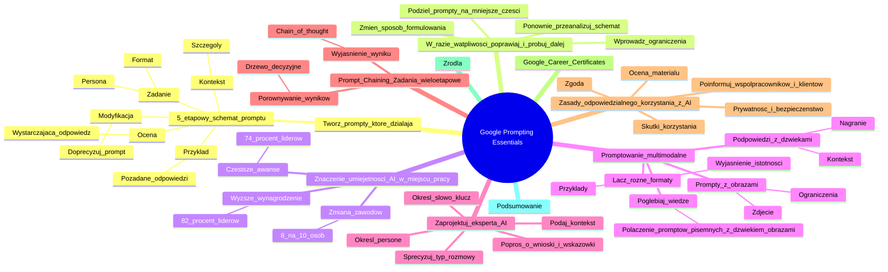

# Materiały dodatkowe - 3. Google Prompting Essentials

# 💡 Diagram

___

# 🗒️ Notatka

# Google Prompting Essentials: Notatki i Podsumowanie

## Wprowadzenie

Ten dokument zawiera szczegółowe notatki i podsumowanie kluczowych informacji dotyczących efektywnego `promptowania` modeli generatywnej AI, zgodnie z materiałami Google Prompting Essentials. Materiał skupia się na praktycznych strategiach i schematach, które pomagają w tworzeniu skutecznych `promptów`, wykorzystaniu multimodalności oraz odpowiedzialnym korzystaniu z AI.

## Twórz prompty, które działają

### 5-etapowy schemat formułowania promptu

Aby tworzyć skuteczne `prompty`, warto zastosować 5-etapowy schemat:

* **Zadanie:** Dokładnie określ cel `promptu`, wskazując **personę** (do kogo ma mówić AI) i **format** odpowiedzi.
    * *Przykład:* „Wciel się w rolę doświadczonego copywritera i napisz krótki, chwytliwy slogan reklamowy dla nowej aplikacji mobilnej do nauki języków obcych.”

* **Kontekst:** Dostarcz **wszystkie istotne szczegóły**, które pomogą AI zrozumieć oczekiwania. Im więcej kontekstu, tym lepsza odpowiedź.
    * *Przykład:* „Aplikacja jest skierowana do osób w wieku 18–35 lat, które chcą uczyć się języka hiszpańskiego w sposób interaktywny i zabawny. Główną cechą aplikacji jest wykorzystanie gier i quizów.”

* **Przykład:** Jeśli to możliwe, podaj **przykłady** pożądanych odpowiedzi. To pomaga AI zrozumieć preferowany styl i treść.
    * *Przykład:* „Slogan powinien być krótki, zapadający w pamięć i pozytywnie nastawiony. Na przykład: 'Hiszpański? Z nami to gra!'”

* **Ocena:** **Sprawdź, czy odpowiedź AI jest wystarczająca** i spełnia Twoje oczekiwania.
    * *Kryteria oceny:* Czy slogan jest chwytliwy? Czy pasuje do grupy docelowej? Czy oddaje charakter aplikacji?

* **Modyfikacja:** Jeśli odpowiedź nie jest satysfakcjonująca, **doprecyzuj `prompt`** i wprowadzaj poprawki. Powtarzaj proces, aż uzyskasz pożądany rezultat.
    * *Przykładowa modyfikacja:* „Slogan powinien być jeszcze krótszy, maksymalnie 5 słów, i zawierać element zaskoczenia.”

### W razie wątpliwości — poprawiaj i próbuj dalej

Proces tworzenia `promptów` jest iteracyjny. Kluczowe jest ciągłe eksperymentowanie i udoskonalanie `promptów`. Schemat kołowy „W razie wątpliwości — poprawiaj i próbuj dalej” sugeruje następujące kroki:

* **Wprowadź ograniczenia dla narzędzia generatywnej AI.** Precyzuj zadanie, format, długość odpowiedzi itp.
* **Ponownie przeanalizuj schemat powyżej.** Sprawdź, czy każdy etap został dokładnie przemyślany i zastosowany.
* **Podziel swoje `prompty` na mniejsze części.** Zamiast jednego dużego `promptu`, spróbuj serii mniejszych, bardziej szczegółowych `promptów`.
* **Zmień sposób formułowania podpowiedzi lub przejdź do podobnego zadania.** Eksperymentuj z różnymi sformułowaniami, strukturami zdań, lub spróbuj podejść do problemu z innej strony.

## Znaczenie umiejętności AI w miejscu pracy

* **8 na 10 osób na świecie** uważa, że sztuczna inteligencja znacząco zmieni większość zawodów i branż w ciągu najbliższych 5 lat.¹
* **82% liderów** uważa, że pracownicy z umiejętnościami AI powinni otrzymywać **wyższe wynagrodzenie**.²
* **74% liderów** uważa, że pracownicy posiadający umiejętności AI powinni być **częściej awansowani**.³

Dane te podkreślają rosnące znaczenie umiejętności związanych z AI na rynku pracy. Inwestowanie w rozwój tych kompetencji może przynieść korzyści finansowe i zawodowe.

## Promptowanie multimodalne

**`Promptowanie multimodalne`** polega na łączeniu różnych typów formatów (tekst, obraz, dźwięk) w jednym `prompcie`, co umożliwia bardziej złożone i bogate interakcje z AI.

* **Twórz `prompty` z obrazami:**
    * Załącz **zdjęcie** do `promptu` i zadawaj pytania dotyczące jego treści.
    * **Wprowadź ograniczenia**, aby skupić się na konkretnych elementach obrazu.
    * *Przykład:* Załącz zdjęcie krajobrazu górskiego i zapytaj: „Opisz szczegółowo ten krajobraz, skupiając się na roślinności i typach skał.”

* **Twórz podpowiedzi z dźwiękami:**
    * Załącz **nagranie głosu lub muzyki** i poproś AI o jego opis.
    * Zapewnij **odpowiedni kontekst**, aby AI mogło jak najlepiej zrozumieć nagranie.
    * *Przykład:* Załącz nagranie dźwięku ptaków i zapytaj: „Jakie gatunki ptaków słyszysz na tym nagraniu? Opisz ich śpiew.”

* **Łącz różne formaty:**
    * Podziel się **przykładami w formie tekstu, obrazu lub dźwięku**, aby ukierunkować wynik.
    * **Wyjaśnij, dlaczego każdy z załączonych elementów jest istotny** dla pożądanej odpowiedzi.
    * *Przykład:* Załącz tekst opisujący styl architektoniczny, zdjęcie budynku w tym stylu i zapytaj: „Zaprojektuj budynek mieszkalny w tym stylu, uwzględniając nowoczesne materiały.”

* **Pogłębiaj swoją wiedzę:**
    * **Połącz pisemne `prompty` z dźwiękiem lub obrazami**, aby lepiej zrozumieć to, co widzisz lub słyszysz.
    * *Przykład:* Przeczytaj artykuł o historii sztuki, a następnie załącz zdjęcie obrazu z danej epoki i poproś AI o analizę stylu i technik malarskich.

## Zaprojektuj eksperta AI

Możesz zaprojektować **eksperta AI**, który będzie wspierał Cię w rozwoju umiejętności, współpracy przy projektach, otrzymywaniu feedbacku i wielu innych zadaniach.

* **Określ personę**, którą ma przyjąć narzędzie generatywnej AI (np. mentor, coach, ekspert w danej dziedzinie).
* **Podaj kontekst sytuacyjny** oraz szczegóły rozwoju konwersacji (np. temat projektu, cel rozmowy).
* **Sprecyzuj typ rozmowy** oraz rodzaje interakcji, które ma wspierać narzędzie generatywnej AI (np. udzielanie porad, generowanie pomysłów, krytyczna ocena).
* **Określ słowo-klucz**, którego możesz użyć, aby zakończyć rozmowę (np. „koniec”, „dziękuję”).
* **Poproś narzędzie o kluczowe wnioski z rozmowy** oraz o wskazówki dotyczące obszarów wymagających poprawy.

## Prompt Chaining: Zadania wieloetapowe

**`Prompt chaining`** polega na wykorzystaniu wyniku jednego `promptu` jako kontekstu w kolejnym `prompcie`, co umożliwia realizację zadań wieloetapowych.

* **Poproś narzędzie generatywnej AI o wyjaśnienie, jak doszło do danego wyniku.**
    * Użyj metody **`chain of thought`**, aby AI wyjaśniło swoje rozumowanie krok po kroku. Jest to szczególnie przydatne przy rozwiązywaniu problemów.
    * *Ikona tablicy/flipchartu sugeruje wizualizację procesu myślowego.*

* **Porównuj jednocześnie wyniki:**
    * Poproś narzędzie generatywnej AI, aby przedstawiło **różne opcje**, które rozważa podczas generowania wyniku.
    * Wykorzystaj schemat rozumowania oparty na **drzewie decyzyjnym**. Pozwala to na zrozumienie różnych ścieżek i możliwości.
    * *Ikona wagi szalkowej symbolizuje ważenie różnych opcji i podejmowanie decyzji.*

## Zasady odpowiedzialnego korzystania z AI

Korzystanie z AI powinno być odpowiedzialne i etyczne. Należy wziąć pod uwagę następujące zasady:

* **Weź pod uwagę skutki korzystania ze sztucznej inteligencji** w swojej sytuacji. Zastanów się nad potencjalnymi konsekwencjami i wpływem na innych.
* **Zdobądź zgodę na korzystanie z narzędzia generatywnej AI od osób decyzyjnych** w Twojej organizacji, zanim zaczniesz go używać przy projektach lub w pracy z klientami. Upewnij się, że jest to zgodne z polityką firmy.
* **Rozważ kwestie prywatności i bezpieczeństwa** związane z narzędziem AI, z którego korzystasz. Chroń dane poufne i unikaj naruszeń prywatności.
* **Oceń cały materiał przed jego wykorzystaniem** w swojej pracy lub udostępnieniem go innym. Nie polegaj wyłącznie na AI, zweryfikuj i poprawiaj wyniki.
* **Poinformuj swoich współpracowników i klientów o korzystaniu z narzędzi generatywnej AI** oraz mów otwarcie o tym, do czego Ci służą. Transparentność buduje zaufanie.

## Google Career Certificates

Materiał pochodzi z Google Career Certificates, co sugeruje jego edukacyjny i praktyczny charakter, mający na celu rozwijanie umiejętności zawodowych w zakresie AI.

## Źródła

¹ Google, Ipsos. *Our life with AI: The reality of today and the promise of tomorrow*. Google and Ipsos, January 2024.
² EdX. *Navigating the Workplace in the Age of AI*. EdX, 2023.

## Podsumowanie

Materiały Google Prompting Essentials stanowią kompleksowy przewodnik po efektywnym `promptowaniu` modeli generatywnej AI. Podkreślają znaczenie struktury `promptu` (5-etapowy schemat), iteracyjnego procesu udoskonalania, wykorzystania multimodalności, projektowania ekspertów AI oraz technik `prompt chaining`. Dodatkowo, zwracają uwagę na odpowiedzialne i etyczne korzystanie z AI. Umiejętności te są coraz bardziej cenione na rynku pracy, co potwierdzają statystyki dotyczące wynagrodzeń i awansów dla osób posiadających kompetencje w zakresie AI. Zrozumienie i zastosowanie tych zasad może znacząco zwiększyć efektywność korzystania z narzędzi AI i otworzyć nowe możliwości zawodowe.

___

# 🔉 Transcript
File: Materiały dodatkowe - 3. Google Prompting Essentials.jpg 
Google Prompting Essentials

**Twórz prompty, które działają**

Poznaj 5-etapowy schemat formułowania promptu i zacznij korzystać ze sztucznej inteligencji.

**Zadanie:** Dokładnie określ, w czym ma pomóc narzędzie generatywnej AI, wskazując personę (do kogo mówisz) i format, w jakim ma zostać przygotowana odpowiedź.

**Kontekst:** Przekaż wszystkie najważniejsze szczegóły, dzięki którym narzędzie AI zrozumie, czego od niego oczekujesz.

**Przykład:** Jeśli to możliwe, podaj przykłady, które narzędzie generatywnej AI może wykorzystać przy tworzeniu odpowiedzi.

**Ocena:** Określ, czy odpowiedź stworzona przez narzędzie generatywnej AI jest wystarczająca.

**Modyfikacja:** Jeśli odpowiedź nie jest pomocna, doprecyzuj swoje potrzeby i wprowadzaj poprawki tak długo, aż rezultat będzie satysfakcjonujący.

**W razie wątpliwości — poprawiaj i próbuj dalej**

Schemat kołowy z centralnym elementem "W razie wątpliwości — poprawiaj i próbuj dalej" i czterema otaczającymi go elementami:
* **Wprowadź ograniczenia dla narzędzia generatywnej AI.**
* **Ponownie przeanalizuj schemat powyżej.**
* **Podziel swoje prompty na mniejsze części.**
* **Zmień sposób, w jaki formułujesz swoje podpowiedzi, lub przejdź do podobnego zadania.**
Strzałki wskazują na cykliczny charakter procesu.

**8 do 10** osób na świecie uważa, że sztuczna inteligencja zmieni większość zawodów lub branż w ciągu najbliższych 5 lat.¹

**82%** liderów uważa, że pracownicy biegli w korzystaniu z AI powinni dostawać wyższe wynagrodzenie.²

**74%** liderów uważa, że pracownicy posiadający umiejętności w zakresie AI powinni otrzymywać awanse częściej.³

**Multimodal prompting**

Połącz różne typy formatów, takie jak tekst, obraz i dźwięk, w jednym prompcie.

Trzy bloki informacyjne:
* **Twórz prompty z obrazami:** Zrób zdjęcie i zadaj pytania dotyczące jego treści. Wprowadź ograniczenia, aby skupić się na najważniejszych elementach obrazu.
* **Twórz podpowiedzi z dźwiękami:** Nagraj głos lub muzykę i poproś o ich opis. Zadbaj o odpowiedni kontekst, aby nagranie zostało jak najlepiej zrozumiane przez narzędzie generatywnej AI.
* **Łącz różne formaty:** Podziel się przykładami w formie tekstu, obrazu lub dźwięku, które pomogą ukierunkować wynik, i wyjaśnij, dlaczego każdy z nich jest istotny.
* **Pogłębiaj swoją wiedzę:** Połącz pisemne prompty z dźwiękiem lub obrazami, aby lepiej zrozumieć to, co widzisz lub słyszysz.

**Zaprojektuj eksperta AI**

Stwórz eksperta AI, który pomoże tobie rozwijać umiejętności, współpracować przy projekcie, otrzymywać feedback i wiele więcej.

Cztery bloki informacyjne:
* **Określ personę, którą ma przyjąć narzędzie generatywnej AI.**
* **Podaj kontekst sytuacyjny oraz szczegóły rozwoju konwersacji.**
* **Sprecyzuj typ rozmowy oraz rodzaje interakcji, które ma wspierać narzędzie generatywnej AI.**
* **Określ słowo-klucz, którego możesz użyć, aby zakończyć rozmowę.**
* **Poproś narzędzie o kluczowe wnioski z rozmowy oraz o wskazówki dotyczące obszarów wymagających poprawy.**

**Zrealizuj zadania wieloetapowe, tworząc ciąg promptów poprzez prompt chaining**

Wykorzystaj wynik jednego promptu jako kontekst w kolejnym prompcie.

Dwa bloki informacyjne:
* **Poproś narzędzie generatywnej AI o wyjaśnienie, jak doszło do danego wyniku.** Potrzebujesz pomocy przy rozwiązywaniu problemu? Poproś narzędzie AI, aby wyjaśniło swoje rozumowanie za pomocą metody *chain of thought*.  Ikona przedstawia tablicę/flipchart.
* **Porównuj jednocześnie wyniki:** Poproś narzędzie generatywnej AI, aby przedstawiło różne opcje, które rozważa podczas generowania wyniku, używając schematu rozumowania opartego na drzewie decyzyjnym. Ikona przedstawia wagę szalkową.

**Zasady odpowiedzialnego korzystania z AI**

Cztery punkty z zaznaczonymi checkboxami:
* Weź pod uwagę skutki korzystania ze sztucznej inteligencji w swojej sytuacji.
* Zdobądź zgodę na korzystanie z narzędzia generatywnej AI od osób decyzyjnych w twojej organizacji zanim zaczniesz go używać przy projektach lub w pracy z klientami.
* Rozważ kwestie prywatności i bezpieczeństwa związane z narzędziem AI, z którego korzystasz.
* Oceń cały materiał przed jego wykorzystaniem w swojej pracy lub udostępnieniem go innym.
* Poinformuj swoich współpracowników i klientów o korzystaniu z narzędzi generatywnej AI oraz mów otwarcie o tym, do czego ci służą.

Google Career Certificates

Źródła:
¹ Jak wynika z ankiety przeprowadzonej w 17 krajach. Google, Ipsos. *Our life with AI: The reality of today and the promise of tomorrow*. Google and Ipsos, January 2024.
² EdX. *Navigating the Workplace in the Age of AI*. EdX, 2023.

___
# 🏷️ Tags
#google_prompting_essentials #promptowanie #generatywna_AI #AI #prompt #5-etapowy_schemat_promptu #zadanie #persona #format_odpowiedzi #kontekst #przykład #ocena #modyfikacja #iteracyjny_proces #udoskonalanie_promptów #ograniczenia_AI #podział_promptów #formułowanie_podpowiedzi #umiejętności_AI #rynek_pracy #wynagrodzenie #awans #promptowanie_multimodalne #formaty #tekst #obraz #dźwięk #ekspert_AI #persona_AI #kontekst_sytuacyjny #typ_rozmowy #słowo-klucz #wnioski_z_rozmowy #prompt_chaining #zadania_wieloetapowe #chain_of_thought #drzewo_decyzyjne #odpowiedzialne_korzystanie_z_AI #etyka_AI #prywatność #bezpieczeństwo #transparentność #google_career_certificates #sztuczna_inteligencja #multimodal_prompting
