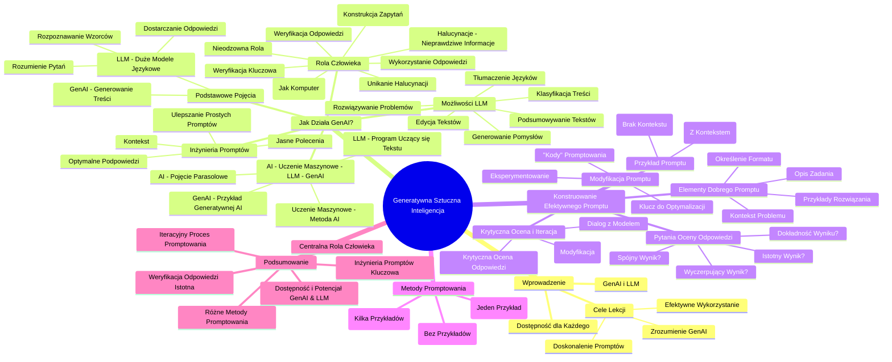

# Sekcja 1. Wprowadzenie do generatywnej AI oraz jak promptować - 1. Podstawy Generatywnej AI

# 💡 Diagram

___

# 🗒️ Notatka

# Notatki i Podsumowanie Lekcji: "Jak Działa Generatywna Sztuczna Inteligencja"

## Wprowadzenie

Lekcja stanowi wprowadzenie do świata generatywnej sztucznej inteligencji (`GenAI`) i dużych modeli językowych (`LLM`).  Podkreśla, że każdy może nauczyć się korzystać z tych narzędzi, podobnie jak opanował obsługę komputera. Celem lekcji jest wyjaśnienie zasad działania `GenAI`, efektywnego wykorzystania jej możliwości oraz doskonalenia zapytań (promptów) w celu uzyskania lepszych rezultatów.

## 1. Jak Działa Generatywna Sztuczna Inteligencja?

### 1.1. Podstawowe Pojęcia

* **Generatywna Sztuczna Inteligencja (`GenAI`):**  Rodzaj sztucznej inteligencji, który generuje nowe treści, takie jak teksty, obrazy i multimedia.
* **Duże Modele Językowe (`LLM`):** (Large Language Models) - rodzaj sztucznej inteligencji trenowany na ogromnych zbiorach danych tekstowych.
    * Rozpoznają wzorce i zależności pomiędzy słowami, pojęciami i wyrażeniami w języku naturalnym.
    * Potrafią rozumieć zadawane pytania i dostarczać na nie odpowiedzi.

### 1.2. Możliwości Modeli `LLM`

Modele `LLM` potrafią:
* **Podsumowywać obszerne i złożone teksty.**
* **Rozwiązywać problemy.**
* **Tłumaczyć teksty na różne języki.**
* **Edytować teksty.**
* **Generować pomysły.**
* **Klasyfikować treści.**

### 1.3. Rola Inżynierii Promptów

* **Inżynieria promptów:** Umiejętność tworzenia optymalnych podpowiedzi (promptów) dla modeli `GenAI`.
    * Jej celem jest formułowanie jasnych, konkretnych poleceń i dostarczanie kontekstu, aby asystent AI mógł precyzyjnie zrozumieć zadanie.
    * Proste prompty (np. „popraw”, „przetłumacz maila”) można znacząco ulepszyć poprzez dodanie kontekstu i szczegółów.

### 1.4. Sztuczna Inteligencja - Uczenie Maszynowe - `LLM` - `GenAI`

* **Sztuczna Inteligencja (`AI`):** Najszersze pojęcie parasolowe.
* **Uczenie Maszynowe:** Metoda `AI` polegająca na tworzeniu programów, które uczą się na podstawie danych.
* **`LLM`:** Program uczeniowy na ogromnych ilościach tekstu, specjalizujący się w generowaniu tekstu.
* **`GenAI`:** Przykład generatywnej sztucznej inteligencji, której przykładem jest `LLM`.

### 1.5. Rola Człowieka w Procesie `GenAI`

* Człowiek jest **nieodzowny** w procesie `GenAI`.
    * **Promptowanie:** Konstruowanie zapytań.
    * **Weryfikacja odpowiedzi:** Sprawdzanie merytorycznej poprawności odpowiedzi generowanych przez `AI`.
    * **Wykorzystanie odpowiedzi:** Praktyczne zastosowanie uzyskanych informacji.
* **Unikanie Halucynacji:** Weryfikacja pomaga minimalizować ryzyko halucynacji i zwiększa wiarygodność odpowiedzi.
* **Halucynacje:** Sytuacje, w których `GenAI` prezentuje nieprawdziwe lub niedokładne informacje.
    * Mogą wynikać z nieprecyzyjnego promptu lub braku wiedzy modelu w danym obszarze tematycznym.
    * `GenAI` zawsze dąży do udzielenia odpowiedzi, nawet w przypadku braku pewności.
* **Kluczowa Rola Weryfikacji:** Każda odpowiedź wygenerowana przez `GenAI` powinna zostać zweryfikowana przez człowieka.
* **Nauka Obsługi `GenAI`:** Podobnie jak nauka obsługi komputera,  opanowanie `GenAI` wymaga czasu i praktyki.

## 2. Konstruowanie Efektywnego Promptu

### 2.1. Elementy Składowe Dobrego Promptu

Dobry prompt powinien zawierać:
* **Opis zadania:** Jasne i precyzyjne określenie oczekiwanego działania modelu.
* **Kontekst problemu:** Dodatkowe informacje ułatwiające modelowi zrozumienie zapytania.
* **Przykłady oczekiwanego rozwiązania (przykłady):**  Prezentacja modelowi pożądanego formatu i typu odpowiedzi.
* **Określenie formatu (dodane na slajdzie):** (element wspomniany na slajdzie, choć nie szczegółowo omówiony w transkrypcie, warto o nim pamiętać).

### 2.2. Krytyczna Ocena i Iteracyjne Poprawki

* **Krytyczna ocena odpowiedzi:** Należy podchodzić z rezerwą i krytycyzmem do każdej odpowiedzi generowanej przez `GenAI`.
* **Iteracja promptów:** W przypadku niezadowalającej odpowiedzi, należy ponowić zapytanie, modyfikując prompt.
    * Należy przeanalizować, czego brakuje w odpowiedzi i odpowiednio zmodyfikować zapytanie, aby model skupił się na brakujących aspektach.
    * Promptowanie to **ciągły dialog** z modelem.

### 2.3. Przykład Promptu: Zły i Dobry

* **Nieefektywny prompt (brak kontekstu):** „Podaj kilka pomysłów na prezent do 100 zł.”
    * Model generuje zbyt ogólne propozycje, nie uwzględniając konkretnych preferencji.
* **Efektywny prompt (z kontekstem):** „Podaj cztery pomysły na prezent urodzinowy dla dziesięcioletniej dziewczynki, która uwielbia kolor fioletowy i jest fanką koni i jednorożców. Mój budżet wynosi 100 zł.”
    * Model generuje pomysły precyzyjnie dopasowane do zainteresowań i wieku, mieszcząc się w określonym budżecie.

### 2.4. Pytania Pomocnicze w Ocenie Odpowiedzi

Oceniając odpowiedź, warto zadać sobie następujące pytania:
* **Czy wynik jest dokładny?**
* **Czy wynik jest wystarczająco wyczerpujący?**
* **Czy wynik jest istotny dla mojego projektu lub zadania?**
* **Czy uzyskuję spójny wynik, zadając wielokrotnie to samo pytanie?**

### 2.5. Modyfikacja Promptu dla Optymalizacji Wyników

* Modyfikacja promptu może być kluczem do rozwiązania problemów z odpowiedziami i uzyskania lepszych rezultatów.
* Podobnie jak w grze komputerowej, nie należy rezygnować, lecz eksperymentować z różnymi podejściami.
* **Kody ułatwiające pracę:** Metody promptowania można traktować jako „kody” usprawniające interakcję z `GenAI`.

## 3. Metody Promptowania

### 3.1. Rodzaje Promptowania

* **Few-shot prompting:** Promptowanie oparte na **kilku przykładach** zbliżonych rozwiązań problemu.
* **Zero-shot prompting:** Promptowanie **bez wykorzystania jakichkolwiek przykładów.**
* **One-shot prompting:** Promptowanie z **jednym przykładem.**

## Podsumowanie

Lekcja "Jak działa generatywna sztuczna inteligencja" wprowadza w fascynujący świat `GenAI` i `LLM`, akcentując ich dostępność i ogromny potencjał.  Kluczowym aspektem efektywnego korzystania z `GenAI` jest **inżynieria promptów**, czyli umiejętność formułowania jasnych i bogatych w kontekst promptów.  Niezwykle istotna jest **weryfikacja odpowiedzi** generowanych przez `AI`, aby zapobiegać halucynacjom i zapewnić wiarygodność informacji. Proces promptowania ma charakter iteracyjny, wymaga krytycznej analizy odpowiedzi i modyfikacji zapytań. Różnorodne metody promptowania, takie jak zero-shot, one-shot i few-shot, umożliwiają dopasowanie strategii do konkretnego zadania i osiągnięcie lepszych rezultatów. Ostatecznie, człowiek odgrywa centralną rolę w całym procesie – od inicjowania zapytań, poprzez weryfikację, aż po praktyczne wykorzystanie uzyskanych odpowiedzi.

___

# 🔉 Transcript
File: Sekcja 1. Wprowadzenie do generatywnej AI oraz jak promptować - 1. Podstawy Generatywnej AI.mp4 
[00:00:05] Speaker: Cześć.
[00:00:06] Screen: The presenter is sitting at a desk with a Google Cloud t-shirt, a laptop, and a green plant on the desk. Behind him, there is a wooden wall with shelves.
[00:00:06] Speaker: To może nie takie oczywiste, ale nikt z nas nie urodził się z umiejętnością korzystania z komputera.
[00:00:13] Screen: The presenter is sitting closer to the camera.
[00:00:13] Speaker: Każdy miał ten moment, kiedy po raz pierwszy posadzony przed klawiaturą i ekranem musiał odpalić komputer, stworzyć pierwszy folder, a potem właściwie nie wiedząc kiedy, grał w skomplikowane gry, pisał pracę dyplomową i z komputerem już się nie rozstawał.
[00:00:32] Screen: The presenter is sitting closer to the camera.
[00:00:32] Speaker: I tak jak każdy z nas był w stanie nauczyć się obsługi komputera, tak samo możemy, a nawet powinniśmy nauczyć się obsługi generatywnej sztucznej inteligencji.
[00:00:44] Screen: The presenter is sitting at a desk with a Google Cloud t-shirt, a laptop, and a green plant on the desk. Behind him, there is a wooden wall with shelves.
[00:00:44] Screen: The screen displays a presentation slide. The title is: "01 Jak działa generatywna sztuczna inteligencja?"
[00:00:45] Speaker: W tej lekcji opowiem wam jak działa generatywna sztuczna inteligencja, jak korzystać z niej skutecznie w pięciu krokach, jak korzystać z niej lepiej niż inni, czyli jak używać jej na poziomie zaawansowanym.
[01:01:01] Speaker: I gdybym miał podsumować wszystko, co powinniście wiedzieć po tej lekcji w jednym zdaniu, to brzmiałoby ono tak: GenAI wykorzystuje modele językowe, tak zwane LLM-y, które używają różnych technik uczenia maszynowego inspirowanych sposobem działania ludzkiego mózgu.
[01:23:00] Speaker: Odpowiednio zadając pytania, tak zwane prompty, jesteśmy w stanie przejąć kontrolę nad tymi modelami, niczym pilot nad samolotem i wykorzystać wiedzę zapisaną w modelu w trakcie jego trenowania oraz jego generatywne zdolności do uzyskania odpowiedzi na nasze pytania.
[01:46:56] Speaker: Nasza rola jest tutaj kluczowa.
[01:49:22] Speaker: To my będziemy konstruować pytania w sposób, który pozwoli modelowi rozpoznać, co się za tym pytaniem kryje - tak zwany kontekst pytania.
[02:01:20] Speaker: Na koniec będziemy musieli zweryfikować, czy odpowiedź jest merytorycznie poprawna, bowiem tego typu modele są stworzone do generowania i generują nawet wtedy, kiedy nie są pewne odpowiedzi.
[02:18:00] Speaker: I mówimy wtedy o ryzyku halucynacji.
[02:21:00] Speaker: Prawda, że proste?
[02:23:00] Speaker: Przeróbmy to na spokojnie.
[02:26:00] Speaker: Zacznijmy od GenAI.
[02:27:00] Speaker: Skrótowca od generative artificial intelligence, a po polsku generatywnej sztucznej inteligencji.
[02:35:00] Speaker: GenAI to rodzaj sztucznej inteligencji, która generuje nowe treści, na przykład teksty, obrazy lub inne multimedia.
[02:47:00] Speaker: GenAI wykorzystuje LLM-y, czyli large language models, a po polsku duże modele językowe.
[02:56:00] Speaker: To rodzaj sztucznej inteligencji, trenowanej na dużej ilości tekstu, co sprawia, że może rozpoznawać pewne wzorce i zależności pomiędzy słowami i pojęciami, a także wyrażeniami w języku naturalnym.
[03:14:00] Speaker: Czyli w takim języku, jakim posługujemy się na co dzień w rozmowach między sobą.
[03:21:00] Speaker: Może nie tylko rozpoznawać, o co nam chodzi, ale też dostarczać odpowiedzi.
[03:28:00] Screen: A presentation slide appears. The title is: "Co konkretnie potrafią LLM-y?" with the following bullet points: "podsumowywać złożone i długie teksty", "rozwiązywać problemy", "tłumaczyć na różne języki", "edytować teksty", "generować pomysły", and "klasyfikować".
[03:29:00] Speaker: Co konkretnie potrafią LLM-y?
[03:32:00] Speaker: Potrafią podsumowywać złożone i długie teksty, rozwiązywać problemy, tłumaczyć na różne języki, edytować teksty, generować pomysły lub klasyfikować treści.
[03:50:00] Speaker: Modele GenAI dają lepsze odpowiedzi, jeśli posiadamy umiejętność z zakresu tak zwanego prompt inżynieringu.
[03:57:00] Speaker: Brzmi skomplikowanie?
[03:59:00] Speaker: Niekoniecznie.
[04:01:00] Speaker: Prompt inżyniering polega na opracowaniu jak najlepszych podpowiedzi dla modelu.
[04:07:00] Speaker: Chodzi o to, żeby ten nasz AI asystent po prostu otrzymywał jasne, konkretne polecenia i kontekst.
[04:17:00] Speaker: Parę promptów przed chwilą widzieliście: popraw, przetłumacz maila, popraw tekst.
[04:24:00] Speaker: To proste prompty.
[04:26:00] Speaker: Da się lepiej.
[04:28:00] Speaker: Ale to za chwilę.
[04:31:00] Speaker: Podsumujmy.
[04:32:00] Speaker: Sztuczna inteligencja, czyli AI, to najszersze pojęcie.
[04:37:00] Speaker: Jedną z metod AI jest uczenie maszynowe, czyli tworzenie programów uczących się na danych.
[04:44:00] Speaker: A LLM to program, który nauczony jest na ogromnych ilościach tekstu, a do tego sam generuje tekst, przez co jest przykładem tak zwanej generatywnej sztucznej inteligencji.
[04:58:00] Speaker: Aby uzyskiwać i ulepszać odpowiedzi od GenAI, stosujemy prompt inżyniering.
[05:05:00] Speaker: Na czym polega nasza rola w tym procesie?
[05:09:00] Speaker: Człowiek jest niezbędny do promptowania, weryfikowania odpowiedzi od AI i na koniec to on będzie wykorzystywać otrzymane odpowiedzi.
[05:20:00] Speaker: Takie podejście pozwala na uniknięcie potencjalnych negatywnych skutków halucynacji, przez co wyniki generowane przez AI mają szansę być bardziej dokładne i trafne.
[05:34:00] Speaker: Wspomniane halucynacje mogą zdarzyć się każdemu.
[05:39:00] Speaker: Również GenAI czasami podaje nieprawdziwe, niedokładne wyniki.
[05:45:00] Speaker: Może to być spowodowane nieprecyzyjnym promptem albo faktem, że model nie posiada wiedzy na dany temat, ale jego generatywna natura sprawia, że zawsze próbuje odpowiedzieć na zadany prompt.
[06:01:00] Speaker: Dlatego każda odpowiedź od GenAI powinna być weryfikowana przez człowieka.
[06:08:00] Speaker: Tak jak komputer, GenAI potrzebuje człowieka, ale też człowiek, tak jak uczy się obsługi komputera, tak samo potrzebuje nauczyć się obsługi GenAI.
[06:14:00] Screen: The screen displays a presentation slide. The title is: "Skonstruuj dobry prompt" with the following bullet points: "Opisz zadanie", "Nadaj kontekst", "Dodaj przykład rozwiązania", and "Określ format". Below the bullet points it says "podejdź krytycznie do każdej odpowiedzi [evaluate]" and "zadaj dodatkowe pytanie, w sposób zwięzły i jasny [iterate]".
[06:24:00] Speaker: Wiecie już, jak działają duże modele językowe.
[06:28:00] Speaker: Czas przekuć teorię w praktykę.
[06:33:00] Speaker: Dobry prompt zawiera: opis zadania, kontekst problemu i przykład rozwiązania zbliżonego zadania.
[06:41:00] Speaker: Tak zwane przykłady.
[06:42:00] Speaker: Dobrze by było, gdybyś podszedł krytycznie do każdej odpowiedzi i jeśli nie jest ona wystarczająco dokładna lub satysfakcjonująca, spróbował zadać pytanie jeszcze raz.
[06:56:00] Speaker: Ale zanim to zrobisz, zastanów się, czego tej odpowiedzi brakuje i zmodyfikuj swoje zapytanie tak, żeby model wiedział, że na tych zagadnieniach powinien się skupić.
[07:08:00] Speaker: Zobaczmy różnicę między dobrze i źle napisanym promptem.
[07:13:00] Speaker: Przed nami niezwykle skomplikowane i trudne zadanie, które chcieli, gdybyśmy chcieli wykonać sami, mogłoby oznaczać noce i dnie wyrywania sobie włosów z głowy.
[07:25:00] Speaker: Czyli co kupić na prezent dla dziesięcioletniej siostrzenicy?
[07:28:00] Screen: The presenter goes to the Gemini website.
[07:29:00] Speaker: Użyjemy jednak do tego Gemini.
[07:32:00] Speaker: Podaj mi kilka pomysłów na prezent poniżej 100 zł.
[07:37:00] Screen: The Gemini website is showing a list of different presents with an image of each one.
[07:37:00] Speaker: Jak widzicie, brakuje kontekstu, więc model poda różne pomysły dla osób z różnymi zainteresowaniami, dorosłych i dzieci.
[07:40:00] Speaker: Trochę zbyt szeroko, prawda?
[07:50:00] Speaker: Spróbujmy z innym promptem.
[07:53:00] Speaker: Podaj mi cztery pomysły na prezent urodzinowy dla dziesięcioletniej dziewczynki, która lubi kolor fioletowy i jest fanką koni i jednorożców.
[08:05:00] Speaker: Mój budżet to 100 zł.
[08:08:00] Screen: The Gemini website is showing a list of different presents with an image of each one.
[08:08:00] Speaker: Zobaczcie, że tutaj podaliśmy już kontekst.
[08:12:00] Speaker: Prezent jest dla dziewczynki, której obiektem zainteresowania są konie i jednorożce.
[08:19:00] Speaker: W tym obszarze Gemini wygenerował nam mnóstwo pomysłów, od zabawek po książki.
[08:27:00] Speaker: Mamy w czym wybierać.
[08:28:00] Speaker: Zauważcie, że model wskazał również konkretne miejsca, gdzie możecie kupić dany prezent.
[08:37:00] Speaker: Chwila i zrobione.
[08:39:00] Speaker: No dobrze, ale może się zdarzyć, że AI nie poda nam od razu odpowiedzi, która nam pasuje.
[08:47:00] Speaker: W końcu no nie zda naszej siostrzenicy.
[08:50:00] Speaker: W takiej sytuacji, zamiast porzucić to wszystko, wystarczy zapytać ponownie.
[08:55:00] Speaker: Podać więcej przykładów, dodatkowy kontekst.
[09:00:00] Speaker: Inaczej mówiąc, iterować prompty.
[09:03:00] Speaker: Bo promptowanie to ciągła rozmowa z modelem.
[09:07:00] Speaker: Gdy z kimś rozmawiacie, naturalne są zatrzymania, przerywniki, dopowiadanie czy strumień myśli.
[09:15:00] Speaker: Podobnie jest z promptowaniem.
[09:18:00] Speaker: Czasem będziecie musieli zacząć od nowa lub wrócić do bardzo podstawowej wersji promptu.
[09:25:00] Speaker: To też jest w porządku.
[09:27:00] Speaker: Na co zwrócić uwagę przy ocenie odpowiedzi i tego, w którą stronę warto pokierować rozmową czy też zmienić kolejny prompt?
[09:40:00] Speaker: W ocenie pomocne mogą być następujące pytania.
[09:44:00] Speaker: Czy wynik jest dokładny?
[09:45:00] Speaker: Czy wynik zawiera wystarczające informacje?
[09:50:00] Speaker: Czy wynik jest związany z moim projektem lub zadaniem?
[09:56:00] Speaker: W końcu czy uzyskuję spójny wynik zadając wielokrotnie to samo pytanie?
[10:03:00] Speaker: Jeśli podczas oceny wyników zauważysz jakiekolwiek problemy, modyfikowanie początkowego promptu może często pomóc w ich rozwiązaniu i uzyskaniu dużo lepszego rezultatu.
[10:17:00] Speaker: Tak jak podczas gry komputerowej.
[10:20:00] Speaker: Rzadko przechodzi się ją za pierwszym razem.
[10:24:00] Speaker: Warto się nie poddawać i próbować aż do skutku.
[10:28:00] Speaker: Oczywiście, tak jak w grze można też grać na kodach i znacząco ułatwić sobie pracę.
[10:35:00] Speaker: W tym przypadku nasze kody to w pełni legalne i skuteczne metody promptowania.
[10:41:00] Screen: The screen displays a presentation slide. The title is: "Metody promptowania" with the following bullet points: "Few shot prompting" - "Tworzenie promptów na podstawie kilku przykładów rozwiązania podobnego problemu.", "Zero shot prompting" - "Tworzenie promptów bez użycia jakichkolwiek przykładów." and "One shot prompting" - "Tworzenie promptów z wykorzystaniem jednego przykładu.".
[10:42:00] Speaker: Pierwszą z nich jest few shot prompting.
[10:46:00] Speaker: Co to jest?
[10:47:00] Speaker: Otóż słowa shot czasem używamy jako synonim słowa przykład.
[10:54:00] Speaker: Zatem few shot prompting to promptowanie na podstawie kilku przykładów rozwiązania zbliżonego problemu.
[11:02:00] Speaker: Analogicznie zero shot prompting to promptowanie bez użycia przykładów.
[11:10:00] Speaker: Natomiast one shot prompting jest użyciem podpowiedzi z jednym przykładem.
[11:17:00] Speaker: Proste.
[11:54:00] Screen: The screen displays the title card of the presentation.
[11:54:00] Speaker: You're watching Umiejętności Jutra AI.