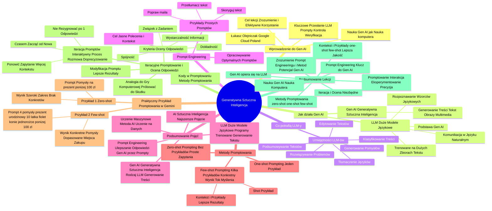

# Sekcja 1. Wprowadzenie do generatywnej AI oraz jak promptować - 1. Podstawy Generatywnej AI

# 💡 Diagram

___

# 🗒️ Notatka

# Notatki i Podsumowanie Lekcji: Jak Działa Generatywna Sztuczna Inteligencja

## Wprowadzenie do Generatywnej Sztucznej Inteligencji (Gen AI)

* **Łukasz Olejniczak** z Google Cloud Poland przedstawia lekcję o generatywnej sztucznej inteligencji.
* Nauka obsługi **Gen AI** jest porównywalna do nauki obsługi komputera – każdy może się jej nauczyć.
* **Cel lekcji:** Zrozumienie działania **Gen AI** i efektywne korzystanie z niej.
* **Kluczowe przesłanie:** **Gen AI** wykorzystuje **modele językowe (LLM)**, a odpowiednio sformułowane `prompty` pozwalają kontrolować i wykorzystywać wiedzę tych modeli. Kluczowa jest nasza rola w konstruowaniu pytań i weryfikacji odpowiedzi.

## 01 Jak Działa Generatywna Sztuczna Inteligencja?

* **Gen AI (Generative Artificial Intelligence)** – generatywna sztuczna inteligencja.
    * Rodzaj sztucznej inteligencji, który generuje nowe treści, takie jak teksty, obrazy i multimedia.
* **LLM (Large Language Models)** – duże modele językowe.
    * Stanowią podstawę **Gen AI**.
    * Są trenowane na ogromnych zbiorach tekstu.
    * Rozpoznają wzorce i zależności w języku naturalnym.
    * Umożliwiają komunikację w języku, którym posługujemy się na co dzień.

## Co Konkretnie Potrafią LLM-y?

* **Umiejętności LLM-ów:**
    * Podsumowywanie złożonych tekstów
    * Rozwiązywanie problemów
    * Tłumaczenie na różne języki
    * Edytowanie tekstów
    * Generowanie pomysłów
    * Klasyfikowanie treści

## Prompt Engineering – Klucz do Lepszych Odpowiedzi

* **Prompt engineering:** Proces opracowywania optymalnych podpowiedzi (`promptów`) dla modeli **Gen AI**.
* **Cel `prompt engineeringu`:** Dostarczanie jasnych i konkretnych poleceń oraz kontekstu dla asystenta AI.
* **Przykłady prostych `promptów`:**
    * „Popraw maila”
    * „Przetłumacz tekst”
    * „Skoryguj tekst”

## Podsumowanie Pojęć: AI, Uczenie Maszynowe, LLM, Gen AI, Prompt Engineering

* **AI (Sztuczna Inteligencja):** Najszersze pojęcie.
* **Uczenie Maszynowe:** Metoda **AI**, polegająca na tworzeniu programów uczących się na danych.
* **LLM (Duże Modele Językowe):** Programy trenowane na ogromnych zbiorach tekstów, generujące tekst.
* **Gen AI (Generatywna Sztuczna Inteligencja):** Rodzaj **LLM**, który generuje różnorodne treści.
* **Prompt Engineering:** Metoda ulepszania odpowiedzi **Gen AI** poprzez precyzyjne formułowanie `promptów`.

## Metody Promptowania

* **Różne metody `promptowania`:**
    * **Zero-shot prompting:** `Promptowanie` bez użycia przykładów.
        * Efektywne w przypadku prostych zapytań.
    * **One-shot prompting:** `Promptowanie` z wykorzystaniem pojedynczego przykładu.
    * **Few-shot prompting:** `Promptowanie` oparte na kilku przykładach rozwiązania podobnego problemu.
        * `Shot` = przykład.
        * Bardziej efektywne, gdy oczekujemy konkretnego wyniku i chcemy, aby model zrozumiał nasz sposób myślenia.
        * Dostarczenie kontekstu i przykładów znacząco poprawia jakość rezultatów.

## Praktyczny Przykład Promptowania w Gemini

* **Przykład 1: Zero-shot prompting (brak kontekstu)**
    * `Prompt`: „Podaj mi kilka pomysłów na prezent poniżej 100 zł.”
    * Wynik: Szeroki zakres pomysłów, brak konkretów.
* **Przykład 2: Few-shot prompting (dodanie kontekstu)**
    * `Prompt`: „Podaj mi 4 pomysły na prezent urodzinowy dla dziesięcioletniej dziewczynki, która lubi kolor fioletowy i jest fanką koni i jednorożców. Mój budżet to 100 zł.”
    * Wynik: Konkretne pomysły, dopasowane do zadanego kontekstu (zainteresowania, wiek, budżet).
    * Model wskazuje nawet potencjalne miejsca zakupu.

## Iteracyjne Promptowanie i Ocena Odpowiedzi

* **Iteracja `promptów`:** `Promptowanie` to interaktywny proces, przypominający rozmowę z modelem, który wymaga iteracji i doprecyzowania.
    * Nie należy rezygnować po pierwszej, niezadowalającej odpowiedzi.
    * Warto ponowić zapytanie, dodając więcej przykładów i kontekstu.
    * Czasami konieczne jest rozpoczęcie od nowa lub powrót do podstawowego `promptu`.
* **Kryteria oceny odpowiedzi:**
    * **Dokładność:** Czy uzyskany wynik jest precyzyjny?
    * **Wystarczalność informacji:** Czy odpowiedź zawiera kompletne informacje?
    * **Związek z zadaniem:** Czy wynik jest adekwatny w kontekście projektu/zadania?
    * **Spójność:** Czy odpowiedź jest spójna przy wielokrotnym zadawaniu tego samego pytania?
* **Modyfikacja `promptu`:** Jeśli ocena odpowiedzi ujawni niedociągnięcia, modyfikacja `promptu` może prowadzić do lepszych rezultatów.
* **Analogia do gry komputerowej:** Sukces rzadko przychodzi za pierwszym podejściem – warto próbować do skutku.
* „Kody” w `promptowaniu`: Metody `promptowania` można traktować jako „kody”, które ułatwiają efektywną pracę z **Gen AI**.

## Podsumowanie Lekcji

* Generatywna sztuczna inteligencja (**Gen AI**) opiera się na dużych modelach językowych (**LLM**).
* **Prompt engineering** – umiejętność tworzenia odpowiednich `promptów` – jest kluczem do efektywnego wykorzystania **Gen AI**.
* Istnieją różne metody `promptowania`: **zero-shot**, **one-shot**, **few-shot**.
* Dodawanie **kontekstu i przykładów** (metody **one-shot** i **few-shot**) znacząco podnosi jakość odpowiedzi.
* **Iteracyjne `promptowanie`** i **ocena odpowiedzi** są niezbędne w procesie uzyskiwania pożądanych rezultatów.
* `Promptowanie` to ciągła interakcja z modelem, wymagająca eksperymentowania i precyzji.

Lekcja podkreśla, że każdy może nauczyć się korzystać z generatywnej sztucznej inteligencji, podobnie jak opanował obsługę komputera. Kluczowe jest zrozumienie zasad `prompt engineeringu` i praktyczne stosowanie różnorodnych metod `promptowania`, aby w pełni wykorzystać potencjał **Gen AI**.

___

# 🔉 Transcript
File: Sekcja 1. Wprowadzenie do generatywnej AI oraz jak promptować - 1. Podstawy Generatywnej AI.mp4 
[00:00:04] (Ekran: Logo "Umiejętności Jutra AI". Poniżej loga "Organizator: Google", "Partner edukacyjny: SGH", "Patronat honorowy: Minister Cyfryzacji")
[00:00:05] (Ekran: Mężczyzna w koszulce "Google Cloud" siedzi przy biurku, na którym leży laptop)
[00:00:05] Łukasz Olejniczak: Cześć.
[00:00:06] (Ekran: Pod mężczyzną pojawia się podpis: "Łukasz Olejniczak Customer Engineer for Smart Analytics and AI + Google Cloud Poland")
[00:00:06] Łukasz Olejniczak: To marzenie takie oczywiste, ale nikt z nas nie urodził się z umiejętnością korzystania z komputera.
[00:00:13] (Ekran: Przybliżenie na twarz mężczyzny)
[00:00:16] Łukasz Olejniczak: Każdy miał ten moment, kiedy po raz pierwszy posadzony przed klawiaturą i ekranem musiał odpalić komputer, stworzyć pierwszy folder, a potem właściwie nie wiedząc kiedy, grał w skomplikowane gry, pisał pracę dyplomową i z komputerem już się nie rozstawał.
[00:00:32] (Ekran: Przybliżenie na twarz mężczyzny)
[00:00:33] Łukasz Olejniczak: I tak jak każdy z nas był w stanie nauczyć się obsługi komputera, tak samo możemy, a nawet powinniśmy nauczyć się obsługi generatywnej sztucznej inteligencji.
[00:00:44] (Ekran: Mężczyzna siedzi przy biurku, obok niego slajd z nagłówkiem "01 Jak działa generatywna sztuczna inteligencja?")
[00:00:44] Łukasz Olejniczak: W tej lekcji opowiem wam jak działa generatywna sztuczna inteligencja.
[00:00:49] (Ekran: Na slajdzie pojawiają się kolejne nagłówki: "02 Jak korzystać z niej skutecznie w 5 krokach?", "03 Jak korzystać z niej lepiej niż inni - czyli jak używać jej na poziomie zaawansowanym?")
[00:01:00] Łukasz Olejniczak: Jak korzystać z niej skutecznie w pięciu krokach?
[00:01:01] Łukasz Olejniczak: Jak korzystać z niej lepiej niż inni, czyli jak używać jej na poziomie zaawansowanym?
[00:01:01] (Ekran: Mężczyzna siedzi przy biurku)
[00:01:02] Łukasz Olejniczak: I gdybym miał podsumować wszystko, co powinniście wiedzieć po tej lekcji w jednym zdaniu, to brzmiałoby ono tak.
[00:01:04] (Ekran: Przybliżenie na twarz mężczyzny)
[00:01:10] Łukasz Olejniczak: Gen AI wykorzystuje modele językowe, tak zwane LLM-y, które używają różnych technik uczenia maszynowego inspirowanych sposobem działania ludzkiego mózgu.
[00:01:22] (Ekran: Przybliżenie na twarz mężczyzny)
[00:01:23] Łukasz Olejniczak: Odpowiednio zadając pytania, tak zwane prompty, jesteśmy w stanie przejąć kontrolę nad tymi modelami, niczym pilot nad samolotem i wykorzystać wiedzę zapisaną w modelu w trakcie jego trenowania oraz jego generatywne zdolności do uzyskania odpowiedzi na nasze pytania.
[00:01:46] (Ekran: Przybliżenie na twarz mężczyzny)
[00:01:47] Łukasz Olejniczak: Nasza rola jest tutaj kluczowa.
[00:01:49] Łukasz Olejniczak: To my będziemy konstruować pytania w sposób, który pozwoli modelowi rozpoznać, co się za tym pytaniem kryje.
[00:01:58] Łukasz Olejniczak: Tak zwany kontekst pytania.
[00:02:01] Łukasz Olejniczak: Na koniec będziemy musieli zweryfikować, czy odpowiedź jest merytorycznie poprawna, bowiem tego typu modele są stworzone do generowania.
[00:02:13] Łukasz Olejniczak: I generują nawet wtedy, kiedy nie są pewne odpowiedzi.
[00:02:18] Łukasz Olejniczak: I mówimy wtedy o ryzyku halucynacji.
[00:02:21] (Ekran: Mężczyzna siedzi przy biurku)
[00:02:22] Łukasz Olejniczak: Prawda, że proste?
[00:02:23] Łukasz Olejniczak: Przeróbmy to na spokojnie.
[00:02:25] (Ekran: Przybliżenie na twarz mężczyzny)
[00:02:26] Łukasz Olejniczak: Zacznijmy od Gen AI, skrótowca od Generative Artificial Intelligence, a po polsku generatywnej sztucznej inteligencji.
[00:02:35] (Ekran: Mężczyzna siedzi przy biurku)
[00:02:36] Łukasz Olejniczak: Gen AI to rodzaj sztucznej inteligencji, która generuje nowe treści, na przykład teksty, obrazy lub inne multimedia.
[00:02:46] (Ekran: Przybliżenie na twarz mężczyzny)
[00:02:47] Łukasz Olejniczak: Gen AI wykorzystuje LLM-y, czyli Large Language Models, a po polsku duże modele językowe.
[00:02:56] (Ekran: Mężczyzna siedzi przy biurku)
[00:02:56] Łukasz Olejniczak: To rodzaj sztucznej inteligencji trenowanej na dużej ilości tekstu, co sprawia, że może rozpoznawać pewne wzorce i zależności pomiędzy słowami i pojęciami, a także wyrażeniami w języku naturalnym.
[00:03:14] (Ekran: Przybliżenie na twarz mężczyzny)
[00:03:14] Łukasz Olejniczak: Czyli w takim języku, jakim posługujemy się na co dzień w rozmowach między sobą.
[00:03:20] (Ekran: Mężczyzna siedzi przy biurku, obok niego slajd z nagłówkiem "Co konkretnie potrafią LLM-y?")
[00:03:28] Łukasz Olejniczak: Co konkretnie potrafią LLM-y?
[00:03:31] (Ekran: Przybliżenie na twarz mężczyzny)
[00:03:32] Łukasz Olejniczak: Potrafią podsumowywać złożone i długie teksty, rozwiązywać problemy, tłumaczyć na różne języki, edytować teksty, generować pomysły lub klasyfikować treści.
[00:03:50] Łukasz Olejniczak: Modele Gen AI dają lepsze odpowiedzi, jeśli posiadamy umiejętność z zakresu tak zwanego prompt engineeringu.
[00:03:57] (Ekran: Mężczyzna siedzi przy biurku)
[00:03:58] Łukasz Olejniczak: Brzmi skomplikowanie?
[00:03:59] Łukasz Olejniczak: Niekoniecznie.
[00:04:01] Łukasz Olejniczak: Prompt engineering polega na opracowaniu jak najlepszych podpowiedzi dla modelu.
[00:04:07] Łukasz Olejniczak: Chodzi o to, żeby ten nasz AI asystent po prostu otrzymywał jasne, konkretne polecenia i kontekst.
[00:04:17] (Ekran: Przybliżenie na twarz mężczyzny)
[00:04:18] Łukasz Olejniczak: Parę promptów przed chwilą widzieliście.
[00:04:21] Łukasz Olejniczak: Popraw, przetłumacz maila, popraw tekst.
[00:04:25] Łukasz Olejniczak: To proste prompty.
[00:04:27] Łukasz Olejniczak: Da się lepiej, ale to za chwilę.
[00:04:30] (Ekran: Mężczyzna siedzi przy biurku)
[00:04:31] Łukasz Olejniczak: Podsumujmy.
[00:04:32] Łukasz Olejniczak: Sztuczna inteligencja, czyli AI to najszersze pojęcie.
[00:04:37] Łukasz Olejniczak: Jedną z metod AI jest uczenie maszynowe, czyli tworzenie programów uczących się na danych.
[00:04:45] Łukasz Olejniczak: A LLM to program, który nauczony jest na ogromnych ilościach tekstu, a do tego sam generuje tekst, przez co jest przykładem tak zwanej generatywnej sztucznej inteligencji.
[00:04:58] Łukasz Olejniczak: Aby uzyskiwać i ulepszać odpowiedzi od Gen AI, stosujemy prompt engineering.
[00:05:05] (Ekran: Mężczyzna siedzi przy biurku, obok niego slajd z nagłówkiem "Metody promptowania", poniżej "Few shot prompting: Tworzenie promptów na podstawie kilku przykładów rozwiązania podobnego problemu", oraz "Zero shot prompting: Tworzenie promptów bez użycia jakichkolwiek przykładów", oraz "One shot prompting: Tworzenie promptów z wykorzystaniem jednego przykładu")
[00:05:14] Łukasz Olejniczak: Pierwszą z nich jest Few shot prompting.
[00:05:22] Łukasz Olejniczak: Co to jest?
[00:05:22] Łukasz Olejniczak: Otóż słowa shot czasem używamy jako synonim słowa przykład.
[00:05:34] Łukasz Olejniczak: Zatem Few shot prompting to promptowanie na podstawie kilku przykładów rozwiązania zbliżonego problemu.
[00:05:40] Łukasz Olejniczak: Analogicznie Zero shot prompting to promptowanie bez użycia przykładów.
[00:05:50] Łukasz Olejniczak: Natomiast one shot prompting jest użyciem podpowiedzi z jednym przykładem.
[00:05:50] Łukasz Olejniczak: Proste.
[00:05:50] (Ekran: Mężczyzna siedzi przy biurku)
[00:06:02] Łukasz Olejniczak: Promptowanie bez użycia przykładów jest okej, gdy szukasz prostych odpowiedzi na zadane pytanie.
[00:06:11] Łukasz Olejniczak: Jednak gdy szukasz konkretnego wyniku lub jeśli chcesz, żeby model lepiej rozumiał twój tok myślenia, zastosuj one shot lub few shot prompting i podpowiedz modelowi, jak ty byś odpowiedział na podobne pytanie.
[00:07:10] Łukasz Olejniczak: Zwróćcie uwagę, że zapewnienie kontekstu i przykładów może znacząco poprawić wyniki.
[00:07:29] (Ekran: Mężczyzna siedzi przy biurku, na ekranie laptopa otwarta strona "gemini.google.com/app")
[00:07:30] Łukasz Olejniczak: Użyjemy jednak do tego Gemini.
[00:07:32] (Ekran: Widok ekranu laptopa powiększony)
[00:07:32] Łukasz Olejniczak: Podaj mi kilka pomysłów na prezent poniżej 100 zł.
[00:07:37] Łukasz Olejniczak: Jak widzicie, brakuje kontekstu, więc model poda różne pomysły dla osób z różnymi zainteresowaniami, dorosłych i dzieci.
[00:07:49] Łukasz Olejniczak: Trochę zbyt szeroko, prawda?
[00:07:50] (Ekran: Widok ekranu laptopa powiększony)
[00:07:52] Łukasz Olejniczak: Spróbujmy z innym promptem.
[00:07:53] (Ekran: Widok ekranu laptopa powiększony, tekst na pasku promptu "Podaj mi 4 pomysły na prezent urodzinowy dla dziesięcioletniej dziewczynki, która lubi kolor fioletowy i jest fanką koni i jednorożców. Mój budżet to 100 zł")
[00:08:02] Łukasz Olejniczak: Podaj mi cztery pomysły na prezent urodzinowy dla dziesięcioletniej dziewczynki, która lubi kolor fioletowy i jest fanką koni i jednorożców.
[00:08:07] Łukasz Olejniczak: Mój budżet to 100 zł.
[00:08:08] (Ekran: Widok ekranu laptopa powiększony, na ekranie lista pomysłów na prezent)
[00:08:27] Łukasz Olejniczak: Zobaczcie, że tutaj podaliśmy już kontekst.
[00:08:29] Łukasz Olejniczak: Prezent jest dla dziewczynki, której obiektem zainteresowania są konie i jednorożce.
[00:08:35] Łukasz Olejniczak: W tym obszarze Gemini wygenerował nam mnóstwo pomysłów od zabawek po książki.
[00:08:36] (Ekran: Widok ekranu laptopa powiększony, na ekranie lista pomysłów na prezent)
[00:08:59] Łukasz Olejniczak: Mamy w czym wybierać.
[00:09:00] Łukasz Olejniczak: Zauważcie, że model wskazał również konkretne miejsca, gdzie możecie kupić dany prezent.
[00:09:17] (Ekran: Przybliżenie na twarz mężczyzny)
[00:09:17] Łukasz Olejniczak: No dobrze, ale może się zdarzyć, że AI nie poda nam od razu odpowiedzi, która nam pasuje.
[00:09:26] Łukasz Olejniczak: W końcu no nie zda naszej siostrzenicy.
[00:09:27] (Ekran: Przybliżenie na twarz mężczyzny)
[00:09:30] Łukasz Olejniczak: W takiej sytuacji, zamiast porzucić to wszystko, wystarczy zapytać ponownie.
[00:09:37] Łukasz Olejniczak: Podać więcej przykładów, dodatkowy kontekst.
[00:09:40] Łukasz Olejniczak: Inaczej mówiąc, iterować prompty.
[00:09:45] Łukasz Olejniczak: Bo promptowanie to ciągła rozmowa z modelem.
[00:09:50] Łukasz Olejniczak: Gdy z kimś rozmawiacie, naturalne są zatrzymania, przerywniki, dopowiadanie czy strumień myśli.
[01:00:02] Łukasz Olejniczak: Podobnie jest z promptowaniem.
[01:00:20] Łukasz Olejniczak: Czasem będziecie musieli zacząć od nowa lub wrócić do bardzo podstawowej wersji promptu.
[01:00:27] Łukasz Olejniczak: To też jest w porządku.
[01:00:28] (Ekran: Mężczyzna siedzi przy biurku, obok niego slajd z nagłówkiem "Metody promptowania", poniżej "Few shot prompting: Tworzenie promptów na podstawie kilku przykładów rozwiązania podobnego problemu", oraz "Zero shot prompting: Tworzenie promptów bez użycia jakichkolwiek przykładów", oraz "One shot prompting: Tworzenie promptów z wykorzystaniem jednego przykładu")
[01:00:40] Łukasz Olejniczak: Na co zwrócić uwagę przy ocenie odpowiedzi i tego, w którą stronę warto pokierować rozmową czy też zmienić kolejny prompt?
[01:01:00] (Ekran: Przybliżenie na twarz mężczyzny)
[01:01:04] Łukasz Olejniczak: Czy wynik jest dokładny?
[01:01:18] Łukasz Olejniczak: Czy wynik zawiera wystarczające informacje?
[01:01:22] Łukasz Olejniczak: Czy wynik zawiera jest związany z moim projektem lub zadaniem?
[01:01:55] Łukasz Olejniczak: W końcu czy uzyskuję spójny wynik zadając wielokrotnie to samo pytanie?
[01:02:19] Łukasz Olejniczak: Jeśli podczas oceny wyników zauważysz jakiekolwiek problemy, modyfikowanie początkowego promptu może często pomóc w ich rozwiązaniu i uzyskaniu dużo lepszego rezultatu.
[01:02:52] Łukasz Olejniczak: Tak jak podczas gry komputerowej.
[01:03:03] Łukasz Olejniczak: Rzadko przechodzi się ją za pierwszym razem.
[01:03:11] Łukasz Olejniczak: Warto się nie poddawać i próbować aż do skutku.
[01:03:18] (Ekran: Przybliżenie na twarz mężczyzny)
[01:03:19] Łukasz Olejniczak: Oczywiście tak jak w grze można też grać na kodach i znacząco ułatwić sobie pracę.
[01:03:35] Łukasz Olejniczak: W tym przypadku nasze kody to w pełni legalne i skuteczne metody promptowania.
[01:03:38] (Ekran: Mężczyzna siedzi przy biurku, obok niego slajd z nagłówkiem "Metody promptowania", poniżej "Few shot prompting: Tworzenie promptów na podstawie kilku przykładów rozwiązania podobnego problemu", oraz "Zero shot prompting: Tworzenie promptów bez użycia jakichkolwiek przykładów", oraz "One shot prompting: Tworzenie promptów z wykorzystaniem jednego przykładu")
[01:03:54] Łukasz Olejniczak: Pierwszą z nich jest Few shot prompting.
[01:04:05] Łukasz Olejniczak: Co to jest?
[01:04:05] Łukasz Olejniczak: Otóż słowa shot czasem używamy jako synonim słowa przykład.
[01:04:13] Łukasz Olejniczak: Zatem Few shot prompting to promptowanie na podstawie kilku przykładów rozwiązania zbliżonego problemu.
[01:04:54] Łukasz Olejniczak: Analogicznie Zero shot prompting to promptowanie bez użycia przykładów.
[01:05:04] Łukasz Olejniczak: Natomiast one shot prompting jest użyciem podpowiedzi z jednym przykładem.
[01:05:04] Łukasz Olejniczak: Proste.

___
# 🏷️ Tags
#Gen_AI
#Generative_Artificial_Intelligence
#sztuczna_inteligencja
#LLM
#Large_Language_Models
#duże_modele_językowe
#model_językowy
#prompt
#prompt_engineering
#AI
#uczenie_maszynowe
#zero-shot_prompting
#one-shot_prompting
#few-shot_prompting
#promptowanie
#kontekst
#iteracyjne_promptowanie
#ocena_odpowiedzi
#dokładność
#wystarczalność_informacji
#związek_z_zadaniem
#spójność
#modyfikacja_promptu
#halucynacje
#Google_Cloud_Poland
#Łukasz_Olejniczak
#Gemini
