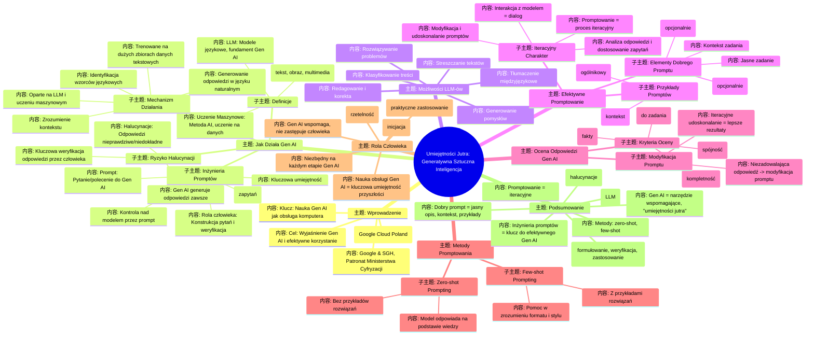

# Sekcja 1. Wprowadzenie do generatywnej AI oraz jak promptować - 1. Podstawy Generatywnej AI

# 💡 Diagram

___

# 🗒️ Notatka

# Notatki i Podsumowanie Lekcji: "Umiejętności Jutra: Generatywna Sztuczna Inteligencja"

## Wprowadzenie

Lekcja "Umiejętności Jutra," zorganizowana przez Google we współpracy edukacyjnej z SGH i pod honorowym patronatem Ministerstwa Cyfryzacji, stanowi wprowadzenie do świata generatywnej sztucznej inteligencji (Gen AI). Prezentacja, prowadzona przez Łukasza Olejniczaka z Google Cloud Poland, ma na celu wyjaśnienie działania Gen AI, efektywnego korzystania z niej oraz ścieżki rozwoju do zaawansowanego użytkownika tej technologii. Kluczowe przesłanie lekcji brzmi: tak jak opanowaliśmy obsługę komputerów, powinniśmy nauczyć się efektywnie wykorzystywać Gen AI.

## 1. Jak Działa Generatywna Sztuczna Inteligencja?

### Podstawowe Definicje

- **Gen AI (Generative Artificial Intelligence) / Generatywna Sztuczna Inteligencja:**  To rodzaj sztucznej inteligencji, która tworzy nowe treści, w tym teksty, obrazy i multimedia.
- **LLM (Large Language Models) / Duże Modele Językowe:** Modele językowe stanowiące fundament Gen AI. Trenowane na ogromnych zbiorach tekstu, umożliwiają rozpoznawanie wzorców i zależności językowych oraz generowanie odpowiedzi.
- **Uczenie Maszynowe:** Metoda sztucznej inteligencji, polegająca na tworzeniu programów, które uczą się na podstawie danych. LLM-y są przykładem programów uczenia maszynowego.

### Mechanizm Działania Gen AI i LLM

- Gen AI opiera się na **modelach językowych (LLM)**, które wykorzystują techniki uczenia maszynowego, inspirowane działaniem ludzkiego mózgu.
- LLM-y są trenowane na **rozległych zbiorach danych tekstowych**, co umożliwia im:
    - Identyfikację wzorców językowych.
    - Zrozumienie kontekstu wypowiedzi.
    - Generowanie odpowiedzi w języku naturalnym.

### Rola Użytkownika: Inżynieria Promptów

- **Inżynieria Promptów (Prompt Engineering):**  To kluczowa umiejętność precyzyjnego formułowania **promptów** (zapytań) dla modelu Gen AI, mająca bezpośredni wpływ na jakość uzyskiwanych odpowiedzi.
- **Prompt (Zapytanie):** Pytanie lub polecenie skierowane do modelu Gen AI.
- Poprzez odpowiednie formułowanie promptów, użytkownik zyskuje **kontrolę** nad modelem, wykorzystując jego wiedzę i zdolności generatywne do realizacji swoich celów.
- **Decydująca rola człowieka:**  Polega na konstruowaniu pytań z uwzględnieniem kontekstu oraz weryfikacji generowanych odpowiedzi.

### Ryzyko Halucynacji

- Modele Gen AI są zaprojektowane do generowania odpowiedzi w każdej sytuacji, nawet przy braku pewności co do ich prawdziwości.
- **Halucynacje:**  To sytuacje, w których Gen AI generuje odpowiedzi nieprawdziwe lub niedokładne.
- **Konieczność weryfikacji odpowiedzi przez człowieka jest kluczowa** dla uniknięcia negatywnych konsekwencji halucynacji i zapewnienia rzetelności wyników.

## 2. Możliwości LLM-ów: Co Potrafią Modele Językowe?

LLM-y charakteryzują się szerokim spektrum umiejętności, w tym:

- **Streszczanie złożonych i obszernych tekstów.**
- **Rozwiązywanie problemów.**
- **Tłumaczenie międzyjęzykowe.**
- **Redagowanie i korekta tekstów.**
- **Generowanie innowacyjnych pomysłów.**
- **Klasyfikowanie treści.**

## 3. Jak Efektywnie Konstruować Prompty?

### Elementy Składowe Dobrego Promptu

Dobrze skonstruowany prompt powinien zawierać:

- **Jasno zdefiniowane zadanie:** Precyzyjne określenie oczekiwanego działania modelu.
- **Kontekst zadania:** Dodatkowe informacje ułatwiające modelowi zrozumienie intencji zapytania.
- **Przykładowe rozwiązanie (opcjonalnie):**  Ilustracje pożądanego formatu i stylu odpowiedzi, które mogą uszczegółowić oczekiwania.
- **Określenie preferowanego formatu odpowiedzi (opcjonalnie):**  Wskazanie formy prezentacji wyniku, np. lista, tabela, esej.

### Iteracyjny Charakter Promptowania

- **Promptowanie jest procesem iteracyjnym.**  Pierwsze zapytanie nie zawsze przynosi optymalną odpowiedź.
- Kluczowe jest **modyfikowanie i udoskonalanie promptów** w oparciu o analizę otrzymanych odpowiedzi.
- Należy **dokładnie analizować odpowiedzi**, identyfikując braki i niedociągnięcia, aby odpowiednio dostosować kolejne zapytania.
- **Interakcja z modelem:**  Promptowanie przypomina dialog, w którym można doprecyzowywać, korygować i uzupełniać zapytania.

### Przykłady Promptów: Dobry i Zły

- **Nieefektywny prompt:** \"Podaj pomysły na prezent do 100 zł.\" -  Zbyt ogólnikowy, brak kontekstu.
- **Efektywny prompt:** \"Zaproponuj 4 pomysły na prezent urodzinowy dla dziesięcioletniej dziewczynki, która uwielbia kolor fioletowy oraz jest fanką koni i jednorożców. Budżet wynosi 100 zł.\" - Zawiera istotny kontekst (wiek, zainteresowania, budżet), co umożliwia modelowi generowanie bardziej spersonalizowanych i trafnych propozycji.

## 4. Ocena Odpowiedzi Generatywnej Sztucznej Inteligencji

### Kryteria Oceny Odpowiedzi Gen AI

Podczas oceny odpowiedzi wygenerowanych przez Gen AI, warto rozważyć następujące pytania:

- **Czy wynik jest rzetelny?** (Faktyczna poprawność przedstawionych informacji)
- **Czy wynik jest wyczerpujący?** (Kompletność i szczegółowość odpowiedzi)
- **Czy wynik jest adekwatny do zadania?** (Zgodność z tematem i celami projektu)
- **Czy wynik jest powtarzalny przy ponownym zadaniu tego samego pytania?** (Spójność i stabilność odpowiedzi)

### Modyfikacja Promptu w oparciu o Ocenę

- W przypadku niezadowalającej odpowiedzi, konieczna jest **modyfikacja promptu** poprzez dodanie kontekstu, przykładów lub doprecyzowanie zadania.
- **Iteracyjne udoskonalanie promptów** jest fundamentem uzyskiwania coraz lepszych rezultatów.

## 5. Metody Promptowania

### Podstawowe Strategie Promptowania

- **Zero-shot prompting:**  Tworzenie promptów bez jakichkolwiek przykładów oczekiwanych rozwiązań. Model ma generować odpowiedź wyłącznie na podstawie posiadanej wiedzy.
- **Few-shot prompting:**  Formułowanie promptów z wykorzystaniem kilku przykładów pożądanych rozwiązań dla podobnych problemów. Przykłady te pomagają modelowi zrozumieć preferowany format i styl odpowiedzi.

## 6. Rola Człowieka w Kontekście Gen AI

- **Udział człowieka jest niezbędny na każdym etapie procesu Gen AI:**
    - **Promptowanie:**  Inicjowanie interakcji poprzez formułowanie zapytań.
    - **Weryfikacja odpowiedzi:**  Sprawdzanie rzetelności i trafności generowanych wyników.
    - **Implementacja odpowiedzi:**  Praktyczne zastosowanie uzyskanych informacji.
- Podobnie jak komputer wymaga użytkownika, tak i Gen AI potrzebuje człowieka do efektywnego działania i osiągania zamierzonych celów.
- Użytkownicy powinni **nabyć umiejętność obsługi Gen AI**, analogicznie do nauki obsługi komputerów.

## Podsumowanie

Generatywna sztuczna inteligencja (Gen AI) to zaawansowane narzędzie, oparte na dużych modelach językowych (LLM), umożliwiające generowanie różnorodnych treści. **Inżynieria promptów** – umiejętność tworzenia precyzyjnych zapytań – stanowi klucz do efektywnego wykorzystania Gen AI. Dobry prompt charakteryzuje się jasnym opisem zadania, kontekstem oraz opcjonalnymi przykładami. Proces promptowania jest iteracyjny, a odpowiedzi Gen AI wymagają weryfikacji przez człowieka ze względu na potencjalne ryzyko halucynacji. Wyróżnia się różne metody promptowania, w tym zero-shot i few-shot prompting. Ostatecznie, człowiek pełni zasadniczą rolę w całym procesie – od formułowania zapytań, poprzez weryfikację, aż po praktyczne zastosowanie odpowiedzi. To sprawia, że Gen AI jest narzędziem wspomagającym, a nie zastępującym ludzką inteligencję. Nauka efektywnej obsługi Gen AI jest kluczową kompetencją w ramach "umiejętności jutra."

___

# 🔉 Transcript
File: Sekcja 1. Wprowadzenie do generatywnej AI oraz jak promptować - 1. Podstawy Generatywnej AI.mp4 
[00:00:00] (The screen is white with a black cursor blinking on the left.)
[00:00:05] (The title card appears: "Umiejętności Jutra" with the "AI" logo to the right. At the bottom of the screen: "Organizator Google," "Partner Edukacyjny SGH," and "Patronat Honorowy Minister Cyfryzacji.")
[00:00:05] Cześć.
[00:00:06] (The screen shows Łukasz Olejniczak, wearing a Google Cloud t-shirt, sitting at a desk with a laptop. A white bar appears across the bottom of the screen with his name and title: "Łukasz Olejniczak Customer Engineer for Smart Analytics + AI + Google Cloud Poland.")
[00:00:06] To marzenie takie oczywiste, ale nikt z nas nie urodził się z umiejętnością korzystania z komputera.
[00:00:12] (Close-up of Łukasz Olejniczak. The background is a wooden wall with plants and a Google logo on a shelf.)
[00:00:13] Każdy miał ten moment, kiedy po raz pierwszy posadzony przed klawiaturą i ekranem musiał odpalić komputer, stworzyć pierwszy folder, a potem właściwie nie wiedząc kiedy, grał w skomplikowane gry, pisał pracę dyplomową i z komputerem już się nie rozstawał.
[00:00:32] I tak jak każdy z nas był w stanie nauczyć się obsługi komputera, tak samo możemy, a nawet powinniśmy nauczyć się obsługi generatywnej sztucznej inteligencji.
[00:00:44] (The screen shows Łukasz Olejniczak with a slide to the right, titled "Umiejętności Jutra" with the "AI" logo and SGH logo. The slide contains the question: "01 Jak działa generatywna sztuczna inteligencja?")
[00:00:45] W tej lekcji opowiem wam, jak działa generatywna sztuczna inteligencja, jak korzystać z niej skutecznie w pięciu krokach, jak korzystać z niej lepiej niż inni, czyli jak używać jej na poziomie zaawansowanym.
[01:01:01] I gdybym miał podsumować wszystko, co powinniście wiedzieć po tej lekcji w jednym zdaniu, to brzmiałoby ono tak:
[01:11:09] Gen AI wykorzystuje modele językowe, tak zwane LLM-y, które używają różnych technik uczenia maszynowego, inspirowanych sposobem działania ludzkiego mózgu.
[01:23:58] Odpowiednio zadając pytania, tak zwane prompty, jesteśmy w stanie przejąć kontrolę nad tymi modelami, niczym pilot nad samolotem i wykorzystać wiedzę zapisaną w modelu w trakcie jego trenowania oraz jego generatywne zdolności do uzyskania odpowiedzi na nasze pytania.
[01:46:59] Nasza rola jest tutaj kluczowa.
[01:49:22] To my będziemy konstruować pytania w sposób, który pozwoli modelowi rozpoznać, co się za tym pytaniem kryje, tak zwany kontekst pytania.
[02:01:30] Na koniec będziemy musieli zweryfikować, czy odpowiedź jest merytorycznie poprawna, bowiem tego typu modele są stworzone do generowania i generują nawet wtedy, kiedy nie są pewne odpowiedzi.
[02:18:09] I mówimy wtedy o ryzyku halucynacji.
[02:21:56] Prawda, że proste?
[02:23:09] Przeróbmy to na spokojnie.
[02:25:48] Zacznijmy od Gen AI, skrótowca od generative artificial intelligence, a po polsku generatywnej sztucznej inteligencji.
[02:35:46] Gen AI to rodzaj sztucznej inteligencji, która generuje nowe treści, na przykład teksty, obrazy lub inne multimedia.
[02:47:30] Gen AI wykorzystuje LLM-y, czyli large language models, a po polsku duże modele językowe.
[02:56:04] To rodzaj sztucznej inteligencji, trenowanej na dużej ilości tekstu, co sprawia, że może rozpoznawać pewne wzorce i zależności pomiędzy słowami i pojęciami, a także wyrażeniami w języku naturalnym, czyli w takim języku, jakim posługujemy się na co dzień w rozmowach między sobą.
[03:21:30] Może nie tylko rozpoznawać, o co nam chodzi, ale też dostarczać odpowiedzi.
[03:28:20] (The screen shows Łukasz Olejniczak with a slide to the right, titled "Co konkretnie potrafią LLM-y?" The slide contains a bulleted list: "Podsumowywać złożone i długie teksty," "Rozwiązywać problemy," "Tłumaczyć na różne języki," "Edytować teksty," "Generować pomysły," and "Klasyfikować.")
[03:29:03] Co konkretnie potrafią LLM-y?
[03:32:40] Potrafią podsumowywać złożone i długie teksty, rozwiązywać problemy, tłumaczyć na różne języki, edytować teksty, generować pomysły lub klasyfikować treści.
[03:50:26] Modele Gen AI dają lepsze odpowiedzi, jeśli posiadamy umiejętność z zakresu tak zwanego prompt inżynieringu.
[03:57:35] Brzmi skomplikowanie?
[03:59:53] Niekoniecznie.
[04:01:36] Prompt inżyniering polega na opracowaniu jak najlepszych podpowiedzi dla modelu.
[04:07:42] Chodzi o to, żeby ten nasz AI asystent po prostu otrzymywał jasne, konkretne polecenia i kontekst.
[04:17:12] Parę promptów przed chwilą widzieliście.
[04:21:01] Popraw, przetłumacz maila, popraw tekst.
[04:24:57] To proste prompty.
[04:26:51] Da się lepiej, ale to za chwilę.
[04:31:31] (The screen shows Łukasz Olejniczak with a slide to the right, titled "Skonstruuj dobry prompt" The slide contains four colored ovals with the text: "Opisz zadanie," "Nadaj kontekst," "Dodaj przykład rozwiązania," and "Określ format.")
[04:31:54] Podsumujmy.
[04:32:20] Sztuczna inteligencja, czyli AI, to najszersze pojęcie.
[04:37:06] Jedną z metod AI jest uczenie maszynowe, czyli tworzenie programów, uczących się na danych.
[04:44:55] A LLM to program, który nauczony jest na ogromnych ilościach tekstu, a do tego sam generuje tekst, przez co jest przykładem tak zwanej generatywnej sztucznej inteligencji.
[04:58:51] Aby uzyskiwać i ulepszać odpowiedzi od Gen AI, stosujemy prompt inżyniering.
[05:05:31] Na czym polega nasza rola w tym procesie?
[05:09:04] Człowiek jest niezbędny do promptowania, weryfikowania odpowiedzi od AI i na koniec to on będzie wykorzystywać otrzymane odpowiedzi.
[05:20:11] Takie podejście pozwala na uniknięcie potencjalnych negatywnych skutków halucynacji, przez co wyniki generowane przez AI mają szansę być bardziej dokładne i trafne.
[05:34:52] Wspomniane halucynacje mogą zdarzyć się każdemu.
[05:39:25] Również Gen AI czasami podaje nieprawdziwe, niedokładne wyniki.
[05:45:29] Może to być spowodowane nieprecyzyjnym promptem albo faktem, że model nie posiada wiedzy na dany temat, ale jego generatywna natura sprawia, że zawsze próbuje odpowiedzieć na zadany prompt.
[06:01:02] Dlatego każda odpowiedź od Gen AI powinna być weryfikowana przez człowieka.
[06:09:10] Tak jak komputer, Gen AI potrzebuje człowieka.
[06:13:36] Ale też człowiek, tak jak uczy się obsługi komputera, tak samo potrzebuje nauczyć się obsługi Gen AI.
[06:24:52] Wiecie już, jak działają duże modele językowe.
[06:28:04] Czas przekuć teorię w praktykę.
[06:32:16] (The screen shows Łukasz Olejniczak with a slide to the right, titled "Skonstruuj dobry prompt" The slide contains four colored ovals with the text: "Opisz zadanie," "Nadaj kontekst," "Dodaj przykład rozwiązania," and "Określ format." A fifth oval with the text "Podejdź krytycznie do każdej odpowiedzi [evaluate]" appears below.)
[06:33:14] Dobry prompt zawiera opis zadania, kontekst problemu i przykład rozwiązania zbliżonego zadania, tak zwane przykłady.
[06:42:47] Dobrze by było, gdybyś podszedł krytycznie do każdej odpowiedzi i jeśli nie jest ona wystarczająco dokładna lub satysfakcjonująca, spróbował zadać pytanie jeszcze raz.
[06:56:15] Ale zanim to zrobisz, zastanów się, czego tej odpowiedzi brakuje i zmodyfikuj swoje zapytanie tak, żeby model wiedział, że na tych zagadnieniach powinien się skupić.
[07:09:07] Zobaczmy różnicę między dobrze i źle napisanym promptem.
[07:13:14] Przed nami niezwykle skomplikowane i trudne zadanie, które chcieli, gdybyśmy chcieli wykonać sami, mogłoby oznaczać noce i dnie wyrywania sobie włosów z głowy.
[07:25:50] Czyli co kupić na prezent dla dziesięcioletniej siostrzenicy?
[07:28:51] (The screen shows Łukasz Olejniczak with a browser window to the right. The window shows Gemini Advanced and the prompt "Podaj mi kilka pomysłów na prezent poniżej 100 zł.")
[07:29:53] Użyjemy jednak do tego Gemini.
[07:32:55] Podaj mi kilka pomysłów na prezent poniżej 100 zł.
[07:36:58] (The screen shows the Gemini Advanced window. The prompt is typed into Gemini. The Gemini screen fills with text in response.)
[07:37:30] Jak widzicie, brakuje kontekstu, więc model poda różne pomysły dla osób z różnymi zainteresowaniami, dorosłych i dzieci.
[07:49:56] Trochę zbyt szeroko, prawda?
[07:50:24] Spróbujmy z innym promptem.
[07:53:27] (The screen shows the Gemini Advanced window. The prompt is typed into Gemini: "Podaj mi 4 pomysły na prezent urodzinowy dla dziesięcioletniej dziewczynki, która lubi kolor fioletowy i jest fanką koni i jednorożców. Mój budżet to 100 zł.")
[08:08:04] Zobaczcie, że tutaj podaliśmy już kontekst.
[08:13:00] Prezent jest dla dziewczynki, której obiektem zainteresowania są konie i jednorożce.
[08:20:00] W tym obszarze Gemini wygenerował nam mnóstwo pomysłów, od zabawek po książki.
[08:27:26] Mamy w czym wybierać.
[08:28:16] Zauważcie, że model wskazał również konkretne miejsca, gdzie możecie kupić dany prezent.
[08:37:23] Chwila i zrobione.
[08:39:21] No dobrze, ale może się zdarzyć, że AI nie poda nam od razu odpowiedzi, która nam pasuje.
[08:46:22] W końcu no nie zda naszej siostrzenicy.
[08:50:29] W takiej sytuacji, zamiast porzucić to wszystko, wystarczy zapytać ponownie.
[08:55:18] Podać więcej przykładów, dodatkowy kontekst.
[09:00:50] Inaczej mówiąc, iterować prompty.
[09:03:27] Bo promptowanie to ciągła rozmowa z modelem.
[09:07:06] Gdy z kimś rozmawiacie, naturalne są zatrzymania, przerywniki, dopowiadanie czy strumień myśli.
[09:14:34] Podobnie jest z promptowaniem.
[09:17:52] Czasem będziecie musieli zacząć od nowa lub wrócić do bardzo podstawowej wersji promptu.
[09:25:34] To też jest w porządku.
[09:27:23] Na co zwrócić uwagę przy ocenie odpowiedzi i tego w którą stronę warto pokierować rozmową czy też zmienić kolejny prompt.
[09:37:05] W ocenie pomocne mogą być następujące pytania:
[09:42:27] Czy wynik jest dokładny?
[09:45:47] Czy wynik zawiera wystarczające informacje?
[09:50:44] Czy wynik jest związany z moim projektem lub zadaniem?
[09:56:49] W końcu czy uzyskuję spójny wynik zadając wielokrotnie to samo pytanie?
[10:03:37] Jeśli podczas oceny wyników zauważysz jakiekolwiek problemy, modyfikowanie początkowego promptu może często pomóc w ich rozwiązaniu i uzyskaniu dużo lepszego rezultatu.
[10:17:24] Tak jak podczas gry komputerowej.
[10:20:18] Rzadko przechodzi się ją za pierwszym razem.
[10:25:30] Warto się nie poddawać i próbować aż do skutku.
[10:28:09] Oczywiście, tak jak w grze, można też grać na kodach i znacząco ułatwić sobie pracę.
[10:35:06] W tym przypadku nasze kody to w pełni legalne i skuteczne metody promptowania.
[10:41:20] (The screen shows Łukasz Olejniczak with a slide to the right, titled "Metody promptowania." Two bullet points are listed: "Few shot prompting - tworzenie promptów na podstawie kilku przykładów rozwiązania podobnego problemu," and "Zero shot prompting - tworzenie promptów bez użycia jakichkolwiek przykładów.")
[10:41:55] Pierwszą z nich jest few shot prompting.
[10:45:04] Co to jest?
[10:47:11] Otóż słowa "shot" czasem używamy jako synonim słowa przykład.
[10:54:42] Zatem few shot prompting to promptowanie na podstawie kilku przykładów