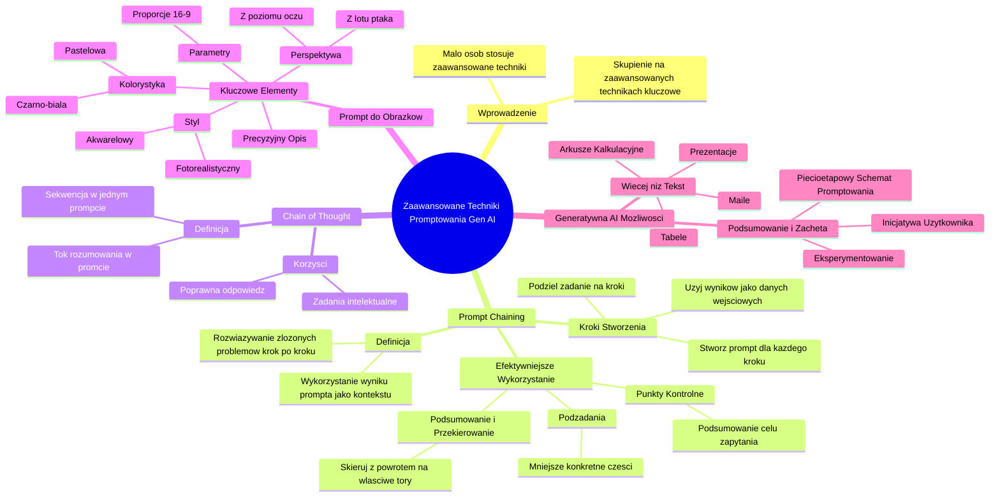

# Sekcja 1. Wprowadzenie do generatywnej AI oraz jak promptować - 2. Metody promptowania

# 💡 Diagram

___

# 🗒️ Notatka

# Notatki z lekcji o zaawansowanych technikach promptowania Gen AI

## Wprowadzenie do Gen AI i Promptowania

* Większość osób w branży może nie słyszała o Gen AI.
* Wiele osób próbowało pisać proste prompty, na przykład do maili.
* **Bardzo niewiele osób regularnie wykorzystuje AI w pracy i stosuje zaawansowane techniki promptowania.**
* Skupienie się na zaawansowanych technikach promptowania jest kluczowe, aby w pełni wykorzystać potencjał AI.

## Prompt Chaining - Łańcuch Podpowiedzi

### Definicja `Prompt Chaining`

* **`Prompt chaining`** (ciąg podpowiedzi) - wykorzystanie wyniku jednego prompta jako kontekstu w kolejnym poleceniu dla modelu AI.
* Pomaga modelowi rozwiązywać złożone problemy poprzez podzielenie ich na mniejsze, łatwiejsze do zarządzania kroki.
* Narzędzie AI jest prowadzone przez serię połączonych promptów, z dodawaniem kolejnych zadań i warstw kontekstowych.
* Metoda ta rozbija skomplikowane problemy na mniejsze części i umożliwia ich rozwiązanie krok po kroku.

### Kroki do Stworzenia `Prompt Chaining`

1. **Podziel zadanie na logiczne kroki.**
2. **Stwórz prompt dla każdego kroku.**
3. **Użyj wyników jako danych wejściowych do kolejnych promptów.** - Iteruj proces aż do ukończenia zadania.

### Efektywniejsze Wykorzystanie `Prompt Chaining`

* **Używaj punktów kontrolnych:**
    * Poproś model o krótkie podsumowanie ogólnego celu zapytania, aby upewnić się, że pozostaje na właściwym kursie.
* **Pracuj nad podzadaniami:**
    * Podziel złożone zadania na mniejsze, bardziej konkretne części.
    * Traktuj każde podzadanie jako odrębny etap, zanim przejdziesz do następnego kroku.
* **Podsumuj i przekieruj:**
    * Jeśli model zaczyna odbiegać od zamierzonego celu, podsumuj kluczowe informacje i skieruj go z powrotem na właściwe tory.

## Chain of Thought - Łańcuch Myśli

### Definicja `Chain of Thought`

* **`Chain of thought`** (łańcuch myśli) - sekwencja działań realizowana w ramach jednego, bardziej rozbudowanego prompta.
* Polega na przejściu przez sekwencję logicznych kroków w obrębie jednego zapytania, zamiast formułowania osobnych zapytań dla każdego kroku.
* W promcie przedstawiamy kroki i tok rozumowania potrzebny do rozwiązania podobnego problemu.
* Model ma zastosować analogiczny tok rozumowania i obsłużyć wszystkie kroki w ramach jednego, kompleksowego prompta.

### Korzyści `Chain of Thought`

* **Zwiększa szansę na uzyskanie poprawnej i satysfakcjonującej odpowiedzi.**
* **Szczególnie przydatna w zadaniach wymagających większego zaangażowania intelektualnego i logicznego myślenia.**

## Jak Stworzyć Dobry Prompt pod Obrazek? 🖼️

### Kluczowe Elementy Efektywnego Promptu Obrazkowego

* **Precyzyjny opis:** Jasno i szczegółowo określ, co chcesz uzyskać na obrazie.
* **STYL:**  Określ preferowany styl graficzny, np. fotorealistyczny, akwarelowy, malarski.
* **KOLORYSTYKA:** Zdefiniuj paletę kolorów, np. czarno-biała, pastelowa, jaskrawa.
* **PARAMETRY:** Ustal parametry techniczne, np. proporcje obrazu 16:9, rozdzielczość.
* **PERSPEKTYWA:** Określ punkt widzenia, np. z lotu ptaka, z poziomu oczu, zbliżenie.

## Generatywna AI - Dodatkowe Możliwości i Podsumowanie

* Generatywna AI potrafi generować znacznie więcej niż tylko tekst, w tym:
    * Tabele
    * Prezentacje
    * Maile
    * Arkusze kalkulacyjne
* Więcej informacji o kreatywnych zastosowaniach zostanie omówionych w dalszej części programu.

### Podsumowanie i Zachęta do Działania

* Wiedza o zaawansowanych technikach promptowania może początkowo wydawać się przytłaczająca.
* Dostępny jest pięcioetapowy schemat promptowania do pobrania, który ułatwi rozpoczęcie eksperymentów.
* **Generatywna sztuczna inteligencja sama nie podejmie inicjatywy i nie napisze pierwszego prompta.**
* Inicjatywa i chęć działania leżą po stronie użytkownika.
* Zachęcamy do aktywnego eksperymentowania, odkrywania nowych możliwości i iteracyjnego doskonalenia promptów w pracy z generatywną sztuczną inteligencją.

## Podsumowanie Lekcji

Lekcja koncentruje się na zaawansowanych technikach promptowania w Gen AI, wykraczających poza podstawowe polecenia. Przedstawiono dwie główne techniki: **`prompt chaining`** (ciąg podpowiedzi) i **`chain of thought`** (łańcuch myśli). `Prompt chaining` polega na dzieleniu złożonych zadań na mniejsze kroki i wykorzystywaniu wyników jednego prompta jako kontekstu dla kolejnego. `Chain of thought` to technika, w której cały proces rozwiązywania problemu jest zawarty w jednym, rozbudowanym promcie, naśladując tok rozumowania. Dodatkowo, lekcja omawia kluczowe elementy skutecznego promptowania przy generowaniu obrazów, takie jak precyzyjny opis, styl, kolorystyka, parametry i perspektywa. Podkreślono, że aktywne eksperymentowanie i inicjatywa użytkownika są kluczowe dla efektywnego wykorzystania potencjału generatywnej AI.

___

# 🔉 Transcript
File: Sekcja 1. Wprowadzenie do generatywnej AI oraz jak promptować - 2. Metody promptowania.mp4 
[00:00:05] Łukasz Olejniczak: Większość osób z waszej branży, otoczenia, czy nawet miejsca pracy, może nawet nie słyszało o Gen AI.
[00:00:13] Łukasz Olejniczak: Wiele z nich spróbowało napisać jakiegoś prompta i użyć tego do maila.
[00:00:19] Łukasz Olejniczak: Bardzo mało osób jednak jeszcze używa AI regularnie w pracy, a jeszcze mniej stosuje zaawansowane techniki promptowania, o których zaraz opowiem.
[00:00:31] Łukasz Olejniczak: Jeśli chcecie być najlepszy w korzystaniu z AI, to teraz warto się skupić.
[00:00:36] Łukasz Olejniczak: Jedną z technik jest wykorzystanie wyniku jednego prompta jako kontekst w kolejnym poleceniu dla modelu.
[00:00:44] Screen: Slajd prezentuje "Prompt chaining - ciąg podpowiedzi".
-Wykorzystanie wyniku jednego prompta jako kontekstu w kolejnym poleceniu.
-Pomaga modelowi rozwiązywać złożone problemy, dzieląc je na mniejsze kroki.
[00:00:44] Łukasz Olejniczak: Nazywamy to prompt chainingiem.
[00:00:48] Łukasz Olejniczak: Inaczej ciągiem podpowiedzi.
[00:00:50] Łukasz Olejniczak: Prompt chaining prowadzi narzędzie AI przez serię połączonych ze sobą promptów, dodając kolejne zadania i warstwy kontekstowe.
[00:01:02] Łukasz Olejniczak: Połączone prompty sprawiają, że pomagamy modelowi rozwiązać skomplikowane problemy, rozbijając je na mniejsze części.
[00:01:11] Łukasz Olejniczak: I rozwiązując je później krok po kroku.
[00:01:14] Łukasz Olejniczak: Taki ciąg podpowiedzi tworzy się w trzech krokach.
[00:01:19] Screen: Slajd prezentuje "Prompt chaining - ciąg podpowiedzi".
-Podziel zadanie na logiczne kroki.
-Stwórz prompt dla każdego kroku.
-Używaj wyników jako danych wejściowych do kolejnych promptów.
[00:01:19] Łukasz Olejniczak: Zacznij od podzielenia złożonego zadania na logiczne kroki.
[00:01:24] Łukasz Olejniczak: Skonstruuj prompt do każdego kroku i użyj danych wyjściowych z jednego promptu, jako danych wejściowych do następnego, iterując po drodze aż do ukończenia zadania.
[00:01:40] Łukasz Olejniczak: Chain prompting to świetna technika na bardziej zaawansowane problemy.
[00:01:46] Screen: Slajd prezentuje "Jak efektywniej wykorzystać chain prompting".
-Używaj punktów kontrolnych.
-Określono proś model o krótkie podsumowanie ogólnego celu.
[00:01:46] Łukasz Olejniczak: Po pierwsze, zdefiniuj sobie punkty kontrolne.
[00:01:57] Łukasz Olejniczak: Czyli określono proś model o krótkie podsumowanie ogólnego celu twojego pytania.
[00:02:05] Screen: Slajd prezentuje "Jak efektywniej wykorzystać chain prompting".
-Pracuj nad podzadaniami.
-Podziel złożone zadania na mniejsze części. Traktuj każde podzadanie, jako krótszy tarcih, zanim przejdziesz do następnego kroku.
[00:02:05] Łukasz Olejniczak: Po drugie, praca z podzadaniami.
[00:02:09] Łukasz Olejniczak: Podziel bardzo złożone zadania na jeszcze mniejsze podzadania.
[00:02:15] Screen: Slajd prezentuje "Jak efektywniej wykorzystać chain prompting".
-Podsumuj i przekieruj.
-Jeśli model odbiega od celu, podsumuj kluczowe informacje i skieruj go z powrotem do głównego celu.
[00:02:15] Łukasz Olejniczak: Po trzecie, podsumowanie i przekierowanie.
[00:02:20] Łukasz Olejniczak: Jeśli zauważysz, że model odbiega od pierwotnego celu twojego pytania, podsumuj najważniejsze informacje, które model zebrał do tej pory i przekieruj je w kolejnym promcie z powrotem do głównego celu.
[00:02:35] Screen: Slajd prezentuje "Chain of Thought - łańcuch myśli".
Łańcuch myśli, w którym sekwencje działań jest obsłużona jednym, bardziej rozbudowanym promptem. Przejście przez sekwencje logicznych kroków w ramach jednego promptu, zamiast wykonywać je jako osobne zapytania.
[00:02:35] Łukasz Olejniczak: Istnieje również technika promptowania chain of thought.
[00:02:40] Łukasz Olejniczak: Łańcuch myśli, w której sekwencja, którą przed chwilą przeszliśmy, jest obsłużona jednym, bardziej rozbudowanym promptem.
[00:02:52] Łukasz Olejniczak: W promcie tym podajemy kroki i pewien tok rozumowania potrzebny do rozwiązania podobnego problemu.
[00:03:02] Łukasz Olejniczak: Rozwiązanie tego podobnego problemu również polegało będzie na przejściu sekwencji logicznych kroków, które w poprzedniej technice wykonywaliśmy jako osobne prompty.
[00:03:18] Łukasz Olejniczak: W technice chain of thought zakładamy, że model zastosuje podobny tok rozumowania i obsłuży wszystkie kroki jednym promptem.
[00:03:30] Screen: Slajd prezentuje "Chain of Thought - łańcuch myśli".
-Zwiększamy szansę na uzyskanie prawidłowej odpowiedzi.
-Sprawdzamy się w zadaniach wymagających większego wysiłku intelektualnego.
[00:03:30] Łukasz Olejniczak: Stosując te sposoby, zwiększamy szansę na prawidłową odpowiedź w przypadku zadań wymagających większego wysiłku intelektualnego.
[00:03:42] Łukasz Olejniczak: Na koniec zostawiłem dla was coś specjalnego, czyli obrazy.
[00:03:46] Screen: Slajd prezentuje "Jak stworzyć dobry prompt pod obrazek?".
-Precyzyjny opis: Jasno określ, co chcesz uzyskać.
[00:03:46] Łukasz Olejniczak: A dokładniej, generowanie obrazów, ilustracji, czy też zdjęć do dowolnego zastosowania.
[00:03:54] Łukasz Olejniczak: W materiałach na stronę, do prezentacji, w kampaniach, czy do mediów społecznościowych.
[00:04:01] Łukasz Olejniczak: Dobry prompt pod obrazek zawiera to wszystko, co już wiecie, czyli precyzyjny opis czego oczekujemy.
[00:04:09] Łukasz Olejniczak: Plus cztery dodatkowe rzeczy.
[00:04:11] Screen: Slajd prezentuje "Jak stworzyć dobry prompt pod obrazek?".
-STYL fotorealistyczny, akwarelowy.
[00:04:11] Łukasz Olejniczak: Styl obrazka, na przykład chcemy, żeby nasze zdjęcie było wygenerowane jako fotorealistyczne.
[00:04:19] Screen: Slajd prezentuje "Jak stworzyć dobry prompt pod obrazek?".
-KOLORYSTYKA czarno-biała, pastelowa.
[00:04:19] Łukasz Olejniczak: Drugie to preferowana kolorystyka.
[00:04:24] Łukasz Olejniczak: Na przykład chcemy, żeby nasze zdjęcie było czarno-białe.
[00:04:27] Screen: Slajd prezentuje "Jak stworzyć dobry prompt pod obrazek?".
-PARAMETRY proporcje obrazu 16:9.
[00:04:27] Łukasz Olejniczak: Trzecie to dodatkowe parametry, jak na przykład chcemy, żeby zdjęcie było w proporcjach 16 na 9.
[00:04:34] Screen: Slajd prezentuje "Jak stworzyć dobry prompt pod obrazek?".
-PERSPEKTYWA z lotu ptaka, z poziomu oczu.
[00:04:34] Łukasz Olejniczak: I czwarte perspektywa.
[00:04:37] Łukasz Olejniczak: Chcemy, żeby nasze zdjęcie było z lotu ptaka.
[00:04:42] Łukasz Olejniczak: Generatywna AI może wygenerować oczywiście o wiele, wiele więcej.
[00:04:48] Łukasz Olejniczak: Mowa tutaj między innymi o tabelach, prezentacjach, mailach oraz arkuszach.
[00:04:56] Łukasz Olejniczak: Więcej o nich i innych kreatywnych elementach dowiecie się w dalszej części programu.
[00:05:03] Łukasz Olejniczak: Gratulacje.
[00:05:05] Łukasz Olejniczak: Dotarliście do końca.
[00:05:07] Łukasz Olejniczak: Zdaję sobie sprawę, że niektórym mogą głowy parować od ilości wiedzy i nowych pojęć.
[00:05:12] Łukasz Olejniczak: Dlatego, gdy już ochłoniecie i będziecie chcieli poeksperymentować z GenAI, to możecie zajrzeć do przygotowanego dla was pięcioetapowego schematu promptowania.
[00:05:24] Łukasz Olejniczak: Możecie go teraz pobrać na swoje telefony, komputery, tablety, by mieć go pod ręką.
[00:05:31] Łukasz Olejniczak: Możecie też wrócić do tej lekcji w dowolnym czasie.
[00:05:35] Łukasz Olejniczak: Generatywna sztuczna inteligencja może zrobić dla was bardzo wiele rzeczy, ale jednej na pewno nie zrobi.
[00:05:42] Łukasz Olejniczak: Nie zrobi pierwszego kroku.
[00:05:45] Łukasz Olejniczak: Nie napiszę pierwszego prompta.
[00:05:48] Łukasz Olejniczak: Tutaj piłka jest po waszej stronie.
[00:05:50] Łukasz Olejniczak: Dziękuję za waszą uwagę i życzę jak najwięcej frajdy z odkrywania, eksperymentowania i iterowania z generatywną sztuczną inteligencją.

___
# 🏷️ Tags
#Gen_AI #promptowanie #zaawansowane_techniki_promptowania #AI #prompt_chaining #ciąg_podpowiedzi #model_AI #logiczne_kroki #dane_wejściowe #iteracja #punkty_kontrolne #podzadania #podsumowanie #przekierowanie #chain_of_thought #łańcuch_myśli #rozumowanie #intelektualne_myślenie #prompt_obrazkowy #opis #styl #kolorystyka #parametry #perspektywa #generowanie_obrazów #fotorealistyczny #czarno-biała #proporcje_obrazu #lot_ptaka #tabela #prezentacja #mail #arkusz_kalkulacyjny #eksperymentowanie #inicjatywa #iteracyjne_doskonalenie #pięcioetapowy_schemat_promptowania
