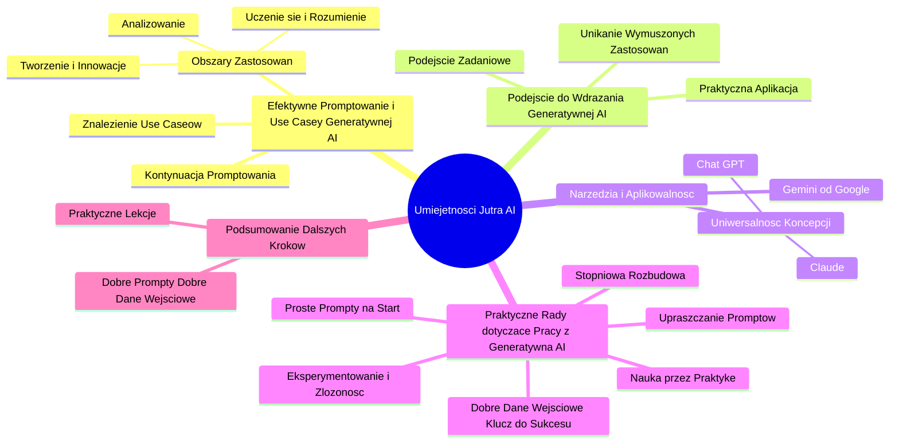

# Sekcja 2. Pomysły na podstawowe wykorzystanie generatywnej AI na przykładzie Gemini - 1. Wstęp

# 💡 Diagram

___

# 🗒️ Notatka

# Notatki i Podsumowanie Transkrypcji Wideo "Umiejętności Jutra AI"

## Wprowadzenie

Ten dokument zawiera szczegółowe notatki i podsumowanie transkrypcji wideo zatytułowanego "Umiejętności Jutra AI", zorganizowanego przez Google we współpracy z SGH i pod honorowym patronatem Ministra Cyfryzacji. Wideo koncentruje się na praktycznym wykorzystaniu generatywnej AI, w szczególności modeli językowych, w codziennej pracy. Prezentacja jest prowadzona przez Cezarego Jaroniego i Michała Domagałę, Product Marketing Managerów z Google.

## Główne Tematy i Kluczowe Punkty

### 1. Efektywne `Promptowanie` i `Use Case'y` Generatywnej AI

*   **Kontynuacja tematu promptowania:** Prelegenci zakładają u widzów podstawową wiedzę na temat efektywnego `promptowania`.
*   **Znalezienie odpowiednich `use case'ów`:** Kluczowym zadaniem staje się identyfikacja wartościowych i powtarzalnych przypadków użycia (`use case'ów`) generatywnej AI. Te `use case'y` mają stanowić fundament praktycznego zastosowania AI.
*   **Obszary zastosowań:** Wideo skupia się na trzech obszarach, w których duże modele językowe mogą wspierać codzienną pracę:
    *   Uczenie się i rozumienie
    *   Analizowanie
    *   Tworzenie i innowacje

### 2. Podejście do Wdrażania Generatywnej AI

*   **Unikanie wymuszonych zastosowań:** Praca z dużymi modelami językowymi nie powinna polegać na poszukiwaniu zastosowań "na siłę".
*   **Podejście zadaniowe:** Należy rozpocząć od określenia konkretnych zadań, a następnie rozważyć, w jaki sposób generatywna AI może je wspomóc.
*   **Praktyczna aplikacja:** Chodzi o identyfikację realnych problemów i zadań, które AI może usprawnić lub rozwiązać.

### 3. Narzędzia i Aplikowalność

*   **Gemini od Google:** Przykłady i demonstracje bazują na modelu `Gemini` firmy Google.
*   **Uniwersalność koncepcji:** Prezentowane koncepcje i metody można zastosować również w innych narzędziach generatywnej AI, takich jak Claude czy Chat GPT.

### 4. Praktyczne Rady dotyczące Pracy z Generatywną AI

*   **Proste `prompty` na start:** Zaleca się rozpoczęcie od prostych, nieskomplikowanych `promptów`.
*   **Stopniowa rozbudowa:** `Prompty` powinny być stopniowo rozwijane i ulepszane w miarę potrzeb.
*   **Eksperymentowanie i złożoność:** W razie potrzeby można wprowadzać bardziej złożone `prompty` i eksperymentować z nimi.
*   **Upraszczanie w przypadku problemów:** Jeśli jakość odpowiedzi spada lub pojawiają się trudności, warto uprościć `prompty`.
*   **Nauka przez praktykę:** Praca z AI to proces uczenia się, co działa efektywnie, a co nie. Eksperymentowanie i iteracja są kluczowe.
*   **Klucz do sukcesu: Dobre dane wejściowe:**  Wysokiej jakości dane wejściowe, czyli dobrze sformułowane `prompty`, są fundamentalne dla uzyskania wartościowych rezultatów z AI.

### 5. Podsumowanie Dalszych Kroków

*   **Praktyczne lekcje:** Kolejne lekcje będą miały charakter praktyczny i skupią się na tworzeniu efektywnych `promptów`.
*   **Dobre `prompty` = Dobre dane wejściowe:** Ponowne podkreślenie, że dobre `prompty` są niezbędne do efektywnej pracy z generatywną AI.

## Podsumowanie

Wideo "Umiejętności Jutra AI" stanowi wprowadzenie do praktycznego wykorzystania generatywnej AI w codziennej pracy, z naciskiem na identyfikację konkretnych `use case'ów`. Prelegenci z Google, Cezary Jaroni i Michał Domagała, akcentują zadaniowe podejście –  rozpoznawanie problemów i poszukiwanie wsparcia w AI, zamiast  wymuszania zastosowań. Istotną wskazówką jest rozpoczynanie od prostych `promptów` i ich stopniowe rozwijanie, a także ciągłe eksperymentowanie i uczenie się poprzez interakcję z modelami językowymi. Prezentowane przykłady bazują na `Gemini`, lecz zasady te są uniwersalne i odnoszą się również do innych narzędzi AI. Dalsze kroki koncentrują się na praktycznym tworzeniu efektywnych `promptów`, co stanowi fundament sukcesu w pracy z generatywną AI.

___

# 🔉 Transcript
File: Sekcja 2. Pomysły na podstawowe wykorzystanie generatywnej AI na przykładzie Gemini - 1. Wstęp.mp4 
[00:00:00] (Biały ekran)
[00:00:01] (Ekran z napisem "Umiejętności Jutra AI". Poniżej napisane: Organizator: Google, Partner edukacyjny: SGH, Patronat Honorowy: Minister Cyfryzacji)
[00:00:05] (Dwóch mężczyzn siedzi przed kamerą. Na ścianie za nimi wisi logo Google. Pod nimi podpisy: Cezary Jaroni, Product Marketing Manager + Google, Michał Domagała, Product Marketing Manager + Google)
[00:00:05] Cezary Jaroni: Dowiedzieliście się już, jak efektywnie promptować.
[00:00:08] Cezary Jaroni: Teraz czas na znalezienie dobrych i powtarzalnych use case'ów, które mogą być dla was podstawą do korzystania z możliwości generatywnej AI.
[00:00:15] Michał Domagała: I choć znalezienie dobrych use case'ów nie zawsze jest łatwe, w następnych krokach pokażemy wam, jak możecie wykorzystać duże modele językowe w swojej codziennej pracy w trzech obszarach: uczenie się i rozumienie, analizowanie, tworzenie i wymyślanie.
[00:00:31] Michał Domagała: Warto jednak podkreślić, że w pracy z dużymi modelami językowymi nie chodzi o to, aby zatrzymać teraz wszystko i na siłę wymyślać to, co możemy z nimi zrobić.
[00:00:41] Michał Domagała: Chodzi raczej o zastanowienie się, jakie my mamy zadanie do wykonania, a następnie, jak generatywna AI może nam w nich pomóc.
[00:00:49] Cezary Jaroni: I te przykłady będziemy pokazywać na Gemini od Google, ale oczywiście będą one również aplikowalne do innych narzędzi, takich jak Claude czy Chat GPT.
[00:00:57] Cezary Jaroni: Zanim jednak przejdziemy do kolejnego kroku, mamy dla was jeszcze jedną radę dotyczącą pracy z generatywną AI.
[00:01:03] Cezary Jaroni: Lepiej zacząć od prostych promptów, a potem stopniowo je rozbudowywać i jeśli to potrzebne, dodawać im złożoności i eksperymentować.
[00:01:12] Michał Domagała: A jeśli zobaczysz, że jakość otrzymywanych odpowiedzi spada lub utkniesz we współpracy z Gemini, spróbuj uprościć swoje prompty.
[00:01:20] Michał Domagała: Nauka tego, co działa, a co nie, jest częścią pracy z AI.
[00:01:24] Michał Domagała: A dobre dane wejściowe to klucz do sukcesu.
[00:01:27] Cezary Jaroni: Dobre dane wejściowe, czyli dobre prompty i to właśnie zrobimy w kolejnych praktycznych lekcjach.
[00:01:34] (Ekran z napisem "Umiejętności Jutra AI". Poniżej napisane: Organizator: Google, Partner edukacyjny: SGH, Patronat Honorowy: Minister Cyfryzacji)

___
# 🏷️ Tags
#umiejętności_jutra_AI #google #SGH #minister_cyfryzacji #generatywna_AI #modele_językowe #promptowanie #use_case #uczenie_się #rozumienie #analizowanie #tworzenie #innowacje #podejście_zadaniowe #aplikowalność #gemini #claude #chat_GPT #proste_prompty #rozbudowa_promptów #eksperymentowanie #dane_wejściowe #cezary_jaroni #michał_domagała #product_marketing_manager #praktyczne_lekcje #dobre_prompty
