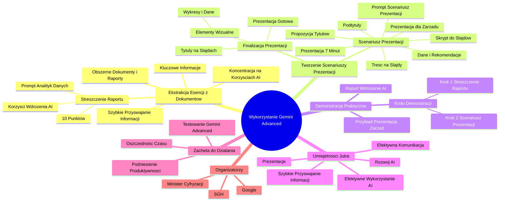

# Sekcja 2. Pomysły na podstawowe wykorzystanie generatywnej AI na przykładzie Gemini - 2. Uporządkowanie listy zadań

# 💡 Diagram

___

# 🗒️ Notatka

# Notatki i Podsumowanie Transkrypcji Wideo: Wykorzystanie Gemini Advanced do Ekstrakcji Esencji z Dokumentów

## Wprowadzenie

Ten materiał wideo prezentuje, w jaki prosty sposób narzędzie **Gemini Advanced** może być użyte do **ekstrakcji esencji z obszernych dokumentów i raportów** oraz **przekształcania ich w zwięzłe scenariusze prezentacji**. Jest to nieocenione, zwłaszcza gdy czas nagli, a szybkie przyswojenie dużej ilości informacji jest kluczowe – na przykład przed ważnym spotkaniem, prezentacją, lub po prostu w celu zrozumienia złożonego tematu, takiego jak rozwój **AI**.

## Demonstracja Praktycznego Zastosowania Gemini Advanced

### Scenariusz Demonstracyjny

Prezentacja skupia się na przygotowaniu do spotkania z zarządem, podczas którego zostanie przedstawiony raport dotyczący wdrożenia **AI** w firmie oraz wynikających z tego korzyści.

### Krok 1: Streszczenie Raportu

1.  **Uruchomienie Gemini Advanced:** Demonstracja rozpoczyna się od otwarcia przeglądarki z aktywnym **Gemini Advanced**.
2.  **Wprowadzenie Promptu:** Użytkownik wprowadza następujące polecenie (prompt) do **Gemini Advanced**:

    > Działasz jako analityk danych. Twoim zadaniem jest sporządzenie streszczenia załączonego raportu, które zostanie zaprezentowane zarządowi.  Przygotuj je w formie 10 punktów, akcentując korzyści z wdrożenia AI dla rozwoju naszej firmy.

3.  **Załączenie Raportu:** Raport jest dołączany do **Gemini Advanced** z **Dysku Google** lub bezpośrednio z dysku komputera.
4.  **Uzyskanie Streszczenia:** **Gemini Advanced** generuje **streszczenie raportu w postaci 10 punktów**. Te punkty zawierają kluczowe informacje i najważniejsze dane z raportu, **koncentrując się na korzyściach płynących z wdrożenia AI**.

### Krok 2: Tworzenie Scenariusza Prezentacji

1.  **Wprowadzenie Kolejnego Promptu:** Po otrzymaniu punktów streszczających raport, użytkownik wprowadza kolejne polecenie, aby **przekształcić te punkty w scenariusz prezentacji**. Celem tego promptu jest wygenerowanie treści na slajdy prezentacji oraz propozycji tytułów.

    > Na podstawie opracowanych punktów, przygotuj treść na slajdy prezentacji, która potrwa maksymalnie 7 minut i zostanie przedstawiona zarządowi. Dla zarządu kluczowe są dane i rekomendacje. Dodatkowo, zaproponuj skrypt do każdego slajdu.

2.  **Otrzymanie Propozycji Scenariusza, Tytułów i Podtytułów:** **Gemini Advanced** generuje:
    *   **Propozycje scenariusza** prezentacji na slajdy.
    *   **Propozycje tytułów** prezentacji.
    *   **Podtytuły** do slajdów.

### Etapy Finalizacji Prezentacji

1.  **Umieszczenie Tytułów na Slajdach:** Użytkownik przenosi zaproponowane tytuły na odpowiednie slajdy prezentacji.
2.  **Dodanie Elementów Wizualnych:** Prezentacja zostaje wzbogacona o **wykresy i dane z raportu**, co uatrakcyjnia ją wizualnie i wzmacnia przekaz.
3.  **Prezentacja Gotowa do Użycia:** Po wykonaniu tych kroków, prezentacja jest w zasadzie gotowa do przedstawienia.

## Podsumowanie i Zachęta do Działania

Wideo demonstruje, jak **Gemini Advanced** może być skutecznym narzędziem do **szybkiego przyswajania dużych ilości danych** i **przygotowywania efektywnych prezentacji**. Proces ten umożliwia **ekstrakcję kluczowych informacji z dokumentów** i **przekształcenie ich w zwięzłą oraz przekonującą formę prezentacji**.

**Zachęta do działania:** Widzowie są zaproszeni do **przetestowania Gemini Advanced** na własnych raportach i dokumentach, które ich interesują, lecz na których analizę dotychczas brakowało czasu. To sposób na **efektywne wykorzystanie narzędzi AI** w celu **oszczędności czasu** i **podniesienia produktywności** w obszarze analizy informacji i tworzenia prezentacji.

## Kluczowe Kompetencje Przyszłości

Prezentacja wpisuje się w koncepcję **`Umiejętności Jutra`**, podkreślając wagę **efektywnego wykorzystania narzędzi AI** w codziennej pracy i edukacji. Umiejętność **szybkiego przyswajania informacji** oraz **efektywnej komunikacji** (na przykład poprzez prezentacje) jest fundamentalna w dynamicznie zmieniającym się świecie.

---
**Organizator:** Google
**Partner Edukacyjny:** SGH
**Patronat Honorowy:** Minister Cyfryzacji
---

___

# 🔉 Transcript
File: Sekcja 2. Pomysły na podstawowe wykorzystanie generatywnej AI na przykładzie Gemini - 2. Uporządkowanie listy zadań.mp4 
[00:00:00] (Białe tło)
[00:00:01] (Na białym tle pojawia się napis "Umiejętności Jutra" oraz logo AI. Poniżej napis "Organizator - Google, partner edukacyjny - SGH, Patronat Honorowy - Minister Cyfryzacji")
[00:00:05] Speaker: W tej lekcji pokażemy ci jak w prosty sposób wyciągnąć esencję z długich dokumentów czy raportów,
[00:00:11] oraz jak przegruć te esencje w na przykład skrypt prezentacji.
[00:00:15] Speaker: Może być to przydatne za każdym razem gdy pod presją czasu musisz szybko zapoznać się z dużą ilością informacji, przygotować na spotkanie, do prezentacji, lub po prostu gdy jakiś temat jest dla ciebie interesujący, jak na przykład rozwój AI.
[00:00:30] Speaker: Okej, przetestujmy to na przykładzie prezentacji.
[00:00:33] Screen: (Uruchomiona przeglądarka Gemini Advanced, po lewej stronie menu, po prawej napis "Cześć Specjalisto" oraz pole do wpisywania tekstu)
[00:00:33] Speaker: Wpisujemy prompta do Gemini.
[00:00:35] Speaker: Jesteś analitykiem danych.
[00:00:38] Speaker: Twoim zadaniem jest podsumowanie informacji zawartych w załączonym raporcie,
[00:00:43] Speaker: które zaprezentuje na spotkaniu z zarządem.
[00:00:51] Speaker: Przedstaw je w formie 10 punktów,
[00:00:55] Speaker: podkreślając korzyści z wdrożenia AI dla rozwoju naszej firmy.
[01:01:01] (Ekran przedstawia wybór plików z Google Drive)
[01:01:01] Speaker: Raport załączam z dysku lub z komputera.
[01:04:06] (Ekran przedstawia podsumowanie raportu o AI w postaci punktów)
[01:06:06] Speaker: Otrzymaliśmy teraz punkty z esencją raportu i najważniejszymi danymi.
[01:10:11] Speaker: Teraz chcemy przegrać tą esencję na jakąś naszą prezentację z podsumowaniem.
[01:16:16] Speaker: Wpisujemy więc kolejny prompt, bo potrzebujemy skryptu no i jakieś propozycji tytułów.
[01:22:00] Speaker: Na podstawie opracowanych punktów przygotuj treść na slajdy prezentacji, trwającej maksymalnie 7 minut,
[01:32:00] Speaker: którą zaprezentuję na spotkaniu z zarządem.
[01:36:00] Speaker: Teraz dodajemy kontekst czego oczekujemy od tej prezentacji.
[01:39:00] Speaker: Dla zarządu ważne są dane oraz rekomendacje.
[01:44:00] Speaker: Dodatkowo, przygotuj propozycję skryptu do każdego slajdu.
[01:49:00] Speaker: Chcemy się upewnić, że na pewno ta treść będzie dobrze wylistowana i opowiedziana.
[01:55:00] (Ekran przedstawia propozycje skryptu, tytułu i podtytułów do prezentacji)
[01:56:00] Speaker: Jak widzimy, otrzymaliśmy propozycje skryptu, propozycje tytułów
[02:01:00] Speaker: i w zasadzie pozostało już tylko wrzucić te tytuły na slajdy, wkleić odpowiednie wykresy z samego raportu aby urozmaicić treść wizualnie i mamy praktycznie gotową prezentację.
[02:12:00] Speaker: Co dalej?
[02:13:00] Speaker: Już teraz jeśli masz pod ręką raport, który być może cię ciekawi, ale nie miałeś czasu się z nim zapoznać, spróbuj wyciągnąć z niego esencję z Gemini.
[02:22:00] (Logo Umiejętności Jutra)

___
# 🏷️ Tags
#Gemini_Advanced
#ekstrakcja_esencji
#dokumenty
#raporty
#scenariusze_prezentacji
#AI
#szybkie_przyswajanie_informacji
#streszczenie_raportu
#prompt
#Dysk_Google
#korzyści_wdrożenia_AI
#scenariusz_prezentacji
#tytuły_prezentacji
#podtytuły
#elementy_wizualne
#wykresy
#dane_z_raportu
#efektywne_prezentacje
#Umiejętności_Jutra
#efektywne_wykorzystanie_AI
#oszczędność_czasu
#produktywność
#analiza_informacji
#tworzenie_prezentacji
#Google
#SGH
#Minister_Cyfryzacji
