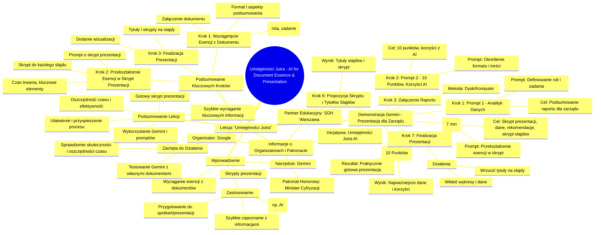

# Sekcja 2. Pomysły na podstawowe wykorzystanie generatywnej AI na przykładzie Gemini - 2. Uporządkowanie listy zadań

# 💡 Diagram

___

# 🗒️ Notatka

# Notatki i Podsumowanie Lekcji "Umiejętności Jutra" - Wyciąganie Esencji z Dokumentów za Pomocą AI

## Wprowadzenie

Lekcja "Umiejętności Jutra" prezentuje, jak w prosty sposób wykorzystać narzędzie AI, konkretnie `Gemini`, do **wyciągania esencji z długich dokumentów i raportów** oraz **przekształcania tej esencji w skrypty prezentacji**. Jest to szczególnie przydatne w sytuacjach, gdy czas jest ograniczony, a konieczne jest szybkie zapoznanie się z dużą ilością informacji, na przykład przed spotkaniem, prezentacją, lub w celu zrozumienia interesującego tematu, takiego jak rozwój AI.

## Demonstracja Wykorzystania Gemini

### Przykład - Prezentacja dla Zarządu

Lekcja demonstruje proces wyciągania esencji i tworzenia prezentacji na przykładzie raportu, który ma być zaprezentowany zarządowi firmy.

1.  **Uruchomienie Gemini i Wpisanie Pierwszego Promptu:**
    - Użytkownik otwiera aplikację `Gemini`.
    - Wpisuje pierwszy prompt, definiujący rolę i zadanie `Gemini`:
        > Jesteś analitykiem danych. Twoim zadaniem jest podsumowanie informacji zawartych w załączonym raporcie, które zaprezentuję na spotkaniu z zarządem.

    - **Cel promptu:** Nadanie kontekstu i określenie celu podsumowania - prezentacja dla zarządu.

2.  **Doprecyzowanie Promptu:**
    - Użytkownik dodaje dalsze instrukcje do promptu, określając formę i treść oczekiwanego podsumowania:
        > Przedstaw je w formie 10 punktów, podkreślając korzyści z wdrożenia AI dla rozwoju naszej firmy.

    - **Cel doprecyzowania:** Określenie formatu (10 punktów) i kluczowego aspektu (korzyści z AI) podsumowania.

3.  **Załączenie Raportu:**
    - Użytkownik załącza raport do `Gemini`, korzystając z dysku lub komputera.

4.  **Otrzymanie Esencji Raportu:**
    - `Gemini` analizuje raport i generuje **10 punktów zawierających esencję raportu**, podkreślając najważniejsze dane i korzyści z wdrożenia AI.

5.  **Wpisanie Drugiego Promptu - Tworzenie Skryptu Prezentacji:**
    - Użytkownik wpisuje kolejny prompt, mający na celu przekształcenie esencji raportu w skrypt prezentacji:
        > Na podstawie opracowanych punktów, przygotuj treść na slajdy prezentacji, trwającej maksymalnie 7 minut, którą zaprezentuję na spotkaniu z zarządem. Dla zarządu ważne są dane oraz rekomendacje. Dodatkowo przygotuj propozycję skryptu do każdego slajdu.

    - **Cel drugiego promptu:**  Stworzenie skryptu prezentacji (do 7 minut), z uwzględnieniem ważnych dla zarządu danych i rekomendacji, oraz skryptu do każdego slajdu.

6.  **Otrzymanie Propozycji Skryptu i Tytułów Slajdów:**
    - `Gemini` generuje **propozycje tytułów slajdów** oraz **skrypt do każdego slajdu**.

7.  **Finalizacja Prezentacji:**
    - Użytkownik, dysponując tytułami i skryptami, musi już tylko:
        - Wrzucić tytuły na slajdy prezentacji.
        - Wkleić odpowiednie wykresy i dane z raportu, aby wizualnie urozmaicić treść.
        - **Prezentacja jest praktycznie gotowa.**

## Podsumowanie Kluczowych Kroków

Poniżej przedstawiono kluczowe kroki procesu:

- **Krok 1: Wyciągnięcie esencji z dokumentu za pomocą Gemini.**
    - Użycie promptu definiującego rolę AI i zadanie podsumowania.
    - Określenie formatu i kluczowych aspektów podsumowania.
    - Załączenie dokumentu.
- **Krok 2: Przekształcenie esencji w skrypt prezentacji.**
    - Użycie kolejnego promptu, proszącego o skrypt prezentacji na podstawie esencji.
    - Określenie czasu trwania prezentacji i kluczowych elementów (dane, rekomendacje).
    - Prośba o skrypt do każdego slajdu.
- **Krok 3: Finalizacja prezentacji.**
    - Wprowadzenie tytułów i skryptów do slajdów.
    - Dodanie wizualizacji (wykresów, danych z raportu).

## Zachęta do Działania

Lekcja zachęca widzów do **samodzielnego przetestowania Gemini** z własnymi raportami i dokumentami, aby przekonać się o jego skuteczności w wyciąganiu esencji i oszczędzaniu czasu.

## Informacje o Organizatorach i Patronacie

- **Umiejętności Jutra AI** - tytuł inicjatywy edukacyjnej.
- **Organizator:** Google.
- **Partner Edukacyjny:** Szkoła Główna Handlowa w Warszawie (SGH).
- **Patronat Honorowy:** Minister Cyfryzacji.

## Podsumowanie Lekcji

Lekcja "Umiejętności Jutra" skutecznie demonstruje, jak wykorzystanie narzędzi AI, takich jak `Gemini`, może znacząco **ułatwić i przyspieszyć proces zapoznawania się z długimi dokumentami i tworzenia prezentacji**. Poprzez zastosowanie odpowiednich promptów, można w szybki sposób wyciągnąć kluczowe informacje i przekształcić je w gotowy skrypt prezentacji, oszczędzając czas i zwiększając efektywność pracy. Jest to szczególnie wartościowe narzędzie dla osób pracujących pod presją czasu, które muszą szybko przyswajać duże ilości informacji i przygotowywać się do prezentacji.

___

# 🔉 Transcript
File: Sekcja 2. Pomysły na podstawowe wykorzystanie generatywnej AI na przykładzie Gemini - 2. Uporządkowanie listy zadań.mp4 
[00:00:00] Screen: A blinking black cursor is shown in the middle of a white screen.
[00:00:00] Background sound: Upbeat music.
[00:00:01] Screen: The words "Umiejętności Jutra" appear in black letters in the middle of a white screen. To the right of the words appears "AI" in blue letters.
[00:00:03] Screen: The words "Organizator Google, Partner Edukacyjny SGH, Patronat Honorowy Minister Cyfryzacji" appear in black letters under the title, along with the Google, SGH, and Minister Cyfryzacji logos.
[00:00:05] Screen: A man with glasses sits at a desk with a gray laptop. Behind him is a wooden wall with circular indentations.
[00:00:05] Speaker: W tej lekcji pokażemy ci jak w prosty sposób wyciągnąć esencję z długich dokumentów czy raportów,
[00:00:11] Speaker: oraz jak przegrać tę esencję w na przykład skrypt prezentacji.
[00:00:15] Speaker: Może być to przydatne za każdym razem, gdy pod presją czasu musisz szybko zapoznać się z dużą ilością informacji, przygotować na spotkanie, do prezentacji lub po prostu, gdy jakiś temat jest dla ciebie interesujący, jak na przykład rozwój AI.
[00:00:30] Speaker: Okej, przetestujmy to na przykładzie prezentacji.
[00:00:32] Screen: The screen switches to the man at the desk, with a gray laptop, and a Gemini app.
[00:00:33] Speaker: Wpisujemy prompta do Gemini.
[00:00:35] Speaker: Jesteś analitykiem danych.
[00:00:38] Speaker: Twoim zadaniem jest podsumowanie informacji zawartych w załączonym raporcie, które zaprezentuję na spotkaniu z zarządem.
[00:00:47] Speaker: Czyli dajemy kontekst, po co jest nam ta esencja.
[00:00:51] Speaker: Przedstaw je w formie 10 punktów, podkreślając korzyści z wdrożenia AI dla rozwoju naszej firmy.
[00:01:01] Speaker: Raport załączam z dysku lub z komputera.
[00:01:06] Screen: The screen shows the Gemini app with information from the attached file.
[00:01:06] Speaker: Otrzymaliśmy teraz punkty z esencją raportu i najważniejszymi danymi.
[00:01:11] Speaker: Teraz chcemy przegrać tą esencję na jakąś naszą prezentację z podsumowaniem.
[00:01:16] Speaker: Wpisujemy więc kolejny prompt, bo potrzebujemy skryptu, no i jakieś propozycji tytułów.
[00:01:21] Screen: The screen switches to the man at the desk, with a gray laptop, and a Gemini app.
[00:01:23] Speaker: Na podstawie opracowanych punktów, przygotuj treść na slajdy prezentacji, trwającej maksymalnie 7 minut, którą zaprezentuję na spotkaniu z zarządem.
[00:01:39] Speaker: Dla zarządu ważne są dane oraz rekomendacje.
[00:01:44] Speaker: Dodatkowo przygotuj propozycję skryptu do każdego slajdu.
[00:01:49] Speaker: Chcemy się upewnić, że na pewno ta treść będzie dobrze wylistowana i opowiedziana.
[00:01:55] Screen: The screen shows the Gemini app with presentation titles and script for each title.
[00:01:56] Speaker: Jak widzimy, otrzymaliśmy propozycje skryptu, propozycje tytułów i w zasadzie pozostało już tylko wrzucić te tytuły na slajdy, wkleić odpowiednie wykresy z samego raportu, aby urozmaicić treść wizualnie i mamy praktycznie gotową prezentację.
[00:02:12] Speaker: Co dalej?
[00:02:13] Speaker: Już teraz, jeśli masz pod ręką raport, które być może cię ciekawi, ale nie miałeś czasu się z nim zapoznać, spróbuj wyciągnąć z niego esencję z Gemini.
[00:02:22] Screen: The words "Umiejętności Jutra" appear in black letters in the middle of a white screen. To the right of the words appears "AI" in blue letters.
[00:02:23] Screen: The words "Organizator Google, Partner Edukacyjny SGH, Patronat Honorowy Minister Cyfryzacji" appear in black letters under the title, along with the Google, SGH, and Minister Cyfryzacji logos.
[00:02:25] Background sound: Upbeat music stops.

___
# 🏷️ Tags
#AI #Gemini #Umiejętności_Jutra #esencja #dokumenty #raporty #prezentacje #skrypty #analiza_danych #zarząd #korzyści_z_AI #wdrożenie_AI #rozwój_firmy #prompt #podsumowanie #tytuły_slajdów #skrypt_prezentacji #wizualizacja_danych #wykresy #dane #rekomendacje #efektywność_pracy #oszczędność_czasu #Google #SGH #Minister_Cyfryzacji #edukacja #uczenie_maszynowe #przetwarzanie_języka_naturalnego #sztuczna_inteligencja
