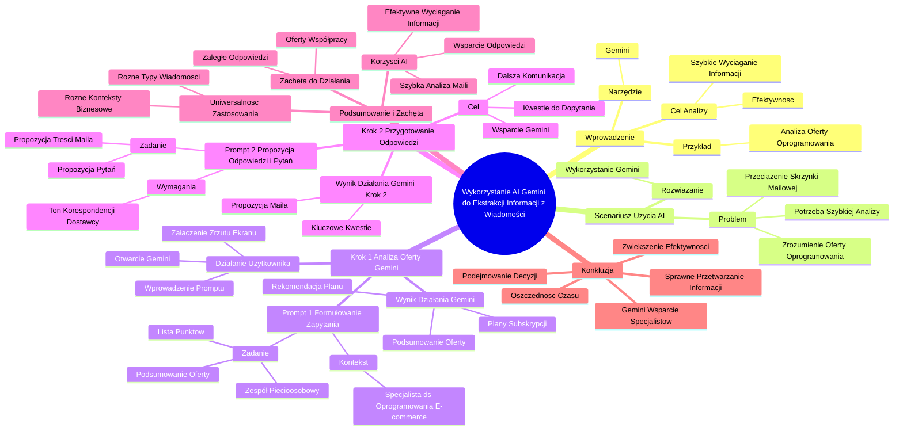

# Sekcja 2. Pomysły na podstawowe wykorzystanie generatywnej AI na przykładzie Gemini - 3. Analiza raportów

# 💡 Diagram

___

# 🗒️ Notatka

# Notatki i Podsumowanie Transkrypcji Wideo: Wykorzystanie AI do Ekstrakcji Informacji z Wiadomości

## Wprowadzenie

Ten film instruktażowy prezentuje wykorzystanie sztucznej inteligencji (`AI`), a konkretnie narzędzia `Gemini`, do szybkiego i efektywnego wyciągania kluczowych informacji z wiadomości e-mail, nawet tych bardzo złożonych. Demonstracja skupia się na praktycznym przykładzie analizy oferty oprogramowania, ukazując, jak `AI` może usprawnić proces przetwarzania informacji i przygotowania odpowiedzi.

## Scenariusz Użycia AI w Analizie Wiadomości E-mail

### Problem: Przeciążenie Skrzynki Mailowej i Potrzeba Szybkiej Analizy

- W intensywny dzień pracy, skrzynka mailowa jest przepełniona.
- Szybkie odnalezienie kluczowych informacji w długich wiadomościach od klientów lub partnerów biznesowych jest trudne.
- **Typowy problem:** Potrzeba sprawnego zrozumienia treści oferty oprogramowania dla e-commerce.

### Rozwiązanie: Wykorzystanie Gemini do Analizy Oferty Oprogramowania

- **Narzędzie:** `Gemini` (dostępne na stronie gemini.google.com/app).
- **Przykład:** Analiza wiadomości e-mail z ofertą nowego oprogramowania dla e-commerce.

## Krok 1: Analiza Oferty za Pomocą Gemini

### Prompt 1: Sformułowanie Zapytania do Gemini

- **Wprowadzenie kontekstu:** Użytkownik wciela się w rolę specjalisty ds. oprogramowania w firmie e-commerce.
- **Zadanie dla Gemini:** Podsumowanie załączonej wiadomości e-mail z ofertą oprogramowania w formie listy, z uwzględnieniem potrzeb pięcioosobowego zespołu i poszukiwania optymalnego rozwiązania.
- **Pełny Prompt:** "Jesteś specjalistą do spraw oprogramowania w firmie e-commerce. Otrzymałeś załączony email od dostawcy oprogramowania z nową ofertą. Podsumuj główne punkty oferty w formie listy. Uwzględnij, że poszukujemy optymalnego rozwiązania dla pięcioosobowego zespołu."

### Działanie Użytkownika w Gemini

1. Otwarcie strony gemini.google.com/app.
2. Wprowadzenie sformułowanego promptu.
3. Załączenie zrzutu ekranu wiadomości e-mail z ofertą jako pliku.

### Wynik Działania Gemini

- `Gemini` analizuje ofertę na podstawie promptu i załączonego pliku (zrzutu ekranu wiadomości e-mail).
- **Rezultat:** Przygotowanie podsumowania oferty, uwzględniającego plany subskrypcji oprogramowania i potrzeby pięcioosobowego zespołu.
- **Rekomendacja:** `Gemini` wskazuje konkretny plan subskrypcji jako najbardziej optymalny w danym kontekście.

## Krok 2: Przygotowanie Odpowiedzi na Maila Dostawcy

### Cel: Dalsza Komunikacja z Dostawcą

- Przygotowanie do rozmowy z dostawcą oprogramowania.
- Wykorzystanie `Gemini` jako wsparcia w przygotowaniu odpowiedzi na wiadomość e-mail.
- Określenie kluczowych kwestii, o które należy dopytać dostawcę na tym etapie.

### Prompt 2: Generowanie Propozycji Odpowiedzi i Pytań

- **Kontynuacja Konwersacji z Gemini:** Powrót do okna konwersacji z `Gemini`.
- **Zadanie dla Gemini:** Zaproponowanie pytań do dostawcy w odpowiedzi oraz przygotowanie propozycji treści wiadomości e-mail.
- **Wymagania dotyczące maila:** Utrzymanie tonu korespondencji dostawcy.
- **Pełny Prompt:** "Zaproponuj, o co warto dopytać dostawcę w odpowiedzi. Następnie przygotuj propozycję treści maila, utrzymaną w tonie, w jakim pisał dostawca."

### Wynik Działania Gemini (Krok 2)

- **Kluczowe Kwestie do Poruszenia:** `Gemini` generuje listę kluczowych kwestii, o które warto dopytać dostawcę.
- **Propozycja Maila:** `Gemini` przygotowuje profesjonalną propozycję wiadomości e-mail, gotową do wysłania, utrzymaną w odpowiednim tonie.

## Podsumowanie i Zachęta do Działania

- **Korzyści z Wykorzystania AI (Gemini):** Szybka analiza długich i złożonych wiadomości e-mail, efektywne wyciąganie kluczowych informacji, wsparcie w przygotowaniu odpowiedzi i dalszej komunikacji.
- **Zachęta:** Wykorzystanie `AI` do obsługi zaległych odpowiedzi na maile, ofert współpracy i tym podobnych.
- **Uniwersalność Zastosowania:** Metoda znajduje zastosowanie w analizie różnych typów wiadomości i w rozmaitych kontekstach biznesowych.

## Konkluzja

Film demonstruje praktyczne zastosowanie `AI` (`Gemini`) w codziennej pracy, w szczególności w obszarze zarządzania informacjami w skrzynce mailowej. Ukazuje, w jaki prosty sposób można wykorzystać `AI` do analizy ofert i przygotowania odpowiedzi, oszczędzając czas i zwiększając efektywność. Narzędzia `AI`, takie jak `Gemini`, stanowią znaczące wsparcie dla specjalistów w sprawnym przetwarzaniu informacji i podejmowaniu decyzji.

---
*Materiały edukacyjne "Umiejętności Jutra AI" przygotowane we współpracy z Google, SGH i Ministerstwem Cyfryzacji.*

___

# 🔉 Transcript
File: Sekcja 2. Pomysły na podstawowe wykorzystanie generatywnej AI na przykładzie Gemini - 3. Analiza raportów.mp4 
[00:00:01] (Na ekranie pojawia się napis "Umiejętności Jutra AI" oraz loga organizatorów, partnerów i patronów honorowych: Google, SGH, Ministerstwo Cyfryzacji).
[00:00:05] Teraz pokażemy Ci, jak wykorzystać AI, by w kilka sekund wyciągnąć najważniejsze dla Ciebie informacje z każdej wiadomości.
[00:00:13] Nawet tej najbardziej zawiłej.
[00:00:16] Wyobraź sobie, że masz bardzo intensywny dzień.
[00:00:19] Twoja skrzynka mailowa jest przepełniona, a Ty musisz szybko znaleźć kluczowe informacje w długim mailu od klienta czy partnera biznesowego.
[00:00:29] Brzmi znajomo?
[00:00:30] Sprawdźmy jak Gemini może Ci z tym pomóc.
[00:00:33] Załóżmy, że dostałeś maila z ofertą nowego oprogramowania dla e-commerce.
[00:00:38] W pierwszym kroku przeanalizujemy ją pod kątem najistotniejszych dla Ciebie informacji.
[00:00:44] (Na ekranie laptopa otwierana jest strona gemini.google.com/app).
[00:00:45] Otwieramy Gemini i wprowadzamy nasz prompt.
[00:00:48] Jesteś specjalistą do spraw oprogramowania w firmie zajmującej się e-commerce.
[00:00:56] Otrzymałeś załączony email od dostawcy oprogramowania z nową ofertą.
[01:01] Podsumuj jego główne punkty w formie listy.
[01:05] Weź pod uwagę, że szukamy optymalnego rozwiązania dla pięcioosobowego zespołu.
[01:12] (Użytkownik klika przycisk "Dodaj plik").
[01:12] Na koniec załączam zrzut ekranu maila.
[01:16] (Do okna czatu Gemini załączony zostaje plik graficzny ze zrzutem ekranu maila).
[01:18] Otrzymujemy odpowiedź i jak widzimy, Gemini przeanalizował ofertę i przygotował podsumowanie, uwzględniając plany subskrypcji oprogramowania oraz nasze potrzeby.
[01:30] Zarekomendował również konkretny plan, jak najbardziej optymalny w związku z nadanym przez nas kontekstem.
[01:37] Teraz przygotujmy się do dalszej rozmowy z dostawcą.
[01:41] Poprośmy Gemini o pomoc w przygotowaniu odpowiedzi na maila.
[01:45] Niech dodatkowo wskaże nam kwestie, o które powinniśmy już zapytać na tym etapie.
[01:50] (Użytkownik wraca do okna przeglądarki z Gemini).
[01:50] Wróćmy do naszej konwersacji z Gemini i wprowadźmy kolejny prompt.
[01:57] Zaproponuj, o co warto dopytać dostawcę w odpowiedzi.
[02:02] Następnie przygotuj mi propozycję maila.
[02:05] Niech będzie utrzymany w tonie, w jakim pisał do mnie dostawca.
[02:12] W odpowiedzi widzimy kilka kluczowych kwestii do poruszenia z dostawcą.
[02:17] Dodatkowo, otrzymaliśmy profesjonalną propozycję maila, którego moglibyśmy od razu wysłać.
[02:25] Teraz zastanów się.
[02:27] Być może od dłuższego czasu zwlekasz z odpowiedzią na któregoś maila, na przykład z ofertą lub propozycją współpracy.
[02:34] Spróbuj podejść do tego w ten sposób, wykorzystując AI.
[02:38] (Na ekranie pojawia się napis "Umiejętności Jutra AI" oraz loga organizatorów, partnerów i patronów honorowych: Google, SGH, Ministerstwo Cyfryzacji).

___
# 🏷️ Tags
#AI #sztuczna_inteligencja #Gemini #Google #SGH #Ministerstwo_Cyfryzacji #ekstrakcja_informacji #wiadomości #e-mail #analiza_wiadomości #automatyzacja #efektywność #oprogramowanie #e-commerce #oferta_oprogramowania #prompt #podsumowanie #lista #plan_subskrypcji #zespół #komunikacja #dostawca #odpowiedź #pytania #ton_korespondencji #współpraca #zarządzanie_informacjami #skrzynka_mailowa #decyzje #umiejętności_jutra_AI
