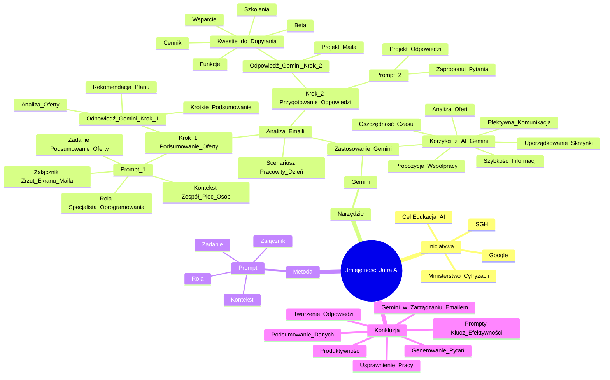

# Sekcja 2. Pomysły na podstawowe wykorzystanie generatywnej AI na przykładzie Gemini - 3. Analiza raportów

# 💡 Diagram

<mind_map_planning>
1. Main topics identified (quote key phrases or sentences):
    * **Umiejętności Jutra AI**: "Umiejętności Jutra AI - Notatki i Podsumowanie Wideo", "inicjatywy \"Umiejętności Jutra AI\"", "(Ekran: Napis \"Umiejętności Jutra AI\". Poniżej loga: Google, SGH i Minister Cyfryzacji.)"
    * **Zastosowanie AI (Gemini)**: "jak wykorzystać **sztuczną inteligencję (AI)**, a konkretnie narzędzie **Gemini**", "Praktyczne Zastosowanie Gemini w Analizie E-maili", "Sprawdźmy jak Gemini może ci z tym pomóc.", "Otwieramy Gemini i wprowadzamy nasz prompt.", "Wróćmy do naszej konwersacji z Gemini i wprowadźmy kolejny prompt."
    * **Analiza E-maili**: "Analizie E-maili", "przeanalizujemy ją pod kątem najistotniejszych dla ciebie informacji.", "przygotujmy się do dalszej rozmowy z dostawcą.", "Poprośmy Gemini o pomoc w przygotowaniu odpowiedzi na maila."
    * **Korzyści**: "Podsumowanie Korzyści i Zachęta do Eksploracji AI", "Zalety Wykorzystania AI (Gemini):", "Znacząca oszczędność czasu", "Wsparcie w tworzeniu profesjonalnej i efektywnej komunikacji mailowej."
    * **Prompt**: "Wprowadzenie **promptu** (polecenia) dla Gemini", "Przykładowy Prompt (tekstowy):", "wprowadzamy nasz prompt.", "wprowadźmy kolejny prompt."

2. Subtopics for each main topic:
    * Umiejętności Jutra AI:
        * Google
        * SGH
        * Ministerstwo Cyfryzacji
        * Cel: Edukacja AI
    * Zastosowanie AI (Gemini):
        * Scenariusz: Pracowity Dzień
        * Analiza Oferty Oprogramowania (Krok 1)
            * Prompt 1 (Specjalista, Podsumowanie, Zespół, Załącznik)
            * Odpowiedź Gemini (Podsumowanie, Rekomendacja)
        * Przygotowanie Odpowiedzi (Krok 2)
            * Prompt 2 (Pytania, Projekt Odpowiedzi)
            * Odpowiedź Gemini (Kwestie do Dopytania, Projekt Maila)
    * Analiza E-maili:
        * Problem: Przepełniona Skrzynka
        * Rozwiązanie: Gemini
        * Podsumowanie Oferty
        * Przygotowanie Odpowiedzi
    * Korzyści:
        * Szybkość Informacji
        * Oszczędność Czasu
        * Efektywna Komunikacja
        * Uporządkowanie Skrzynki
        * Analiza Ofert
        * Propozycje Współpracy
    * Prompt:
        * Rola
        * Zadanie
        * Kontekst
        * Załącznik

3. Key tasks or action items:
    * Wykorzystać Gemini do analizy maili
    * Formułować prompty
    * Testować AI w pracy

4. Important relationships between topics:
    * Umiejętności Jutra AI jest inicjatywą, w ramach której demonstruje się zastosowanie Gemini.
    * Analiza E-maili jest praktycznym przykładem zastosowania Gemini.
    * Korzyści wynikają z zastosowania Gemini do analizy e-maili.
    * Prompt jest kluczowym elementem interakcji z Gemini.

5. Potential categories or groupings:
    * Inicjatywa (Umiejętności Jutra AI)
    * Narzędzie (Gemini)
    * Metoda (Prompt)
    * Zastosowanie (Analiza E-maili)
    * Wyniki (Korzyści)

</mind_map_planning>

___

# 🗒️ Notatka

# Umiejętności Jutra AI - Notatki i Podsumowanie Wideo

## Wprowadzenie

Ten materiał wideo demonstruje, jak wykorzystać **sztuczną inteligencję (AI)**, a konkretnie narzędzie **Gemini**, do szybkiego wyciągania kluczowych informacji z wiadomości e-mail, nawet tych bardzo rozbudowanych.  Przedstawiono, w jaki sposób AI może usprawnić zarządzanie skrzynką mailową i oszczędzić cenny czas.  Prezentacja powstała w ramach inicjatywy "Umiejętności Jutra AI", wspólnego projektu Google, Szkoły Głównej Handlowej (SGH) i Ministerstwa Cyfryzacji.

## Praktyczne Zastosowanie Gemini w Analizie E-maili

### Scenariusz: Pracowity Dzień i Przepełniona Skrzynka Odbiorcza

*   Problem: W natłoku pracy trudno szybko wyłowić istotne informacje z długich wiadomości od klientów lub partnerów biznesowych.
*   Rozwiązanie: Wykorzystanie **Gemini** do sprawnej analizy i podsumowania treści e-maili.

### Krok 1: Ekspresowe Podsumowanie Oferty Oprogramowania

1.  **Założenie:** Użytkownik otrzymuje wiadomość e-mail z ofertą nowego oprogramowania dla e-commerce.
2.  **Wykorzystanie Gemini:**
    *   Uruchomienie **Gemini Advanced**.
    *   Wprowadzenie **promptu** (polecenia) dla Gemini, zawierającego następujące wytyczne:
        *   Twoja rola: Specjalista ds. oprogramowania w firmie e-commerce.
        *   Zadanie: Stwórz listę podsumowującą główne punkty załączonej oferty oprogramowania.
        *   Kontekst: Poszukiwanie rozwiązania optymalnego dla pięcioosobowego zespołu.
        *   Załącznik: Zrzut ekranu wiadomości e-mail z ofertą.
    *   **Przykładowy Prompt (tekstowy):** "Jako specjalista ds. oprogramowania w firmie e-commerce, otrzymałem e-mail z ofertą nowego oprogramowania. Proszę o podsumowanie głównych punktów oferty w formie listy, z uwzględnieniem potrzeb pięcioosobowego zespołu."
3.  **Odpowiedź Gemini:**
    *   **Analiza Oferty:** Gemini analizuje treść oferty oprogramowania.
    *   **Krótkie Podsumowanie:**  Generuje zwięzłe podsumowanie, uwzględniając plany subskrypcji i potrzeby zespołu.
    *   **Rekomendacja Planu:**  Sugeruje najbardziej odpowiedni plan subskrypcji w danym kontekście.

### Krok 2:  Efektywne Przygotowanie Odpowiedzi i Dopytanie o Kluczowe Aspekty

1.  **Cel:** Przygotowanie gruntu pod dalszą rozmowę z dostawcą oprogramowania.
2.  **Wykorzystanie Gemini:**
    *   Wprowadzenie kolejnego **promptu** w ramach tej samej konwersacji z Gemini.
    *   **Przykładowy Prompt (tekstowy):** "Zaproponuj listę pytań do dostawcy w odpowiedzi na jego mail. Następnie przygotuj projekt odpowiedzi, zachowując ton oryginalnej wiadomości."
3.  **Odpowiedź Gemini:**
    *   **Kluczowe Kwestie do Dopytania:** Gemini wskazuje istotne obszary, które warto poruszyć z dostawcą. Przykładowe kategorie pytań:\
        *   Cennik
        *   Dostępne funkcje
        *   Najczęściej wybierane produkty
        *   Wsparcie techniczne
        *   Materiały szkoleniowe wideo
        *   Dostęp do wersji beta
    *   **Projekt Odpowiedzi Mailowej:** Gemini generuje profesjonalny projekt odpowiedzi,  dostosowany tonem do oryginalnej wiadomości.  Mail jest gotowy do wysłania lub dalszej personalizacji.

## Podsumowanie Korzyści i Zachęta do Eksploracji AI

*   **Zalety Wykorzystania AI (Gemini):**
    *   Błyskawiczne wyodrębnianie kluczowych informacji z wiadomości.
    *   Znacząca oszczędność czasu poświęcanego na analizę ofert i redagowanie odpowiedzi.
    *   Wsparcie w tworzeniu profesjonalnej i efektywnej komunikacji mailowej.
*   **Rekomendacja:** Warto wdrożyć AI w codzienną pracę, na przykład do uporządkowania zaległości w skrzynce odbiorczej, analizy ofert czy propozycji współpracy. Zachęcamy do przetestowania zaprezentowanego podejścia w praktyce.

## Konkluzja

To wideo prezentuje praktyczne zastosowanie **AI (Gemini)** w zarządzaniu komunikacją e-mailową w biznesie.  Pokazuje, jak za pomocą odpowiednio sformułowanych **promptów** można efektywnie wykorzystać AI do **podsumowywania danych**, **generowania pytań** i **tworzenia projektów odpowiedzi**. Takie podejście może znacząco usprawnić pracę i podnieść produktywność.  Inicjatywa "Umiejętności Jutra AI" ma na celu edukację i popularyzację wykorzystania tych narzędzi w codziennych zadaniach.

___

# 🔉 Transcript
File: Sekcja 2. Pomysły na podstawowe wykorzystanie generatywnej AI na przykładzie Gemini - 3. Analiza raportów.mp4 
[00:00:01] (Ekran: Napis "Umiejętności Jutra AI". Poniżej loga: Google, SGH i Minister Cyfryzacji.)
[00:00:05] Teraz pokażemy ci jak wykorzystać AI, by w kilka sekund wyciągnąć najważniejsze dla ciebie informacje z każdej wiadomości.
[00:00:13] Nawet tej najbardziej zawiłej.
[00:00:16] Wyobraź sobie, że masz bardzo intensywny dzień.
[00:00:19] Twoja skrzynka mailowa jest przepełniona, a ty musisz szybko znaleźć kluczowe informacje w długim mailu od klienta czy partnera biznesowego.
[00:00:28] Brzmi znajomo?
[00:00:30] Sprawdźmy jak Gemini może ci z tym pomóc.
[00:00:33] Załóżmy, że dostałeś maila z ofertą nowego oprogramowania dla e-commerce.
[00:00:38] W pierwszym kroku przeanalizujemy ją pod kątem najistotniejszych dla ciebie informacji.
[00:00:44] Otwieramy Gemini i wprowadzamy nasz prompt.
[00:00:45] (Ekran: W przeglądarce otwarta strona Gemini Advanced. Po lewej stronie menu, po prawej pole do wpisania wiadomości.)
[00:00:48] Jesteś specjalistą do spraw oprogramowania w firmie zajmującej się e-commerce.
[00:00:55] Otrzymałeś załączony e-mail od dostawcy oprogramowania z nową ofertą.
[00:01:01] Podsumuj jego główne punkty w formie listy.
[00:01:04] Weź pod uwagę, że szukamy optymalnego rozwiązania dla pięcioosobowego zespołu.
[00:01:12] Na koniec załączam zrzut ekranu maila.
[00:01:16] (Ekran: Zrzut ekranu maila. Poniżej treść promptu: "Jesteś specjalistą do spraw oprogramowania w firmie zajmującej się e-commerce. Otrzymałeś załączony e-mail od dostawcy oprogramowania z nową ofertą. Podsumuj jego główne punkty w formie listy. Weź pod uwagę, że szukamy optymalnego rozwiązania dla pięcioosobowego zespołu.")
[00:01:18] Otrzymujemy odpowiedź i jak widzimy, Gemini przeanalizował ofertę i przygotował podsumowanie, uwzględniając plany subskrypcji oprogramowania oraz nasze potrzeby.
[00:01:30] (Ekran: Pytania do dostawcy: Ceny, Funkcjonalności, Najpopularniejsze produkty, Wsparcie, Filmy szkoleniowe, Wersje beta. Poniżej Propozycja maila.)
[00:01:30] Zarekomendował również konkretny plan, jak najbardziej optymalny w związku z nadanym przez nas kontekstem.
[00:01:37] Teraz przygotujmy się do dalszej rozmowy z dostawcą.
[00:01:41] Poprośmy Gemini o pomoc w przygotowaniu odpowiedzi na maila.
[00:01:45] Niech dodatkowo wskaże nam kwestie o które powinniśmy już zapytać na tym etapie.
[00:01:50] Wróćmy do naszej konwersacji z Gemini i wprowadźmy kolejny prompt.
[00:01:51] (Ekran: W przeglądarce otwarta strona Gemini Advanced. Po lewej stronie menu, po prawej lista z podsumowaniem i Pytaniami do dostawcy. Poniżej pole do wpisania wiadomości.)
[00:01:57] Zaproponuj o co warto dopytać dostawcę w odpowiedzi.
[00:02:02] Następnie przygotuj mi propozycję maila.
[00:02:05] Niech będzie utrzymany w tonie, w jakim pisał do mnie dostawca.
[00:02:12] W odpowiedzi widzimy kilka kluczowych kwestii do poruszenia z dostawcą.
[00:02:17] (Ekran: Pytania do dostawcy: Dotyczące oferty: Ceny, Funkcjonalności, Najpopularniejsze produkty, Wsparcie, Filmy szkoleniowe, Wersje beta. Poniżej Propozycja maila.)
[00:02:17] Dodatkowo otrzymaliśmy profesjonalną propozycję maila, którego moglibyśmy od razu wysłać.
[00:02:25] Teraz zastanów się.
[00:02:27] Być może od dłuższego czasu zwlekasz z odpowiedzią na któregoś maila, na przykład z ofertą lub propozycją współpracy.
[00:02:34] Spróbuj podejść do tego w ten sposób, wykorzystując AI.
[00:02:38] (Ekran: Napis "Umiejętności Jutra AI". Poniżej loga: Google, SGH i Minister Cyfryzacji.)

___
# 🏷️ Tags
#Umiejętności_Jutra_AI #sztuczna_inteligencja #AI #Gemini #e-mail #skrzynka_mailowa #zarządzanie_e-mailami #oszczędność_czasu #SGH #Szkoła_Główna_Handlowa #Ministerstwo_Cyfryzacji #Gemini_Advanced #prompt #oprogramowanie #e-commerce #analiza_oferty #podsumowanie_oferty #plan_subskrypcji #rekomendacja_planu #dostawca_oprogramowania #cennik #funkcje #wsparcie_techniczne #materiały_szkoleniowe #wersja_beta #projekt_odpowiedzi #komunikacja_mailowa #produktywność #podsumowywanie_danych #generowanie_pytań #tworzenie_projektów #analiza_wiadomości #automatyzacja_e-mail