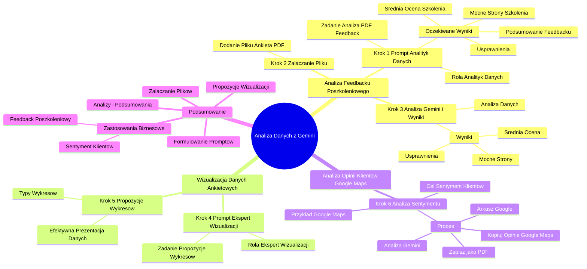

# Sekcja 2. Pomysły na podstawowe wykorzystanie generatywnej AI na przykładzie Gemini - 4. Analiza maili

# 💡 Diagram

___

# 🗒️ Notatka

# Analiza Danych z Arkuszy Google za pomocą Gemini: Notatki i Podsumowanie

## Wprowadzenie

Ten film instruktażowy pokazuje, jak wykorzystać **Gemini** do analizy danych z arkuszy Google, koncentrując się na wydobywaniu kluczowych informacji. Prezentacja skupia się na analizie feedbacku poszkoleniowego, ale technika ta ma szersze zastosowanie – można ją wykorzystać na przykład do analizy sentymentu opinii o produktach lub firmach.

## Analiza Feedbacku Poszkoleniowego z Gemini

### Krok 1: Przygotowanie Promptu dla Gemini – Rola Analityka Danych

*   Otwórz **Gemini Advanced**.
*   Wpisz **prompt**, w którym **Gemini** wciela się w rolę **analityka danych**.
*   **Zadanie dla Gemini:** Analiza załączonego pliku PDF z odpowiedziami z ankiety feedbackowej po szkoleniu.
*   **Oczekiwane wyniki analizy:**
    *   Stworzenie **podsumowania** feedbacku.
    *   Obliczenie **średniej oceny** szkolenia.
    *   Wskazanie docenionych przez uczestników **mocnych stron** szkolenia.
    *   Wskazanie **obszarów do usprawnienia** w przyszłości.

> "Wciel się w rolę analityka danych. Twoim zadaniem jest analiza załączonego pliku z odpowiedziami na ankietę feedbackową dotyczącą szkolenia. Na podstawie tych danych stwórz podsumowanie, które uwzględni średnią ocenę szkolenia, wskaże mocne strony oraz obszary warte usprawnienia w przyszłości."

### Krok 2: Załączanie Pliku z Feedbackiem

*   W interfejsie **Gemini** wybierz opcję **dodania pliku**.
*   Załącz plik **Ankieta.pdf** z feedbackiem, wybierając go z Dysku Google lub komputera.
*   Plik **Ankieta.pdf** zostanie załadowany do **Gemini**.

### Krok 3: Analiza Danych przez Gemini i Wyniki

*   Po wysłaniu promptu i załączeniu pliku, **Gemini** rozpocznie **analizę danych**.
*   Pojawi się komunikat: "Analizuje... Piszę kod do analizy".
*   **Wyniki analizy** przedstawione przez **Gemini**:
    *   **Średnia ocena szkolenia**.
    *   Informacje o **mocnych stronach** szkolenia, docenionych przez uczestników.
    *   Wskazanie **elementów do usprawnienia** w przyszłości.

> "Jak widać, otrzymaliśmy średnią ocenę szkolenia, informacje o mocnych stronach docenionych przez uczestników oraz wskazówki, co warto usprawnić."

## Wizualizacja Danych Ankietowych – Propozycje Wykresów

### Krok 4: Prompt dla Gemini – Ekspert od Wizualizacji Danych

*   Sformułuj **kolejny prompt** dla **Gemini**, tym razem w roli **eksperta od wizualizacji danych**.
*   **Zadanie dla Gemini:** Przygotowanie propozycji wykresów, które efektywnie zwizualizują dane z ankiety i zależności między nimi.
*   **Ważne:** **Gemini** ma **zaproponować wykresy**, a nie od razu je wygenerować.

> "Jesteś ekspertem od wizualizacji danych. Przygotuj propozycje wykresów, które dobrze zwizualizują dane z ankiety i powiązania między nimi."

### Krok 5: Propozycje Wykresów od Gemini

*   **Gemini** przedstawi **propozycje różnych typów wykresów**, które można wykorzystać do zobrazowania danych z ankiety.
*   Te propozycje pomogą użytkownikowi zrozumieć, jakie wizualizacje będą najbardziej efektywne w prezentacji zebranych danych.

> "Jak widać, otrzymaliśmy propozycje kilku rodzajów wykresów, które możemy wykorzystać do zobrazowania danych uzyskanych z ankiety."

## Zastosowanie Analizy Gemini do Opinii Klientów – Przykład z Google Maps

### Krok 6: Analiza Sentymentu Opinii z Google Maps

*   **Przykładowe ćwiczenie:** Analiza ogólnego sentymentu klientów wobec firmy lub produktów.
*   **Proces:**
    1.  **Skopiuj opinie z Google Maps** dotyczące firmy.
    2.  **Wklej opinie do arkusza Google**.
    3.  **Zapisz arkusz jako plik PDF**.
    4.  **Poproś Gemini o analizę i syntezę** opinii z pliku PDF.
*   **Cel:** Zrozumienie ogólnego nastawienia klientów do firmy lub produktów na podstawie opinii z Google Maps.

> "Jeśli chcesz sprawdzić ogólny sentyment klientów wobec Twojej firmy lub produktów, możesz wykonać przykładowe ćwiczenie: skopiuj opinie z Google Maps na temat firmy, umieść je w arkuszu, zapisz jako PDF, a następnie poproś Gemini o analizę i syntezę, aby dowiedzieć się, co klienci myślą o Twojej firmie lub produktach."

## Podsumowanie

Film instruktażowy demonstruje efektywne wykorzystanie **Gemini** do analizy danych z arkuszy Google. Proces ten obejmuje:

*   **Formułowanie precyzyjnych promptów** dla **Gemini**, definiujących rolę i zadanie (np. analityk danych, ekspert od wizualizacji).
*   **Załączanie plików z danymi** (np. PDF z feedbackiem, PDF z opiniami).
*   **Otrzymywanie analiz i podsumowań** danych, w tym średnich ocen, identyfikacji pozytywnych aspektów i obszarów do usprawnień.
*   **Uzyskiwanie propozycji wizualizacji danych** w postaci sugestii odpowiednich wykresów.

**Gemini** staje się potężnym narzędziem do szybkiej analizy danych i wydobywania z nich kluczowych informacji, co znajduje zastosowanie w różnych kontekstach biznesowych – od analizy feedbacku poszkoleniowego po monitorowanie sentymentu klientów.

___

# 🔉 Transcript
File: Sekcja 2. Pomysły na podstawowe wykorzystanie generatywnej AI na przykładzie Gemini - 4. Analiza maili.mp4 
[00:00:05] W tej lekcji pokażemy ci jak z pomocą Gemini możesz analizować dowolne dane zawarte na przykład w arkusza Google i wydobywać z nich najważniejsze informacje.
[00:00:11] (Na ekranie Cezary Jaroni, Product Marketing Manager + Google)
[00:00:15] To może być przydatne, gdy chcesz dokonać analizy na przykład z sentymentów opiniach na temat swoich produktów, firmy lub też, gdy po szkoleniu potrzebujesz po prostu szybko przeanalizować jaki był feedback.
[00:00:27] Przetestujemy to na podstawie feedbacku do przykładowego szkolenia.
[00:00:30] Wpisuję prompt do Gemini.
[00:00:31] (Ekran laptopa z otwartą stroną Gemini Advanced. Na stronie treść: Cześć, Specjalisto)
[00:00:33] Wciel się w rolę analityka danych.
[00:00:36] Twoim zadaniem jest analiza załączonego pliku z odpowiedziami na ankietę z feedbackiem dot. szkolenia.
[00:00:45] Na podstawie tych danych stwórz podsumowanie, które uwzględni średnią ocenę szkolenia, pokaże co poszło dobrze oraz wskaże co warto usprawnić na przyszłość.
[01:01:01] (prowadzę szkolenia dla polskich firm e-commerce).
[01:06:03] (Na dole ekranu opcja dodania pliku)
[01:07:04] Załączam plik z PDF z feedbackiem, z dysku Google lub z komputera.
[01:08:05] (Otwiera się okno Wybierz pliki. Na oknie pliki Dysku Google. Wybiera plik Ankieta.pdf)
[01:11:11] (Plik Ankieta.pdf załadowany)
[01:11:12] I wysyłamy.
[01:11:13] (Gemini analizuje dane. Pojawia się tekst: Analizuje... Piszę kod do analizy)
[01:16:48] Jak widzimy, otrzymaliśmy średnią ocenę ze szkolenia. Informacje o tym co poszło dobrze, co docenili uczestnicy oraz co warto usprawnić.
[01:26:58] Teraz w kolejnym kroku możemy poprosić Gemini by zaproponował nam wykresy, które pomogą zwizualizować nam zebrane dane ze szkolenia i jeszcze lepiej je zrozumieć.
[01:37:21] Co ważne, Gemini teraz nie przygotuje nam tych wykresów, nie prosimy go o to, ale prosimy o propozycję jakie wykresy moglibyśmy przygotować.
[01:45:09] Okej, więc przygotujemy kolejny prompt.
[01:49:57] Jesteś ekspertem od wizualizacji danych.
[01:53:34] Przygotuj mi propozycje wykresów, które dobrze zwizualizują dane z ankiety i powiązania między nimi.
[02:03:23] Jak widzimy, otrzymaliśmy propozycje kilku rodzajów wykresów, które mogą, możemy wykorzystać do zobrazowania tych danych, które otrzymaliśmy w ankiecie.
[02:14:46] I teraz co z tym możecie zrobić?
[02:17:06] Jeśli na przykład chcecie sprawdzić jaki jest ogólny sentyment klientów do waszej firmy bądź produktów, możecie wykonać takie przykładowe ćwiczenie, czyli skopiować opinię z Google Maps na temat waszej firmy, wrzucić je do arkusza, następnie zapisać w PDF-ie oraz poprosić Gemini o ich analizę i syntezę, żeby dowiedzieć się więcej co generalnie ludzie myślą o waszej firmie lub o waszych produktach.
[02:41:54] (Na ekranie logo Umiejętności Jutra AI)

___
# 🏷️ Tags
#Gemini #analiza_danych #arkusze_Google #Google_Sheets #analiza_feedbacku #feedback_poszkoleniowy #prompt #analityk_danych #podsumowanie #średnia_ocena #mocne_strony #obszary_do_usprawnienia #wizualizacja_danych #ekspert_od_wizualizacji_danych #propozycje_wykresów #analiza_sentymentu #opinie_klientów #Google_Maps #analiza_opinii #Umiejętności_Jutra_AI #Cezary_Jaroni #Product_Marketing_Manager #e-commerce #Ankieta_PDF #Dysk_Google
