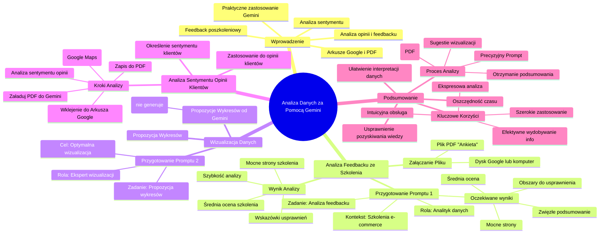

# Sekcja 2. Pomysły na podstawowe wykorzystanie generatywnej AI na przykładzie Gemini - 4. Analiza maili

# 💡 Diagram

___

# 🗒️ Notatka

# Analiza Danych za Pomocą Gemini: Szczegółowe Notatki i Podsumowanie

## Wprowadzenie

Niniejszy materiał przedstawia praktyczne zastosowanie narzędzia Gemini do analizy danych, takich jak opinie i `feedback`, zgromadzonych w arkuszach Google lub plikach PDF.  Celem jest sprawne wydobycie kluczowych informacji, przydatnych w analizie sentymentu opinii o produktach, firmach, czy też w analizie `feedbacku` poszkoleniowego.  Na przykładzie analizy `feedbacku` ze szkolenia zademonstrowano możliwości Gemini w tym zakresie.

## Analiza `Feedbacku` ze Szkolenia za Pomocą Gemini

### Przygotowanie `Promptu` w Gemini Advanced

Prezenter uruchamia Google Gemini Advanced i formułuje `prompt` ukierunkowany na analizę `feedbacku` ze szkolenia.

**`Prompt` 1 (Analiza `Feedbacku`):**

> Wciel się w rolę doświadczonego analityka danych. Twoim zadaniem jest szczegółowa analiza załączonego pliku zawierającego odpowiedzi z ankiety `feedbackowej` dotyczącej szkolenia. Na podstawie tych danych opracuj zwięzłe podsumowanie, uwzględniając średnią ocenę szkolenia, wskazanie mocnych stron oraz obszarów wymagających usprawnienia w przyszłości. Kontekst: prowadzę szkolenia dla polskich firm e-commerce.

**Kluczowe elementy `promptu`:**

*   **Rola:** Analityk danych
*   **Zadanie:** Analiza pliku z `feedbackiem` poszkoleniowym
*   **Oczekiwane wyniki:**
    *   Zwięzłe podsumowanie danych
    *   Średnia ocena szkolenia
    *   Wskazanie mocnych stron szkolenia
    *   Identyfikacja obszarów do usprawnienia
*   **Kontekst:** Szkolenia dedykowane polskim firmom e-commerce

### Załączanie Pliku z `Feedbackiem`

Prezenter dołącza plik PDF o nazwie "Ankieta", zawierający `feedback` ze szkolenia. Plik, znajdujący się na Dysku Google lub komputerze, zostaje przesłany do Gemini Advanced.

### Wynik Analizy `Feedbacku` w Gemini

Gemini analizuje załączony plik i generuje podsumowanie, które zawiera:

*   **Średnią ocenę szkolenia.**
*   **Informacje o mocnych stronach szkolenia** -  elementy szkolenia szczególnie docenione przez uczestników.
*   **Wskazówki dotyczące usprawnień**  -  sugestie obszarów do poprawy w przyszłości.

Prezenter podkreśla szybkość, z jaką Gemini dostarcza kluczowe informacje z analizowanych danych.

## Wizualizacja Danych - Propozycja Wykresów

Następnie prezenter zwraca się do Gemini z prośbą o propozycje wykresów, które mogłyby skutecznie zwizualizować dane ankietowe.

### Przygotowanie `Promptu` dotyczącego Wizualizacji Danych

**`Prompt` 2 (Propozycja Wykresów):**

> Działasz jako ekspert w dziedzinie wizualizacji danych. Zaproponuj różnorodne typy wykresów, które optymalnie przedstawią dane z ankiety i relacje między nimi.

**Kluczowe elementy `promptu`:**

*   **Rola:** Ekspert wizualizacji danych
*   **Zadanie:** Propozycja typów wykresów
*   **Cel:** Optymalna wizualizacja danych ankietowych i korelacji

### Propozycje Wykresów od Gemini

Gemini analizuje dane i sugeruje różne typy wykresów, które można zastosować do zobrazowania wyników ankiety. Prezenter zaznacza, że Gemini nie generuje wykresów bezpośrednio, lecz wskazuje odpowiednie typy.

## Zastosowanie do Analizy Sentymentu Opinii Klientów

Prezenter sugeruje, że analogiczna analiza może być zastosowana do opinii klientów, na przykład tych z Google Maps.  Proces ten obejmuje następujące kroki:

1.  **Skopiowanie opinii z Google Maps.**
2.  **Wklejenie opinii do arkusza Google.**
3.  **Zapisanie arkusza w formacie PDF.**
4.  **Załadowanie pliku PDF do Gemini.**
5.  **Zlecenie Gemini analizy i syntezy opinii w celu określenia ogólnego sentymentu klientów** wobec firmy lub oferowanych produktów.

Dzięki temu możliwe jest szybkie uzyskanie informacji o postrzeganiu firmy lub produktów przez klientów na podstawie dostępnych opinii.

## Podsumowanie

Zaprezentowany materiał demonstruje efektywne wykorzystanie Gemini do analizy danych z plików, w tym formatu PDF. Proces ten charakteryzuje się prostotą i szybkością:

1.  **Sformułowanie precyzyjnego `promptu`**, definiującego rolę Gemini i zadanie analityczne.
2.  **Załączenie pliku z danymi** (np. PDF z `feedbackiem`, PDF z opiniami).
3.  **Otrzymanie podsumowania i kluczowych informacji** (np. średnia ocena, mocne strony, obszary do usprawnień, sentyment opinii).
4.  **Wykorzystanie Gemini do uzyskania sugestii wizualizacji danych** w celu lepszego zrozumienia i prezentacji wyników.

**Kluczowe korzyści z zastosowania Gemini do analizy danych:**

*   **Ekspresowa analiza:** Gemini błyskawicznie przetwarza dane i dostarcza rezultaty.
*   **Efektywne wydobywanie kluczowych informacji:** Gemini koncentruje się na najważniejszych aspektach danych, takich jak średnie oceny, pozytywne i negatywne aspekty oraz sentyment.
*   **Szerokie spektrum zastosowań:** Możliwość analizy `feedbacku`, opinii klientów i innych danych tekstowych.
*   **Intuicyjna obsługa:** Interfejs Gemini Advanced jest przyjazny użytkownikowi, a proces analizy sprowadza się do wprowadzenia `promptu` i załączenia pliku.

**Podsumowując, Gemini stanowi zaawansowane narzędzie do analizy danych, które znacząco usprawnia proces pozyskiwania wiedzy z różnorodnych źródeł, oszczędzając czas i ułatwiając interpretację danych.**

___

# 🔉 Transcript
File: Sekcja 2. Pomysły na podstawowe wykorzystanie generatywnej AI na przykładzie Gemini - 4. Analiza maili.mp4 
[00:00:05] W tej lekcji pokażemy ci jak z pomocą Gemini możesz analizować dowolne dane zawarte na przykład w arkuszach Google i wydobywać z nich najważniejsze informacje.
[00:00:15] To może być przydatne, gdy chcesz dokonać analizy na przykład sentymentu w opiniach na temat swoich produktów, firmy lub też gdy po szkoleniu potrzebujesz po prostu szybko przeanalizować jaki był feedback.
[00:00:27] Przetestujemy to na podstawie feedbacku do przykładowego szkolenia.
[00:00:30] (The screen shows the presenter opening Google Gemini Advanced on his laptop.)
[00:00:31] Wpisuję prompt do Gemini.
[00:00:34] (The presenter types a prompt into Google Gemini Advanced.)
[00:00:34] Wciel się w rolę analityka danych.
[00:00:37] (The presenter continues typing the prompt into Google Gemini Advanced.)
[00:00:37] Twoim zadaniem jest analiza załączonego pliku z odpowiedziami na ankietę z feedbackiem dotyczącą szkolenia.
[00:00:45] (The presenter continues typing the prompt into Google Gemini Advanced.)
[00:00:45] Na podstawie tych danych stwórz podsumowanie, które uwzględni średnią ocenę szkolenia, pokaże co poszło dobrze oraz wskaże co warto usprawnić na przyszłość.
[00:01:01] (The presenter continues typing the prompt into Google Gemini Advanced.)
[01:01:01] Prowadzę szkolenia dla polskich firm e-commerce.
[01:06:06] (The presenter clicks the add file button in Google Gemini Advanced.)
[01:07:07] (The screen shows the presenter opening a file explorer window.)
[01:08:08] (The presenter selects a PDF file titled Ankieta and uploads it to Google Gemini Advanced.)
[01:08:08] Załączam plik z PDF z feedbackiem z Dysku Google lub z komputera.
[01:12:08] (The presenter sends the prompt to Google Gemini Advanced.)
[01:12:08] I wysyłam.
[01:12:08] (The screen shows Google Gemini Advanced analyzing the file.)
[01:17:04] (The screen shows Google Gemini Advanced providing a summary of the survey data.)
[01:17:04] Jak widzimy, otrzymaliśmy średnią ocenę ze szkolenia, informacje o tym co poszło dobrze, co docenili uczestnicy oraz co warto usprawnić.
[01:27:09] W kolejnym kroku możemy poprosić Gemini by zaproponował nam wykresy, które pomogą zwizualizować nam zebrane dane ze szkolenia i jeszcze lepiej je zrozumieć.
[01:37:03] Co ważne, Gemini teraz nie przygotuje nam tych wykresów, nie prosimy go o to, ale prosimy o propozycje jakie wykres moglibyśmy przygotować.
[01:45:15] (The presenter types a new prompt into Google Gemini Advanced.)
[01:45:15] Okej, więc przygotujemy kolejny prompt.
[01:49:16] (The presenter types a new prompt into Google Gemini Advanced.)
[01:49:16] Jesteś ekspertem od wizualizacji danych.
[01:53:06] (The presenter continues typing the prompt into Google Gemini Advanced.)
[01:53:06] Przygotuj mi propozycje wykresów, które dobrze zwizualizują dane z ankiety i powiązania między nimi.
[02:02:05] (The screen shows Google Gemini Advanced analyzing the file.)
[02:05:05] (The screen shows Google Gemini Advanced providing suggestions for data visualizations.)
[02:05:05] Jak widzimy, otrzymaliśmy propozycję kilku rodzajów wykresów, które mogą, możemy wykorzystać do zobrazowania tych danych, które otrzymaliśmy się w ankiecie.
[02:14:05] I teraz co z tym możecie zrobić?
[02:17:01] Jeśli na przykład chcecie sprawdzić jaki jest ogólny sentyment klientów do waszej firmy bądź produktów, możecie wykonać takie przykładowe ćwiczenie, czyli skopiować opinię z Google Maps na temat waszej firmy, wrzucić je do arkusza, następnie zapisać w PDF-ie oraz poprosić Gemini o ich analizę i syntezę, żeby dowiedzieć się więcej co generalnie ludzie myślą o waszej firmie lub o waszych produktach.
[02:41:05] (The screen displays the Umiejętności Jutra logo.)

___
# 🏷️ Tags
#gemini #analiza_danych #google #feedback #szkolenie #analiza_sentymentu #opinie_klientow #arkusze_google #pdf #prompt #analiza_feedbacku #srednia_ocena #mocne_strony #usprawnienia #ecommerce #wizualizacja_danych #wykresy #google_maps #podsumowanie #kluczowe_informacje #dane_tekstowe #interfejs_uzytkownika #efektywnosc #oszczednosc_czasu #interpretacja_danych #gemini_advanced #ankieta #analityk_danych #ekspert_wizualizacji #korelacje #synteza_opinii #postrzeganie_firmy #postrzeganie_produktow
