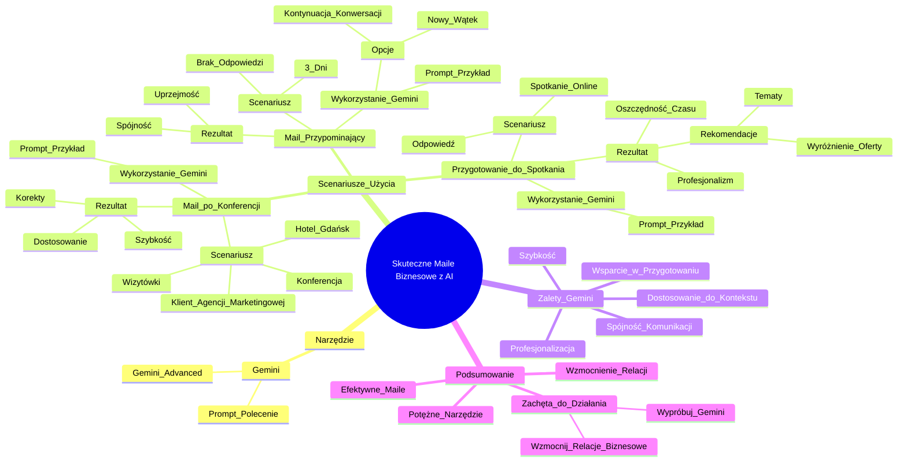

# Sekcja 2. Pomysły na podstawowe wykorzystanie generatywnej AI na przykładzie Gemini - 5. Analiza sentymentu

# 💡 Diagram

___

# 🗒️ Notatka

# Notatki i Podsumowanie Lekcji "Umiejętności Jutra AI": Tworzenie Skutecznych Maili Biznesowych z Generatywną AI

## Wprowadzenie

Lekcja "Umiejętności Jutra AI" prezentuje, jak wykorzystać generatywną AI, a konkretnie **Gemini**, do tworzenia skutecznych i angażujących wiadomości e-mail w kontekście biznesowym.  Celem lekcji jest wzmocnienie relacji biznesowych poprzez profesjonalną i efektywną komunikację mailową. Skupia się ona na praktycznym zastosowaniu AI w różnorodnych scenariuszach, takich jak nawiązywanie kontaktu po konferencji, wysyłanie przypomnień oraz przygotowanie do spotkań.

## Tworzenie Pierwszego Maila po Konferencji z Gemini

### Scenariusz:

* Uczestnik konferencji branżowej wraca z wizytówkami i nowymi pomysłami.
* Chce napisać maila do potencjalnego klienta agencji marketingowej.

### Wykorzystanie Gemini:

1. **Uruchom Gemini Advanced.**
2. **Wprowadź `prompt` (polecenie):**
   > "Jesteś specjalistą ds. komunikacji. Potrzebuję pomocy w napisaniu maila do menadżera hotelu w Gdańsku, którego poznałem na konferencji branży hotelarskiej. Rozmawialiśmy o potencjalnej współpracy z moją agencją marketingową. Chciałbym podtrzymać kontakt i zaproponować spotkanie online w celu omówienia szczegółów. Proszę o przyjacielski ton, ale bez natarczywości."

### Rezultat:

* Gemini generuje treść maila w kilka sekund, dostosowaną do kontekstu.
* Wygenerowany mail jest niemal gotowy do wysłania, wymagając jedynie ewentualnych, drobnych korekt.
* **Kluczowe zalety:** szybkość działania i precyzyjne dostosowanie do kontekstu.

## Wysyłanie Maila Przypominającego (Reminder)

### Scenariusz:

* Trzy dni po wysłaniu pierwszego maila – brak odpowiedzi.
* Konieczność wysłania uprzejmego przypomnienia.

### Wykorzystanie Gemini:

1. **Dwie opcje:**
   * **Nowy wątek:** Utworzenie nowego `promptu`, ponownie wprowadzając kontekst pierwszego maila.
   * **Kontynuacja konwersacji:** Powrót do wcześniejszej rozmowy z Gemini i dodanie kolejnego `promptu` (opcja zalecana w lekcji).
2. **Wprowadź `prompt` w istniejącej konwersacji:**
   > "Minęły trzy dni od mojego maila, a ja wciąż nie otrzymałem odpowiedzi. Napisz proszę kulturalne przypomnienie, zachęcające do odpowiedzi na moją poprzednią wiadomość."

### Rezultat:

* Gemini generuje mail przypominający, który:
   * Jest spójny z tonem poprzedniej wiadomości.
   * Zachowuje uprzejmy i nienachalny charakter.
* **Kluczowe zalety:** utrzymanie spójności komunikacji i unikanie nachalności.

## Przygotowanie do Spotkania Online z Gemini

### Scenariusz:

* Otrzymano odpowiedź z propozycją spotkania online.
* Potrzeba efektywnego przygotowania się do rozmowy.

### Wykorzystanie Gemini:

1. **Wprowadź `prompt` w konwersacji:**
   > "Otrzymałem odpowiedź i propozycję spotkania online. Jak najlepiej się do niego przygotować? Zaproponuj proszę kilka tematów, które warto poruszyć, oraz strategie wyróżnienia mojej oferty agencji marketingowej na tle konkurencji."

### Rezultat:

* Gemini generuje konkretne rekomendacje dotyczące:
   * Kluczowych tematów do omówienia podczas spotkania.
   * Sposobów na wyróżnienie oferty agencji marketingowej.
* **Kluczowe zalety:** oszczędność czasu poświęconego na przygotowania, wzrost pewności siebie i profesjonalizmu, a w efekcie – skuteczniejsza komunikacja.

## Podsumowanie i Zachęta do Działania

* Generatywna AI, taka jak **Gemini**, to potężne narzędzie do tworzenia efektywnych maili biznesowych.
* Umożliwia szybkie generowanie wiadomości, precyzyjnie dopasowanych do kontekstu.
* Pomaga w utrzymaniu profesjonalnej i konsekwentnej komunikacji.
* Stanowi wsparcie w przygotowaniu się do kolejnych etapów, takich jak spotkania.
* **Zachęta:** Wypróbuj **Gemini** w praktyce, aby nawiązać nowe kontakty i wzmocnić istniejące relacje biznesowe poprzez tworzenie profesjonalnych wiadomości e-mail.

---

**Podsumowanie lekcji w punktach:**

* **Temat:** Wykorzystanie generatywnej AI (**Gemini**) do tworzenia skutecznych maili biznesowych.
* **Cel:** Wzmocnienie relacji biznesowych poprzez profesjonalną komunikację mailową.
* **Narzędzie:** Gemini Advanced.
* **Scenariusze użycia:**
    * Tworzenie pierwszego maila po konferencji.
    * Wysyłanie maila przypominającego.
    * Przygotowanie do spotkania online.
* **Zalety Gemini:**
    * Szybkość generowania treści.
    * Dostosowanie do kontekstu.
    * Spójność komunikacji.
    * Wsparcie w przygotowaniu i profesjonalizacji działań.
* **Zachęta do działania:** Praktyczne zastosowanie **Gemini** w tworzeniu maili biznesowych.

---

**Kluczowe wnioski:**

> Generatywna AI, w tym **Gemini**, znacząco usprawnia i przyspiesza proces tworzenia skutecznych maili biznesowych, oszczędzając czas i zwiększając efektywność komunikacji. Umożliwia profesjonalne budowanie i podtrzymywanie relacji biznesowych.

___

# 🔉 Transcript
File: Sekcja 2. Pomysły na podstawowe wykorzystanie generatywnej AI na przykładzie Gemini - 5. Analiza sentymentu.mp4 
[00:00:01] Ekran: Logo "Umiejętności Jutra AI" z logotypami Google, SGH i Ministerstwa Cyfryzacji poniżej.
[00:00:05] Speaker: W tej lekcji pokażemy ci jak z pomocą generatywnej AI tworzyć skuteczne i angażujące maile, które wzmocnią twoje relacje biznesowe.
[00:00:14] Speaker: To może być szczególnie przydatne, gdy chcesz wysłać wiadomość po spotkaniu z klientem albo zainicjować kontakt z nowym potencjalnym dostawcą, ale nie wiesz jak zacząć.
[00:00:25] Speaker: Przetestujmy to w praktyce.
[00:00:27] Speaker: Załóżmy, że wracasz z konferencji branżowej z plikiem wizytówek.
[00:00:31] Speaker: Mnóstwem pomysłów i jednoczesnym chaosem w głowie.
[00:00:35] Speaker: Co z tym zrobić i jak to przekuć w realne korzyści?
[00:00:40] Speaker: Chcesz napisać maila do potencjalnego klienta twojej agencji marketingowej.
[00:00:44] Speaker: Otwórzmy Gemini i wprowadźmy nasz prompt.
[00:00:48] Ekran: Widok laptopa z otwartą stroną Gemini Advanced.
[00:00:51] Speaker: Jesteś specjalistą ds. komunikacji.
[00:00:55] Speaker: Potrzebuję pomocy w napisaniu maila do osoby, którą poznałem na konferencji branży hotelarskiej.
[01:02] Speaker: To manager hotelu w Gdańsku.
[01:06] Speaker: Rozmawialiśmy o ewentualnej współpracy z moją agencją marketingową.
[01:10] Speaker: Chciałbym do niego napisać, podtrzymać kontakt i zaproponować spotkanie online, aby omówić szczegóły.
[01:18] Speaker: Zadbaj o przyjacielski ton, ale unikaj natarczywości.
[01:23] Ekran: Wygenerowana treść maila w Gemini.
[01:28] Speaker: Okej, mamy to.
[01:30] Speaker: Na podstawie ogólnego kontekstu Gemini w zaledwie kilka sekund zaproponował maila, który już na tym etapie po kilku drobnych zmianach można śmiało wysyłać.
[01:41] Speaker: A co w sytuacji, gdy od wysyłki minęły już trzy dni i nie otrzymaliśmy żadnej odpowiedzi.
[01:48] Speaker: Przyznaję, przedłużająca się cisza po wysłaniu maila bywa frustrująca.
[01:53] Speaker: Poproś Gemini, aby napisał dla ciebie mail z przypomnieniem.
[01:57] Speaker: Możemy to zrobić na dwa sposoby.
[02:00] Speaker: Otworzyć nowy wątek i dać mu kontekst pierwszego maila lub wrócić do poprzedniej konwersacji, dlatego wpiszmy teraz kolejny prompt.
[02:08] Ekran: Użytkownik wpisuje treść prompta w Gemini.
[02:11] Speaker: Po trzech dniach nie otrzymałem odpowiedzi.
[02:14] Speaker: Napisz kulturalny reminder, w którym poproszę o odpowiedź na wiadomość.
[02:22] Speaker: Jak widzicie, mail wpisuje się w ton poprzedniej wiadomości i nie brzmi nachalnie.
[02:28] Speaker: Mamy to więc za sobą.
[02:29] Speaker: Ale czy na tym koniec współpracy z AI w tym temacie?
[02:33] Speaker: Zupełnie nie.
[02:34] Speaker: Wyobraź sobie, że otrzymujesz odpowiedź na przesłanego maila z propozycją spotkania online już na jutro.
[02:41] Speaker: Rozpocznij przygotowania do niego z pomocą Gemini i wprowadź następujący prompt.
[02:47] Ekran: Użytkownik wpisuje treść prompta w Gemini.
[02:50] Speaker: Otrzymałem odpowiedź i propozycję spotkania online.
[02:55] Speaker: Jak się do niego przygotować?
[02:57] Speaker: Zaproponuj kilka tematów, które mogę poruszyć oraz jak mogę wyróżnić moją ofertę na tle innych agencji marketingowych?
[03:11] Speaker: Otrzymaliśmy konkretne rekomendacje.
[03:15] Speaker: W ten sposób Gemini zaoszczędził nasz czas i dzięki niemu zyskaliśmy większą pewność, że nasza komunikacja z dostawcą będzie skuteczna i profesjonalna.
[03:27] Speaker: I co teraz?
[03:28] Speaker: Wypróbujcie to w praktyce.
[03:30] Speaker: Zastanówcie się z kim chcielibyście nawiązać kontakt lub wzmocnić relację, stwórzcie profesjonalnego maila z pomocą Gemini.
[03:39] Ekran: Logo "Umiejętności Jutra AI" z logotypami Google, SGH i Ministerstwa Cyfryzacji poniżej.

___
# 🏷️ Tags
#AI #generatywna_AI #Gemini #maile #e-mail #biznes #komunikacja #marketing #agencja_marketingowa #konferencja #hotelarstwo #spotkanie_online #prompt #reminder #przypomnienie #współpraca #relacje_biznesowe #efektywność #profesjonalizm #umiejętności_jutra_AI #Google #SGH #Ministerstwo_Cyfryzacji #szybkość_działania #kontekst #spójność_komunikacji #przygotowanie_do_spotkania #rekomendacje #oszczędność_czasu #pewność_siebie #skuteczność #wiadomości_e-mail #nawiązywanie_kontaktów #wzmacnianie_relacji #szczegóły #ton_maila #natarczywość #kulturalny_reminder #wyróżnienie_oferty #tematy_do_omówienia #dostawca #klient #menadżer_hotelu #Gdańsk
