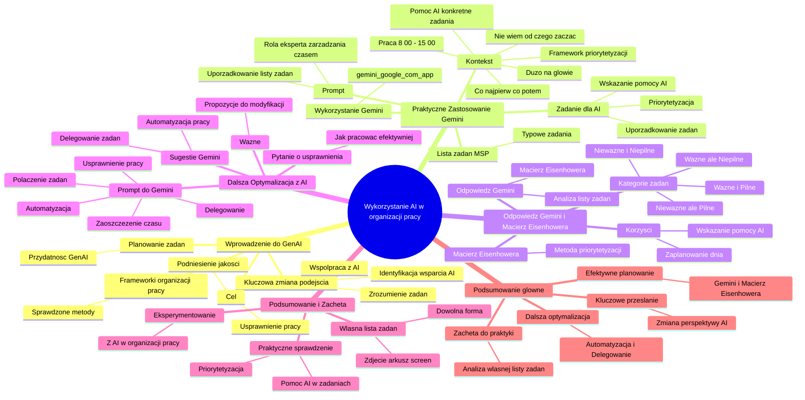

# Sekcja 2. Pomysły na podstawowe wykorzystanie generatywnej AI na przykładzie Gemini - 6. Projektowanie maili

# 💡 Diagram

___

# 🗒️ Notatka

# Notatki i Podsumowanie Wideo o Wykorzystaniu AI

## Wprowadzenie do Generatywnej AI

*   W dyskusjach o AI często pojawia się pytanie: **„Jak generatywna AI może nam pomóc?”**
*   Kluczowa zmiana w podejściu do AI:
    *   **Nie chodzi o poszukiwanie na siłę zastosowań** dla GenAI.
    *   **Kluczem jest zrozumienie własnych zadań** i zidentyfikowanie obszarów, w których AI może być wsparciem.
    *   **Współpraca z AI** ma na celu uproszczenie, przyspieszenie i podniesienie jakości pracy.
*   **Cel:** Usprawnienie i podniesienie jakości pracy, a nie wymuszone szukanie zastosowań dla AI.
*   **Wykorzystanie sprawdzonych frameworków organizacji pracy** jest niezwykle istotne.
*   Generatywna AI jest **bardzo przydatna w planowaniu zadań**.

## Praktyczne Zastosowanie Gemini w Planowaniu Zadań

*   **Praktyczne testowanie** wykorzystania AI w organizacji pracy.
*   Przygotowana **lista zadań typowa dla MŚP**.
*   Zadanie dla AI (Gemini):
    *   Wskazanie zadań, w których AI może pomóc.
    *   Uporządkowanie i ustalenie priorytetów zadań dla zwiększenia efektywności.
*   **Wykorzystanie Gemini** (gemini.google.com/app):
    *   Wprowadzenie **promptu**: „Wciel się w rolę eksperta zarządzania czasem i pomóż mi usystematyzować załączoną listę zadań.”
    *   Dodanie **kontekstu**:
        *   „Mam dziś bardzo dużo na głowie i nie wiem, od czego zacząć.”
        *   „Co powinienem zrobić najpierw, a co może poczekać?”
        *   „Wykorzystaj proszę skuteczny framework do priorytetyzacji.”
        *   „Pracę zaczynam o 8:00 i chciałbym uporać się z obowiązkami do 15:00.”
        *   „Podpowiedz, z którym zadaniem i w jaki sposób możesz mi pomóc.”
    *   Załączenie listy zadań (niewidoczna w materiale).
    *   Wysłanie zapytania do Gemini.

## Odpowiedź Gemini i Macierz Eisenhowera

*   **Odpowiedź Gemini**:
    *   Analiza listy zadań.
    *   Zaproponowanie **Macierzy Eisenhowera** jako metody priorytetyzacji.
    *   Podział zadań na cztery kategorie:
        *   **Ważne i Pilne**
        *   **Ważne, ale Niepilne**
        *   **Nieważne, ale Pilne**
        *   **Nieważne i Niepilne**
    *   Dodatkowe wskazówki (nieujęte w materiale).
*   **Korzyści z odpowiedzi Gemini**:
    *   **Zaplanowanie dnia pracy** z użyciem frameworku.
    *   **Wskazanie zadań, w których AI może być pomocne** i sposobu tej pomocy – **szczególnie interesujące i wartościowe** dla użytkownika.

## Dalsza Optymalizacja z AI

*   **Pytanie o dalsze usprawnienia**: „Jak mogę pracować jeszcze efektywniej?”
*   **Prompt do Gemini**: „Jak mogę usprawnić moją pracę? Czy da się coś połączyć, zautomatyzować lub komuś zlecić? Jak mogę zaoszczędzić czas 🕰️?”
*   **Odpowiedź Gemini (sugestie)**:
    *   **Automatyzacja pracy**.
    *   **Delegowanie zadań**.
*   **Ważne**: Sugestie Gemini są **propozycjami** – można je modyfikować i dopasowywać do indywidualnych potrzeb.

## Podsumowanie i Zachęta

*   **Konieczność użycia własnej listy zadań** – w dowolnej formie (zdjęcie, arkusz kalkulacyjny, screen).
*   **Praktyczne sprawdzenie, jak AI może pomóc w zadaniach i ich priorytetyzacji** na własnych przykładach.
*   **Zachęta do eksperymentowania** z AI w organizacji pracy.

## Podsumowanie

Materiał wideo prezentuje praktyczne zastosowanie generatywnej AI, konkretnie narzędzia Gemini, w organizacji pracy. Kluczowym przesłaniem jest zmiana perspektywy na AI: zamiast na siłę szukać zastosowań, należy skupić się na identyfikacji zadań, w których AI może realnie usprawnić pracę, podnosząc jej jakość i tempo. Wideo demonstruje, jak z pomocą Gemini i **Macierzy Eisenhowera** można efektywnie planować dzień, priorytetyzować zadania i wskazywać obszary, gdzie AI może wspierać realizację obowiązków. Sugeruje również dalszą optymalizację poprzez automatyzację i delegowanie zadań. Głównym celem jest zachęcenie do praktycznego wykorzystania AI w codziennej pracy, zaczynając od analizy własnej listy zadań.

___

# 🔉 Transcript
File: Sekcja 2. Pomysły na podstawowe wykorzystanie generatywnej AI na przykładzie Gemini - 6. Projektowanie maili.mp4 
[00:00:05] W różnych rozmowach na temat wykorzystania AI, praktycznie zawsze wracamy do tego pytania.
[00:00:10] Okej, ale w czym tak naprawdę generatywne AI może nam pomóc?
[00:00:15] I tutaj jest ważna kwestia dotycząca zmiany myślenia o wykorzystaniu tych narzędzi.
[00:00:20] Nie chodzi tak bardzo o to, do czego możemy wykorzystać GenAI i szukanie na siłę use case'ów, ale raczej o zrozumienie, jakie zadania wykonujemy na co dzień i zastanowienie się, wspólnie z AI, w których z nich może nam pomóc oraz w jaki sposób.
[00:00:35] Czyli ponownie, nie szukamy na siłę use case'ów, ale uproszczenia, przyśpieszenia i zwiększenia jakości wykonywania swoich zadań.
[00:00:43] I teraz do planowania swoich zadań warto wykorzystywać nie przypadkowe podejścia, ale raczej sprawdzone frameworki organizacji swojej pracy.
[00:00:52] I w tym generatywne AI też jest bardzo dobre.
[00:00:56] Przetestujmy więc to w praktyce.
[00:00:58] Przygotowałem sobie listę zadań, które osoba pracująca w MŚP mogłaby mieć do wykonania.
[00:01:04] I poproszę AI o wskazanie, w których z tych zadań może mi pomóc oraz o ich poukładanie i priorytetyzację, tak żebym efektywniej pracował.
[00:01:13] (Ekran: wyświetlona strona gemini.google.com/app. Po lewej stronie znajduje się menu z opcjami: "Nowy czat", "Ostatnie", "Gemy", "Menedżer Gemów", "Pomoc", "Aktywność", "Ustawienia". Po prawej stronie widnieje napis "Cześć, Specjalisto" oraz pole tekstowe z napisem "Zapytaj Gemini".)
[00:01:13] Więc przechodzimy do Gemini i wpisujemy prompt.
[00:01:17] Wciel się w rolę eksperta od zarządzania czasem i pomóż mi uporządkować załączoną listę zadań.
[00:01:25] Mam dzisiaj mnóstwo rzeczy na głowie i nie wiem od czego zacząć.
[00:01:29] Co mam zrobić najpierw, a co może poczekać?
[00:01:33] Teraz dodaje mu kontekst i proszę, wykorzystaj dobry framework do priorytetyzacji.
[00:01:39] Dzień zaczynam o 8:00 i chciałbym wyrobić się z obowiązkami do godziny 15:00.
[00:01:45] W kolejnym kroku, podpowiedz mi z którym zadaniem i w jaki sposób możesz mi pomóc, czyli to o czym mówiliśmy na początku.
[00:01:53] I teraz ważne, żeby powiedzieć w kolejnym kroku, bo chcemy, żeby AI osobno odpowiedział nam na te dwie rzeczy.
[00:01:59] Na koniec oczywiście załączamy wspaniałą listę zadań.
[00:02:03] I wysyłamy.
[00:02:06] (Ekran: Gemini Advanced wyświetla odpowiedź na zadane pytanie. Na górze znajduje się wpisane zapytanie. Poniżej, Gemini analizuje listę zadań i proponuje użycie macierzy Eisenhowera. Następnie, Gemini dzieli listę zadań na cztery kategorie: "Ważne i Pilne", "Ważne, ale Niepilne", "Nieważne, ale Pilne", "Nieważne i Niepilne". Podaje również dodatkowe wskazówki.)
[00:02:06] Dostajemy już odpowiedź i jak widzimy Gemini świetnie sobie poradziło z zaplanowaniem mojego dnia, wykorzystując framework do priorytetyzacji.
[00:02:15] To pomocne wskazówki, ale to co tutaj jest, dla mnie przynajmniej szczególnie interesujące i z czego korzystam na co dzień, to jest wskazanie z jakimi zadaniami AI i w jaki sposób właśnie może nam pomóc.
[00:02:27] Ale sprawdźmy co jeszcze można z tym zrobić.
[00:02:30] Może spytajmy co można zrobić jeszcze lepiej.
[00:02:33] Poprośmy więc Gemini o wykonanie kolejnego zadania.
[00:02:38] Zastanów się, jak mogę to zrobić, jak mogę zrobić to wszystko jeszcze sprawniej.
[00:02:44] Może da się coś połączyć, zautomatyzować albo komuś zlecić.
[00:02:50] Jak zaoszczędzić czas?
[00:02:56] Trochę wracamy do tego pytania, jak w zasadzie AI może to pomóc.
[00:03:01] I widzimy kilka ciekawych rozwiązań na automatyzację naszej pracy i delegowanie zadań.
[00:03:06] To jednak tylko propozycja, którą oczywiście możecie dowolnie modyfikować i dostosowywać do swoich potrzeb.
[00:03:13] Co teraz?
[00:03:14] Koniecznie użyj swojej listy zadań.
[00:03:17] Bez względu na to, w jakiej jest formie.
[00:03:19] Czy jest to zdjęcie, czy arkusz, może screen z listy zadań.
[00:03:25] I dowiedz się, jak AI może ci pomóc w twoich zadaniach i jak może ci pomóc w ich priorytetyzacji.
[00:31:30] (Ekran: logo "Umiejętności Jutra AI" oraz logotypy organizatorów: Google, SGH i Ministerstwo Cyfryzacji.)

___
# 🏷️ Tags
#generatywna_AI #AI #sztuczna_inteligencja #GenAI #planowanie_zadań #organizacja_pracy #efektywność #produktywność #MŚP #Gemini #Google_Gemini #prompt #zarządzanie_czasem #priorytetyzacja #Macierz_Eisenhowera #automatyzacja_pracy #delegowanie_zadań #usprawnienie_pracy #optymalizacja #framework #use_case #wskazówki #praktyczne_zastosowanie #eksperymentowanie #lista_zadań #zadania #obowiązki #wsparcie_AI #jakość_pracy #tempo_pracy #analiza_zadań #sugestie #propozycje #dostosowanie_do_potrzeb #umiejętności_jutra_AI
