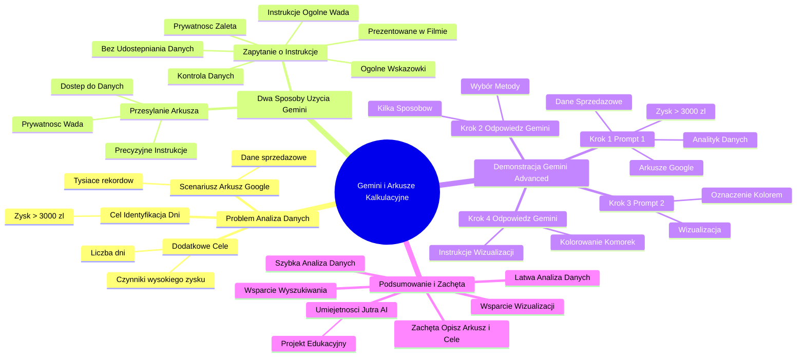

# Sekcja 2. Pomysły na podstawowe wykorzystanie generatywnej AI na przykładzie Gemini - 7. Tworzenie formuł

# 💡 Diagram

___

# 🗒️ Notatka

# Notatki i Podsumowanie Wideo: Gemini i Arkusze Kalkulacyjne

## Wprowadzenie

Ten film demonstruje, jak **Gemini** może efektywnie wspierać korzystanie z arkuszy kalkulacyjnych, takich jak Arkusze Google. Głównym celem jest ukazanie, jak szybko i łatwo analizować dane, nawet bez zaawansowanej wiedzy o formułach i funkcjach arkuszy kalkulacyjnych.

## Problem: Analiza Danych Sprzedażowych w Arkuszach Google

- **Scenariusz:** Dysponujemy obszernym arkuszem Google zawierającym dane sprzedażowe (tysiące rekordów).
- **Cel:** Sprawna identyfikacja dni, w których zysk przekroczył określoną wartość, na przykład 3000 zł.
- **Dodatkowe Cele:**
    - Ustalenie liczby takich dni.
    - Zrozumienie czynników wpływających na wysoki zysk w tych dniach.

## Dwa Sposoby Wykorzystania Gemini

Istnieją dwie podstawowe metody wykorzystania **Gemini** do analizy danych z arkuszy kalkulacyjnych:

1. **Przesyłanie Arkusza Danych do Gemini:**
    - Opcja przesłania kompletnego arkusza z danymi sprzedażowymi bezpośrednio do **Gemini**.
    - Możliwość poproszenia **Gemini** o przeprowadzenie krok po kroku przez proces analizy.
    - **Zaleta:** **Gemini** uzyskuje bezpośredni dostęp do danych, co umożliwia dostarczanie precyzyjnych i spersonalizowanych instrukcji.
    - **Potencjalna Wada:** Zagadnienia związane z prywatnością i bezpieczeństwem danych – niektórzy użytkownicy mogą mieć obawy dotyczące udostępniania danych zewnętrznemu narzędziu.

2. **Zapytanie o Instrukcje Bez Udostępniania Danych:**
    - Opcja zwrócenia się do **Gemini** o ogólne wskazówki, jak samodzielnie przeprowadzić analizę w Arkuszach Google.
    - **Zaleta:** Większa kontrola nad danymi i ochrona prywatności, dane pozostają w arkuszu użytkownika.
    - **Wada:** Instrukcje mogą być nieco bardziej ogólne, lecz nadal bardzo przydatne.
    - **Ta opcja jest prezentowana w filmie.**

## Demonstracja Użycia Gemini Advanced (Opcja nr 2)

### Krok 1: Uruchomienie Gemini Advanced i Sformułowanie Zapytania (Promptu)

- Użytkownik korzysta z **Gemini Advanced**.
- Wprowadza **prompt** (zapytanie) do **Gemini**, wcielając się w rolę analityka analizującego arkusz danych sprzedażowych z ostatniego roku.
- **Prompt 1:**
    > Jestem analitykiem i analizuję arkusz z danymi sprzedażowymi z ostatniego roku. Chciałbym szybko odnaleźć daty, w których zysk przekroczył 3000 zł. Jak mogę to zrobić w Arkuszach Google?

### Krok 2: Odpowiedź Gemini i Wybór Metody

- **Gemini** proponuje **kilka sposobów** na zlokalizowanie komórek spełniających kryteria (zysku powyżej 3000 zł).
- Użytkownik może wybrać metodę, która wydaje się najprostsza lub najbardziej odpowiednia do jego potrzeb.

### Krok 3: Kolejne Zapytanie o Wizualizację Danych

- Użytkownik pragnie **wizualnie wyróżnić** znalezione daty w arkuszu, aby ułatwić ich identyfikację.
- Formułuje **kolejny prompt** dotyczący wizualizacji.
- **Prompt 2:**
    > Jak mogę wizualnie oznaczyć te daty kolorem w arkuszu?

### Krok 4: Odpowiedź Gemini z Instrukcjami Wizualizacji

- **Gemini** dostarcza **szczegółowe instrukcje**, jak wizualnie zmodyfikować arkusz.
- Te instrukcje umożliwiają łatwe odnalezienie i zaznaczenie istotnych danych poprzez **pokolorowanie komórek**.

## Podsumowanie i Zachęta do Działania

- **Gemini** umożliwia **łatwą i szybką analizę danych** w arkuszach kalkulacyjnych, nawet dla osób bez specjalistycznej wiedzy.
- Możliwe jest uzyskanie wsparcia w **wyszukiwaniu konkretnych danych** oraz ich **wizualizacji**.
- **Zachęta:** Użytkowników zachęca się do opisywania swoich arkuszy i celów analizy generatywnej AI (**Gemini**), aby otrzymać wskazówki, jak lepiej zrozumieć posiadane dane.
- **Umiejętności Jutra AI:** Projekt edukacyjny (logo widoczne na końcu) związany z rozwojem umiejętności cyfrowych i AI, wspierany przez Google, SGH i Ministerstwo Cyfryzacji.

## Kluczowe Punkty Podsumowania

- **Gemini** wspomaga analizę arkuszy kalkulacyjnych.
- Dwa sposoby użycia: z przesłaniem danych lub bez.
- Demonstracja na przykładzie wyszukiwania dni z zyskiem powyżej 3000 zł i wizualizacji tych dni.
- **Gemini** oferuje instrukcje krok po kroku.
- Upraszcza analizę danych dla osób bez specjalistycznej wiedzy.
- Zachęta do wykorzystania **Gemini** w celu lepszego zrozumienia własnych danych w arkuszach.

___

# 🔉 Transcript
File: Sekcja 2. Pomysły na podstawowe wykorzystanie generatywnej AI na przykładzie Gemini - 7. Tworzenie formuł.mp4 
[00:00:05] Teraz dowiesz się jak Gemini może ci pomóc w korzystaniu z arkuszy kalkulacyjnych.
[00:00:10] Na przykład gdy wiesz jakich danych szukasz, ale nie wiesz jak je efektywnie wyciągnąć lub po prostu jaką formułę wykorzystać.
[00:00:17] Wyobraź sobie, że masz przed sobą arkusz Google z danymi sprzedażowymi, ale lista jest bardzo długa, kilka tysięcy rekordów.
[00:00:24] A my chcemy po prostu szybko zidentyfikować dni, w których zysk przekroczył, na przykład 3000 zł.
[00:00:30] Albo mieć zrozumienie ile takich dni było, a potem postarać się lepiej zrozumieć co na to wpłynęło.
[00:00:36] Możemy to zadanie wykonać na dwa sposoby.
[00:00:38] Albo wrzucając do Gemini cały arkusz z danymi sprzedażowymi i poprosić go o przeprowadzenie nas przez cały proces krok po kroku jak to zrobić.
[00:00:47] Lub, jeśli nie chcemy wrzucać naszych danych sprzedażowych do Gemini, możemy poprosić o instrukcję jak samodzielnie to zrobić.
[00:00:55] Teraz sprawdźmy tą drugą opcję.
[00:00:57] (Ekran: Na ekranie laptopa widoczna jest strona internetowa Gemini Advanced. Po lewej stronie ekranu znajduje się menu z opcjami "Nowy czat", "Ostatnie", "Gemy", "Menedżer Gemów", "Pomoc", "Aktywność", "Ustawienia". Po prawej stronie widnieje napis "Cześć, Specjalisto", a pod nim pole tekstowe z możliwością wpisania wiadomości.)
[00:00:58] Jesteś analitykiem i przeglądasz arkusz z danymi sprzedażowymi z ostatniego roku.
[00:01:04] (Ekran: Na ekranie laptopa widoczna jest strona internetowa Gemini Advanced. Po lewej stronie ekranu znajduje się menu z opcjami "Nowy czat", "Ostatnie", "Gemy", "Menedżer Gemów", "Pomoc", "Aktywność", "Ustawienia". Po prawej stronie widnieje napis "Cześć, Specjalisto", a pod nim pole tekstowe z możliwością wpisania wiadomości.)
[00:01:05] Chciałbym szybko znaleźć daty, w których zysk osiągnął powyżej 3000 zł.
[00:01:10] Zaproponuj, jak mogę to zrobić w arkuszach Google.
[00:01:13] (Ekran: Na ekranie laptopa widoczna jest strona internetowa Gemini Advanced. Po lewej stronie ekranu znajduje się menu z opcjami "Nowy czat", "Ostatnie", "Gemy", "Menedżer Gemów", "Pomoc", "Aktywność", "Ustawienia". Po prawej stronie widnieje napis "Cześć, Specjalisto", a pod nim pole tekstowe z możliwością wpisania wiadomości, oraz wysłana wiadomość.)
[00:01:15] Teraz jak widzimy Gemini podał nam kilka sposobów na znalezienie odpowiednich komórek.
[00:01:20] I możecie wybrać takie, które najbardziej wam odpowiada albo wydaje się po prostu najprostsze.
[00:01:26] (Ekran: Na ekranie laptopa widoczna jest strona internetowa Gemini Advanced. Po lewej stronie ekranu znajduje się menu z opcjami "Nowy czat", "Ostatnie", "Gemy", "Menedżer Gemów", "Pomoc", "Aktywność", "Ustawienia". Po prawej stronie widnieją instrukcje od Gemini.)
[00:01:27] A co jeśli chciałbym zrobić coś innego?
[00:01:29] Na przykład wizualnie oznaczyć i wyróżnić komórki z tym wyższym zyskiem.
[00:01:34] Mogę wpisać kolejny prompt.
[00:01:36] Jak mogę wizualnie oznaczyć te daty w arkuszu kolorem?
[00:01:41] (Ekran: Na ekranie laptopa widoczna jest strona internetowa Gemini Advanced. Po lewej stronie ekranu znajduje się menu z opcjami "Nowy czat", "Ostatnie", "Gemy", "Menedżer Gemów", "Pomoc", "Aktywność", "Ustawienia". Po prawej stronie widnieją instrukcje od Gemini.)
[00:01:41] No i otrzymałem dokładną instrukcję jak wizualnie dostosować arkusz, dzięki czemu będę mógł w łatwy sposób odnaleźć interesujące mnie dane i zaznaczyć konkretne komórki.
[00:01:52] Co dalej?
[00:01:53] Na pewno macie jakiś arkusz albo dane, które chcielibyście lepiej zrozumieć.
[00:01:57] Opiszcie generatywnej AI jak ten arkusz wygląda i co chcielibyście zrozumieć i niech wskaże wam jak możecie to zrobić.
[00:02:03] (Ekran: Logo "Umiejętności Jutra AI" z logotypami Google, SGH i Ministerstwa Cyfryzacji.)

___
# 🏷️ Tags
#Gemini #arkusze-kalkulacyjne #arkusze_google #analiza-danych #dane-sprzedażowe #zysk #wizualizacja-danych #instrukcje #prompt #Gemini_Advanced #analityk #formuły #funkcje #prywatność #bezpieczeństwo_danych #wskazówki #krok-po-kroku #wyszukiwanie-danych #kolorowanie-komórek #Umiejętności_Jutra_AI #AI #sztuczna_inteligencja #uczenie_maszynowe #analiza_generatywna_AI #prompt_engineering
