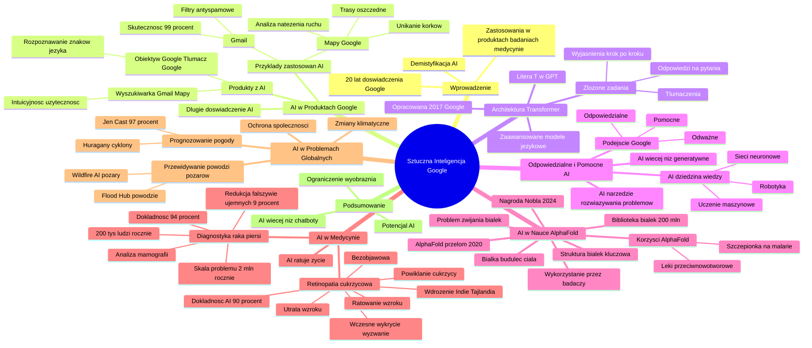

# Sekcja 3. Szersze spojrzenie na AI i bezpieczeństwo - 1. Co poza chatbotami

# 💡 Diagram

___

# 🗒️ Notatka

# Sztuczna Inteligencja w Google: Szczegółowe Notatki i Podsumowanie

## Wprowadzenie

Prezentacja Olgi Sztuby z Google omawia sztuczną inteligencję (`AI`) i jej zastosowania, koncentrując się na osiągnięciach i podejściu Google do tej technologii. Celem prezentacji jest demistyfikacja `AI`, ukazanie jej jako narzędzia rozwijanego przez Google od ponad 20 lat, które znajduje zastosowanie w wielu codziennych produktach, przełomowych badaniach naukowych i medycynie.

## Sztuczna Inteligencja w Produktach Google - Długoletnie Doświadczenie

*   **Początki `AI` w Google:** Sztuczna inteligencja nie jest dla Google nowością. Firma rozwija ją już od ponad 20 lat.
*   **Produkty wykorzystujące `AI`:** Wiele popularnych produktów Google korzysta z `AI`:
    *   **Obiektyw Google, Tłumacz Google:** Wykorzystanie systemów uczących się do rozpoznawania znaków i języka.
    *   **Wyszukiwarka Google, Gmail, Mapy:** Elementy `AI` sprawiają, że te narzędzia stają się bardziej intuicyjne i użyteczne dla miliardów użytkowników.
*   **Przykłady zastosowań `AI` w produktach Google:**
    *   **Mapy Google:**
        *   Analiza natężenia ruchu drogowego w czasie rzeczywistym.
        *   Pomoc w unikaniu korków oraz wyszukiwanie tras oszczędnych paliwowo i przyjaznych dla środowiska.
    *   **Gmail:**
        *   Filtry antyspamowe oparte na `AI`.
        *   Skuteczność filtrów antyspamowych na poziomie 99% – wychwytywanie niechcianych i niebezpiecznych wiadomości e-mail 📧.

## Architektura Transformer - Podstawa Sukcesu `AI`

*   **Transformer:** Architektura opracowana przez inżynierów Google w 2017 roku.
*   **Znaczenie Transformera:** Umożliwił stworzenie zaawansowanych modeli językowych zdolnych do rozwiązywania złożonych zadań, takich jak:
    *   Tłumaczenia między językami.
    *   Odpowiedzi na trudne pytania.
    *   Szczegółowe wyjaśnianie rozwiązań krok po kroku.
*   **Powiązanie z GPT:** Litera "T" w skrócie GPT pochodzi od architektury `Transformer`.

## Odpowiedzialne i Pomocne `AI` od Google

*   **Podejście Google do `AI`:** Tworzenie technologii w sposób:
    *   Odpowiedzialny.
    *   Odważny.
    *   Pomocny dla każdego.
*   **`AI` to więcej niż technologie generatywne:** `AI` to szeroka dziedzina wiedzy, wykraczająca poza generowanie tekstu czy obrazów.
*   **`AI` jako dziedzina wiedzy:** Analogia do biologii – `AI` to rozległa dziedzina, obejmująca poddziedziny, takie jak:
    *   Uczenie maszynowe.
    *   Robotyka 🤖.
    *   Sieci neuronowe.
*   **`AI` jako narzędzie:** Przede wszystkim, `AI` jest narzędziem służącym do rozwiązywania problemów, z którymi ludzkość zmaga się od lat, a nawet stuleci.

## `AI` w Nauce - Zmiana Zasad Gry

*   **Białka - Podstawowy Budulec Ciała:**  Pełnią kluczowe funkcje w organizmach żywych.
*   **Struktura Białek:** Zrozumienie trójwymiarowej struktury białek jest kluczowe dla zrozumienia ich działania. Sposób zwijania się białka determinuje jego funkcję, a nieprawidłowe zwijanie może prowadzić do chorób.
*   **Problem Zwijania Białek:** Naukowcy przez 50 lat próbowali przewidzieć sposób zwijania się białek, co stanowiło ogromne wyzwanie.
*   **AlphaFold - Przełom Google DeepMind (2020):** Model `AI`, który rozwiązał problem przewidywania struktury białek.
*   **Biblioteka Białek AlphaFold:** W ciągu kilku miesięcy stworzono bibliotekę 200 milionów struktur białek, obejmującą praktycznie wszystkie znane nauce.
*   **Wykorzystanie AlphaFold:** Baza danych AlphaFold jest wykorzystywana przez ponad milion badaczy na całym świecie w ich pracach.
*   **Nagroda Nobla:** Zespół Google DeepMind pracujący nad AlphaFold otrzymał Nagrodę Nobla w dziedzinie chemii jesienią 2024 roku.
*   **Konkretne Korzyści AlphaFold:** Przyspieszenie prac nad nową szczepionką na malarię oraz postęp w odkrywaniu leków przeciwnowotworowych.

## `AI` Ratujące Życie Tu i Teraz - Medycyna ⚕️

*   **`AI` w Medycynie:** Szczególnie istotne zastosowanie `AI`, przynoszące szybką i wymierną pomoc społeczeństwu.
*   **Retinopatia Cukrzycowa:**
    *   Powikłanie cukrzycy i jedna z głównych przyczyn utraty wzroku 👀.
    *   Rozwija się niemal bezobjawowo.
    *   Wczesne wykrycie stanowi wyzwanie, zwłaszcza w miejscach o ograniczonym dostępie do specjalistów.
*   **`AI` w Diagnostyce Retinopatii Cukrzycowej:** `AI` potrafi wykrywać retinopatię cukrzycową z ponad 90% dokładnością, dorównując, a nawet przewyższając ludzkich ekspertów.
*   **Wdrożenie Algorytmów Google:** Algorytmy `AI` do diagnostyki retinopatii są stosowane w Indiach i Tajlandii, gdzie dostęp do specjalistów jest ograniczony.
*   **Efekt Wdrożenia:** Tysiące przypadków wczesnej diagnozy i szansa na uratowanie wzroku.
*   **Diagnostyka Raka Piersi:** `AI` wspiera również diagnostykę raka piersi poprzez analizę mamografii.
*   **Dokładność `AI` w Diagnostyce Raka Piersi:** Technologia Google osiąga 94% dokładności, wspomagając lekarzy w wykrywaniu nawet najmniejszych zmian.
*   **Zmniejszenie Fałszywie Ujemnych Wyników Mamografii:** `AI` zredukowało liczbę wyników fałszywie ujemnych o 9%.
*   **Skala Problemu Raka Piersi:** Rak piersi jest diagnozowany u 2 milionów osób rocznie na świecie.
*   **Wpływ 9% Redukcji Fałszywie Ujemnych Wyników:** 9% to blisko 200 tysięcy osób rocznie, co odpowiada populacji miasta wielkości Torunia lub Radomia.

## `AI` w Walce z Problemami Globalnymi 🌍

*   **Zmiany Klimatyczne:** `AI` wspiera walkę z globalnymi problemami związanymi ze zmianami klimatycznymi.
*   **Przewidywanie Powodzi i Pożarów Lasów:**
    *   **Flood Hub:** Narzędzie pomagające prognozować powodzie z wyprzedzeniem.
    *   **Wildfire `AI`:** Lokalizuje zagrożenia pożarowe zanim się rozprzestrzenią.
*   **Prognozowanie Pogody ☀️:**
    *   **Jen Cast:** Najnowszy model Google prognozuje pogodę z dokładnością do 97%.
    *   **Zastosowanie Jen Cast:** Kluczowe znaczenie przy przewidywaniu huraganów i cyklonów tropikalnych.
*   **Ochrona Społeczności:** Narzędzia `AI` nie tylko ratują życie, ale także chronią całe społeczności przed katastrofami.

## Zakończenie

*   **`AI` to Więcej Niż Chatboty:** Podkreślenie, że `AI` to znacznie więcej niż tylko chatboty i generatywna sztuczna inteligencja.
*   **Potencjał `AI`:** `AI` to narzędzie dające szansę na rozwiązanie problemów, które jeszcze niedawno wydawały się nie do pokonania.
*   **Ograniczenie `AI`:** Jedynym ograniczeniem w wykorzystaniu `AI` jest ludzka wyobraźnia i pomysłowość w aplikowaniu tej technologii.

## Podsumowanie

Prezentacja Olgi Sztuby skutecznie przedstawia sztuczną inteligencję jako dojrzałą i wszechstronną technologię, rozwijaną przez Google od ponad 20 lat. Podkreślono, że `AI` stanowi integralną część wielu codziennych produktów Google, czyniąc je bardziej intuicyjnymi i użytecznymi. Kluczowym elementem prezentacji jest architektura `Transformer`, będąca fundamentem nowoczesnych modeli językowych. Google akcentuje odpowiedzialne i pomocne podejście do `AI`, demonstrując jej zastosowania w nauce (AlphaFold i przewidywanie struktur białek, Nagroda Nobla), medycynie (diagnostyka retinopatii cukrzycowej i raka piersi) oraz w walce z globalnymi problemami (przewidywanie powodzi, pożarów, pogody). Prezentacja kończy się optymistycznym przesłaniem o ogromnym potencjale `AI` jako narzędzia do rozwiązywania największych wyzwań ludzkości, gdzie jedynym ograniczeniem jest ludzka wyobraźnia. Sztuczna inteligencja jest prezentowana nie tylko jako technologia przyszłości, lecz jako realne i działające narzędzie, które już teraz przynosi wymierne korzyści w wielu dziedzinach życia.

___

# 🔉 Transcript
File: Sekcja 3. Szersze spojrzenie na AI i bezpieczeństwo - 1. Co poza chatbotami.mp4 
[00:00:05] Olga Sztuba: Sztuczna inteligencja to hasło, które budzi jednocześnie ekscytację i wiele pytań.
[00:00:09] Ekran: Slajd z napisem "Ponad 20 lat doświadczenia w przełomowym rozwoju sztucznej inteligencji."
[00:00:13] Olga Sztuba: Ale dla nas w Google nie jest niczym nowym, bo od ponad 20 lat pracujemy nad jej rozwojem.
[00:00:14] Ekran: Slajd z napisem "Produkty wykorzystujące AI:" i listą: "Obiektyw Google, Tłumacz Google - rozpoznawanie znaków i języka." oraz "Wyszukiwarka Google, Gmail, Mapy - intuicyjność i przydatność dla miliardów użytkowników."
[00:00:14] Olga Sztuba: Wiele naszych produktów, takich jak obiektyw czy tłumacz Google powstało w oparciu o systemy uczące się, wykorzystujące AI, na przykład do rozpoznawania znaków czy języka.
[00:00:22] Olga Sztuba: Co więcej, wiele codziennych narzędzi, z których prawdopodobnie i wykorzystacie: wyszukiwarka Google, Gmail albo mapy zawierają w sobie elementy sztucznej inteligencji, które sprawiają, że stają się one bardziej intuicyjne i użyteczne dla miliardów ludzi.
[00:00:36] Ekran: Slajd z napisem "Przykłady zastosowań AI:" i listą: "Mapy Google: -Analiza natężenia ruchu. -Unikanie korków i oszczędne trasy."
[00:00:36] Olga Sztuba: AI w Mapach Google analizuje dane, aby przekazywać informacje na temat bieżącego natężenia ruchu i opóźnień, co pozwala uniknąć stania w korkach i pomaga w wyszukiwaniu tras przyjaznych dla środowiska.
[00:00:48] Ekran: Slajd z napisem "Przykłady zastosowań AI:" i listą: "Mapy Google: -Analiza natężenia ruchu. -Unikanie korków i oszczędne trasy." oraz "Gmail: -Filtry antyspamowe- skuteczność na poziomie 99%."
[00:00:48] Olga Sztuba: A w Gmailu stosujemy sztuczną inteligencję do filtrów antyspamowych, bo wychwytuje ona blisko 99% niechcianych lub niebezpiecznych maili.
[00:00:56] Olga Sztuba: Podstawą aktualnego sukcesu w AI jest architektura Transformer, którą nasi inżynierowie w Google opracowali w 2017 roku.
[01:04] Olga Sztuba: To dzięki niej możliwe jest tworzenie zaawansowanych modeli językowych, które rozwiązują złożone zadania.
[01:09] Olga Sztuba: Od tłumaczeń między językami, przez odpowiedzi na trudne pytania, aż po szczegółowe wyjaśnianie swoich rozwiązań krok po kroku.
[01:16] Olga Sztuba: Dodam na ucho, że to z Transformera wywodzi się literka T w skrócie GPT.
[01:23] Olga Sztuba: W Google nasze podejście do AI jest jasne.
[01:25] Olga Sztuba: Tworzymy tą technologię w sposób odpowiedzialny, odważny i chcemy, aby była pomocna dla każdego.
[01:31] Olga Sztuba: Ale co to właściwie oznacza w praktyce?
[01:34] Olga Sztuba: To nie tylko technologie generatywne, które mogą tworzyć teksty czy obrazy.
[01:39] Olga Sztuba: Sztuczna inteligencja to duża dziedzina wiedzy, w ramach której jest wiele różnych poddziedzin.
[01:43] Olga Sztuba: Tak jak biologia jest dużą dziedziną nauki, w ramach której mieści się genetyka, mykologia, zoologia albo botanika, tak samo w ramach sztucznej inteligencji mamy uczenie maszynowe, robotykę albo sieci neuronowe.
[01:56] Olga Sztuba: Przede wszystkim AI to narzędzie do rozwiązywania problemów, z którymi ludzkość zmaga się od lat.
[02:01] Olga Sztuba: Czasem nawet od stuleci.
[02:03] Olga Sztuba: Zacznijmy może od świata nauki, w którym sztuczna inteligencja zmienia zasady gry.
[02:07] Ekran: Zdjęcie struktury białka.
[02:08] Olga Sztuba: Weźcie białko, podstawowy budulec naszego ciała.
[02:11] Olga Sztuba: Coś co wykonuje wszystkie kluczowe funkcje w organizmach żywych.
[02:14] Olga Sztuba: Żeby zrozumieć jak działają białka, musimy znać ich trójwymiarową strukturę.
[02:18] Olga Sztuba: Musimy wiedzieć jak się zwijają, bo to determinuje ich funkcję.
[02:23] Olga Sztuba: Nieprawidłowo zwinięte białko może powodować choroby.
[02:26] Olga Sztuba: Przez 50 lat naukowcy próbowali przewidzieć sposób zwijania się białka, aby pomóc w zrozumieniu i leczeniu chorób.
[02:33] Olga Sztuba: To wyzwanie zajmowało naukowcom naprawdę całe lata, często stając się tematem całych rozpraw doktorskich, aż do teraz.
[02:41] Olga Sztuba: Bo w 2020 roku laboratorium Google Deep Mind dokonało skoku dziejowego w dziedzinie AI i nauki, wprowadzając model AlphaFold.
[02:50] Olga Sztuba: AlphaFold po prostu rozwiązał problem zwijania się białek.
[02:54] Olga Sztuba: W ciągu zaledwie kilku miesięcy stworzyliśmy bibliotekę obejmującą 200 milionów białek, czyli praktycznie wszystkie znane nauce, obejmujące prawie każdy organizm na planecie.
[03:04] Olga Sztuba: Ponad milion badaczy wykorzystało tę bazę do pracy.
[03:08] Olga Sztuba: A dodam jeszcze, że jesienią 2024 roku kilka miesięcy temu zespół pracujący nad AlphaFold z Google Deep Mind otrzymał nagrodę Nobla w dziedzinie chemii.
[03:18] Olga Sztuba: Dzięki temu między innymi przyśpieszone zostały prace nad nową szczepionką na malarię i dokonany został postęp w odkrywaniu leków przeciwnowotworowych.
[03:26] Olga Sztuba: Ale AI nie tylko wspiera naukę, ale ratuje życie tu i teraz.
[03:30] Olga Sztuba: Opowiem wam o jednym z moich ulubionych zastosowań sztucznej inteligencji.
[03:34] Olga Sztuba: Tam, gdzie może ona pomóc społeczeństwu w najszybszy i najbardziej wymierny sposób, czyli w medycynie.
[03:40] Olga Sztuba: Retinopatia cukrzycowa jest jednym ze skutków ubocznych cukrzycy i jest jednym z głównych przyczyn utraty wzroku.
[03:47] Olga Sztuba: Co gorsza, rozwija się niemal bezobjawowo.
[03:50] Olga Sztuba: Wykrycie jej w odpowiednim momencie to wyzwanie szczególnie w miejscach, gdzie dostęp do specjalistów jest bardzo ograniczony.
[03:56] Ekran: Slajd z napisem "AI może wykrywać retinopatię cukrzycową z ponad 90% dokładnością - dorównując, a nawet przewyższając ludzkich ekspertów."
[03:56] Olga Sztuba: Natomiast badania pokazują, że AI może zidentyfikować zmiany wskazujące na retinopatię cukrzycową z dokładnością przekraczającą 90%, co dorównuje, a często przewyższa zdolności ludzkich ekspertów.
[04:10] Olga Sztuba: Nasze algorytmy stosowane są już w Indiach i Tajlandii, gdzie dostępność do wysoko wyspecjalizowanych diagnostów jest bardzo ograniczona.
[04:18] Olga Sztuba: W praktyce oznacza to tysiące przypadków wczesnej diagnozy i szansę na uratowanie wzroku.
[04:24] Olga Sztuba: Podobnie AI wspiera diagnostykę raka piersi.
[04:27] Olga Sztuba: Dzięki analizie mamografii nasza technologia osiąga 94% dokładności pomagając lekarzom w wychwyceniu nawet najmniejszych zmian, które mogą zadecydować o życiu pacjentów.
[04:38] Ekran: Slajd z napisem "9% to blisko 200 tysięcy ludzi rocznie."
[04:38] Olga Sztuba: AI zmniejszyło o 9% ilość wyników mamografii tak zwanej fałszywie ujemnej, czyli tam, gdzie lekarz nie widział nowotworu, ale sztuczna inteligencja go wykryła.
[04:48] Olga Sztuba: Może 9% to nie brzmi dużo, ale rak piersi jest rocznie diagnozowany u 2 milionów ludzi na świecie.
[04:53] Olga Sztuba: I te 9% to blisko 200 tysięcy ludzi rocznie.
[04:57] Olga Sztuba: Tak jakby rocznie AI mogło ratować przed rakiem piersi miasto rozmiaru Torunia albo Radomia.
[05:03] Olga Sztuba: AI pomaga również w walce z problemami globalnymi.
[05:06] Olga Sztuba: W obliczu zmieniającego się klimatu pozwala przewidzieć powodzie i pożary lasów.
[05:11] Olga Sztuba: Na przykład Flood Hub pomaga prognozować powodzie z wyprzedzeniem, a Wildfire AI lokalizuje zagrożenia związane z pożarami zanim te się rozprzestrzenią.
[05:19] Olga Sztuba: Jen Cast, nasz najnowszy model prognozuje pogodę na poziomie 97%, co może być kluczowe przy przewidywaniu huraganów czy cyklonów tropikalnych.
[05:29] Olga Sztuba: To narzędzia, które nie tylko ratują życie, ale pozwalają chronić całe społeczności przed katastrofami.
[05:34] Olga Sztuba: Na zakończenie chciałabym podkreślić, że AI to coś więcej niż chatboty czy generatywna sztuczna inteligencja.
[05:40] Olga Sztuba: To narzędzie, które daje nam szansę na rozwiązanie problemów, które jeszcze niedawno wydawały się niemożliwe do pokonania, a jedynym ograniczeniem może być nasza wyobraźnia i pomysł jak AI zastosować.

___
# 🏷️ Tags
#sztuczna_inteligencja #AI #Google #Olga_Sztuba #demistyfikacja_AI #produkty_Google #Obiektyw_Google #Tłumacz_Google #Wyszukiwarka_Google #Gmail #Mapy_Google #intuicyjność #użyteczność #natężenie_ruchu #korki #trasy_paliwowe #trasy_ekologiczne #filtry_antyspamowe #architektura_Transformer #modele_językowe #tłumaczenia #GPT #odpowiedzialne_AI #pomocne_AI #technologie_generatywne #uczenie_maszynowe #robotyka #sieci_neuronowe #AI_narzędzie #AI_w_nauce #białka #struktura_białek #zwijanie_białek #choroby #AlphaFold #Google_DeepMind #biblioteka_białek #Nagroda_Nobla #szczepionka_na_malarię #leki_przeciwnowotworowe #AI_w_medycynie #retinopatia_cukrzycowa #utrata_wzroku #diagnostyka_retinopatii #algorytmy_AI #Indie #Tajlandia #diagnostyka_raka_piersi #mamografia #fałszywie_ujemne_wyniki #rak_piersi #AI_w_walce_z_problemami_globalnymi #zmiany_klimatyczne #przewidywanie_powodzi #przewidywanie_pożarów_lasów #Flood_Hub #Wildfire_AI #prognozowanie_pogody #Jen_Cast #huragany #cyklony_tropikalne #ochrona_społeczności #chatboty #potencjał_AI #ograniczenia_AI #ludzka_wyobraźnia #rozwiązywanie_problemów
