# Sekcja 3. Szersze spojrzenie na AI i bezpieczeństwo - 2. Zagadnienia w obszarze bezpieczeństwa i prywatności danych

# 💡 Diagram

```mermaid
graph TD
    A[DataPrivacyAndSecurityInAI] --> B[Introduction]
    A --> C[FundamentalPrinciples]
    A --> D[HowAIToolsUtilizeData]
    A --> E[RisksOfDataDisclosure]
    A --> F[PracticalTipsForSecurity]
    A --> G[DataResponsibilityProfLife]
    A --> H[SummaryAndKeyActions]

    B --> B1[UnderstandingPrivacy]
    B --> B2[UnderstandingSecurity]

    C --> C1[IsItNecessaryAndSecure]
    C --> C2[DataMinimization]
    C --> C3[SensitiveDataExamples]
    C --> C4[ConsequencesSensitiveData]
    C --> C5[PrivacyPoliciesCredibility]

    C3 --> C3_1[NameLastName]
    C3 --> C3_2[AddressDetails]
    C3 --> C3_3[PhoneNumber]
    C3 --> C3_4[MedicalDocuments]
    C3 --> C3_5[CreditCardNumbers]

    C4 --> C4_1[DataBreaches]
    C4 --> C4_2[UnauthorizedUse]
    C4 --> C4_3[Impersonation]
    C4 --> C4_4[Fraud]

    D --> D1[NoUniversalAnswer]
    D --> D2[PrivacyPolicyGuarantees]
    D --> D3[DataUsageExamples]

    D2 --> D2_1[NoAutoShare]
    D2 --> D2_2[NoTrainingWithoutNotice]

    D3 --> D3_1[QueryProcessing]
    D3 --> D3_2[ImprovingResponseQuality]

    D3_1 --> D3_1_1[SolelyForQuery]
    D3_1 --> D3_1_2[NotPublicDB]
    D3_2 --> D3_2_1[EnhanceQuality]
    D3_2 --> D3_2_2[NoIndividualLink]
    D3_2 --> D3_2_3[NoPublicDB]


    E --> E1[DataTheftBreaches]
    E --> E2[IdentityTheft]
    E --> E3[FinancialFraud]
    E --> E4[DataSecurityParamount]

    F --> F1[ReadPrivacyPolicies]
    F --> F2[UsePrivacySettings]
    F --> F3[AvoidSensitiveData]

    F1 --> F1_1[DataCollectedUsage]
    F1 --> F1_2[GeminiExample]
    F2 --> F2_1[ControlOverData]
    F3 --> F3_1[MinimizePrivateData]
    F3 --> F3_2[UseGenericData]

    G --> G1[SeparatePersonalProfessional]
    G --> G2[BusinessDataRegulations]
    G --> G3[BusinessAISolutions]
    G --> G4[GoogleWorkspacePrivacy]

    G2 --> G2_1[DifferentRules]
    G2 --> G2_2[NotYourProperty]
    G3 --> G3_1[AdvancedRules]
    G3 --> G3_2[GoogleCloudVertexAI]
    G4 --> G4_1[NoShareWithoutConsent]
    G4 --> G4_2[NoTraining]

    H --> H1[SecurityPrivacyCrucial]
    H --> H2[ActivelyProtectData]
    H --> H3[UnderstandDataCollection]
    H --> H4[MinimizeRiskDisclosure]
    H --> H5[SimpleStepsProtection]

    H5 --> H5_1[UpdatePasswords2FA]
    H5 --> H5_2[ReviewPrivacySettingsAI]
    H5 --> H5_3[CompanyAIPolicies]
    H5 --> H5_4[ReviewPrivacyDocs]
    H5 --> H5_5[DeleteHistoricalData]

    H5_4 --> H5_4_1[TermsOfService]

```

___

# 🗒️ Notatka

# Notatki i Podsumowanie Transkrypcji Wideo: "Umiejętności Jutra AI" - Prywatność i Bezpieczeństwo Danych w AI

## Wprowadzenie do Prywatności i Bezpieczeństwa w Kontekście `AI`

This lesson addresses **data privacy and security** within the context of using **artificial intelligence (AI)** tools. We frequently use `AI` in our daily lives, often without considering the data we share and the potential consequences. The aim of this lesson is to clarify how `AI` tools utilize user data and how to ensure its security.

### Understanding Privacy and Security

*   **Privacy**: Your **right to control** how your data is:
    *   Collected
    *   Stored
    *   Used
*   **Security**: Protection of data against:
    *   **Unauthorized access**
    *   **Modification**
    *   **Loss**
    *   Prevention of attacks (e.g., data theft, introduction of malicious data into `AI` systems).

## Fundamental Principles of Data Protection and Privacy in `AI`

### Is It Truly Necessary and Secure?

*   Before entering data into any online tools, including `AI`, ask yourself: **"Is this necessary and secure?"**
*   **`AI` tools are not exempt** – the same data security principles apply.

### Data Minimization

*   **Avoid entering unnecessary data** to obtain results or utilize tool functions.
*   **Pay particular attention to personal and sensitive data**:
    *   First and last name
    *   Address details
    *   Phone number
    *   Medical documents
    *   Credit card numbers

### Consequences of Revealing Sensitive Data

*   **Data breaches**
*   **Unauthorized use**
*   **Impersonation**
*   **Fraud**

### Privacy Policies and Data Usage Rules

*   **Familiarize yourself with privacy policies** if providing data is justified and necessary.
*   **If in doubt about credibility?** – Refrain from using the tool and seek alternatives.

## How `AI` Tools Utilize Input Data

### No Universal Answer

*   **Much depends on the developers of the `AI` application.**
*   **Reviewing privacy policies is crucial.**

### Guarantees in Privacy Policies (Minimum)

*   **User data is not automatically shared with other users.**
*   **`AI` models do not use user data for training without proper notification.**

### Examples of Data Usage

*   **Query Processing**: Entered data (e.g., project description) is used **solely to process your query.**
    *   Stored as part of the interaction with the tool.
    *   **Should not be shared with others or end up in public databases.**
*   **Improving Response Quality**: Responsibly trained `AI` models may use user data **to enhance the quality of responses.**
    *   **Without linking data to individual accounts.**
    *   **Without placing data in databases accessible to others.**

## Risks of Data Disclosure and Consequences

*   **Data theft or breaches** – serious repercussions.
*   **Identity theft**
*   **Financial fraud**
*   **Maintaining data security in `AI` applications is paramount.**

## Practical Tips for Data Security in `AI` Applications

### Read Privacy Policies

*   **Check what data is collected and how it is used** before using an `AI` application.
*   **Example: Gemini (Google)**: Explains data retention periods and user data deletion options (information available in the Gemini privacy center).

### Utilize Appropriate Privacy Settings

*   Privacy-respecting applications provide **complete control over your data.**

### Avoid Entering Sensitive Data

*   **Minimize sharing private data** (email, financial details).
*   **Use generic data** that poses no risk if breached.

## Data Responsibility in Professional Life

### Separating Personal and Professional Digital Spheres

*   **Keep personal and professional digital lives separate.**
*   **Do not use personal accounts and applications for business data.**

### Differences in Regulations and Security Requirements

*   **Business data** may be subject to different regulations, not be your property, and require distinct security and privacy rules.
*   **`AI` solutions for business** may have more sophisticated data collection and processing rules than consumer-grade applications.
*   **Example: Google Cloud Vertex `AI`** – advanced methods for data sovereignty control.

### Privacy of Generative `AI` in Google Workspace

*   **Google Workspace (Gmail, Google Docs, Sheets, Drive, Calendar)**:
    *   Content (emails, documents) **is not shared without consent.**
    *   Applies to Google Workspace products **for personal and business use.**
    *   **Data remains within Workspace and is not used for training or improving generative `AI`.**

## Summary and Key Actions

### Security and Privacy are Crucial in `AI`

*   **Actively protect your data** as users.
*   **Understand how `AI` tools collect and use data.**
*   **Minimize the risk of losing control and unwanted data disclosure.**

### Simple and Quick Steps for Enhanced Data Protection

*   **Update passwords and enable two-factor authentication.**
    *   **Protecting digital identity is a priority.**
*   **Review privacy settings in `AI` applications and disable unnecessary data collection features.**
*   **Learn about your company's `AI` policies and adhere to them.**
*   **Review privacy documentation before using new `AI` tools.**
    *   **Familiarize yourself with the privacy policy and terms of service.**
    *   **Understand what data is collected and how it is used.**
*   **Regularly delete historical data.**
    *   **In the data management section of `AI` applications, remove unnecessary conversations, data, and activities.**
    *   **Limit the amount of information stored about you.**

## Transcription Summary

The video transcription "Umiejętności Jutra `AI`" addresses critical aspects of **data privacy and security in the context of artificial intelligence tools**. The speaker clarifies the definitions of privacy and security, emphasizing the user's right to control their data and the necessity of its protection.

A key point is **data minimization** when entering information into `AI` tools, especially sensitive data. The **importance of reading privacy policies** and **verifying the credibility of `AI` application providers** is highlighted.

The transcription explains that **data usage by `AI` depends on application developers**, but privacy policies should guarantee that data is not automatically shared with other users and is not used for training `AI` models without notification. Data may be used for query processing and improving response quality, while adhering to privacy principles.

The risks of **data breaches and serious consequences**, such as identity theft, are pointed out. **Practical tips for data protection** are presented: reading privacy policies, using privacy settings, and avoiding sensitive data.

The **difference in data responsibility in personal and professional life** is emphasized, recommending the separation of these digital spheres and the use of appropriate solutions (e.g., Google Workspace for business with privacy assurances).

Finally, the speaker lists **simple actions** to strengthen data security, such as updating passwords, verifying privacy settings, understanding privacy policies, and regularly deleting historical data.

The main message is to **actively care for data privacy and security** in the `AI` era by consciously using tools, reading privacy policies, and applying data minimization principles.

___

# 🔉 Transcript
File: Sekcja 3. Szersze spojrzenie na AI i bezpieczeństwo - 2. Zagadnienia w obszarze bezpieczeństwa i prywatności danych.mp4 
[00:00:04] (The screen shows a slide with the title "Umiejętności Jutra AI". Below this, there are three logos: Google, SGH, and Minister Cyfryzacji.)
[00:00:05] Speaker: Na co dzień korzystamy z narzędzie AI, ale często nie zastanawiamy się, jakie dane udostępniamy i jakie mogą być tego konsekwencje.
[00:00:12] (The speaker's face is shown in a closer shot.)
[00:00:13] Speaker: W tej lekcji dowiesz się, jak narzędzie AI wykorzystują dane, które wprowadzamy i jak dbać o swoje dane w tych aplikacjach.
[00:00:21] Speaker: Zacznijmy od tego, czym tak właściwie jest prywatność i bezpieczeństwo.
[00:00:25] Speaker: Prywatność to twoje prawo do kontroli nad tym, jak twoje dane są zbierane, przechowywane i wykorzystywane.
[00:00:33] Speaker: Gdy korzystasz z aplikacji AI, wprowadzasz dane, które mogą obejmować twoje imię, lokalizację, historię wyszukiwania czy preferencje.
[00:00:41] Speaker: Bezpieczeństwo oznacza ochronę tych danych przed nieautoryzowanym dostępem, modyfikacją lub utratą.
[00:00:47] Speaker: To także zapobieganie atakom, jak na przykład kradzież danych czy wprowadzenie szkodliwych danych do systemów AI.
[00:00:55] Speaker: Dobrze, przejdźmy teraz do podstawowych zasad, o których powinniśmy pamiętać, chcąc chronić nasze dane i ich prywatność.
[00:01:02] Speaker: Po pierwsze, wprowadzając dane do jakichkolwiek narzędzi udostępnianych w internecie, powinniście zadać sobie pytanie, czy jest to na pewno konieczne i czy jest to bezpieczne.
[00:01:13] Speaker: Narzędzia sztucznej inteligencji nie stanowią tutaj wyjątku.
[00:01:17] Speaker: Nie wprowadzajcie żadnych danych, które nie są niezbędne do uzyskania pożądanego wyniku czy skorzystania z danej funkcjonalności narzędzia.
[00:01:25] Speaker: Zachowajcie szczególną uwagę w przypadku danych osobowych i innych danych wrażliwych, takich jak na przykład imię, nazwisko, dane adresowe, numer telefonu, dokumenty medyczne i numery kart kredytowych.
[00:01:39] Speaker: Dlaczego?
[00:01:40] Speaker: Ponieważ z pewnością nie chcielibyście, aby te dane zostały ujawnione w wycieku lub wykorzystane w innym nieautoryzowany przez was sposób, w tym do podszywania się pod was, czy do innego rodzaju oszustwa.
[00:01:52] Speaker: A co jeżeli podanie takich danych jest uzasadnione i konieczne?
[00:01:56] Speaker: Takie sytuacje mogą się oczywiście zdarzyć.
[00:01:59] Speaker: Wtedy koniecznie zapoznajcie się z politykami prywatności i zasadami wykorzystywania waszych danych.
[00:02:05] Speaker: Jeżeli macie jakiekolwiek wątpliwości co do wiarygodności autorów aplikacji lub treści tych polityk, zrezygnujcie z wykorzystania ich i poszukajcie alternatywnego rozwiązania.
[00:02:16] Speaker: Teraz możemy zadać sobie pytanie, jak w takim razie narzędzia AI wykorzystują dane, które wprowadzamy.
[00:02:23] Speaker: Wiele osób zastanawia się, czy jeśli wprowadzą jakąś informację do narzędzia opartego na AI, ta sama informacja pojawi się później, gdy ktoś inny będzie szukał podobnych odpowiedzi.
[00:02:34] Speaker: To zrozumiałe.
[00:02:35] Speaker: W dobie cyfrowych technologii nie zawsze łatwo jest zrozumieć, co dzieje się z naszymi danymi po ich wprowadzeniu.
[00:02:42] Speaker: Niestety, nie ma na to pytanie uniwersalnej odpowiedzi.
[00:02:45] Speaker: Wiele zależy od twórców aplikacji.
[00:02:48] Speaker: Właśnie dlatego powinniśmy zapoznać się z politykami prywatności, obowiązującymi w stosunku do wykorzystywanych przez nas narzędzi.
[00:02:56] Speaker: To, co dzieje się z naszymi danymi, powinno być w nich dokładnie opisane.
[00:03:01] Speaker: Zasady prywatności powinny gwarantować użytkownikom co najmniej, że ich dane nie są automatycznie udostępniane innym użytkownikom.
[00:03:10] Speaker: A modele AI, które są trenowane na określonych zbiorach danych, nie wykorzystują do tego danych użytkowników bez udostępnienia im odpowiedniej informacji na ten temat.
[00:03:20] Speaker: Co to znaczy?
[00:03:22] Speaker: Po pierwsze, jeśli wprowadzisz jakąś informację do narzędzia AI, na przykład opis projektu lub preferencje, te dane będą używane tylko do przetwarzania twojego zapytania.
[00:03:33] Speaker: Powinny być przechowywane w ramach twojej interakcji z narzędziem AI i nie powinny być udostępniane innym osobom, ani trafiać do publicznych baz danych.
[00:03:42] Speaker: Po drugie, odpowiedzialnie trenowane modele AI mogą zgodnie z polityką prywatności korzystać z danych użytkowników, na przykład do ulepszania jakości odpowiedzi, ale bez łączenia ich z indywidualnym kontem czy umieszczania w bazach danych dostępnych dla innych.
[00:04:00] Speaker: Warto pamiętać, że nasze dane, jeśli nie są odpowiednio chronione, mogą zostać ujawnione na skutek kradzieży lub wycieku.
[00:04:08] Speaker: Jak już wspominałem, może to prowadzić do poważnych konsekwencji, takich jak kradzież tożsamości czy nadużycia finansowe.
[00:04:16] Speaker: Dlatego dbanie o bezpieczeństwo danych w aplikacjach AI jest kluczowe.
[00:04:21] Speaker: Co możecie zrobić w tym zakresie?
[00:04:23] Speaker: Jak mogliście już usłyszeć, czytajcie polityki prywatności.
[00:04:27] Speaker: Przed użyciem jakiejkolwiek aplikacji AI sprawdźcie jakie dane są przez nią zbierane i jak są wykorzystywane.
[00:04:34] Speaker: Przykładowo w aplikacjach takich jak Gemini Google wyjaśnia, że przechowuje dane przez określony czas i pozwala na ich usuwanie.
[00:04:43] Speaker: W prosty sposób możecie zapoznać się z tymi informacjami w centrum prywatności dotyczącymi aplikacji z Gemini.
[00:04:50] Speaker: Kolejna wskazówka to używajcie odpowiednich ustawień prywatności.
[00:04:55] Speaker: Pamiętajcie, że aplikacje stworzone z poszanowaniem prywatności danych pozwalają wam na pełną kontrolę nad tym, co się dzieje z waszymi danymi.
[00:05:04] Speaker: I w końcu unikajcie wprowadzania danych wrażliwych.
[00:05:08] Speaker: Przekazywanie prywatnych danych, takich jak adresy email czy dane finansowe powinno być ograniczone do minimum.
[00:05:15] Speaker: Zamiast tego używajcie ogólnych danych, które w przypadku wycieku nie stanowią zagrożenia.
[00:05:20] Speaker: Przejdźmy teraz do kolejnego aspektu związanego bardziej z naszym życiem zawodowym.
[00:05:25] Speaker: Odpowiedzialność za dane i bezpieczeństwo może bowiem wyglądać inaczej, w zależności od tego, czy jesteś konsumentem, czy reprezentujesz przedsiębiorstwo.
[00:05:35] Speaker: Także w przypadku rozwiązań AI warto trzymać się ogólnie obowiązującej zasady.
[00:05:41] Speaker: W sferze cyfrowej nie mieszać ze sobą życia prywatnego i zawodowego, w szczególności nie wykorzystywać kont prywatnych i powiązanych z nimi aplikacji do przetwarzania danych biznesowych.
[00:05:53] Speaker: Dlaczego?
[00:05:53] Speaker: Dane biznesowe mogą podlegać zupełnie innym regulacją, nie stanowić twojej własności i wymagać innych zasad bezpieczeństwa i prywatności niż dane prywatne.
[00:06:04] Speaker: W szczególności rozwiązania AI przeznaczone do zastosowań biznesowych mogą posiadać inne zasady gromadzenia i przetwarzania danych, zwykle bardziej zaawansowane niż rozwiązania konsumenckie.
[00:06:16] Speaker: Przykładem może być rozwiązanie Google Cloud Vertex AI, obejmujące zaawansowane metody kontroli suwerenności danych.
[00:06:23] Speaker: Aby zrozumieć tę różnicę, skupmy się na chwilę na zasadach prywatności dotyczących generatywnej AI w Google Workspace.
[00:06:32] Speaker: Zaprojektowaliśmy naszą technologię w taki sposób, aby treści, takie jak maile czy dokumenty, nie były udostępniane innym bez twojej zgody.
[00:06:41] Speaker: To zobowiązanie dotyczy wszystkich produktów Google Workspace do użytku osobistego i biznesowego, w tym Gmail, dokumenty Google, arkusze, dysk, kalendarz i inne rozwiązania z pakietu.
[00:06:54] Speaker: Twoje dane pozostają w Workspace i nie są wykorzystywane do trenowania ani ulepszania generatywnej AI, w tym dużych modeli językowych.
[00:07:04] Speaker: Podsumowując, także w kontekście narzędzi AI, bezpieczeństwo i prywatność są kluczowe.
[00:07:09] Speaker: Jako użytkownicy musimy aktywnie dbać o nasze dane, rozumiejąc jak narzędzia zbierają informację, jak je wykorzystują i jak możemy zminimalizować ryzyko utraty kontroli, w szczególności niepożądanego ujawnienia danych.
[00:07:25] Speaker: Na koniec, kilka prostych i szybkich działań, które możesz podjąć, by zacząć lepiej chronić swoje dane.
[00:07:31] Speaker: Zaktualizuj swoje hasła i włącz weryfikację dwuetapową.
[00:07:36] Speaker: Ochrona cyfrowej tożsamości to zawsze powinien być twój numer jeden.
[00:07:41] Speaker: Sprawdź ustawienia prywatności w aplikacjach AI, z których korzystasz i wyłącz funkcje, które mogą zbierać niepotrzebne dane.
[00:07:50] Speaker: Dowiedz się, jakie są zasady stosowania rozwiązań AI w twojej firmie i dostosuj się do nich.
[00:07:56] Speaker: Przejrzyj dokumentację prywatności.
[00:07:59] Speaker: Zanim zaczniesz korzystać z nowych narzędzi AI, zapoznaj się z polityką prywatności dostawcy i warunkami użytkowania.
[00:08:06] Speaker: Dowiedz się, jakie dane są zbierane i w jaki sposób są wykorzystywane.
[00:08:11] Speaker: Usuwaj regularnie historyczne dane.
[00:08:14] Speaker: Jeśli korzystasz z aplikacji AI, przejdź do sekcji zarządzania danymi i usuń rozmowy, dane lub aktywności, które są zbędne.
[00:08:23] Speaker: Działając w ten sposób, ograniczysz ilość przechowywanych informacji o tobie.
[00:08:28] (The screen shows a slide with the title "Umiejętności Jutra AI". Below this, there are three logos: Google, SGH, and Minister Cyfryzacji.)

___
# 🏷️ Tags
#AI #artificial_intelligence #data_privacy #data_security #privacy #security #data_protection #data_minimization #sensitive_data #personal_data #privacy_policies #data_usage #AI_models #query_processing #response_quality #data_breaches #identity_theft #financial_fraud #privacy_settings #generic_data #professional_life #digital_spheres #business_data #regulations #security_requirements #Google_Cloud_Vertex_AI #Google_Workspace #Gmail #Google_Docs #Sheets #Drive #Calendar #two-factor_authentication #digital_identity #AI_policies #terms_of_service #data_management #historical_data #data_disclosure #unauthorized_access #data_theft #malicious_data #data_sovereignty #generative_AI #data_control #data_collection #data_storage #data_usage_rules #data_responsibility
