# Sekcja 3. Szersze spojrzenie na AI i bezpieczeństwo - 2. Zagadnienia w obszarze bezpieczeństwa i prywatności danych

# 💡 Diagram

```mermaid
mindmap
  root((Prywatnosc i Bezpieczenstwo Danych w AI))
    Prywatnosc i Bezpieczenstwo
      Prywatnosc
        Kontrola Danych
      Bezpieczenstwo
        Ochrona przed Zagrozeniami
    Podstawowe Zasady Ochrony Danych
      Koniecznosc Udostepniania Danych
        Czy Konieczne
        Czy Bezpieczne
        Niepotrzebne Dane
      Uwaznosc na Dane Osobowe
        Dane Osobowe i Wrazliwe
        Imie i Nazwisko
        Dane Adresowe
        Numer Telefonu
        Dokumenty Medyczne
        Numery Kart Kredytowych
        Unikaj
          Wycieku Danych
          Nieautoryzowanego Wykorzystania
          Podszwania Sie
          Oszustw
      Polityka Prywatnosci
        Zapoznaj Sie Koniecznie
        Watpliwosci
          Zrezygnuj
          Alternatywne Rozwiazanie
    Wykorzystanie Danych przez AI
      Brak Uniwersalnej Odpowiedzi
      Znaczenie Polityki Prywatnosci
        Dokladny Opis Danych
      Gwarancje Polityki Prywatnosci
        Brak Udostepniania Innym
        Brak Trenowania Modeli Bez Zgody
      Przykłady Wykorzystania Danych
        Przetwarzanie Zapytania
          Tylko do Zapytania
          Nie Udostepniane
        Ulepszanie Jakosci Odpowiedzi
          Odpowiedzialne Trenowanie
          Bez Laczenia z Kontem
    Bezpieczenstwo Danych i Wycieki
      Konsekwencje Wyciekow
        Kradziez Tozsamosci
        Naduzycia Finansowe
      Dbanie o Bezpieczenstwo Kluczowe
    Co Mozesz Zrobic w Zakresie Bezpieczenstwa Danych
      Czytaj Polityki Prywatnosci
        Przed Uzyciem Aplikacji
        Jakie Dane Zbierane
        Jak Wykorzystywane
        Przyklad Gemini Google
          Centrum Prywatnosci
      Uzywaj Ustawien Prywatnosci
        Pelna Kontrola Danych
      Unikaj Danych Wrazliwych
        Ogranicz Przekazywanie
        Dane Ogolne
    Roznice w Odpowiedzialnosci za Dane
      Sfera Prywatna vs Zawodowa
        Nie Mieszaj Sfer
        Konta Prywatne vs Biznesowe
      Regulacje i Wymagania
        Odrebne Regulacje Biznesowe
        Nie Twoja Wlasnosc
        Inne Standardy Bezpieczenstwa
      Rozwiazania AI dla Biznesu
        Zaawansowane Mechanizmy
        Przyklad Google Cloud Vertex AI
      Prywatnosc w Google Workspace
        Brak Udostepniania Bez Zgody
        Dotyczy Wszystkich Produktow Workspace
        Dane w Workspace Nie do Trenowania AI
    Podsumowanie i Kluczowe Dzialania
      Bezpieczenstwo i Prywatnosc Kluczowe
        Aktywne Dbanie o Dane
        Zrozumienie Narzedzi AI
        Minimalizacja Ryzyka
      Proste i Szybkie Dzialania
        Aktualizacja Hasel
          Weryfikacja Dwuetapowa
          Ochrona Tozsamosci
        Sprawdz Ustawienia Prywatnosci
          Wylacz Zbieranie Danych
        Zasady AI w Firmie
          Dostosuj Sie
        Przejrzyj Dokumentacje Prywatnosci
          Przed Uzyciem Narzedzi
          Jakie Dane Jak Wykorzystywane
        Usuwaj Dane Historyczne
          Sekcja Zarzadzania Danymi
          Ograniczenie Przechowywania
```

___

# 🗒️ Notatka

# Prywatność i Bezpieczeństwo Danych w Narzędziach AI

## Wprowadzenie

Prezentacja Artura Kulińskiego, Customer Engineer w Google Cloud Security, omawia kluczowe aspekty `prywatności` i `bezpieczeństwa danych` w kontekście narzędzi `sztucznej inteligencji` (AI). Podkreśla znaczenie świadomego korzystania z AI oraz ochrony danych osobowych w aplikacjach AI, zarówno w życiu prywatnym, jak i zawodowym.

## Co to jest Prywatność i Bezpieczeństwo?

- **Prywatność:** Prawo do kontroli nad sposobem, w jaki dane są zbierane, przechowywane i wykorzystywane.
- **Bezpieczeństwo:** Ochrona danych przed nieautoryzowanym dostępem, modyfikacją lub utratą. Obejmuje zapobieganie atakom, kradzieży danych i wprowadzaniu szkodliwych danych do systemów AI.

## Podstawowe Zasady Ochrony Danych w Narzędziach AI

### Konieczność i Bezpieczeństwo Udostępniania Danych

- Zastanów się, czy wprowadzenie danych do narzędzia online jest **konieczne** i **bezpieczne**.
- Dotyczy to także narzędzi AI.
- Nie wprowadzaj danych **niepotrzebnych** do uzyskania wyniku lub skorzystania z funkcji.

### Szczególna Uważność na Dane Osobowe i Wrażliwe

- Zachowaj szczególną ostrożność w przypadku **danych osobowych i wrażliwych**, takich jak:
    - Imię i nazwisko
    - Dane adresowe
    - Numer telefonu 📞
    - Dokumenty medyczne 🩺
    - Numery kart kredytowych 💳

- **Dlaczego to ważne?** Aby uniknąć:
    - Ujawnienia danych w wyniku wycieku
    - Nieautoryzowanego wykorzystania
    - Podszywania się
    - Oszustw ⚠️

### Zapoznanie się z Polityką Prywatności

- Jeśli podanie danych jest **uzasadnione i konieczne**:
    - **Koniecznie** zapoznaj się z **polityką prywatności** i zasadami wykorzystywania danych.
    - W przypadku **wątpliwości** co do wiarygodności autorów lub treści polityki:
        - **Zrezygnuj** z korzystania z aplikacji.
        - Poszukaj **alternatywnego rozwiązania**.

## Jak Narzędzia AI Wykorzystują Wprowadzane Dane?

### Brak Uniwersalnej Odpowiedzi

- Nie istnieje uniwersalna odpowiedź na pytanie o to, co dzieje się z danymi wprowadzonymi do AI.
- Wiele zależy od **twórców aplikacji**.

### Znaczenie Polityki Prywatności

- **Konieczne jest zapoznanie się z polityką prywatności** obowiązującą dla używanych narzędzi.
- Polityka prywatności powinna **dokładnie opisywać**, co dzieje się z danymi.

### Gwarancje Polityki Prywatności

- Zasady prywatności powinny gwarantować, że:
    - Dane **nie są automatycznie udostępniane innym użytkownikom**.
    - Modele AI **nie wykorzystują danych użytkowników do trenowania** bez ich wiedzy i zgody.

### Przykłady Wykorzystania Danych

- **Przetwarzanie Zapytania:** Wprowadzone dane (np. opis projektu, preferencje) są używane **wyłącznie do przetworzenia danego zapytania**.
    - Dane są przechowywane w ramach interakcji z narzędziem AI.
    - **Nie powinny być udostępniane innym osobom** ani trafiać do publicznych baz danych.

- **Ulepszanie Jakości Odpowiedzi (Odpowiedzialne Trenowanie Modeli AI):**
    - Modele AI mogą korzystać z danych użytkowników w celu ulepszania jakości odpowiedzi.
    - Dzieje się to **bez łączenia danych z indywidualnym kontem** i **bez umieszczania ich w bazach danych dostępnych dla innych**.

## Bezpieczeństwo Danych i Konsekwencje Wycieków

- Nieodpowiednio chronione dane mogą zostać ujawnione w wyniku **kradzieży lub wycieku**.
- Poważne konsekwencje to m.in.:
    - Kradzież tożsamości
    - Nadużycia finansowe 💸

- **Dbanie o bezpieczeństwo danych w aplikacjach AI jest kluczowe.**

## Co Możesz Zrobić w Zakresie Bezpieczeństwa Danych?

### Czytaj Polityki Prywatności

- **Przed rozpoczęciem korzystania z aplikacji AI**:
    - Sprawdź, **jakie dane są zbierane**.
    - Sprawdź, **w jaki sposób dane są wykorzystywane**.

- **Przykład Gemini (Google):**
    - Google informuje, że przechowuje dane przez określony czas i umożliwia ich usuwanie.
    - Szczegółowe informacje są dostępne w **centrum prywatności** aplikacji Gemini.

### Używaj Odpowiednich Ustawień Prywatności

- Aplikacje, które szanują prywatność danych, zazwyczaj pozwalają na **pełną kontrolę** nad danymi.

### Unikaj Wprowadzania Danych Wrażliwych

- **Ogranicz do minimum** przekazywanie prywatnych danych (takich jak adresy e-mail 📧, dane finansowe).
- W miarę możliwości używaj **danych ogólnych**, które nie stanowią zagrożenia w przypadku potencjalnego wycieku.

## Różnice w Odpowiedzialności za Dane: Konsument vs. Przedsiębiorstwo

### Rozdzielenie Sfery Prywatnej i Zawodowej w Świecie Cyfrowym

- **Unikaj łączenia życia prywatnego i zawodowego** w sferze cyfrowej.
- **Nie używaj kont prywatnych i aplikacji do przetwarzania danych biznesowych**.

### Różnice w Regulacjach i Wymaganiach

- Dane biznesowe mogą podlegać **odrębnym regulacjom prawnym**.
- Dane biznesowe mogą **nie stanowić Twojej własności**.
- Dane biznesowe mogą wymagać **innych standardów bezpieczeństwa i prywatności** niż dane prywatne.

### Rozwiązania AI dla Biznesu

- Rozwiązania AI dla biznesu często oferują **bardziej zaawansowane mechanizmy gromadzenia i przetwarzania danych** niż rozwiązania konsumenckie.
- **Przykład: Google Cloud Vertex AI** – oferuje zaawansowane metody kontroli suwerenności danych.

### Prywatność Generatywnej AI w Google Workspace

- Technologie Google Workspace zostały zaprojektowane tak, aby treści (wiadomości e-mail, dokumenty) **nie były udostępniane bez zgody użytkownika**.
- Dotyczy to **wszystkich produktów Google Workspace** (Gmail, Dokumenty Google, Arkusze, Dysk, Kalendarz 📅).
- **Dane pozostają w Workspace i nie są wykorzystywane do trenowania ani ulepszania generatywnej AI**, w tym dużych modeli językowych.

## Podsumowanie i Kluczowe Działania

### Bezpieczeństwo i Prywatność Kluczowe w Kontekście AI

- Aktywne dbanie o dane jest kluczowe dla każdego użytkownika.
- Ważne jest zrozumienie, w jaki sposób narzędzia AI zbierają i wykorzystują informacje.
- Minimalizacja ryzyka utraty kontroli i niepożądanego ujawnienia danych.

### Proste i Szybkie Działania dla Lepszej Ochrony Danych

1. **Zaktualizuj hasła** i **włącz weryfikację dwuetapową**.
    - Ochrona tożsamości cyfrowej to priorytet.
2. **Sprawdź ustawienia prywatności** w aplikacjach AI.
    - Wyłącz funkcje zbierające niepotrzebne dane.
3. **Dowiedz się o zasadach stosowania AI w firmie** i dostosuj się do nich.
4. **Przejrzyj dokumentację prywatności**.
    - Zapoznaj się z polityką prywatności i warunkami użytkowania **przed** rozpoczęciem korzystania z nowych narzędzi AI.
    - Dowiedz się, jakie dane są zbierane i jak są wykorzystywane.
5. **Regularnie usuwaj historyczne dane**.
    - W sekcji zarządzania danymi aplikacji AI usuń zbędne rozmowy, dane i aktywności.
    - Ograniczenie ilości przechowywanych informacji zwiększa bezpieczeństwo.

## Podsumowanie

Prezentacja Artura Kulińskiego podkreśla kluczową rolę `prywatności` i `bezpieczeństwa danych` w erze narzędzi AI. Świadome korzystanie z tych technologii, zrozumienie zasad gromadzenia i wykorzystywania danych oraz aktywne działania na rzecz ochrony informacji są niezwykle istotne. Zaleca się szczególną ostrożność przy udostępnianiu danych osobowych, regularne zapoznawanie się z politykami prywatności, korzystanie z dostępnych ustawień prywatności oraz rozdzielenie sfery prywatnej i zawodowej w kontekście danych cyfrowych. Wdrożenie prostych kroków, takich jak aktualizacja haseł i regularne usuwanie danych, może znacząco zwiększyć poziom bezpieczeństwa i kontroli nad naszymi danymi w świecie AI.

___

# 🔉 Transcript
File: Sekcja 3. Szersze spojrzenie na AI i bezpieczeństwo - 2. Zagadnienia w obszarze bezpieczeństwa i prywatności danych.mp4 
[00:00:05] Ekran: Mężczyzna w zielonej koszulce z napisem "Google" siedzi za biurkiem, za nim regał z logo Google i roślinami. Na blacie biurka stoi laptop i doniczka z rośliną. Pod spodem pojawia się pasek z tekstem: "Artur Kuliński, Customer Engineer + Google Cloud Security EMEA North".
[00:00:05] Artur Kuliński: Na co dzień korzystamy z narzędzi AI, ale często nie zastanawiamy się, jakie dane udostępniamy i jakie mogą być tego konsekwencje.
[00:00:12] Ekran: Zb блиżenie na twarz mężczyzny.
[00:00:13] Artur Kuliński: W tej lekcji dowiesz się, jak narzędzie AI wykorzystują dane, które wprowadzamy i jak dbać o swoje dane w tych aplikacjach.
[00:00:21] Ekran: Powrót do szerszego planu - mężczyzna siedzi za biurkiem z laptopem i roślinami w tle.
[00:00:21] Artur Kuliński: Zacznijmy od tego, czym tak właściwie jest prywatność i bezpieczeństwo.
[00:00:25] Ekran: Zb блиżenie na twarz mężczyzny.
[00:00:25] Artur Kuliński: Prywatność to twoje prawo do kontroli nad tym, jak twoje dane są zbierane, przechowywane i wykorzystywane.
[00:00:32] Ekran: Powrót do szerszego planu - mężczyzna siedzi za biurkiem z laptopem i roślinami w tle.
[00:00:32] Artur Kuliński: Gdy korzystasz z aplikacji AI, wprowadzasz dane, które mogą obejmować twoje imię, lokalizację, historię wyszukiwania czy preferencje.
[00:00:40] Ekran: Zb блиżenie na twarz mężczyzny.
[00:00:41] Artur Kuliński: Bezpieczeństwo oznacza ochronę tych danych przed nieautoryzowanym dostępem, modyfikacją lub utratą.
[00:00:47] Ekran: Powrót do szerszego planu - mężczyzna siedzi za biurkiem z laptopem i roślinami w tle.
[00:00:47] Artur Kuliński: To także zapobieganie atakom, jak na przykład kradzież danych, czy wprowadzenie szkodliwych danych do systemów AI.
[00:00:55] Ekran: Powrót do szerszego planu - mężczyzna siedzi za biurkiem z laptopem i roślinami w tle.
[00:00:55] Artur Kuliński: Dobrze, przejdźmy teraz do podstawowych zasad, o których powinniśmy pamiętać, chcąc chronić nasze dane i ich prywatność.
[00:01:02] Ekran: Zb блиżenie na twarz mężczyzny.
[00:01:02] Artur Kuliński: Po pierwsze, wprowadzając dane do jakichkolwiek narzędzi udostępnianych w internecie.
[00:01:07] Artur Kuliński: Powinniście zadać sobie pytanie, czy jest to na pewno konieczne i czy jest to bezpieczne.
[00:01:13] Ekran: Powrót do szerszego planu - mężczyzna siedzi za biurkiem z laptopem i roślinami w tle.
[00:01:13] Artur Kuliński: Narzędzia sztucznej inteligencji nie stanowią tutaj wyjątku.
[00:01:17] Artur Kuliński: Nie wprowadzajcie żadnych danych, które nie są niezbędne do uzyskania pożądanego wyniku czy skorzystania z danej funkcjonalności narzędzia.
[00:01:25] Ekran: Zb блиżenie na twarz mężczyzny.
[00:01:25] Artur Kuliński: Zachowajcie szczególną uwagę w przypadku danych osobowych i innych danych wrażliwych.
[00:01:31] Artur Kuliński: Takich jak na przykład imię, nazwisko, dane adresowe, numer telefonu, dokumenty medyczne i numery kart kredytowych.
[00:01:40] Ekran: Powrót do szerszego planu - mężczyzna siedzi za biurkiem z laptopem i roślinami w tle.
[00:01:40] Artur Kuliński: Dlaczego?
[00:01:40] Artur Kuliński: Ponieważ z pewnością nie chcielibyście, aby te dane zostały ujawnione w wycieku lub wykorzystane w innym nieautoryzowany przez was sposób, w tym do podszywania się pod was czy do innego rodzaju oszustwa.
[00:01:52] Ekran: Zb блиżenie na twarz mężczyzny.
[00:01:52] Artur Kuliński: A co jeżeli podanie takich danych jest uzasadnione i konieczne?
[00:01:56] Artur Kuliński: Takie sytuacje mogą się oczywiście zdarzyć.
[00:01:59] Artur Kuliński: Wtedy koniecznie zapoznajcie się z politykami prywatności i zasadami wykorzystywania waszych danych.
[00:02:05] Artur Kuliński: Jeżeli macie jakiekolwiek wątpliwości co do wiarygodności autorów aplikacji lub treści tych polityk, zrezygnujcie z wykorzystania ich i poszukajcie alternatywnego rozwiązania.
[00:02:16] Ekran: Powrót do szerszego planu - mężczyzna siedzi za biurkiem z laptopem i roślinami w tle.
[00:02:16] Artur Kuliński: Teraz możemy zadać sobie pytanie, jak w takim razie narzędzie AI wykorzystują dane, które wprowadzamy.
[00:02:23] Artur Kuliński: Wiele osób zastanawia się, czy jeśli wprowadzą jakąś informację do narzędzia opartego na AI, ta sama informacja pojawi się później, gdy ktoś inny będzie szukał podobnych odpowiedzi.
[00:02:34] Ekran: Zb блиżenie na twarz mężczyzny.
[00:02:34] Artur Kuliński: To zrozumiałe.
[00:02:35] Artur Kuliński: W dobie cyfrowych technologii nie zawsze łatwo jest zrozumieć, co dzieje się z naszymi danymi po ich wprowadzeniu.
[00:02:42] Artur Kuliński: Niestety, nie ma na to pytanie uniwersalnej odpowiedzi.
[00:02:45] Artur Kuliński: Wiele zależy od twórców aplikacji.
[00:02:48] Ekran: Powrót do szerszego planu - mężczyzna siedzi za biurkiem z laptopem i roślinami w tle.
[00:02:48] Artur Kuliński: Właśnie dlatego powinniśmy zapoznać się z politykami prywatności, obowiązującymi w stosunku do wykorzystywanych przez nas narzędzi.
[00:02:56] Artur Kuliński: To, co dzieje się z naszymi danymi, powinno być w nich dokładnie opisane.
[00:03:01] Ekran: Zb блиżenie na twarz mężczyzny.
[00:03:01] Artur Kuliński: Zasady prywatności powinny gwarantować użytkownikom co najmniej, że.
[00:03:06] Artur Kuliński: Ich dane nie są automatycznie udostępniane innym użytkownikom.
[00:03:10] Artur Kuliński: A modele AI, które są trenowane na określonych zbiorach danych, nie wykorzystują do tego danych użytkowników bez udostępnienia im odpowiedniej informacji na ten temat.
[00:03:20] Artur Kuliński: Co to znaczy?
[00:03:22] Ekran: Powrót do szerszego planu - mężczyzna siedzi za biurkiem z laptopem i roślinami w tle.
[00:03:22] Artur Kuliński: Po pierwsze, jeśli wprowadzisz jakąś informację do narzędzia AI, na przykład opis projektu lub preferencje, te dane będą używane tylko do przetwarzania twojego zapytania.
[00:03:33] Artur Kuliński: Powinny być przechowywane w ramach twojej interakcji z narzędziem AI i nie powinny być udostępniane innym osobom, ani trafiać do publicznych baz danych.
[00:03:42] Ekran: Zb блиżenie na twarz mężczyzny.
[00:03:42] Artur Kuliński: Po drugie, odpowiedzialnie trenowane modele AI mogą zgodnie z polityką prywatności korzystać z danych użytkowników, na przykład do ulepszania jakości odpowiedzi, ale bez łączenia ich z indywidualnym kontem, czy umieszczania w bazach danych dostępnych dla innych.
[00:04:00] Ekran: Powrót do szerszego planu - mężczyzna siedzi za biurkiem z laptopem i roślinami w tle.
[00:04:00] Artur Kuliński: Warto pamiętać, że nasze dane, jeśli nie są odpowiednio chronione, mogą zostać ujawnione na skutek kradzieży lub wycieku.
[00:04:08] Artur Kuliński: Jak już wspominałem, może to prowadzić do poważnych konsekwencji, takich jak kradzież tożsamości czy nadużycia finansowe.
[00:04:16] Artur Kuliński: Dlatego dbanie o bezpieczeństwo danych w aplikacjach AI jest kluczowe.
[00:04:21] Artur Kuliński: Co możecie zrobić w tym zakresie?
[00:04:23] Artur Kuliński: Jak mogliście już usłyszeć, czytajcie polityki prywatności.
[00:04:27] Artur Kuliński: Przed użyciem jakiejkolwiek aplikacji AI, sprawdźcie jakie dane są przez nią zbierane i jak są wykorzystywane.
[00:04:34] Artur Kuliński: Przykładowo, w aplikacjach takich jak Gemini, Google wyjaśnia, że przechowuje dane przez określony czas i pozwala na ich usuwanie.
[00:04:43] Artur Kuliński: W prosty sposób możecie zapoznać się z tymi informacjami w centrum prywatności dotyczącymi aplikacji z Gemini.
[00:04:50] Artur Kuliński: Kolejna wskazówka to używajcie odpowiednich ustawień prywatności.
[00:04:55] Artur Kuliński: Pamiętajcie, że aplikacje stworzone z poszanowaniem prywatności danych pozwalają wam na pełną kontrolę nad tym, co się dzieje z waszymi danymi.
[00:05:04] Artur Kuliński: I w końcu unikajcie wprowadzania danych wrażliwych.
[00:05:08] Artur Kuliński: Przekazywanie prywatnych danych, takich jak adresy email czy dane finansowe powinno być ograniczone do minimum.
[00:05:15] Artur Kuliński: Zamiast tego używajcie ogólnych danych, które w przypadku wycieku nie stanowią zagrożenia.
[00:05:20] Artur Kuliński: Przejdźmy teraz do kolejnego aspektu związanego bardziej z naszym życiem zawodowym.
[00:05:25] Artur Kuliński: Odpowiedzialność za dane i bezpieczeństwo może bowiem wyglądać inaczej w zależności od tego, czy jesteś konsumentem, czy reprezentujesz przedsiębiorstwo.
[00:05:35] Artur Kuliński: Także w przypadku rozwiązań AI warto trzymać się ogólnie obowiązującej zasady.
[00:05:41] Artur Kuliński: W sferze cyfrowej nie mieszać ze sobą życia prywatnego i zawodowego, w szczególności nie wykorzystywać kont prywatnych i powiązanych z nimi aplikacji do przetwarzania danych biznesowych.
[00:05:53] Artur Kuliński: Dlaczego?
[00:05:53] Artur Kuliński: Dane biznesowe mogą podlegać zupełnie innym regulacjom, nie stanowić twojej własności i wymagać innych zasad bezpieczeństwa i prywatności niż dane prywatne.
[06:04] Artur Kuliński: W szczególności rozwiązania AI przeznaczone do zastosowań biznesowych mogą posiadać inne zasady gromadzenia i przetwarzania danych, zwykle bardziej zaawansowane niż rozwiązania konsumenckie.
[06:16] Artur Kuliński: Przykładem może być rozwiązanie Google Cloud Vertex AI obejmujące zaawansowane metody kontroli suwerenności danych.
[06:23] Artur Kuliński: Aby zrozumieć tę różnicę, skupmy się na chwilę na zasadach prywatności dotyczących generatywnej AI w Google Workspace.
[06:32] Artur Kuliński: Zaprojektowaliśmy naszą technologię w taki sposób, aby treści takie jak maile czy dokumenty nie były udostępniane innym bez twojej zgody.
[06:41] Artur Kuliński: To zobowiązanie dotyczy wszystkich produktów Google Workspace do użytku osobistego i biznesowego.
[06:47] Artur Kuliński: W tym Gmail, dokumenty Google, arkusze, dysk, kalendarz i inne rozwiązania z pakietu.
[06:54] Artur Kuliński: Twoje dane pozostają w Workspace i nie są wykorzystywane do trenowania ani ulepszania generatywnej AI.
[07:01] Artur Kuliński: W tym dużych modeli językowych.
[07:03] Artur Kuliński: Podsumowując, także w kontekście narzędzi AI, bezpieczeństwo i prywatność są kluczowe.
[07:10] Artur Kuliński: Jako użytkownicy musimy aktywnie dbać o nasze dane, rozumiejąc jak narzędzia zbierają informacje, jak je wykorzystują i jak możemy zminimalizować ryzyko utraty kontroli, w szczególności niepożądanego ujawnienia danych.
[07:25] Artur Kuliński: Na koniec kilka prostych i szybkich działań, które możesz podjąć, by zacząć lepiej chronić swoje dane.
[07:32] Artur Kuliński: Zaktualizuj swoje hasła i włącz weryfikację dwuetapową.
[07:36] Artur Kuliński: Ochrona cyfrowej tożsamości to zawsze powinien być twój numer jeden.
[07:41] Artur Kuliński: Sprawdź ustawienia prywatności w aplikacjach AI, z których korzystasz i wyłącz funkcje, które mogą zbierać niepotrzebne dane.
[07:50] Artur Kuliński: Dowiedz się jakie są zasady stosowania rozwiązań AI w twojej firmie i dostosuj się do nich.
[07:56] Artur Kuliński: Przejrzyj dokumentację prywatności.
[07:59] Artur Kuliński: Zanim zaczniesz korzystać z nowych narzędzi AI, zapoznaj się z polityką prywatności dostawcy i warunkami użytkowania.
[08:06] Artur Kuliński: Dowiedz się, jakie dane są zbierane i w jaki sposób są wykorzystywane.
[08:12] Artur Kuliński: Usuwaj regularnie historyczne dane.
[08:15] Artur Kuliński: Jeśli korzystasz z aplikacji AI, przejdź do sekcji zarządzania danymi i usuń rozmowy, dane lub aktywności, które są zbędne.
[08:23] Artur Kuliński: Działając w ten sposób, ograniczysz ilość przechowywanych informacji o tobie.
[08:25] Artur Kuliński: To wszystko.
[08:27] Ekran: Końcowy ekran z napisem "Umiejętności Jutra AI" oraz logo Google, SGH i Ministerstwa Cyfryzacji.

___
# 🏷️ Tags
#prywatność #bezpieczeństwo_danych #AI #sztuczna_inteligencja #dane_osobowe #dane_wrażliwe #polityka_prywatności #wykorzystanie_danych #ujawnienie_danych #kradzież_tożsamości #nadużycia_finansowe #ustawienia_prywatności #dane_ogólne #życie_prywatne #życie_zawodowe #regulacje_prawne #standardy_bezpieczeństwa #Google_Cloud_Vertex_AI #Google_Workspace #Gmail #Dokumenty_Google #Arkusze #Dysk #Kalendarz #generatywna_AI #duże_modele_językowe #ochrona_danych #weryfikacja_dwuetapowa #dokumentacja_prywatności #warunki_użytkowania #usuwanie_danych #Artur_Kuliński #Customer_Engineer #Google_Cloud_Security #konieczność_udostępniania_danych #bezpieczeństwo_udostępniania_danych #niepotrzebne_dane #szczególna_uważność #dane_adresowe #numer_telefonu #dokumenty_medyczne #numery_kart_kredytowych #nieautoryzowane_wykorzystanie #podszywanie_się #oszustwa #wiarygodność_autorów #alternatywne_rozwiązanie #twórcy_aplikacji #gwarancje_prywatności #automatyczne_udostępnianie #trenowanie_modeli_AI #przetwarzanie_zapytania #ulepszanie_jakości_odpowiedzi #odpowiedzialne_trenowanie_modeli_AI #kradzież #wyciek #kontrola_danych #minimalizacja_ryzyka #ochrona_tożsamości_cyfrowej #zasady_stosowania_AI_w_firmie #zarządzanie_danymi #suwerenność_danych #prywatność_w_Google_Workspace #bezpieczeństwo_danych_w_aplikacjach_AI #świadome_korzystanie_z_AI #ochrona_danych_osobowych #aplikacje_AI #bezpieczeństwo #danych #prywatnych #biznesowych #rozdzielenie_sfery_prywatnej_i_zawodowej #w_świecie_cyfrowym #rozwiązania_konsumenckie #rozwiązania_biznesowe #w_kontekście_AI #aktywne_dbanie_o_dane #zrozumienie_zasad_gromadzenia_i_wykorzystywania_danych #aktywne_działania_na_rzecz_ochrony_informacji #szczególna_ostrożność_przy_udostępnianiu_danych_osobowych #regularne_zapoznawanie_się_z_politykami_prywatności #korzystanie_z_dostępnych_ustawień_prywatności #wdrożenie_prostych_kroków #aktualizacja_haseł #regularne_usuwanie_danych #zwiększenie_poziomu_bezpieczeństwa #kontrola_nad_danymi #w_świecie_AI #Gemini
