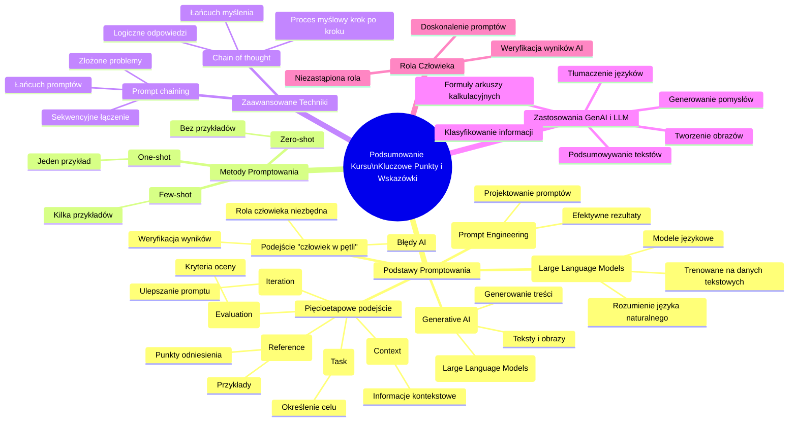

# Materiały dodatkowe - 1. Podsumowanie
## Diagram

## Notatka

# Podsumowanie Kursu: Kluczowe Punkty i Wskazówki

Poniżej znajdziesz esencję kursu – kluczowe informacje i wskazówki z każdej lekcji.  Zebraliśmy najważniejsze punkty, aby ułatwić Ci zrozumienie omawianych zagadnień i ich praktyczne zastosowanie. To podsumowanie pomoże Ci utrwalić główne zasady i sprawnie wdrożyć zdobytą wiedzę w Twoich projektach.

## Najważniejsze Punkty z Podstaw Promptowania

* **GenAI (Generative AI)**:  Rodzaj sztucznej inteligencji, która za pomocą LLM (Large Language Models) generuje nowe treści, takie jak teksty i obrazy.
* **LLM (Large Language Models)**:  Rozbudowane modele językowe, trenowane na ogromnych zbiorach danych tekstowych, umożliwiające rozumienie i odpowiadanie na zapytania w języku naturalnym.
* **Inżynieria Promptów (Prompt Engineering)**:  Proces projektowania efektywnych promptów, które pozwalają na osiągnięcie pożądanych rezultatów z wykorzystaniem LLM.
* **Pięcioetapowe podejście do tworzenia efektywnych promptów**: Kurs rekomenduje podejście składające się z pięciu kroków:
    - **Zadanie (Task)**: Jasne określenie celu, który ma zostać osiągnięty za pomocą promptu.
    - **Kontekst (Context)**: Dostarczenie niezbędnych informacji kontekstowych, wspomagających LLM w zrozumieniu zadania.
    - **Odniesienie (Reference)**: Wykorzystanie przykładów lub punktów odniesienia w celu ukierunkowania odpowiedzi LLM.
    - **Ocena (Evaluation)**: Ustalenie kryteriów oceny odpowiedzi LLM, pozwalających na weryfikację osiągnięcia zamierzonego celu.
    - **Iteracja (Iteration)**:  Ulepszanie promptu w oparciu o wyniki oceny, w celu uzyskania optymalnych rezultatów.
* **Podejście "człowiek w pętli" (Human-in-the-loop)**:  Krytyczne, ponieważ AI może generować wyniki obarczone błędami. Weryfikacja przez człowieka jest niezbędna.
* **Metody tworzenia promptów**:
    - **Zero-shot**: Promptowanie bez przykładów, polegające na zadawaniu pytań lub instrukcji bez prezentowania oczekiwanych odpowiedzi.
    - **One-shot**: Promptowanie z jednym przykładem, prezentujące LLM pojedynczą parę wejście-wyjście.
    - **Few-shot**: Promptowanie z kilkoma przykładami, dostarczające LLM zestaw par wejście-wyjście, aby precyzyjniej ukierunkować odpowiedź.
* **Zaawansowane techniki promptowania**:
    - **Prompt chaining (Łańcuch promptów)**:  Sekwencyjne łączenie promptów, gdzie wyjście jednego promptu staje się wejściem dla kolejnego, umożliwiające rozwiązywanie złożonych problemów.
    - **Chain of thought (Łańcuch myślenia)**: Technika polegająca na nakłanianiu LLM do ujawnienia procesu myślowego krok po kroku, co sprzyja uzyskaniu bardziej logicznych i dokładnych odpowiedzi.
* **Zastosowania GenAI i LLM**:  Między innymi:
    - Podsumowywanie tekstów
    - Tłumaczenie języków
    - Generowanie pomysłów
    - Tworzenie obrazów
    - Generowanie formuł do arkuszy kalkulacyjnych
    - Klasyfikowanie informacji
* **Rola ludzi**:  Niezbędna w procesie weryfikacji wyników generowanych przez AI oraz w ciągłym doskonaleniu promptów.

## Podsumowanie

To podsumowanie kursu koncentruje się na kluczowych aspektach GenAI, LLM i inżynierii promptów.  Kurs ma na celu wyjaśnienie, czym są generatywne modele AI i duże modele językowe, oraz jak efektywnie z nimi pracować poprzez projektowanie skutecznych promptów.  Kluczowe jest zrozumienie pięcioetapowego podejścia do tworzenia promptów,  znaczenia podejścia "człowiek w pętli", a także poznanie różnorodnych metod i zaawansowanych technik promptowania. Kurs podkreśla szerokie spektrum zastosowań GenAI i LLM,  jednocześnie akcentując niezastąpioną rolę człowieka w weryfikacji i ulepszaniu generowanych wyników.  Zrozumienie tych zasad umożliwi efektywne wykorzystanie potencjału AI w różnorodnych projektach.

### Original Transcript
**Podsumowanie Kursu**

Below you will find key information and tips from the individual lessons of the course. We have gathered the most important points that will help you understand the topics discussed and apply them in practice.  Thanks to this summary, you will more easily remember the main principles and quickly implement the acquired knowledge in your projects.

**Most important points from the basics of prompting**

* GenAI is a type of artificial intelligence that creates new content, such as texts and images, using LLMs.
* LLMs are trained on large datasets of text data, which allows them to understand and respond to natural language queries.
* Prompt engineering involves designing effective prompts that allow you to achieve desired results with LLMs.
* The materials recommend a five-step approach to creating effective prompts: task, context, reference, evaluation, and iteration.
* A human-in-the-loop approach is crucial, as AI can sometimes generate inaccurate results.
* Prompt creation methods include zero-shot, one-shot, and few-shot approaches.
* Advanced techniques include prompt chaining and chain of thought.
* GenAI and LLMs can be used for summarizing texts, translating languages, and generating ideas.
* Other applications include creating images, generating formulas for spreadsheets, and classifying information.
* Humans are needed to verify the results and create better prompts.

Each of the bullet points is accompanied by a green checkmark icon to the left.
