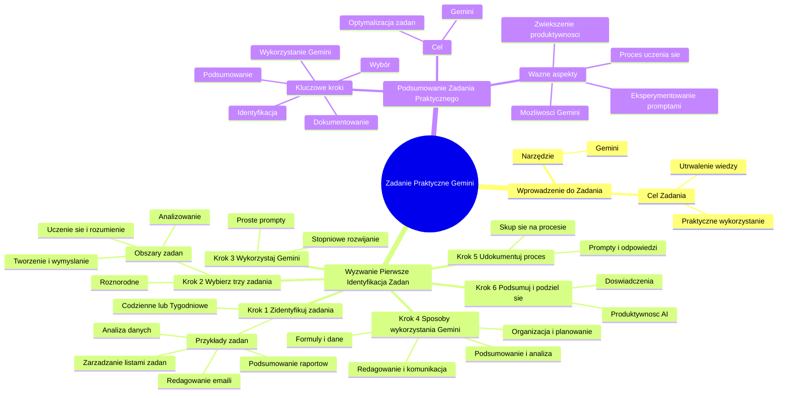

# Wyzwanie - Zadania dla Ciebie

# 💡 Diagram

___

# 🗒️ Notatka

# Notatki i Podsumowanie do Zadania Praktycznego z Kursu

Niniejszy dokument zawiera szczegółowe notatki i podsumowanie zadania praktycznego przedstawionego w transkrypcji. Zadanie ma na celu utrwalenie wiedzy z kursu poprzez samodzielne ćwiczenie kluczowych zagadnień związanych z generatywną sztuczną inteligencją, konkretnie z narzędziem **Gemini**.

## Wprowadzenie do Zadania Praktycznego

Zadanie praktyczne zostało przygotowane, aby umożliwić uczestnikom kursu samodzielne przećwiczenie kluczowych zagadnień. Jego realizacja krok po kroku ma na celu utrwalenie wiedzy teoretycznej oraz nauczenie praktycznego wykorzystania zdobytych umiejętności.

## Wyzwanie Pierwsze: Identyfikacja Zadań

### Krok 1: Zidentyfikuj swoje zadania

- **Zastanów się nad swoimi codziennymi lub tygodniowymi zadaniami.**
- Jakie czynności wykonujesz regularnie?
- Przykładowe zadania:
    - Analiza danych w arkuszach kalkulacyjnych
    - Redagowanie e-maili
    - Podsumowywanie raportów
    - Zarządzanie listami zadań

### Krok 2: Wybierz trzy zadania

- **Wybierz trzy różnorodne zadania**, które chciałbyś zoptymalizować za pomocą generatywnej sztucznej inteligencji.
- **Idealnym wyborem będą zadania** z co najmniej dwóch z trzech obszarów:
    - **Uczenie się i rozumienie**
    - **Analizowanie**
    - **Tworzenie i wymyślanie**

### Krok 3: Wykorzystaj **Gemini** do pomocy

- **Wykorzystaj narzędzie Gemini** w każdym z trzech wybranych zadań.
- **Postępuj zgodnie z zaleceniami z materiałów szkoleniowych:**
    - Zacznij od **prostych promptów**.
    - **Stopniowo rozwijaj** prompty.

### Krok 4: Sposoby wykorzystania **Gemini**

- **Przykładowe zastosowania Gemini:**
    - **Podsumowanie i analiza**
    - **Formuły i dane** (arkusze kalkulacyjne)
    - **Redagowanie i komunikacja** (np. e-maile)
    - **Organizacja i planowanie**

### Krok 5: Udokumentuj proces

- **Zapisuj używane prompty oraz odpowiedzi** uzyskane od **Gemini**.
- **Skup się na procesie, a nie tylko na wynikach.**
- Refleksja nad przebiegiem pracy jest kluczowa dla procesu uczenia się.

### Krok 6: Podsumuj i podziel się doświadczeniami

- **Przygotuj się do podzielenia się swoimi doświadczeniami.**
- **Zastanów się, czego nauczyłeś się** o wykorzystaniu narzędzi AI do zwiększenia produktywności.

## Podsumowanie Zadania Praktycznego

Zadanie praktyczne polega na wykorzystaniu narzędzia **Gemini** do optymalizacji trzech wybranych zadań z życia codziennego lub zawodowego. Kluczowe kroki obejmują: identyfikację zadań, wybór trzech z nich z różnych obszarów (uczenie się, analiza, tworzenie), użycie **Gemini** do wsparcia ich realizacji, dokumentowanie procesu poprzez zapisywanie promptów i odpowiedzi, a na koniec – podsumowanie i dzielenie się zdobytymi doświadczeniami. Ważne jest eksperymentowanie z różnymi promptami, rozpoczynając od prostych i stopniowo je rozbudowując. Należy skupić się na procesie uczenia się i zrozumieniu możliwości narzędzia **Gemini**, a nie tylko na osiągnięciu konkretnych rezultatów.  Celem zadania jest praktyczne zastosowanie wiedzy z kursu oraz zrozumienie, w jaki sposób AI może zwiększyć produktywność w różnych dziedzinach.

___

# 🔉 Transcript
File: Wyzwanie - Zadania dla Ciebie.png 
**Zadanie dla Ciebie**

Poniżej znajdziesz przygotowane specjalnie dla Ciebie zadanie praktyczne. Jego celem jest umożliwienie Ci samodzielnego przećwiczenia kluczowych zagadnień omawianych w kursie. Dzięki temu nie tylko utrwalisz zdobytą wiedzę, ale także nauczysz się wykorzystywać ją w praktyce. Wykonaj krok po kroku poniższe wskazówki, aby zdobyć cenne doświadczenie.

**Wyzwanie pierwsze: Zidentyfikuj swoje zadania**

* **Zidentyfikuj swoje zadania:**
Zastanów się nad swoimi codziennymi lub tygodniowymi zadaniami. Jakie czynności regularnie wykonujesz? Mogą to być zadania takie jak analiza danych w arkuszach kalkulacyjnych, redagowanie e-maili, podsumowywanie raportów lub zarządzanie listami zadań.

* **Wybierz trzy zadania:**
Wybierz trzy różne zadania, które chciałbyś zoptymalizować za pomocą generatywnej sztucznej inteligencji. Idealnie, wybierz zadania z co najmniej dwóch z trzech obszarów: uczenie się i rozumienie, analizowanie, tworzenie i wymyślanie.

* **Wykorzystaj Gemini do pomocy:**
W przypadku każdego z trzech wybranych zadań, użyj Gemini, aby Ci pomógł. Staraj się postępować zgodnie z radami z materiałów szkoleniowych: zacznij od prostych promptów, a następnie stopniowo je rozbudowuj.

* **Oto kilka sposobów, w jakie możesz wykorzystać Gemini:**
Podsumowanie i analiza, formuły i dane, redagowanie i komunikacja, organizacja i planowanie.

* **Udokumentuj proces:**
Zapisuj używane prompty i odpowiedzi, które otrzymujesz od Gemini. Ważne jest, aby zastanowić się nad procesem, a nie tylko nad wynikami.

* **Podsumuj i podziel się doświadczeniami:**
Przygotuj się na podzielenie się swoimi doświadczeniami. Czego nauczyłeś się o wykorzystaniu narzędzi AI w celu zwiększenia produktywności?

___
# 🏷️ Tags
#zadanie_praktyczne #kurs #generatywna_sztuczna_inteligencja #Gemini #optymalizacja_zadań #identyfikacja_zadań #codzienne_zadania #tygodniowe_zadania #analiza_danych #arkusze_kalkulacyjne #redagowanie_e-maili #podsumowywanie_raportów #zarządzanie_listami_zadań #trzy_zadania #różnorodne_zadania #uczenie_się_i_rozumienie #analizowanie #tworzenie_i_wymyślanie #prompt #proste_prompty #rozwijanie_promptów #podsumowanie_i_analiza #formuły_i_dane #redagowanie_i_komunikacja #organizacja_i_planowanie #dokumentowanie_procesu #dzielenie_się_doświadczeniami #produktywność #narzędzia_AI
