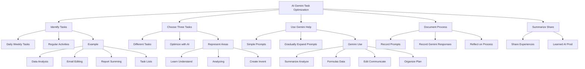

# Wyzwanie - Zadania dla Ciebie

# 💡 Diagram

___

# 🗒️ Notatka

# Zadanie Praktyczne: Wykorzystanie AI Gemini do Optymalizacji Zadań

## Wprowadzenie

To praktyczne zadanie ma na celu utrwalenie wiedzy z kursu i nauczenie Cię, jak stosować AI Gemini do optymalizacji zadań. Wykonaj poniższe kroki, aby zdobyć cenne doświadczenie.

## Pierwsze Wyzwanie: Identyfikacja Zadań

### Krok 1: Określ Swoje Zadania

*   Zastanów się nad swoimi **codziennymi lub tygodniowymi zadaniami**.
*   Jakie czynności wykonujesz **regularnie**?
*   Przykładowe zadania:
    *   Analiza danych w arkuszach kalkulacyjnych
    *   Edycja e-maili
    *   Sumowanie raportów
    *   Zarządzanie listami zadań

### Krok 2: Wybierz Trzy Zadania

*   Wybierz **trzy różne zadania**, które chcesz zoptymalizować za pomocą generatywnej sztucznej inteligencji.
*   Idealnie, zadania powinny reprezentować **co najmniej dwa z trzech obszarów**:
    *   **Uczenie się i rozumienie**
    *   **Analizowanie**
    *   **Tworzenie i wymyślanie**

### Krok 3: Wykorzystaj Gemini do Pomocy

*   Dla każdego z **trzech wybranych zadań**, użyj **Gemini** jako narzędzia wspomagającego.
*   Zastosuj wskazówki z materiałów szkoleniowych:
    *   Zacznij od **prostych promptów**.
    *   **Stopniowo rozwijaj i doprecyzowuj** prompty.
*   **Przykładowe sposoby wykorzystania Gemini**:
    *   **Sumowanie i analiza**
    *   **Formuły i dane**
    *   **Edycja i komunikacja**
    *   **Organizacja i planowanie**

### Krok 4: Dokumentuj Proces

*   **Zapisuj używane prompty**.
*   **Zapisuj odpowiedzi otrzymane od Gemini**.
*   Skoncentruj się na **refleksji nad procesem**, a nie tylko na wynikach. Jest to kluczowe dla nauki i zrozumienia potencjału narzędzia.

### Krok 5: Podsumuj i Podziel się Doświadczeniami

*   Przygotuj się do **podzielenia się swoimi wnioskami**.
*   Zastanów się, czego nauczyłeś się o **wykorzystaniu narzędzi AI do zwiększenia produktywności**.

## Podsumowanie

Zadanie polega na praktycznym zastosowaniu AI Gemini do optymalizacji codziennych zadań.  Twoim celem jest:

*   Identyfikacja trzech zadań z różnych obszarów (**uczenie się**, **analiza**, **tworzenie**).
*   Wykorzystanie Gemini do usprawnienia tych zadań.
*   Dokumentowanie procesu interakcji z AI (prompty i odpowiedzi).
*   Podsumowanie doświadczeń i wniosków dotyczących wpływu AI na produktywność.

Pamiętaj o iteracyjnym podejściu do promptów – zacznij od prostych i stopniowo je rozwijaj. Kluczowa jest refleksja nad całym procesem, a nie tylko końcowymi rezultatami. Celem tego zadania jest praktyczne zrozumienie potencjału AI we wspieraniu i ulepszaniu codziennych zadań.

___

# 🔉 Transcript
File: Wyzwanie - Zadania dla Ciebie.png 
**Zadanie dla Ciebie**

Below you will find a practical task prepared especially for you. Its purpose is to enable you to independently practice the key concepts discussed in the course. Thanks to this, you will not only consolidate the acquired knowledge, but also learn how to use it in practice. Follow the steps below to gain valuable experience.

**First Challenge: Identify Your Tasks**

* **Identify your tasks:**
Think about your daily or weekly tasks. What activities do you perform regularly? These could be tasks such as data analysis in spreadsheets, editing emails, summarizing reports, or managing task lists.

* **Choose three tasks:**
Choose three different tasks that you would like to optimize using generative artificial intelligence. Ideally, choose tasks from at least two of the three areas: learning and understanding, analyzing, creating and inventing.

* **Use Gemini to help:**
For each of the three selected tasks, use Gemini to help you. Try to follow the advice from the training materials: start with simple prompts and then gradually expand them.

Here are some ways you can use Gemini:
Summarization and analysis, formulas and data, editing and communication, organization and planning.

* **Document the process:**
Record the prompts you use and the responses you receive from Gemini. It is important to reflect on the process, not just the results.

* **Summarize and share your experiences:**
Prepare to share your experiences. What have you learned about using AI tools to increase productivity?

___
# 🏷️ Tags
#AI_Gemini #optymalizacja_zadań #zadania_codzienne #zadania_tygodniowe #analiza_danych #arkusze_kalkulacyjne #edycja_e-maili #sumowanie_raportów #zarządzanie_listami_zadań #generatywna_sztuczna_inteligencja #uczenie_się #rozumienie #analizowanie #tworzenie #wymyślanie #prompty #dokumentowanie_procesu #produktywność #wnioski #doświadczenia #narzędzia_AI #usprawnienie_zadań #interakcja_z_AI #refleksja #rezultaty #potencjał_AI #wskazówki #materiały_szkoleniowe #proste_prompty #rozwijanie_promptów #sumowanie #formuły #dane #komunikacja #organizacja #planowanie
