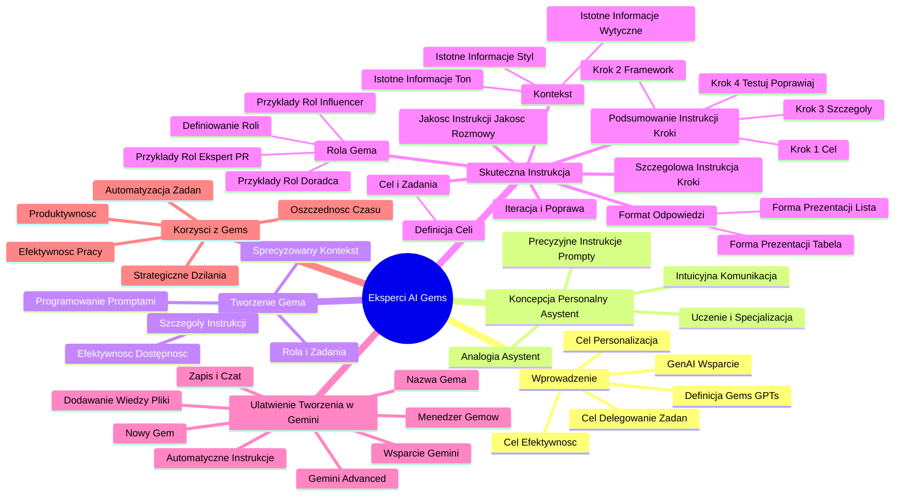

# Lekcje wideo - 1. Wstęp do tworzenia ekspertów AI

# 💡 Diagram

___

# 🗒️ Notatka

# Umiejętności Jutra: Eksperci AI (Gems) - Szczegółowe Notatki i Podsumowanie

## Wprowadzenie do Ekspertów AI (`Gems`)

*   **Eksperci AI**, w Gemini nazywani `Gems`, a w ChatGPT `GPTs`, to funkcja umożliwiająca spersonalizowane i efektywne korzystanie ze sztucznej inteligencji.
*   Celem ich wprowadzenia jest oddelegowanie powtarzalnych zadań, co pozwala użytkownikom skupić się na działaniach strategicznych i twórczych.
*   **Generatywna sztuczna inteligencja** (`GenAI`) wspiera automatyzację i usprawnienie pracy.

## Koncepcja Ekspertów AI jako Personalnych Asystentów

*   Praca z `GenAI` przypomina współpracę z **personalnym asystentem**.
*   Kluczowym elementem efektywnej współpracy jest formułowanie **precyzyjnych instrukcji**, czyli **promptów**, które kierują działaniem asystenta AI.
*   Im bardziej szczegółowe instrukcje na starcie, tym lepsze i szybsze rezultaty.
*   Z czasem **ekspert AI uczy się i specjalizuje** w realizacji powtarzalnych zadań, stając się coraz bardziej efektywny.
*   Po pewnym czasie, szczegółowość instrukcji może być mniejsza, a komunikacja staje się bardziej intuicyjna i płynna.
*   **Eksperci AI** dążą do **porozumienia bez zbędnych słów**, podobnie jak w relacji z doświadczonym asystentem, co zwiększa komfort i szybkość pracy.

## Tworzenie Wyspecjalizowanego Asystenta AI (`Gema`)

*   **Programowanie Gema** opiera się na tworzeniu **precyzyjnych promptów**, które definiują jego działanie.
*   **Skuteczność Gema jest wprost proporcjonalna do liczby szczegółów zawartych w instrukcji**.
*   **Kluczowe jest jasne określenie roli i zadań** dedykowanych Gemu.
*   `Gemy` to narzędzia AI o **sprecyzowanym kontekście**, co przyspiesza uzyskiwanie trafnych i szybkich odpowiedzi.
*   Dzięki zdefiniowanemu kontekstowi, nie ma potrzeby każdorazowego tworzenia rozbudowanego promptu.
*   Współpraca z Gemem przypomina interakcję z **doświadczonym ekspertem**, który doskonale rozumie potrzeby, zna swoją rolę i sprawnie realizuje powierzone zadania.
*   Gem jest **zawsze dostępny**, gotowy do działania.
*   Delegowanie zadań staje się **prostsze, szybsze i efektywniejsze** dzięki `Gemom`, co znacząco optymalizuje proces pracy.

## Jak Stworzyć Skuteczną Instrukcję dla `Gema`

*   Tworzenie `Gema` to programowanie narzędzia generatywnej AI, analogiczne do tworzenia efektywnych promptów.
*   Im więcej szczegółów określa zakres działania i sposób reakcji Gema, tym większa jego skuteczność.
*   **Kluczowe jest zdefiniowanie roli, jaką ma pełnić Twój Gem.**

### Określanie Roli `Gema`

*   **Definiowanie roli eksperta w oparciu o założony cel.**
    *   **Ekspert ds. PR z 10-letnim doświadczeniem** → gwarantuje rozważne i przemyślane propozycje.
    *   **Młody influencer** →  zapewnia komunikację językiem pokolenia Z.
    *   **Kreatywny doradca** (np. Barack Obama) → inspiruje i generuje nieszablonowe pomysły.
*   **Krytyczne i kreatywne podejście** do wyboru roli, która optymalnie odpowiada zamierzonemu celowi.

### Kluczowe Elementy Skutecznej Instrukcji dla `Gema`

*   Skuteczna instrukcja powinna składać się z kilku kluczowych elementów:
    1.  **Rola Gema**
        *   Precyzyjne określenie funkcji: copywriter, badacz rynku, asystent sprzedaży.
    2.  **Cel i Zadania**
        *   Jasna definicja głównego celu: tworzenie treści, analiza opinii klientów, przygotowanie prezentacji.
    3.  **Kontekst**
        *   Uwrażliwienie Gema na istotne informacje: ton wypowiedzi, styl marki, wcześniejsze wytyczne projektowe.
    4.  **Format Odpowiedzi**
        *   Określenie preferowanej formy prezentacji wyników: lista, punkty, tabelka.
    5.  **Szczegółowa Instrukcja (opcjonalnie)**
        *   Precyzyjne wytyczne krok po kroku, opisujące sposób realizacji zadania przez Gema.

*   **Jakość rozmowy z Gemem bezpośrednio zależy od jakości instrukcji.**
    *   Możliwość uzyskania satysfakcjonującej odpowiedzi już po pierwszej interakcji.
    *   Opcja zaprojektowania dialogu z pytaniami pomocniczymi generowanymi przez Gema, co pozwala na doprecyzowanie oczekiwań.

### Iteracja i Poprawa Instrukcji

*   **Instrukcje Gema można modyfikować w dowolnym momencie**, aby dostosować je do zmieniających się potrzeb i oczekiwań, szczególnie gdy początkowe rezultaty nie są w pełni satysfakcjonujące.
*   **Proces programowania Gema powinien być iteracyjny**:  oceniaj, poprawiaj i udoskonalaj instrukcje.
*   Docelowo, idealnym stanem jest sytuacja, w której Gem rozumie Twoje intencje **bez konieczności używania wielu słów**, co świadczy o wysokiej precyzji instrukcji.

### Podsumowanie Tworzenia Dobrej Instrukcji `Gema`

1.  **Zdefiniuj konkretny cel**, jaki ma realizować Gem.
2.  **Wykorzystaj framework**: rola + zadanie + kontekst + format odpowiedzi.
3.  **Szczegółowo opisz instrukcję**:  krok po kroku, jak Gem ma realizować zadanie.
4.  **Testuj, oceniaj i poprawiaj** instrukcję, dążąc do optymalnej skuteczności.

## Ułatwienie Tworzenia `Gemów` za Pomocą Gemini

*   Platforma **Gemini** oferuje wsparcie w procesie tworzenia instrukcji dla `Gemów`, znacząco ułatwiając ten proces.
*   W **Gemini Advanced**, w **Menedżerze Gemów** dostępna jest opcja utworzenia **Nowego Gema**.
*   Wystarczy podać **nazwę Gema** (np. \"Asystent ds. kontaktu z potencjalnym klientem\"), aby rozpocząć proces konfiguracji.
*   **Gemini może automatycznie wygenerować wstępne instrukcje**, stanowiące punkt wyjścia do dalszej personalizacji.
*   Istnieje możliwość wzbogacenia wiedzy Gema poprzez załączenie dodatkowych plików (np. \"Lista klientów\", \"Ton komunikacji marki\", \"Aktualna oferta\"), co pozwala na lepsze dostosowanie Gema do specyficznych potrzeb.
*   Po konfiguracji wystarczy **zapisać Gema** i **rozpocząć czat** z nowo utworzonym, spersonalizowanym asystentem AI.

## Podsumowanie Lekcji o Ekspertach AI (`Gems`)

*   **Eksperci AI (`Gems`)** to zaawansowane narzędzia umożliwiające personalizację i automatyzację zadań z wykorzystaniem potencjału sztucznej inteligencji.
*   **Precyzyjne i dobrze skonstruowane instrukcje** są kluczem do efektywnego wykorzystania `Gemów`.
*   Kompletna instrukcja powinna definiować **rolę Gema, cel i zadania, kontekst działania oraz preferowany format odpowiedzi**.
*   Tworzenie `Gemów` to proces **iteracyjny**, wymagający ciągłego testowania, oceniania i udoskonalania instrukcji, aby osiągnąć optymalne rezultaty.
*   **Gemini** znacząco **ułatwia i przyspiesza proces tworzenia instrukcji**, oferując wsparcie i automatyzację.
*   Wykorzystanie `Gemów` pozwala na **efektywne oddelegowanie powtarzalnych zadań**, co przekłada się na oszczędność czasu, zwiększenie produktywności i umożliwia skupienie się na strategicznych działaniach, realnie wspierając rozwój firmy.

---

**Podsumowanie najważniejszych informacji w punktach:**

*   **Eksperci AI (`Gems`/`GPTs`)**: Spersonalizowane i efektywne narzędzia AI, zwiększające produktywność.
*   **Główny Cel**: Automatyzacja powtarzalnych zadań i znacząca oszczędność czasu.
*   **Klucz do Sukcesu**: Precyzyjne instrukcje (`prompty`), definiujące działanie Gema.
*   **Analogia**: Personalny asystent, rozumiejący potrzeby i działający intuicyjnie.
*   **Elementy Skutecznej Instrukcji**: Rola, Cel, Kontekst, Format Odpowiedzi – kluczowe aspekty definiujące Gema.
*   **Iteracyjny Proces**: Testowanie i ciągłe udoskonalanie instrukcji dla optymalizacji efektów.
*   **Wsparcie Gemini**: Platforma Gemini ułatwia tworzenie instrukcji, przyspieszając konfigurację Gemów.
*   **Realne Korzyści**: Szybsza i efektywniejsza praca, możliwość koncentracji na strategicznych zadaniach, co przekłada się na postęp firmy.

___

# 🔉 Transcript
File: Lekcje wideo - 1. Wstęp do tworzenia ekspertów AI.mp4 
[00:00:01] (Ekran: Białe tło z napisem "Umiejętności Jutra" w kolorze czarnym. Obok napisu znajduje się logo "AI" w kolorze gradientu.)
[00:00:05] Cześć.
[00:00:05] (Ekran: Mężczyzna w okularach siedzi przy biurku z laptopem. W tle widoczny jest znak Google i roślina doniczkowa. Na dole ekranu pojawia się napis z imieniem i nazwiskiem mężczyzny: "Radosław Łyko, Marketing Manager + Google".)
[00:00:06] W kolejnej lekcji zanurzymy się w świat ekspertów AI.
[00:00:09] Jest to funkcja, która pozwala na jeszcze bardziej spersonalizowane i efektywne korzystanie ze sztucznej inteligencji.
[00:00:16] Wspomnijcie sobie teraz wszystkie powtarzalne zadania, z którymi mierzycie się w pracy.
[00:00:20] Na przykład pisanie regularnych raportów i wniosków.
[00:00:23] Odpowiadanie na podobne maile klientów, czasami w języku obcym.
[00:00:27] To prawdziwe zjadacze czasu.
[00:00:29] Jak często macie w głowie myśl, że znowu musicie to zrobić i poświęcić swój czas, a przecież dopiero to robiliście.
[00:00:36] A teraz wyobraźcie sobie, że możecie oddelegować te zadania i zająć się działaniem strategicznym, twórczym i realnie przesuwającym waszą firmę do przodu.
[00:00:46] Generatywna sztuczna inteligencja może wam w tym pomóc.
[00:00:50] (Ekran: Mężczyzna w okularach na tle slajdu z prezentacji o tytule "Generatywna Sztuczna Inteligencja (Gems) – Twoje wsparcie w pracy". Po prawej stronie slajdu znajdują się następujące punkty: "Narzędzie wspierające codzienną pracę.", "Efektywność zależna od precyzyjnych instrukcji.", "Powtarzanie zadań zwiększa skuteczność działania.", "Specjalizacja prowadzi do automatyzacji procesów.", "Możliwość ograniczenia komunikacji do minimum.".)
[00:00:50] Często mówimy, że praca z GenAI to trochę jak posiadanie personalnego asystenta.
[00:00:56] Żeby wasz prawdziwy asystent dobrze sobie poradził, potrzebuje dostać odpowiednie instrukcje.
[00:01:01] Im bardziej dokładne, tym na początku lepiej.
[00:01:04] Tak jak AI potrzebuje dostać odpowiedni prompt.
[00:01:07] Jeśli asystent wykona swoje zadanie raz, drugi, czy trzeci, powinien nabrać wprawy.
[00:01:13] Przy kolejnym takim samym zadaniu będzie już znał jego kontekst, a dokładna instrukcja stanie się zbędna.
[00:01:19] Twój asystent wyspecjalizuje się w wykonywaniu danego obowiązku i można powiedzieć, że będziecie rozumieli się bez zbędnych słów.
[00:01:27] Na tym właśnie polega praca z ekspertami AI.
[00:01:31] W przypadku Gemini, funkcja ta nosi nazwę Gems.
[00:01:34] A w przypadku chatu GPT mówimy o GPTs.
[00:01:37] (Ekran: Mężczyzna w okularach na tle slajdu z prezentacji o tytule "Tworzenie Wyspecjalizowanego Asystenta AI (Gema)". Poniżej znajdują się następujące punkty: "Programowanie Gema polega na tworzeniu precyzyjnych promptów.", "Skuteczność zależy od liczby szczegółów w instrukcji.", "Kluczowe jest jasno określenie roli i zadań.".)
[00:01:38] Tworzycie swojego wyspecjalizowanego asystenta AI, z którym zrozumiecie się bez zbędnych słów.
[00:01:43] Jeśli tylko przyłożycie się do pierwszej instrukcji.
[00:01:46] Gemy to narzędzia sztucznej inteligencji o sprecyzowanym kontekście, przez co szybciej i bardziej trafnie mogą odpowiadać na twoje pytania, a ty nie musisz za każdym razem tworzyć dokładnego promptu.
[00:01:59] To trochę jak współpraca z doświadczonym ekspertem, który od razu rozumie twoje potrzeby, zna swoją rolę i sprawnie realizuje zadania.
[00:02:08] A dodatkowo jak asystent jest zawsze do twojej dyspozycji.
[00:02:12] Dzięki Gemom delegowanie staje się prostsze i szybsze, a efekty lepsze.
[00:02:19] Jak zatem stworzyć Gema, twojego wyspecjalizowanego asystenta AI?
[00:02:23] Właściwie już to umiecie.
[00:02:25] Aby stworzyć Gema, będziecie programować narzędzia generatywnej sztucznej inteligencji, tak jak zwykle, czyli stosując się do zasad tworzenia promptów.
[00:02:34] Im więcej szczegółów udacie na temat tego, co ekspert AI ma robić, jak ma reagować, tym będzie skuteczniejszy.
[00:02:40] Zastanówcie się, jaką rolę ma pełnić wasz Gem.
[00:02:44] (Ekran: Mężczyzna w okularach na tle slajdu z prezentacji o tytule "Określanie roli Gema". Poniżej znajdują się następujące punkty: "Definiowanie roli eksperta w oparciu o cel:", "Ekspert ds. PR z 10-letnim doświadczeniem → rozważne i przemyślane propozycje.".)
[00:02:44] Jeśli chcesz stworzyć Gema, który będzie ekspertem do spraw PR, możesz nadać mu rolę doświadczonego specjalisty z 10-letnim stażem.
[00:02:52] Taki ekspert będzie lepiej adresował potencjalne ryzyka, ale prawdopodobnie będzie też bardziej rozważny w swoich propozycjach.
[00:02:59] (Ekran: Mężczyzna w okularach na tle slajdu z prezentacji o tytule "Określanie roli Gema". Poniżej znajdują się następujące punkty: "Definiowanie roli eksperta w oparciu o cel:", "Ekspert ds. PR z 10-letnim doświadczeniem → rozważne i przemyślane propozycje.", "Młody influencer → komunikacja z pokoleniem Z.".)
[00:02:59] Jeśli chcesz stworzyć przekaz dla pokolenia Z, to może zamiast doświadczonego specjalisty, lepiej sprawdzi się młody influencer.
[00:03:07] (Ekran: Mężczyzna w okularach na tle slajdu z prezentacji o tytule "Określanie roli Gema". Poniżej znajdują się następujące punkty: "Definiowanie roli eksperta w oparciu o cel:", "Ekspert ds. PR z 10-letnim doświadczeniem → rozważne i przemyślane propozycje.", "Młody influencer → komunikacja z pokoleniem Z.", "Kreatywny doradca → inspiracja i nieszablonowe pomysły.".)
[00:03:07] A może w innej sytuacji najlepszym doradcą piarowym będzie Barack Obama.
[00:03:12] Bądźcie krytyczni i kreatywnie szukajcie roli, która najlepiej pasuje do waszego celu.
[00:03:17] Powiem wam teraz, jak powinna wyglądać skuteczna instrukcja Gema.
[00:03:22] (Ekran: Mężczyzna w okularach siedzi przy biurku z laptopem. W tle widoczny jest znak Google i roślina doniczkowa.)
[00:03:22] W trakcie lekcji może wam się wydawać, że praca nad instrukcjami jest ciężka i żmudna.
[00:03:27] Jednak nie martwcie się na zapas, bo pod koniec tej części pokażę wam również sposób na to, jak znacząco ułatwić tworzenie Gemów.
[00:03:36] Zaczynajmy.
[00:03:38] Każda instrukcja powinna składać się z kilku elementów.
[00:03:41] Jest to rola Gema, jego cel i zadanie, kontekst oraz format odpowiedzi.
[00:03:47] Przyjrzyjmy się krótko każdej z nich.
[00:03:50] (Ekran: Mężczyzna w okularach na tle slajdu z prezentacji o tytule "Instrukcja dla Gema – Kluczowe Elementy". Poniżej znajduje się nagłówek "Praktyczne wskazówki:" oraz punkty: "Rola Gema", "Określenie, jaką funkcję pełni: copywriter, badacz rynku, asystent sprzedaży.".)
[00:03:50] Po pierwsze należy określić jaką rolę ma pełnić twój Gem.
[00:03:54] Na przykład copywriter, badacz rynku czy asystent sprzedaży.
[00:03:58] (Ekran: Mężczyzna w okularach na tle slajdu z prezentacji o tytule "Instrukcja dla Gema – Kluczowe Elementy". Poniżej znajduje się nagłówek "Praktyczne wskazówki:" oraz punkty: "Rola Gema", "Określenie, jaką funkcję pełni: copywriter, badacz rynku, asystent sprzedaży.", "Cel i Zadania", "Definicja głównego celu: tworzenie treści, analiza opinii, przygotowanie prezentacji.".)
[00:03:58] Następnie musimy nadać mu cel, czyli zdefiniować co dokładnie ma robić Gem.
[00:04:03] Na przykład tworzyć treści marketingowe, analizować opinie klientów czy generować konspekty prezentacji sprzedażowych.
[00:04:10] (Ekran: Mężczyzna w okularach na tle slajdu z prezentacji o tytule "Instrukcja dla Gema – Kluczowe Elementy". Poniżej znajduje się nagłówek "Praktyczne wskazówki:" oraz punkty: "Rola Gema", "Określenie, jaką funkcję pełni: copywriter, badacz rynku, asystent sprzedaży.", "Cel i Zadania", "Definicja głównego celu: tworzenie treści, analiza opinii, przygotowanie prezentacji.", "Kontekst", "Uwrażliwienie niezbednych informacji: ton wypowiedzi, styl marki, wcześniejsze wytyczne.".)
[00:04:10] Teraz zbudujmy szerszy kontekst, czyli podajmy Gemowi niezbędne informacje, takie jak ton wypowiedzi, preferowany styl komunikacji i inne wytyczne, na przykład uwzględnienie wcześniejszych rozmów.
[00:04:23] (Ekran: Mężczyzna w okularach na tle slajdu z prezentacji o tytule "Instrukcja dla Gema – Kluczowe Elementy". Poniżej znajduje się nagłówek "Praktyczne wskazówki:" oraz punkty: "Rola Gema", "Określenie, jaką funkcję pełni: copywriter, badacz rynku, asystent sprzedaży.", "Cel i Zadania", "Definicja głównego celu: tworzenie treści, analiza opinii, przygotowanie prezentacji.", "Kontekst", "Uwrażliwienie niezbednych informacji: ton wypowiedzi, styl marki, wcześniejsze wytyczne.", "Format Odpowiedzi", "Forma prezentacji: lista, punkty, tabelka, wcześniejsze wytyczne.".)
[00:04:23] Teraz określmy format, czyli sposób w jaki Gem ma prezentować odpowiedzi.
[00:04:29] Na przykład zwięźle w punktach, w formie listy czy w formie tabelki.
[00:04:35] (Ekran: Mężczyzna w okularach siedzi przy biurku z laptopem. W tle widoczny jest znak Google i roślina doniczkowa.)
[00:04:35] Na koniec możesz dodać też szczegółową instrukcję, czyli jak krok po kroku Gem ma realizować swoje zadanie.
[00:04:42] To jak będzie wyglądała twoja rozmowa z Gemem zależy od instrukcji.
[00:04:46] Możesz wymagać gotowej odpowiedzi już w po pierwszej interakcji lub na przykład zaprojektować dialog, który doprowadzi cię do zamierzonych efektów dzięki pytaniom pomocniczym, które zada ci Gem.
[00:04:57] Pamiętaj, że instrukcje Gema możesz w każdym momencie poprawić, jeżeli rezultaty nie są dla ciebie satysfakcjonujące.
[00:05:05] Oceniaj, poprawiaj i iteruj programowanie.
[00:05:08] Tak, aby twój wyspecjalizowany asystent AI rozumiał cię bez słów.
[00:05:13] Podsumowując, aby stworzyć dobrą instrukcję Gema, na początku zdefiniuj cel, użyj frameworka, zastosuj strukturę rola plus zadanie plus kontekst plus format.
[00:05:26] Następnie szczegółowo opisz instrukcję, czyli jak krok po kroku Gem ma realizować zadanie.
[00:05:35] A na koniec testuj, oceniaj i poprawiaj instrukcję.
[00:05:36] (Ekran: Mężczyzna w okularach siedzi przy biurku z laptopem. W tle widoczny jest znak Google i roślina doniczkowa.)
[00:05:37] Przed chwilą obiecałem wam, że pokażę sposób na łatwiejsze pisanie instrukcji i uwaga, to właśnie ten moment.
[00:05:44] Jeżeli nie jesteście przekonani, że napisaliście dobrą instrukcję lub po prostu macie mniej czasu, możecie skorzystać z pomocy Gemini.
[00:05:53] (Ekran: Mężczyzna w okularach na tle widoku przeglądarki Gemini. W panelu po lewej stronie widać "Menedżer Gemów". Mężczyzna klika "Nowy Gem".)
[00:05:53] (Ekran: Mężczyzna w okularach na tle widoku przeglądarki Gemini. W panelu po lewej stronie widać pola do wprowadzenia nazwy i instrukcji. Mężczyzna przechodzi do dodawania instrukcji.)
[00:05:53] (Ekran: Mężczyzna w okularach na tle widoku przeglądarki Gemini. W panelu po lewej stronie widać pola do wprowadzania nazwy i instrukcji. Mężczyzna usuwa domyślną instrukcję.)
[00:05:53] (Ekran: Mężczyzna w okularach na tle widoku przeglądarki Gemini. W panelu po lewej stronie widać pola do wprowadzania nazwy i instrukcji. Mężczyzna wpisuje nazwę "Asystent ds. kontaktu z potencjalnym klientem".)
[00:05:53] (Ekran: Mężczyzna w okularach na tle widoku przeglądarki Gemini. W panelu po lewej stronie widać pola do wprowadzania nazwy i instrukcji. Mężczyzna wpisuje nazwę "Asystent ds. kontaktu z potencjalnym klientem" i klika ikonę Gemini w celu wygenerowania instrukcji.)
[00:05:53] (Ekran: Mężczyzna w okularach na tle widoku przeglądarki Gemini. W panelu po lewej stronie widać pola do wprowadzania nazwy i instrukcji. Automatycznie wygenerowane instrukcje zostały wprowadzone do pola instrukcji.)
[00:05:53] (Ekran: Mężczyzna w okularach na tle widoku przeglądarki Gemini. W panelu po lewej stronie widać pola do wprowadzania nazwy i instrukcji. Automatycznie wygenerowane instrukcje zostały wprowadzone do pola instrukcji. Następnie mężczyzna przechodzi do pola "Wiedza" i dodaje pliki "Lista klientów" i "Ton komunikacji".)
[00:05:53] (Ekran: Mężczyzna w okularach na tle widoku przeglądarki Gemini. W panelu po lewej stronie widać pola do wprowadzania nazwy i instrukcji. Automatycznie wygenerowane instrukcje zostały wprowadzone do pola instrukcji. Następnie mężczyzna przechodzi do pola "Wiedza" i dodaje pliki "Lista klientów", "Ton komunikacji" i "Oferta".)
[00:05:53] (Ekran: Mężczyzna w okularach na tle widoku przeglądarki Gemini. W panelu po lewej stronie widać pola do wprowadzania nazwy i instrukcji, a także dodane pliki "Lista klientów", "Ton komunikacji" i "Oferta". Mężczyzna klika "Zapisz".)
[00:05:53] (Ekran: Mężczyzna w okularach na tle widoku przeglądarki Gemini. Wyświetla się okno z informacją o zapisaniu Gema. Następnie mężczyzna klika "Rozpocznij czat".)
[00:05:53] (Ekran: Mężczyzna w okularach na tle widoku przeglądarki Gemini. Wyświetla się czat z Gemem o nazwie "Asystent ds. kontaktu z potencjalnym klientem".)
[00:05:53] (Ekran: Mężczyzna w okularach na tle widoku przeglądarki Gemini. W polu czatu mężczyzna wpisuje "Cześć" i otrzymuje odpowiedź.)
[00:05:53] (Ekran: Mężczyzna w okularach siedzi przy biurku z laptopem. W tle widoczny jest znak Google i roślina doniczkowa.)
[00:05:53] (Ekran: Mężczyzna w okularach siedzi przy biurku z laptopem. W tle widoczny jest znak Google i roślina doniczkowa.)
[00:05:53] (Ekran: Mężczyzna w okularach siedzi przy biurku z laptopem. W tle widoczny jest znak Google i roślina doniczkowa.)
[00:06:22] Otwórzmy Gemini Advanced i w menu po lewej stronie wejdźmy w Menedżer Gemów.
[00:06:27] (Ekran: Mężczyzna na tle widoku przeglądarki Gemini. W panelu po lewej stronie widać "Menedżer Gemów". Mężczyzna klika "Nowy Gem".)
[00:06:27] (Ekran: Mężczyzna na tle widoku przeglądarki Gemini. W panelu po lewej stronie widać pola do wprowadzenia nazwy i instrukcji. Mężczyzna wpisuje nazwę "Asystent ds. kontaktu z potencjalnym klientem".)
[00:06:27] (Ekran: Mężczyzna na tle widoku przeglądarki Gemini. W panelu po lewej stronie widać pola do wprowadzania nazwy i instrukcji. Automatycznie wygenerowane instrukcje zostały wprowadzone do pola instrukcji.)
[00:06:27] (Ekran: Mężczyzna na tle widoku przeglądarki Gemini. W panelu po lewej stronie widać pola do wprowadzania nazwy i instrukcji. Automatycznie wygenerowane instrukcje zostały wprowadzone do pola instrukcji. Następnie mężczyzna przechodzi do pola "Wiedza" i dodaje pliki "Lista klientów" i "Ton komunikacji".)
[00:06:27] (Ekran: Mężczyzna na tle widoku przeglądarki Gemini. W panelu po lewej stronie widać pola do wprowadzania nazwy i instrukcji. Automatycznie wygenerowane instrukcje zostały wprowadzone do pola instrukcji. Następnie mężczyzna przechodzi do pola "Wiedza" i dodaje pliki "Lista klientów", "Ton komunikacji" i "Oferta".)
[00:06:27] (Ekran: Mężczyzna na tle widoku przeglądarki Gemini. W panelu po lewej stronie widać pola do wprowadzania nazwy i instrukcji, a także dodane pliki "Lista klientów", "Ton komunikacji" i "Oferta". Mężczyzna klika "Zapisz".)
[00:06:27] (Ekran: Mężczyzna na tle widoku przeglądarki Gemini. Wyświetla się okno z informacją o zapisaniu Gema. Następnie mężczyzna klika "Rozpocznij czat".)
[00:06:27] (Ekran: Mężczyzna na tle widoku przeglądarki Gemini. Wyświetla się czat z Gemem o nazwie "Asystent ds. kontaktu z potencjalnym klientem".)
[00:06:27] (Ekran: Mężczyzna na tle widoku przeglądarki Gemini. W polu czatu mężczyzna wpisuje "Cześć" i otrzymuje odpowiedź.)
[00:06:27] (Ekran: Mężczyzna w okularach siedzi przy biurku z laptopem. W tle widoczny jest znak Google i roślina doniczkowa.)
[00:06:27] (Ekran: Mężczyzna w okularach siedzi przy biurku z laptopem. W tle widoczny jest znak Google i roślina doniczkowa.)
[00:06:27] (Ekran: Mężczyzna w okularach siedzi przy biurku z laptopem. W tle widoczny jest znak Google i roślina doniczkowa.)
[00:07:27] (Ekran: Mężczyzna w okularach siedzi przy biurku z laptopem. W tle widoczny jest znak Google i roślina doniczkowa.)

___
# 🏷️ Tags
#eksperci_AI #Gems #GPTs #sztuczna_inteligencja #personalizacja #efektywność #automatyzacja #zadania #praca #działania_strategiczne #twórczość #GenAI #generatywna_sztuczna_inteligencja #personalny_asystent #precyzyjne_instrukcje #prompt #uczenie_się #specjalizacja #porozumienie_bez_słów #komfort_pracy #szybkość_pracy #programowanie_Gema #skuteczność #rola #zadania #kontekst #trafne_odpowiedzi #doświadczony_ekspert #dostępność #delegowanie_zadań #optymalizacja_pracy #zakres_działania #sposób_reakcji #cel #PR #influencer #pokolenie_Z #kreatywny_doradca #Barack_Obama #krytyczne_podejście #kreatywne_podejście #copywriter #badacz_rynku #asystent_sprzedaży #tworzenie_treści #analiza_opinii #przygotowanie_prezentacji #ton_wypowiedzi #styl_marki #wcześniejsze_wytyczne #format_odpowiedzi #lista #punkty #tabelka #szczegółowa_instrukcja #jakość_rozmowy #dialog #pytania_pomocnicze #doprecyzowanie_oczekiwań #modyfikacja_instrukcji #iteracja #poprawa_instrukcji #udoskonalanie_instrukcji #intencje #konkretny_cel #framework #rola_zadanie_kontekst_format #testowanie #ocena #Gemini #Gemini_Advanced #Menedżer_Gemów #Nowy_Gem #nazwa_Gema #automatyczne_instrukcje #personalizacja #dodatkowe_pliki #lista_klientów #ton_komunikacji_marki #aktualna_oferta #czat #spersonalizowany_asystent #zaawansowane_narzędzia #konstrukcja_instrukcji #testowanie_Gemów #oszczędność_czasu #zwiększenie_produktywności #rozwój_firmy #postęp_firmy
