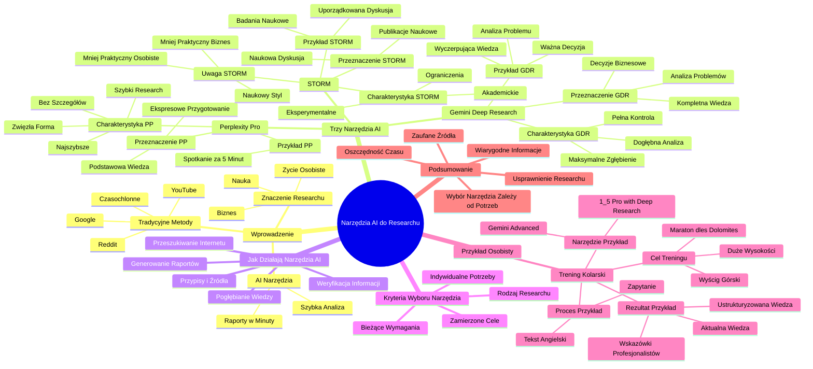

# Lekcje wideo - 2. Gemini Deep Research

# 💡 Diagram

___

# 🗒️ Notatka

# Notatki i Podsumowanie Lekcji: Narzędzia AI do Pogłębionego Researchu

## Wprowadzenie

Lekcja poświęcona jest wykorzystaniu **narzędzi sztucznej inteligencji (AI)** w **pogłębionym researchu**.  Podkreślono, że umiejętność dogłębnego zrozumienia różnorodnych zagadnień jest kluczowa w **biznesie**, **nauce** i **życiu osobistym**. Tradycyjne metody researchu, takie jak przeszukiwanie Google, YouTube'a czy Reddita, mogą być czasochłonne i żmudne. AI oferuje rozwiązania, które analizują setki źródeł internetowych i generują raporty w krótkim czasie.

## Trzy Narzędzia AI do Pogłębionego Researchu

Przedstawiono trzy główne narzędzia AI, wyspecjalizowane w pogłębionym researchu:

1.  **Gemini Deep Research**
2.  **Perplexity Pro**
3.  **STORM** (narzędzie eksperymentalne)

Każde z tych narzędzi charakteryzuje się nieco odmiennymi cechami i jest przeznaczone do innych zastosowań, co umożliwia dopasowanie ich do konkretnych potrzeb.

### 1. Perplexity Pro

*   **Charakterystyka:**
    *   **Najszybsze** z wymienionych narzędzi.
    *   **Idealne do szybkiego researchu**, gdy czas jest ograniczony i potrzebna jest **zwięzła forma** bez wnikania w detale.
*   **Przeznaczenie:**
    *   Ekspresowe przygotowanie do spotkań lub sytuacji wymagających podstawowej wiedzy na dany temat w krótkim czasie.
*   **Przykład:**
    *   \"Gdy za 5 minut masz spotkanie na temat, o którym niewiele wiesz i potrzebujesz błyskawicznie się przygotować.\"

### 2. Gemini Deep Research

*   **Charakterystyka:**
    *   **Specjalizuje się w dogłębnej analizie**, nad przebiegiem której użytkownik ma **pełną kontrolę**.
    *   Umożliwia **maksymalne zgłębienie** interesującego zagadnienia.
*   **Przeznaczenie:**
    *   Dogłębna analiza problemów.
    *   Przygotowanie szczegółowych analiz przed podjęciem kluczowych decyzji biznesowych.
    *   Upewnienie się, że dysponujemy **kompletną wiedzą** w danym obszarze.
*   **Przykład:**
    *   \"Kiedy chcesz dokładnie przeanalizować problem, opracować analizę przed ważną decyzją biznesową lub upewnić się, że posiadasz wyczerpującą wiedzę na dany temat.\"

### 3. STORM (narzędzie eksperymentalne)

*   **Charakterystyka:**
    *   **Wersja eksperymentalna** z pewnymi ograniczeniami funkcjonalnymi.
    *   **Wyjątkowo przydatne w zastosowaniach naukowych**.
    *   Posiada charakter **akademicki**.
*   **Przeznaczenie:**
    *   Analiza publikacji naukowych.
    *   Gromadzenie badań w formie naukowej dyskusji.
*   **Przykład:**
    *   \"Jeżeli potrzebujesz przeanalizować badania naukowe z ostatnich dekad i zebrać je w formie uporządkowanej dyskusji naukowej.\"
*   **Uwaga:**
    *   W kontekście biznesowym i osobistym generuje raporty w **bardziej naukowym i mniej praktycznym stylu**.

## Jak Działają Narzędzia AI do Researchu? (Ogólny Mechanizm)

Wszystkie te narzędzia operują na zbliżonej zasadzie:

*   **Przeszukują zasoby internetowe.**
*   **Generują raport na zadany temat.**
*   **Dodają przypisy i wskazują źródła informacji.**
*   Pozwalają na **weryfikację informacji** i **przejście do źródeł**, umożliwiając pogłębienie wiedzy.

## Kryteria Wyboru Narzędzia

Wybór odpowiedniego narzędzia jest uzależniony od **indywidualnych potrzeb** i **bieżących wymagań**. Różne narzędzia sprawdzają się lepiej w zależności od rodzaju researchu i zamierzonych celów.

## Skupienie na Gemini Deep Research

Lekcja koncentruje się na **Gemini Deep Research** i jego efektywnym wykorzystaniu. Zaprezentowane zostaną dwa studia przypadków użycia tego narzędzia: przykład osobisty i przykład biznesowy (który zostanie omówiony w dalszej części lekcji, nieujętej w transkrypcji).

## Przykład Osobisty: Trening Kolarski

Przykład osobisty ilustruje planowanie treningu do wymagającego wyścigu kolarskiego – **Maratonu dles Dolomites**. Prelegent, jako amator, pragnął profesjonalnie podejść do zagadnienia i zgromadzić wiedzę na temat treningu ukierunkowanego na wyścigi górskie na dużych wysokościach.

*   **Cel:** Zebranie **uporządkowanej i aktualnej wiedzy** oraz **najnowszych wskazówek od profesjonalistów** dotyczących treningu do wyścigów górskich na dużych wysokościach.
*   **Narzędzie:** Gemini Advanced z opcją \"1.5 Pro with Deep Research\".
*   **Proces:** Użytkownik wkleja tekst w języku angielskim do okna konwersacji w Gemini Advanced i formułuje zapytanie. (Dalsza część procesu i rezultaty nie zostały uwzględnione w tym fragmencie transkrypcji).

## Podsumowanie

Lekcja stanowi wprowadzenie do **narzędzi AI wspomagających pogłębiony research**. Przedstawiono trzy narzędzia: **Perplexity Pro**, **Gemini Deep Research** i **STORM**, każde z unikalnymi cechami i zastosowaniami.  Narzędzia te mogą znacząco **usprawnić proces researchu**, oszczędzając czas i dostarczając **wiarygodnych informacji z zaufanych źródeł**.  Lekcja skupia się na **Gemini Deep Research** i jego praktycznym zastosowaniu, demonstrując jego potencjał na przykładzie osobistym.  Wybór optymalnego narzędzia zależy od konkretnych potrzeb i celów użytkownika.

___

# 🔉 Transcript
File: Lekcje wideo - 2. Gemini Deep Research.mp4 
[00:00:00] (Białe tło)
[00:00:02] (Na białym tle pojawia się tekst "Umiejętności Jutra", a po prawej stronie logo "AI" w kolorach niebieskim, fioletowym i białym. Poniżej znajduje się tekst "Organizator: Google, Partner edukacyjny: SGH, Patronat Honorowy: Minister Cyfryzacji" z odpowiednimi logami.)
[00:00:05] Łukasz Pietrzak: Tematem dzisiejszej lekcji będą narzędzia AI do pogłębionego researchu.
[00:00:10] Łukasz Pietrzak: Przydatne zarówno w biznesie, nauce, jak i życiu osobistym.
[00:00:14] Łukasz Pietrzak: Dogłębne zrozumienie różnych zagadnień jest kluczowe dla sukcesu, zarówno zawodowego, jak i osobistego.
[00:00:22] Łukasz Pietrzak: Niezależnie od tego, czy planujemy wejście na nowy rynek i potrzebujemy dogłębnie zrozumieć jego potencjał, zidentyfikować różnice w zachowaniach konsumentów i rozpoznać kluczowych konkurentów,
[00:00:34] Łukasz Pietrzak: czy po prostu chcemy się lepiej przygotować do nowych wyzwań w życiu prywatnym.
[00:00:39] Łukasz Pietrzak: Solidny research jest niezbędną podstawą.
[00:00:43] Łukasz Pietrzak: Każdy z nas zna to uczucie znużenia po godzinach spędzonych na przeklikiwaniu Google'a,
[00:00:50] Łukasz Pietrzak: oglądaniu filmów na YouTubie, scrollowaniu Reddita i dziesiątek stron internetowych w poszukiwaniu rzetelnych informacji i wiarygodnych źródeł.
[00:01:01] Łukasz Pietrzak: Dziś z pomocą przychodzi nam sztuczna inteligencja.
[00:01:05] Łukasz Pietrzak: Mamy już do dyspozycji narzędzia, które analizują za nas dziesiątki, a nawet setki wartościowych źródeł internetowych i generują raporty na dany temat w zaledwie kilka minut.
[00:01:16] (Ekran prezentuje slajd zatytułowany "3 narzędzia AI do pogłębionego researchu" z trzema punktami: "01 Gemini Deep Research, 02 Perplexity Pro, 03 STORM (narzędzie eksperymentalne)". U dołu slajdu znajduje się logo "Umiejętności Jutra AI" oraz logotypy Google i SGH.)
[00:01:17] Łukasz Pietrzak: Trzy główne narzędzia AI, które specjalizują się w pogłębionym researchu to Gemini Deep Research, Perplexity Pro oraz eksperymentalne narzędzie STORM, udostępnione niedawno przez Stanford.
[00:01:31] Łukasz Pietrzak: Każde z tych narzędzi ma nieco inną charakterystykę i przeznaczenie.
[00:01:36] (Na ekranie pojawia się slajd z tytułem "Perplexity Pro" oraz punktami "najszybszy z wymienionych modeli", "idealny do szybkiego researchu, gdy zależy Wam na czasie i zwięzłej formie, bez wchodzenia w szczegóły". Poniżej znajduje się przykład: "Jeśli za 5 minut masz spotkanie na temat, o którym niewiele wiesz i potrzebujesz się przygotować".)
[00:01:36] Łukasz Pietrzak: Perplexity Pro to najszybszy z wymienionych modeli, idealny do szybkiego researchu, gdy zależy wam na czasie i zwięzłej formie, bez wchodzenia w szczegóły.
[00:01:46] Łukasz Pietrzak: Jeśli za pięć minut macie spotkanie na temat, o którym niewiele wiecie, Perplexity Pro będzie idealnym rozwiązaniem.
[00:01:54] (Na ekranie pojawia się slajd z tytułem "Gemini Deep Research" oraz punktami "specjalizuje się w dogłębnej analizie, nad której przebiegiem mamy pełną kontrolę", "pozwala na maksymalne zgłębienie interesującego Was tematu". Poniżej znajduje się przykład: "Jeśli chcesz dogłębnie przeanalizować dany problem, przygotować analizę przed podjęciem ważnej decyzji biznesowej lub upewnić się, że masz kompletną wiedzę".)
[00:01:54] Łukasz Pietrzak: Gemini Deep Research natomiast specjalizuje się w dogłębnej analizie, nad której przebiegiem mamy pełną kontrolę.
[00:02:02] Łukasz Pietrzak: Pozwala to na maksymalne zgłębienie interesującego nas tematu.
[00:02:07] Łukasz Pietrzak: Jeśli chcecie dogłębnie przeanalizować dany problem, przygotować analizę przed podjęciem ważnej decyzji biznesowej lub upewnić się, że macie kompletną wiedzę, warto skorzystać z Gemini Deep Research.
[00:02:22] (Na ekranie pojawia się slajd z tytułem "STORM" oraz punktami "wersja eksperymentalna, która ma ograniczenia", "doskonale sprawdza się w zastosowaniach naukowych". Poniżej znajduje się przykład: "Jeśli potrzebujesz przeanalizować badania naukowe z ostatnich dekad i zebrać je w formie naukowej dyskusji".)
[00:02:22] Łukasz Pietrzak: STORM ma charakter akademicki i doskonale sprawdza się w zastosowaniach naukowych.
[00:02:28] Łukasz Pietrzak: Należy jednak pamiętać, że to wciąż wersja eksperymentalna, która ma pewne ograniczenia.
[00:02:35] Łukasz Pietrzak: Kiedy potrzebowałem przeanalizować badania naukowe z ostatnich dekad na temat dyfuzji innowacji i zebrać je w formie naukowej dyskusji, STORM okazał się niezastąpiony.
[00:02:45] Łukasz Pietrzak: Natomiast w zastosowaniach biznesowych i osobistych prezentował raporty w bardziej naukowej i mniej praktycznej formie.
[00:02:54] Łukasz Pietrzak: Wszystkie te narzędzia działają jednak podobnie.
[00:02:58] Łukasz Pietrzak: Przeszukują zasoby internetu, aby stworzyć raport na dany temat.
[00:03:03] Łukasz Pietrzak: Dołączają przypisy i wskazują źródła informacji.
[00:03:08] Łukasz Pietrzak: Dzięki temu każdą informację możecie łatwo zweryfikować i przejść do źródła, aby pogłębić wiedzę dotyczącą danego fragmentu raportu.
[00:03:18] Łukasz Pietrzak: W zależności od potrzeb możecie wybrać narzędzie, które najlepiej odpowiada waszym aktualnym wymaganiom.
[00:03:26] (Na ekranie pojawia się slajd z tytułem "Gemini Deep Research".)
[00:03:26] Łukasz Pietrzak: Ja w dzisiejszej lekcji skupię się na głębokiej analizie i efektywnym wykorzystaniu Gemini Deep Research, prezentując wam dwa przykłady:
[00:03:40] (Na ekranie pojawia się slajd z tytułem "Przykład osobisty".)
[00:03:40] Łukasz Pietrzak: Zacznijmy od przykładu osobistego, w którym ostatnio wykorzystałem w praktyce Deep Research.
[00:03:48] Łukasz Pietrzak: Na nowy rok zaplanowałem start w jednym z najtrudniejszych amatorskich wyścigów kolarskich, Maratona dles Dolomites, 4300 metrów przewyższenia na dużych wysokościach w Dolomitach, to dla takiego amatora jak ja spore wyzwanie.
[00:04:03] Łukasz Pietrzak: Dlatego chciałem podejść do tematu wreszcie profesjonalnie i zgromadzić całą dostępną wiedzę teoretyczną oraz najnowsze wskazówki od zawodowców dotyczące treningu pod górskie wyścigi na dużych wysokościach.
[00:04:17] Łukasz Pietrzak: Zobaczmy, jak jako amator mogłem w kilka minut stworzyć profesjonalny przegląd ustrukturyzowanej i aktualnej wiedzy na ten temat.
[00:04:29] (Użytkownik włącza okno wyszukiwarki Gemini Advanced.)
[00:04:32] (Widok z bliska na ekran laptopa, na którym jest otwarty Gemini Advanced. Użytkownik wybiera opcję "1.5 Pro with Deep Research".)
[00:04:47] (Na ekranie widoczny jest biały ekran z napisem "Cześć, Specjalisto".)
[00:04:47] (Użytkownik wkleja w okno rozmowy w Gemini Advanced tekst w języku angielskim.)
[00:04:55] (Użytkownik klika przycisk "Prześlij".)
[00:05:54] Łukasz Pietrzak: Wszystkie te narzędzia

___
# 🏷️ Tags
#AI #sztuczna_inteligencja #research #pogłębiony_research #biznes #nauka #życie_osobiste #Google #YouTube #Reddit #źródła_internetowe #raporty #Gemini_Deep_Research #Perplexity_Pro #STORM #narzędzie_eksperymentalne #szybki_research #zwięzła_forma #dogłębna_analiza #pełna_kontrola #maksymalne_zgłębienie #problemy #decyzje_biznesowe #kompletna_wiedza #publikacje_naukowe #badania_naukowe #dyskusja_naukowa #zasoby_internetowe #przypisy #źródła_informacji #weryfikacja_informacji #indywidualne_potrzeby #bieżące_wymagania #studia_przypadków #przykład_osobisty #przykład_biznesowy #trening_kolarski #Maraton_dles_Dolomites #wyścigi_górskie #duże_wysokości #profesjonaliści #wskazówki #Gemini_Advanced #1.5_Pro_with_Deep_Research #usprawnienie_researchu #wiarygodne_informacje #zaufane_źródła #efektywne_wykorzystanie #aktualna_wiedza
