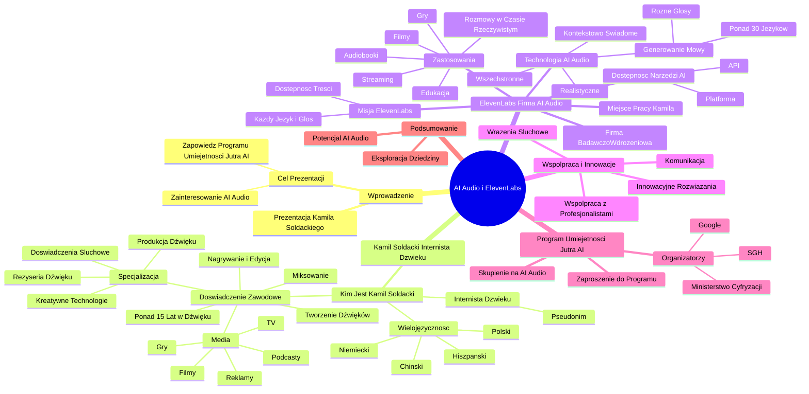

# Lekcje wideo - 1. Kim jest internauta dźwięku i co to ElevenLabs

# 💡 Diagram

___

# 🗒️ Notatka

# Szczegółowe Notatki i Podsumowanie Transkrypcji Wideo

## Wprowadzenie do Tematu `AI Audio` i ElevenLabs

Transkrypcja wideo przedstawia Kamila Sołdackiego, który wprowadza słuchaczy w fascynujący świat **AI Audio** i prezentuje firmę **ElevenLabs**, specjalizującą się w tej innowacyjnej technologii. Celem prezentacji jest wzbudzenie zainteresowania tematem i zapowiedź dogłębnego omówienia zagadnień **AI Audio** w ramach programu szkoleniowego "Umiejętności Jutra AI".

## Kim jest Kamil Sołdacki? - "Internista Dźwięku"

*   **Prezentacja:** Kamil Sołdacki w interesujący sposób demonstruje swoją wielojęzyczność, witając się po polsku, chińsku, hiszpańsku i niemiecku, aby zaintrygować słuchaczy lingwistycznymi możliwościami.
    *   **Polski:** Dzień dobry, nazywam się Kamil Sołdacki.
    *   **Chiński:** Nin hao, wo jiao Kamil Sołdacki.
    *   **Hiszpański:** Buenos dias, me llamo Kamil Sołdacki.
    *   **Niemiecki:** Guten Tag, mein name ist Kamil Sołdacki.
*   **"Internista Dźwięku":** Kamil przedstawia się jako "internista dźwięku" – to jego pseudonim wśród rodziny i przyjaciół.
*   **Doświadczenie zawodowe:**
    *   Ponad 15 lat doświadczenia w branży dźwiękowej.
    *   Zakres działalności: nagrywanie, edycja, miksowanie i tworzenie dźwięków.
    *   Media: reklamy, filmy, podcasty, programy telewizyjne, gry i inne media audiowizualne.
    *   **Specjalizacja:** Produkcja i reżyseria dźwięku, kreatywne łączenie technologii w celu tworzenia unikalnych doświadczeń słuchowych.

## ElevenLabs - Firma Badawczo-Wdrożeniowa `AI Audio`

*   **Miejsce pracy:** Kamil Sołdacki pracuje w **ElevenLabs**, firmie badawczo-wdrożeniowej w dziedzinie **AI Audio**.
*   **Misja ElevenLabs:**
    > Uczynienie wszelkich treści powszechnie dostępnymi w każdym języku i głosie.
*   **Rozwijana Technologia:** **ElevenLabs** rozwija najbardziej realistyczne, wszechstronne i kontekstowo świadome **Audio AI**.
    *   Generowanie mowy w ponad 30 językach, z wykorzystaniem różnorodnych głosów.
*   **Dostępność i Zastosowania:**
    *   Modele i narzędzia **AI** dostępne za pośrednictwem platformy lub **API**.
    *   Zastosowania w różnorodnych dziedzinach:
        *   Edukacja
        *   Streaming
        *   Audiobooki
        *   Gry
        *   Filmy
        *   Rozmowy w czasie rzeczywistym

## Współpraca i Innowacyjne Rozwiązania

*   **Współpraca z Profesjonalistami:** Kamil podkreśla wartość współpracy z profesjonalistami, wierząc w zespołowe działanie jako klucz do osiągania najlepszych rezultatów.
*   **Koncentracja na Innowacjach:** Jako "internista dźwięku", Kamil skupia się na nowatorskich rozwiązaniach, które wspierają komunikację i kreowanie niezapomnianych wrażeń słuchowych.

## Program "Umiejętności Jutra AI" i Zaproszenie do Dalszej Nauki

*   **Odejście od "youtubowego" podejścia:** Kamil żartobliwie nawiązuje do typowych próśb o subskrypcję, jednak rezygnuje z nich, zakładając pełne zaangażowanie i motywację uczestników programu "Umiejętności Jutra AI".
*   **Skupienie na `AI Audio`:** Zaproszenie do pogłębienia wiedzy na temat **AI Audio** w ramach programu.
*   **Organizatorzy Programu:** Na ekranie wyświetlana jest nazwa programu "Umiejętności Jutra AI" oraz logotypy organizatorów: Google, SGH i Ministerstwo Cyfryzacji.

## Podsumowanie

Kamil Sołdacki w swoim wprowadzeniu prezentuje się jako "internista dźwięku" i wprowadza słuchaczy w świat **AI Audio**, przedstawiając firmę **ElevenLabs**, w której pracuje. **ElevenLabs** koncentruje swoje działania na rozwoju zaawansowanych technologii **AI**, umożliwiających generowanie realistycznej mowy w wielu językach i różnorodnych głosach, znajdujących zastosowanie w sektorach od edukacji po rozrywkę. Prezentacja stanowi zapowiedź szczegółowego omówienia tematyki **AI Audio** w ramach programu "Umiejętności Jutra AI", akcentując innowacyjność technologii i istotę współpracy w jej rozwoju. Głównym celem jest ukazanie potencjału **AI Audio** i zachęcenie uczestników programu do dalszego eksplorowania tej dziedziny.

___

# 🔉 Transcript
File: Lekcje wideo - 1. Kim jest internauta dźwięku i co to ElevenLabs.mp4 
[00:00:05] Dzień dobry, nazywam się Kamil Sołdacki.
[00:00:08] Dzień dobry. Nazywam się Kamil Sołdacki.
[00:00:10] Dzień dobry. Nazywam się Kamil Sołdacki.
[00:00:14] Dzień dobry. Nazywam się Kamil Sołdacki. Stop, nic nie klikaj.
[00:00:18] To nie twoje połączenie się zawiesiło. Wszystko jest okej, serio.
[00:00:22] A co jeśli powiem ci, że przed chwilą usłyszałeś moje przywitanie w czterech różnych językach.
[00:00:27] Nie wierzysz? Sprawdźmy to.
[00:00:30] Dzień dobry, nazywam się Kamil Sołdacki.
[00:00:32] (Na ekranie pojawia się flaga Chin)
[00:00:34] Nin hao, wo jiao Kamil Sołdacki.
[00:00:36] (Na ekranie pojawia się flaga Hiszpanii)
[00:00:36] Buenos dias, me llamo Kamil Sołdacki.
[00:00:38] (Na ekranie pojawia się flaga Niemiec)
[00:00:39] Guten Tag, mein name ist Kamil Sołdacki.
[00:00:41] Nie uwierzyłeś mi, co?
[00:00:43] A wiesz, że ty też tak możesz i to w ponad 30 językach?
[00:00:47] Zostań ze mną do końca.
[00:00:49] Nazywam się Kamil, ale rodzina i przyjaciele mówią o mnie internista dźwięku.
[00:00:54] (Podzielony ekran. Z lewej strony Kamil Sołdacki, z prawej strony zbliżenie na usta i mikrofon)
[00:00:54] Moja zawodowa podróż, dźwięk, rozwija się od ponad 15 lat, w trakcie których zajmowałem się nagrywaniem, edytowaniem, miksowaniem i tworzeniem dźwięków do reklam, filmów, podcastów, programów telewizyjnych, gier i innych mediów audiowizualnych.
[01:10:00] Specjalizuje się w produkcji i reżyserii dźwięku, łącząc kreatywność z technologią, aby dostarczać wyjątkowe doświadczenia słuchowe.
[01:18:00] Na co dzień możesz spotkać mnie w Eleven Labs. Firmie zajmującej się badaniami i wdrażaniem AI Audio.
[01:25:00] (Na ekranie pojawia się animacja planety z zaznaczonymi flagami różnych krajów: Francji, Chin, USA, Wietnamu, Hiszpanii, Norwegii, Finlandii, Danii, Szwecji, Turcji, Meksyku, Węgier i Indii)
[01:25:00] Naszą misją jest sprawienie, żeby wszelkie treści były uniwersalnie dostępne w każdym języku i głosie.
[01:30:00] (Na ekranie napis IIElevenLabs)
[01:31:00] Rozwijamy najbardziej realistyczne, wszechstronne i kontekstowo świadome Audio AI.
[01:37:00] Pozwalając generować mowę w ponad 30 językach dowolnymi głosami.
[01:42:00] Nasze modele i narzędzia AI są dostępne przez naszą platformę lub API i znajdują zastosowanie w różnych dziedzinach, takich jak edukacja, streaming, audiobooki, gry, filmy i rozmowy w czasie rzeczywistym.
[01:55:00] Cenię sobie współpracę z profesjonalistami, takimi jak ty, wierząc, że najlepsze wyniki osiąga się grając zespołowo.
[02:03:00] Jako internista dźwięku, koncentruję się na innowacyjnych rozwiązaniach, które pomagają w komunikacji i tworzeniu niezapomnianych przeżyć.
[02:11:00] Gdybym miał swój kanał na YouTube, zapewne poprosiłbym cię teraz o suba, łapkę w górę i komentarz.
[02:17:00] Próbując złapać ciebie na dłużej.
[02:19:00] Ale wierzę, że skoro świadomie zdecydowałeś się dołączyć do programu szkoleniowego Umiejętności Jutra AI, jesteś w pełni skupiony i zmotywowany.
[02:28:00] Więc wgryźmy się w AI Audio.
[02:31:00] (Na ekranie napis Umiejętności Jutra AI, pod spodem loga organizatorów: Google, SGH i Ministerstwo Cyfryzacji)

___
# 🏷️ Tags
#AI_Audio
#ElevenLabs
#Umiejętności_Jutra_AI
#Kamil_Sołdacki
#Internista_Dźwięku
#AI
#Technologia_AI
#Generowanie_Mowy
#Synteza_Mowy
#Języki
#Wielojęzyczność
#Badania_i_Rozwój
#Dźwięk
#Produkcja_Dźwięku
#Reżyseria_Dźwięku
#Edycja_Dźwięku
#Miksowanie_Dźwięku
#Nagrywanie_Dźwięku
#Media_Audiowizualne
#Reklamy
#Filmy
#Podcasty
#Programy_Telewizyjne
#Gry
#Audiobooki
#Streaming
#Edukacja
#Rozmowy_w_czasie_rzeczywistym
#API
#Platforma_AI
#Innowacje
#Współpraca
#Google
#SGH
#Ministerstwo_Cyfryzacji
#Dostępność_treści
#Doświadczenia_słuchowe
