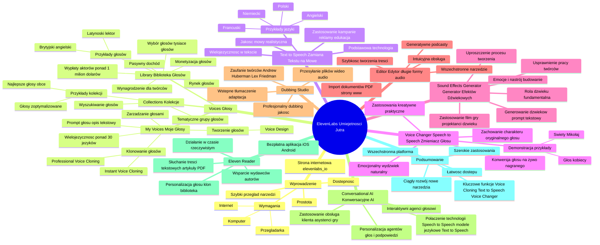

# Lekcje wideo - 2. Narzędzia ElevenLabs, które zmieniają reguły gry

# 💡 Diagram

___

# 🗒️ Notatka

# Notatki i Podsumowanie Transkrypcji Wideo „Umiejętności Jutra” o ElevenLabs

## Wprowadzenie do ElevenLabs

* **Dostępność i prostota:** ElevenLabs jest platformą dostępną dla każdego, nie wymagającą specjalistycznej wiedzy, sprzętu ani rozbudowanej infrastruktury serwerowej.
* **Wymagania:** Do korzystania z platformy wystarczy komputer z dostępem do internetu i przeglądarka internetowa.
* **Dostęp:** Platforma jest dostępna poprzez stronę internetową elevenlabs.io.
* **Szybki przegląd narzędzi:** Prezentacja ma na celu zwięzłe przedstawienie dostępnych narzędzi ElevenLabs.

## Voices - Głosy

### My Voices - Moje Głosy

* **Centralne miejsce zarządzania głosami:** Sekcja `My Voices` umożliwia szybki dostęp i efektywną organizację Twoich głosów.
* **Narzędzia do klonowania i tworzenia głosów:** Oferuje zaawansowane narzędzia do klonowania istniejących głosów oraz projektowania zupełnie nowych.
* **Opcje klonowania głosu:**
    * **Instant Voice Cloning:** Natychmiastowe klonowanie głosu.
    * **Professional Voice Cloning:** Profesjonalne klonowanie głosu, zapewniające wysoką jakość.
    * **Voice Design:** Projektowanie unikalnych, nowych głosów od podstaw.
* **Opis głosu za pomocą promptu:** Możliwość zdefiniowania pożądanego głosu lektora poprzez opis tekstowy (prompt).
* **Wielojęzyczność:** Każdy głos, w tym głosy sklonowane, jest dostępny w ponad 30 językach z natywną wymową.

### Library - Biblioteka Głosów

* **Rynek głosów:** `Library` to platforma wymiany głosów, gdzie społeczność ElevenLabs może udostępniać swoje głosy i zarabiać na ich wykorzystaniu.
* **Promowanie kreatywności i monetyzacja:** Umożliwia twórcom głosów zarabianie na swoich unikalnych projektach.
* **Bogaty wybór głosów:** Dostęp do tysięcy różnorodnych głosów z całego świata.
* **Przykłady zastosowań:** Dostępne są głosy takie jak latynoski lektor czy brytyjski angielski, idealny do raportów finansowych.
* **Wynagrodzenie dla twórców głosów:** Twórcy otrzymują wynagrodzenie za każde użycie ich głosów z biblioteki.
* **Możliwość pasywnego dochodu:** Twój głos może generować pasywny dochód.
* **Wypłaty dla aktorów głosowych:** W pierwszych miesiącach od wprowadzenia wypłat, aktorzy głosowi zarobili łącznie ponad 1 milion dolarów.

### Collections - Kolekcje

* **Ułatwienie wyszukiwania głosów:** Funkcja `Collections` pomaga w szybkim odnalezieniu idealnych głosów do konkretnych zastosowań.
* **Tematyczne grupy głosów:** Kolekcje grupują głosy według ich przeznaczenia, co usprawnia proces doboru głosu do potrzeb projektu.
* **Przykłady kolekcji:** Dostępne są kolekcje takie jak "Najlepsze głosy w językach obcych" czy "Głosy zoptymalizowane pod kątem konkretnych zastosowań".

## Text to Speech - Zamiana Tekstu na Mowę

* **Podstawowa technologia ElevenLabs:** `Text to Speech` to kluczowa technologia, stanowiąca fundament wielu funkcji platformy.
* **Wyjątkowa jakość mowy:** Modele ElevenLabs generują mowę o niezwykle realistycznym brzmieniu.
* **Wielojęzyczność w jednym tekście:** Możliwość tworzenia tekstów w wielu językach, które zostaną odczytane z zachowaniem natywnego akcentu dla każdego języka.
* **Przykłady tekstów wielojęzycznych:** Demonstracja natywnego akcentu na przykładach w języku polskim, angielskim, francuskim i niemieckim.
* **Zastosowanie:** Idealne do tworzenia wielojęzycznych kampanii reklamowych i materiałów edukacyjnych.

## Voice Changer (Speech to Speech) - Zmieniacz Głosu

* **Konwersja głosu w czasie rzeczywistym:** Umożliwia transformację głosu na żywo lub nagranego na inny, sklonowany głos.
* **Zachowanie charakteru oryginalnego głosu:** Pomimo zmiany barwy, zachowywany jest ton i sposób ekspresji oryginalnego głosu.
* **Szerokie spektrum zastosowań:** Funkcja oferuje nieograniczone możliwości kreatywne i praktyczne.
* **Emocjonalny i naturalny wydźwięk:** Umożliwia precyzyjne odwzorowanie subtelnych niuansów głosu, nadając nagraniom autentyczności i emocji.
* **Przykłady demonstracji:** Prezentacja zmiany głosu prezentera na głos kobiecy oraz głos Świętego Mikołaja 🎅.

## Sound Effects Generator - Generator Efektów Dźwiękowych

* **Kluczowa rola dźwięku:** Dźwięk jest elementem o fundamentalnym znaczeniu, często przewyższającym wagą obraz w odbiorze treści.
* **Budowanie emocji i nastroju:** Ścieżka dźwiękowa kreuje emocje i atmosferę, istotnie wpływając na kontekst przekazu.
* **Uproszczenie procesu tworzenia dźwięku:** Generator efektów dźwiękowych ElevenLabs znacząco ułatwia i przyspiesza proces poszukiwania idealnego dźwięku.
* **Generowanie dźwięków za pomocą promptów:** Narzędzie umożliwia generowanie dowolnych efektów dźwiękowych poprzez wprowadzenie opisu tekstowego (prompt).
* **Znaczące usprawnienie pracy:** Narzędzie to znacząco usprawnia pracę twórców treści.
* **Zastosowanie:** Szczególnie przydatny dla niezależnych twórców filmowych i gier, jak również dla profesjonalnych projektantów dźwięku.

## Editor - Edytor (długie formy audio)

* **Wszechstronne narzędzie:** `Editor` jest przeznaczony do tworzenia długich form audio, takich jak audiobooki, artykuły czy podcasty.
* **Generatywne podcasty:** Nowa funkcja umożliwiająca generowanie podcastów.
* **Import dokumentów:** Możliwość importowania plików PDF, stron internetowych i generowania na ich podstawie narracji lektorskich.
* **Intuicyjna obsługa:** Wystarczy przesłać plik lub link, wybrać preferowany głos i dostosować ustawienia.
* **Szybkość tworzenia treści:** Umożliwia błyskawiczne tworzenie długich form audio.

## Dubbing Studio

* **Profesjonalny dubbing wysokiej jakości:** Umożliwia tworzenie dubbingu w różnych językach z zachowaniem oryginalnej barwy głosu i charakteru wykonania.
* **Przesyłanie plików wideo i audio:** Proces dubbingu rozpoczyna się od przesłania pliku wideo lub audio i wyboru języków docelowych.
* **Wstępne tłumaczenie z opcją adaptacji:** Użytkownik otrzymuje wstępne tłumaczenie, które można dostosować do kontekstu kulturowego i specyfiki języka.
* **Zaufanie topowych twórców:** Z `Dubbing Studio` korzystają znani twórcy, m.in. Andrew Huberman, Lex Friedman, Colin i Samir, oraz Drubiński.

## Conversational AI - Konwersacyjne AI

* **Platforma interaktywnych agentów głosowych:** Narzędzie do wdrażania interaktywnych agentów głosowych, zdolnych do prowadzenia naturalnych i angażujących rozmów.
* **Połączenie zaawansowanych technologii:** Łączy `Speech to Speech`, modele językowe, `Text to Speech`, funkcję przerywania oraz logikę konwersacji.
* **Personalizacja agentów:** Możliwość personalizacji agentów poprzez wybór głosu oraz definiowanie podpowiedzi systemowych.
* **Zastosowanie:** Idealne do obsługi klienta, tworzenia wirtualnych asystentów i interaktywnych postaci w grach lub aplikacjach.

## Eleven Reader

* **Bezpłatna aplikacja:** `Eleven Reader` to darmowa aplikacja dostępna w sklepach iOS i Android oraz na stronie elevenreader.io.
* **Słuchanie treści tekstowych:** Umożliwia odsłuchiwanie artykułów, plików PDF, Epub, wiadomości e-mail i newsletterów.
* **Personalizacja głosu lektora:** Możliwość wyboru sklonowanego głosu, głosu z biblioteki lub ulubionego głosu znanej osoby.
* **Działanie w czasie rzeczywistym:** Wszystko odbywa się w czasie rzeczywistym, bez konieczności eksportowania plików.
* **Wsparcie dla wydawców i autorów:** Oferta współpracy skierowana do niezależnych wydawców i autorów ebooków.

## Podsumowanie

ElevenLabs to wszechstronna platforma oferująca zaawansowane narzędzia do generowania i modyfikacji mowy. Prezentacja podkreśla łatwość dostępu oraz szerokie spektrum zastosowań, od klonowania i projektowania głosów, poprzez zamianę tekstu na mowę w wielu językach, aż po generowanie efektów dźwiękowych i tworzenie dubbingu. Platforma umożliwia użytkownikom tworzenie wysokiej jakości treści audio bez specjalistycznej wiedzy czy specjalistycznego sprzętu, otwierając nowe możliwości dla twórców treści, firm i użytkowników indywidualnych. Szczególnie istotne funkcje to **Voice Cloning**, **Text to Speech**, **Voice Changer**, **Sound Effects Generator**, **Dubbing Studio** i **Conversational AI**, które razem tworzą kompleksowe środowisko do pracy z dźwiękiem. Dodatkowo, `Library` i `Collections` usprawniają wybór i zarządzanie głosami, a `Eleven Reader` rozszerza funkcjonalność platformy na aplikację mobilną do konsumpcji treści tekstowych w formie audio. ElevenLabs nieustannie się rozwija, zapowiadając nowe narzędzia i innowacyjne rozwiązania w przyszłości.

___

# 🔉 Transcript
File: Lekcje wideo - 2. Narzędzia ElevenLabs, które zmieniają reguły gry.mp4 
[00:00:00] (Pojawia się biały ekran).
[00:00:01] (Na ekranie pojawia się napis "Umiejętności Jutra" oraz logo "AI").
[00:00:05] (Mężczyzna siedzi przy biurku. Na ekranie pojawia się napis "Kamil Sołdacki" oraz "Audio director + ElevenLabs").
[00:00:05] Aby korzystać z narzędzi oferowanych przez ElevenLabs, nie potrzebujesz specjalistycznej wiedzy, konkretnego sprzętu czy całej infrastruktury serwerowej.
[00:00:14] Wystarczy tylko komputer z dostępem do internetu i twoją ulubioną przeglądarką, przez którą po prostu wejdź na stronę elevenlabs.io.
[00:00:23] I teraz zapraszam ciebie na szybką wycieczkę, podczas której opowiem ci o narzędziach ElevenLabs.
[00:00:30] Pierwszy krok to od razu to, co tygryski lubią najbardziej, czyli głosy, Voices.
[00:00:37] A tam My Voices, czyli wszechstronne centrum dowodzenia głosami, które zapewnia szybki dostęp i przejrzystą organizację, aby twoje projekty przebiegały sprawniej.
[00:00:48] My Voices to także kompleksowe narzędzia do klonowania głosów i tworzenia nowych modeli głosowych, dostosowanych do różnych potrzeb i poziomów zaawansowania użytkowników.
[00:00:59] Możesz tam sklonować swój głos przy użyciu Instant Voice Cloning lub Professional Voice Cloning, lub alternatywnie zaprojektować zupełnie nowy głos za pomocą narzędzia Voice Design.
[00:01:11] No właśnie.
[00:01:12] Czy umiesz za pomocą promptu opisać głos lektora, jaki uszami wyobraźni słyszysz w swoim filmie promocyjnym?
[00:01:21] I pamiętaj, każdy głos, również twój klon, dostępny jest w ponad 30 językach z natywnym akcentem.
[00:01:29] Jednak nie o szczegółach teraz.
[00:01:31] Idźmy dalej poprzez narzędzia zawarte w podstronie Voices.
[00:01:35] Library to specjalny marketplace, na którym nasza społeczność może dzielić się głosami i zdobywać wynagrodzenie za ich wykorzystanie.
[00:01:44] To przestrzeń, która promuje kreatywność i pozwala twórcom zarabiać na swoich unikalnych głosach.
[00:01:50] Potrzebujesz pięknie brzmiącego latynoskiego lektora na nowy rynek, który chcesz podbić swoim produktem?
[00:01:56] A może królewski British English do raportu finansowego?
[00:02:01] Dzięki naszej społeczności na pewno znajdziesz głos, jakiego potrzebujesz.
[00:02:06] Kilka tysięcy głosów z całego świata w jednym miejscu.
[00:02:10] (Na ekranie pojawia się kolaż zdjęć różnych osób w słuchawkach oraz napis "ElevenLabs. Voice Actor payouts are here...").
[00:02:11] (Na ekranie pojawia się laptop z wykresem zarobków).
[00:02:12] (Na ekranie pojawia się kolaż z grafikami i polami tekstowymi).
[00:02:16] (Na ekranie pojawia się zbliżenie wykresu zarobków).
[00:02:17] (Na ekranie pojawiają się instrukcje jak stworzyć i udostępnić klon głosu).
[00:02:20] (Na ekranie pojawia się kolaż zdjęć różnych osób i postaci z bajek).
[00:02:23] I pamiętaj, twórcy otrzymują wynagrodzenie za każdorazowe użycie ich głosów z biblioteki i zdradzę ci coś.
[00:02:27] W pierwszych miesiącach po uruchomieniu payouts, czyli wypłat, aktorzy głosowi zarobili łącznie ponad 1 milion dolarów na naszej platformie.
[00:02:27] A czy już przeszło ci przez myśl, że też możesz zmienić swój głos w pasywny dochód?
[00:02:33] Come on!
[00:02:35] Stosunkowo niedawno dodaliśmy funkcję kolekcji, aby ułatwić znajdowanie idealnych głosów do różnych zastosowań.
[00:02:43] Kolekcje grupują głosy według ich przeznaczenia, co pozwala szybko i efektywnie dopasować głos do twoich potrzeb.
[00:02:51] Szukasz najlepszych spośród całej platformy ElevenLabs głosów w języku obcym?
[00:02:56] A może interesuje cię głos zoptymalizowany pod kątem konkretnego zastosowania?
[00:03:02] Zajrzyj do Collections.
[00:03:04] Teraz mam ogromną przyjemność zjawić ci fundament działalności ElevenLabs, czyli Text to Speech, zamiana tekstu na mowę.
[00:03:14] Wiele funkcji, które oferujemy opiera się na tej właśnie technologii.
[00:03:19] A liczne usługi dostępne w internecie korzystają z naszego rozwiązania tam, gdzie wymagana jest najwyższa jakość generowanej mowy.
[00:03:27] Naprawdę!
[00:03:28] Modele ElevenLabs przekształcą tekst w niezwykle realistyczną mowę.
[00:03:33] Sprawdź to.
[00:03:35] W jednym ciągu możesz napisać tekst w kilku językach, a nasze modele bez problemu odczytają to z natywnym akcentem.
[00:03:43] Posłuchajmy.
[00:03:45] Witaj w naszym sklepie! Sprawdź nasze najnowsze promocje i odkryj produkty, które pokochasz.
[00:03:53] Welcome to our store! Check out our latest promotions and discover products you'll love.
[00:04:00] Bienvenue dans notre magasin! Découvrez nos dernières promotions et trouvez des produits que vous adorerez.
[00:04:08] Willkommen in unserem Geshaft! Schauen sie sich unsere neusten Angebote an und entdecken sie Produkte, die sie lieben werden.
[00:04:16] Prosty sposób, twórz wielojęzyczne kampanie, które przemawiają do globalnych klientów.
[00:04:23] A teraz narzędzie, które osobiście uwielbiam.
[00:04:26] Voice Changer.
[00:04:27] Wcześniej znany też jako Speech to Speech.
[00:04:30] Umożliwia konwersję jednego głosu, czyli głosu źródłowego, na inny głos sklonowany, zachowując ton i sposób wyrażania się oryginalnego głosu.
[00:04:41] Możliwości są niemal nieograniczone.
[00:04:43] Jest to szczególnie przydatne do odwzorowania subtelnych, charakterystycznych cech głosu, które nadają nagraniom jeszcze bardziej emocjonalny i ludzki wydźwięk.
[00:04:54] Brzmi kosmicznie?
[00:04:55] To sprawdźmy, jak ja zabrzmię jako kobieta.
[00:05:00] Dzień dobry, nazywam się Kamil Sołdacki.
[00:05:03] A teraz posłuchajmy Kamila w wersji Święty Mikołaj.
[00:05:10] Dzień dobry, nazywam się Kamil Sołdacki.
[00:05:12] It's a kind of magic, nie sądzisz?
[00:05:15] Mówi się, że dźwięk jest ważniejszy niż obraz.
[00:05:18] A teraz obserwuję, że większość ludzi zaakceptuje słabszy obraz, ale słabej jakości dźwięku raczej nie zniosą.
[00:05:27] Wiadomo.
[00:05:28] Ścieżka dźwiękowa wywołuje emocje i buduje nastrój.
[00:05:32] W zależności od użytych dźwięków i muzyki możesz całkowicie zmienić kontekst emocjonalny i swoje przesłanie.
[00:05:40] Znalezienie jednak idealnego dźwięku bywa trudne, bardzo trudne.
[00:05:44] Teraz dzięki ElevenLabs i naszemu generatorowi efektów dźwiękowych proces stał się znacznie prostszy.
[00:05:52] Narzędzie pozwala generować dowolne dźwięki za pomocą promptu, co znacząco usprawnia pracę.
[00:06:00] Jest to doskonałe rozwiązanie zarówno dla niezależnych twórców filmów czy gier, jak i dla dużych profesjonalnych projektantów dźwięków.
[00:07:01] (Odtwarzane są wygenerowane efekty dźwiękowe).
[00:07:06] Edytor, kompleksowe narzędzie do tworzenia długich treści audio, takich jak audiobooki, artykuły, od niedawna też generatywne podcasty.
[00:07:42] Edytor umożliwia użytkownikom przesłanie dokumentów, na przykład plików PDF lub stron internetowych i generowanie narracji lektorskich.
[00:07:51] Prościej się nie da.
[00:07:52] Wrzuć plik lub link, wybierz głos, dostosuj ustawienia jakości i twoja super długa forma audio jest gotowa.
[00:07:57] W moim zawodowym portfolio znajdziesz wiele realizacji dubbingowych filmów czy gier komputerowych, gdzie tygodniami poszukiwałem głosów podobnych do tych z oryginalnych ścieżek, a później miesiące nagrań, postprodukcji, no i oczywiście testów.
[00:08:16] Teraz dzięki Dubbing Studio od ElevenLabs możesz tworzyć wysokiej jakości dubbing w różnych językach, zachowując oryginalną barwę głosu i wykonanie.
[00:08:30] Wystarczy przesłać plik wideo lub audio, wybrać język źródłowy i docelowy.
[00:08:34] Wraz z rezultatem otrzymujesz wstępne tłumaczenie, które możesz zaadoptować do flow czy żartu kultury rynku docelowego.
[00:08:42] Z technologii Dubbing Studio skorzystało już wielu topowych twórców, takich jak Andrew Huberman, Lex Friedman, Colin i Samir czy Drubiński.
[00:08:52] A teraz jedno z naszych ostatnio opublikowanych narzędzi - Conversational AI, platforma do wdrażania interaktywnych agentów głosowych, które mogą prowadzić naturalne rozmowy z twoimi użytkownikami czy klientami.
[00:09:05] Konwersacyjne AI od ElevenLabs łączy technologię Speech to Speech, modele językowe, Text to Speech oraz funkcje takie jak obsługa przerywania i logika prowadzenia rozmów.
[00:09:17] Użytkownicy mogą personalizować agentów, wybierając różne głosy i systemowe podpowiedzi.
[00:09:21] Narzędzie idealnie sprawdza się w sytuacjach takich jak obsługa klienta, wirtualni asystenci czy interaktywne postaci.
[00:09:30] A jeśli zostaniesz ze mną do końca, dowiesz się o tym narzędziu więcej.
[00:09:35] Ale w sklepach z aplikacjami iOS i Android oraz na stronie elevenreader.io znajdziesz darmową aplikację Eleven Reader, która umożliwia użytkownikom słuchanie artykułów, plików PDF, Epub, maili, newsletterów i innych treści tekstowych przy pomocy swojego sklonowanego głosu, wybranego głosu z biblioteki lub ulubionego głosu gwiazd kina czy telewizji.
[01:12] W Eleven Reader nie możesz eksportować pliku.
[01:15] Wszystko dzieje się real time.
[01:17] Ale jeżeli jesteś niezależnym wydawcą, autorem ebooków lub innych treści tekstowych, wejdź na elevenreader.io i skontaktuj się z nami.
[01:18] Na dobrą sprawę to i tak nie wszystko, bo cały czas pracujemy nad nowymi modelami, narzędziami i rozwiązaniami, które pozwolą ci wejść na nowy poziom, o którym prawdopodobnie nigdy nie myślałeś.
[01:37:47]

___
# 🏷️ Tags
#ElevenLabs #AI #Umiejętności_Jutra #Kamil_Sołdacki #Audio_director #Voices #My_Voices #klonowanie_głosów #tworzenie_głosów #Instant_Voice_Cloning #Professional_Voice_Cloning #Voice_Design #prompt #wielojęzyczność #Library #marketplace #monetyzacja #pasywny_dochód #aktorzy_głosowi #Collections #Text_to_Speech #zamiana_tekstu_na_mowę #jakość_mowy #języki_obce #kampanie_reklamowe #Voice_Changer #Speech_to_Speech #konwersja_głosu #Sound_Effects_Generator #efekty_dźwiękowe #ścieżka_dźwiękowa #Editor #długie_formy_audio #audiobooki #artykuły #podcasty #generatywne_podcasty #Dubbing_Studio #dubbing #tłumaczenie #Andrew_Huberman #Lex_Friedman #Colin_i_Samir #Drubiński #Conversational_AI #interaktywni_agenci_głosowi #obsługa_klienta #wirtualni_asystenci #Eleven_Reader #aplikacja_mobilna #iOS #Android #ebooki #elevenreader_io
