# Lekcje wideo - 3. Twój profesjonalny klon głosu

# 💡 Diagram

```mermaid
mindmap
  root((Eleven Labs Narzędzia))
    Wprowadzenie
      Narzędzia Eleven Labs
        Text to Speech
        Audio Native
        Conversational AI
      Główny Nacisk
        Text to Speech
        Audio Native
    Text to Speech
      Elementy Generowania Mowy
        Wybór Głosu
          Tysiące Głosów
          Własny Klon Głosu
          Głosy Domyślne Default
          Głosy z Biblioteki
          Testowanie Głosów
        Modele
          Algorytmy AI
          Grupy Modeli
            Standardowe
              Multilingual V2
              Multilingual V1
              English V2
              Najwyższa Jakość
              Wyższa Latencja
            Flash
              Niska Latencja
              Czas Rzeczywisty
              Conversational AI
              Kompromis Dokładności
            Starsze Modele
              Mniej Zaawansowane
              Dostępne dla Użytkowników
        Ustawienia Głosu Voice Settings
          Stabilność Stability
            Niższe Wartości - Emocje Dynamika
            Wyższe Wartości - Stabilność Monotonia
          Podobieństwo Similarity
            Wyższe Wartości - Wierne Błędy Szumy
            Niższe Wartości - Odporność Artefakty
          Wyolbrzymienie Stylu Style Exaggeration
            Ekspresja i Styl
            Zasoby Obliczeniowe
            Latencja Stabilność
          Speaker Boost
            Podobieństwo Oryginał
            Moc Obliczeniowa Latencja
            Subtelne Efekty
        Rekomendowane Ustawienia Start
          Stabilność 50 Eksperymentuj
          Podobieństwo 75 Eksperymentuj
          Wyolbrzymienie i Speaker Boost Eksperymentuj
    Audio Native
      Funkcjonalność
        Odtwarzacz Audio Text to Speech
        Metryki Zaangażowania Statystyki
      Konfiguracja Audio Native
        Krok 1 Konfiguracja Konta
        Krok 2 Ustawienia Audio Native
        Krok 3 Lista Dozwolonych Domen Allow List
          Dodawanie URL
            Ogólny Adres Cała Strona
            Specyficzny Adres Blog
      Personalizacja Odtwarzacza
        Sekcja Odtwarzacz Player
        Wybór Głosu i Modelu Voice and Model
        Wygląd Odtwarzacza Player Appearance
        Tytuł i Autor Title and Author
        Dodatkowe Treści Custom Content
          Nagłówek Intro Outro
      Wdrażanie Audio Native
        Metody Wdrożenia
          Metoda 1 Osadzenie Automatyczne Odczytywanie HTML
          Metoda 2 Osadzenie Audio Projekt
          Metoda 3 Osadzenie API
        Metoda 1 Automatyczne Odczytywanie
          Kod HTML Zakładka Ogólne General
          Osadzenie na Stronie Allow List
          Nowa Podstrona Nowy Projekt
          Pobieranie Treści Strony
          Konwersja Audio Odtwarzacz
      Edycja Audio w Audio Native
        Błędy Audio Edycja Projektu
        Edit Audio
        Poprawki Tekstu
        Ponowna Konwersja
        Aktualizacja Pliku Audio
      Podsumowanie Audio Native
        Potężne Narzędzie
        Prosta Integracja Zaawansowane Funkcje
        Wzbogacenie Strony Audio
    Profesjonalny Klon Głosu Professional Voice Clone
      Wymagania
        Zaawansowany Model AI
        Minimum 30 Minut Nagrań
        Optymalnie 2-3 Godziny Nagrań
      Tworzenie Klonu Głosu
        Krok 1 Zakładka Głosy Voices
        Krok 2 Add a New Voice
        Krok 3 Professional Voice Cloning
        Krok 4 Regulamin i Polityka Prywatności
        Krok 5 Start
        Krok 6 Nazwa Klonu
        Krok 7 Język Plików
        Krok 8 Prześlij Nagrania
        Krok 9 Opis i Etykiety Opcjonalnie
        Krok 10 Create Professional Voice
    Podsumowanie Końcowe
      Narzędzia Eleven Labs
        Text to Speech
        Audio Native
      Aspekty Text to Speech
        Głosy Modele Ustawienia
      Konfiguracja Personalizacja Wdrożenie Audio Native
      Tworzenie Klonu Głosu
      Zaawansowane Możliwości Wzbogacenie Treści Audio
```

___

# 🗒️ Notatka

# Notatki i Podsumowanie Wideo o Narzędziach Eleven Labs

## Wprowadzenie

Wideo szczegółowo prezentuje trzy narzędzia oferowane przez Eleven Labs: **Text to Speech**, **Audio Native** i **Conversational AI**.  Główny nacisk położono na funkcjonalności **Text to Speech** i **Audio Native**.

## 1. Text to Speech

### Podstawowe Elementy Generowania Mowy

* **Wybór głosu:**
    * Dostępne są tysiące głosów.
    * Możliwość wykorzystania własnego klonu głosu (omówione w dalszej części).
    * **Głosy domyślne (default):**
        * Starannie wyselekcjonowane i zoptymalizowane pod kątem kluczowych zastosowań.
        * Dostępne dla wszystkich użytkowników Eleven Labs.
    * **Głosy z biblioteki:**
        * Ich jakość i stabilność zależą od jakości nagrania źródłowego i użytego modelu.
        * Różne głosy lepiej sprawdzają się w różnych językach i zastosowaniach.
        * Zalecenie: **Testuj i sprawdzaj różne głosy**, aby znaleźć najlepsze dopasowanie.

### Modele

* **Modele w Eleven Labs:** Zaawansowane algorytmy AI, które przekształcają tekst w mowę.
* Zaprojektowane z myślą o różnorodnych zastosowaniach i oferują unikalne cechy.
* **Grupy Modeli:**
    * **Standardowe:**
        * **Multilingual V2, V1, English V2.**
        * Charakteryzują się najwyższą jakością i dokładnością.
        * **Wyższa latencja** (dłuższy czas oczekiwania na wygenerowanie plików).
    * **Flash:**
        * Zoptymalizowane pod kątem **niskiej latencji.**
        * Idealne do zastosowań w czasie rzeczywistym, na przykład **Conversational AI.**
        * Niewielki kompromis w zakresie dokładności i stabilności głosów.
    * **Starsze Modele:**
        * Mniej zaawansowane, ale nadal dostępne dla użytkowników, którzy z nich korzystają.
        * Eleven Labs ceni długoletnie relacje z użytkownikami.
        * Szczegółowe informacje można znaleźć na stronie Eleven Labs.

### Ustawienia Głosu (Voice Settings)

* Różnorodne ustawienia pozwalają na dostosowanie brzmienia i stylu głosu.
* **Stabilność (Stability):**
    * Kontroluje stabilność głosu oraz stopień losowości między generowanymi wersjami.
    * **Niższe wartości:** Większy zakres emocji, dynamiczne wykonanie (np. w dramatycznych wystąpieniach).
    * **Wyższe wartości:** Bardziej stabilne i monotonne wykonanie.
* **Podobieństwo (Similarity):**
    * Określa, jak wiernie technologia ma odwzorować oryginalny głos.
    * **Wyższe wartości:** Bardzo wierne odwzorowanie, ale mogą uwypuklić błędy/szumy z nagrania źródłowego.
    * **Niższe wartości:** Większa odporność na artefakty dźwiękowe i szumy.
* **Wyolbrzymienie stylu (Style Exaggeration):**
    * Zwiększa ekspresję i styl oryginalnego głosu.
    * Wymaga większych zasobów obliczeniowych (może wydłużyć czas generowania i obniżyć stabilność).
* **Speaker Boost:**
    * Subtelnie wzmacnia podobieństwo do oryginalnego głosu.
    * Zwiększa zapotrzebowanie na moc obliczeniową (wpływa na latencję).
    * Efekty są subtelne i nie zawsze łatwo zauważalne.

### Rekomendowane Ustawienia na Start

* **Stabilność (Stability):** Zacznij od wartości **50** i eksperymentuj.
* **Podobieństwo (Similarity):** Ustaw około **75** i eksperymentuj, aby znaleźć równowagę między wiernością a odpornością na artefakty.
* **Wyolbrzymienie i Speaker Boost:** Zachęca się do eksperymentowania.

## 2. Audio Native

### Funkcjonalność

* Wbudowany odtwarzacz audio, który automatycznie odczytuje treści stron internetowych za pomocą **Text to Speech** od Eleven Labs.
* Wbudowane metryki śledzenia zaangażowania użytkowników (panel statystyk słuchacza).

### Konfiguracja Audio Native

* **Krok 1: Konfiguracja na koncie.** Nie pomijaj żadnego kroku.
* **Krok 2: Otwórz Audio Native i przejdź do Ustawień (Settings).**
* **Krok 3: Skonfiguruj listę dozwolonych domen (allow list).**
    * Dodaj adresy stron, na których odtwarzacz ma działać.
    * Odtwarzacz będzie działał tylko na stronach znajdujących się na tej liście.
    * **Dodawanie URL:** Kliknij \"add URL\" i wpisz adres.
        * **Ogólny adres (np. twojastrona.pl):** Odtwarzacz działa na całej stronie.
        * **Specyficzny adres (np. twojastrona.pl/blog):** Odtwarzacz działa tylko na stronach bloga.

### Personalizacja Odtwarzacza

* Przejdź do sekcji **Odtwarzacz (Player)**.
* **Wybór głosu i modelu (Voice and Model):** Ustaw domyślny głos do automatycznego odczytywania treści.
* **Wygląd odtwarzacza (Player appearance):** Dostosuj wygląd odtwarzacza do swoich preferencji.
* **Tytuł i autor (Title and author):** Ustaw domyślny tytuł i autora.
* **Dodatkowe treści (Custom content):** Dodaj niestandardowe treści (nagłówek, intro, outro) do każdego odtwarzanego audio.

### Wdrażanie Audio Native

* **Trzy metody wdrożenia:**
    1. **Osadzenie i automatyczne odczytywanie treści strony (główne zagadnienie wideo).**
    2. Osadzenie audio z istniejącego projektu.
    3. Osadzenie audio przy użyciu **API**.
* **Metoda 1: Automatyczne odczytywanie treści strony:**
    * Skopiuj wygenerowany kod HTML z zakładki **Ogólne (General)**.
    * Osadź kod na stronie internetowej, która znajduje się na **allow list**.
    * Przy utworzeniu nowej podstrony, Audio Native automatycznie tworzy nowy projekt.
    * Pobiera treść strony i dodaje ją do projektu.
    * Konwertuje projekt na audio i umieszcza odtwarzacz na stronie.

### Edycja Audio w Audio Native

* W przypadku wykrycia błędów w wygenerowanym audio:
    * Otwórz projekt w Audio Native.
    * Kliknij **\"edit audio\"**.
    * Wprowadź poprawki w tekście.
    * Ponownie przekonwertuj tekst na audio.
    * Zaktualizuj plik audio w odtwarzaczu z poziomu Audio Native.

### Podsumowanie Audio Native

* Potężne narzędzie do automatycznego odczytywania treści.
* Prosta integracja i zaawansowane funkcje.
* Umożliwia wzbogacenie strony internetowej o unikalne doznania audio.

## 3. Profesjonalny Klon Głosu (Professional Voice Clone)

### Wymagania

* Zaawansowany model AI, który wiernie odwzorowuje głos.
* **Minimum 30 minut nagrań treningowych.**
* **Optymalnie 2-3 godziny nagrań** dla osiągnięcia maksymalnej jakości i naturalności klonu.

### Tworzenie Klonu Głosu

1. Kliknij zakładkę **Głosy (Voices)**.
2. Wybierz **\"add a new voice\"**.
3. Zaznacz opcję **\"Professional Voice Cloning\"**.
4. Potwierdź zapoznanie się z regulaminem i polityką prywatności.
5. Kliknij **\"start\"**.
6. Nadaj nazwę klonowi głosu.
7. Wybierz język plików treningowych.
8. Prześlij nagrania.
9. Opcjonalnie dodaj opis i etykiety.
10. Kliknij **\"create professional voice\"**.

## Podsumowanie Końcowe

Wideo przedstawiło narzędzia Eleven Labs, z naciskiem na **Text to Speech** i **Audio Native**. Omówiono kluczowe aspekty generowania mowy, wybór głosów i modeli, ustawienia głosu w **Text to Speech**, a także konfigurację, personalizację i wdrażanie **Audio Native**. Na koniec zaprezentowano proces tworzenia **profesjonalnego klonu głosu**. Narzędzia Eleven Labs oferują zaawansowane możliwości w zakresie generowania mowy i wzbogacania treści audio na stronach internetowych.

___

# 🔉 Transcript
File: Lekcje wideo - 3. Twój profesjonalny klon głosu.mp4 
[00:00:00] (Białe tło.)
[00:00:05] (Na białym tle napis "Umiejętności Jutra AI". Na dole logotypy Google, SGH i Ministerstwa Cyfryzacji.)
[00:00:05] Teraz chciałbym pokazać Ci szczegółowo trzy narzędzia Eleven Labs.
[00:00:09] Text to speech, audio native, conversational AI.
[00:00:13] (Ekran z interfejsem ElevenLabs: AI Voice Generator & Text to Speech. Po lewej stronie menu: Home, Voices, Playground, Text to Speech, Voice Changer, Sound Effects, Products, Studio, Dubbing, Conversational AI. Po prawej stronie interfejs Eleven Labs Workspace.)
[00:00:14] Podstawowe elementy generowania mowy w Text to Speech to.
[00:00:17] (Ekran z interfejsem Text to Speech z zakładkami Settings, History, Feedback. Po prawej stronie Voice, Model, Stability, Similarity, Style Exaggeration, Speaker Boost i Reset Values.)
[00:00:17] Wybór głosu, wybór modelu, ustawienia głosu.
[00:00:22] Zacznijmy od wybrania odpowiedniego głosu.
[00:00:25] Tak jak wspominałem we wprowadzeniu, do wyboru masz tysiące głosów.
[00:00:30] Oczywiście na tej liście może znajdować się twój własny klon, ale o tym później.
[00:00:36] Ja dziś wybiorę jeden z głosów domyślnych.
[00:00:39] Głosy default to zbiór starannie wyselekcjonowanych głosów zoptymalizowanych pod kątem kluczowych zastosowań.
[00:00:46] Są one dostępne dla wszystkich użytkowników Eleven Labs.
[00:00:50] Jeśli jednak wybierzesz jakiś głos z biblioteki, pamiętaj: jakość i stabilność głosu zależą od źródłowego nagrania oraz modelu, w którym pracuje głos.
[01:01] Jedne głosy lepiej sprawdzają się w konkretnych językach lub zastosowaniach, inne gorzej.
[01:06] Testuj, sprawdzaj, castinguj.
[01:10] Zapewne teraz zastanawiasz się czym są modele.
[01:14] Modele w Eleven Labs to zaawansowane algorytmy sztucznej inteligencji, które przekształcają tekst w mowę.
[01:21] Każdy model został zaprojektowany z myślą o różnych zastosowaniach i oferuje unikalne cechy dostosowane do potrzeb użytkowników.
[01:30] Standardowe, takie jak multilingual w wersji V2 i V1 oraz English V2.
[01:37] Które oferują najlepszą jakość i dokładność.
[01:40] Ale wysoka jakość, stabilność i realistycznie brzmiące głosy potrzebują więcej czasu na wygenerowanie plików.
[01:48] Zatem standardowe modele to też wyższa latencja, czyli dłuższy czas oczekiwania na reakcję.
[01:55] Druga grupa modeli nazywa się Flash.
[01:58] Modele te są zoptymalizowane pod kątem niskiej latencji, idealne i do użycia w czasie rzeczywistym, na przykład w conversational AI.
[02:08] Jednak szybsze przetwarzanie zawsze jest niewielkim kompromisem w zakresie dokładności i stabilności głosów.
[02:14] Czy teraz pojawia się w twojej głowie pytanie, dlaczego na liście wymienione jest dużo więcej modeli?
[02:21] Chętnie odpowiem.
[02:22] Są to nasze poprzednie, mniej rozwinięte modele, ale z których część użytkowników nadal korzysta, a my lubimy budować długoletnie relacje z użytkownikami, niezależnie od dynamicznych zmian.
[02:36] Szczegółowe informacje znajdziesz na naszej stronie.
[02:39] Rzućmy jeszcze okiem i uchem na ustawienia głosu.
[02:42] W Eleven Labs oferujemy różnorodne ustawienia głosów, które pozwalają dostosować ich brzmienie i styl.
[02:50] To trochę jak zestaw podstawowych przypraw w każdej kuchni.
[02:54] Niby nic, a czuć różnicę.
[02:56] Oto jak działają poszczególne ustawienia głosu.
[02:59] Stabilność stability.
[03:02] Kontroluje stabilność głosu oraz stopień losowości między generowanymi wersjami.
[03:08] Niższe wartości tego suwaka to większy zakres emocji, czyli bardziej dynamiczne wykonanie.
[03:13] Na przykład do żywych i dramatycznych wystąpień.
[03:17] Za to wyższe wartości powinny pomóc w osiągnięciu stabilniejszego i bardziej monotonnego wykonania.
[03:24] Podobieństwo similarity określa jak blisko nasza technologia ma trzymać się oryginalnego głosu, jego replikacji.
[03:33] Wyższe wartości wiernie reprodukują oryginalny głos, ale mogą uwypuklać błędy lub szumy z nagrania źródłowego.
[03:41] Za to niższe wartości tego ustawienia są bardziej odporne na artefakty dźwiękowe czy szumy z nagrania źródłowego.
[03:48] Style exaggeration.
[03:50] Hm, jak to będzie po polsku?
[03:53] Wyolbrzymienie stylu.
[03:56] Trochę brzmi jak funkcja dla współczesnych raperów.
[04:00] To ustawienie zwiększa ekspresję i styl oryginalnego głosu.
[04:04] Zmiana tego ustawienia wymaga większych zasobów obliczeniowych, co może wydłużyć czas generowania i obniżyć stabilność modelu.
[04:13] Ostatnia opcja speaker boost to subtelne wymuszenie podobieństwa do oryginalnego głosu.
[04:20] O ile poprzednie ustawienia to grzeczne sugestie reżysera, tak tutaj to już jest lekkie tupnięcie nogą.
[04:28] Pamiętaj jednak, że to ustawienie zwiększa zapotrzebowanie na moc obliczeniową, zatem i wpływa na latencję.
[04:35] A wyniki to tylko subtelne zmiany, więc nie zawsze zauważalne.
[04:40] No chyba, że masz ucho internisty dźwięku.
[04:43] Co mogę na początek zarekomendować?
[04:46] Stabilność zacznij od wartości 50, ale nie bój się eksperymentować.
[04:52] Similarity ustaw około 75, aby uzyskać równowagę między wiernym odwzorowaniem, a odpornością na artefakty, ale nie bój się eksperymentować.
[05:03] Wyolbrzymienie i speaker boost nie bój się eksperymentować.
[05:08] A teraz, jak mawia Deckard Kane w mojej ulubionej grze, zostań na chwilę i posłuchaj.
[05:11] (Ekran z interfejsem ElevenLabs: AI Voice Generator & Text to Speech. Po lewej stronie menu: Home, Voices, Playground, Text to Speech, Voice Changer, Sound Effects, Products, Studio, Dubbing, Conversational AI. Po prawej stronie interfejs Text to Speech.)
[05:46] Audio native to wbudowany odtwarzacz audio, który automatycznie odczytuje treści strony internetowej przy użyciu technologii text to speech od Eleven Labs.
[05:57] Narzędzie to zawiera również wbudowane metryki, które pozwalają śledzić zaangażowanie użytkowników za pomocą panelu statystyk słuchacza.
[06:05] Aby rozpocząć musisz skonfigurować audio native na swoim koncie.
[06:10] Nie pomijaj żadnego kroku.
[06:12] Pomoże Ci to uniknąć problemów w działaniu i w pełni zrozumieć jak działa narzędzie.
[06:17] (Ekran z interfejsem ElevenLabs: AI Voice Generator & Text to Speech. Po lewej stronie menu: Home, Voices, Playground, Text to Speech, Voice Changer, Sound Effects, Products, Studio, Dubbing, Conversational AI. Po prawej stronie interfejs strony domowej.)
[06:19] Otwórz audio native.
[06:21] (Ekran z interfejsem Audio Native z zakładkami Pages i Settings. Po prawej stronie opis Audio Motive i przycisk Go to settings.)
[06:22] A następnie przejdź do settings.
[06:25] (Interfejs Audio Native z zakładkami Pages i Settings i opcjami General: Embed code, URL allowlist.)
[06:25] Skonfiguruj najpierw listę dozwolonych domen, allow list.
[06:30] Dodaj adresy, na których odtwarzacz będzie działać.
[06:34] Odtwarzacz Audio Native zadziała tylko na stronach z tej listy.
[06:38] (Na interfejsie wyświetla się okno Add a URL to the allowlist.)
[06:38] Kliknij add URL i wpisz adres.
[06:42] Pamiętaj jednak, jeśli dodasz ogólny adres, na przykład twojastrona.pl, odtwarzacz będzie działać na całej stronie.
[06:51] Jeśli dodasz specyficzne odniesienie, na przykład twojastrona.pl/blog, odtwarzacz będzie działać wyłącznie na stronach bloga.
[07:02] Odtwarzacz Audio Native możesz spersonalizować.
[07:05] W tym celu przejdź do sekcji player.
[07:09] (Na interfejsie opcje Voice and Model, Player appearance, Title and author, Custom content, Pronunciation dictionaries, CSS Selectors.)
[07:09] Wybierz domyślny głos dla odtwarzacza, czyli głos dla automatycznego odczytywania treści.
[07:17] Dostosuj wygląd odtwarzacza.
[07:20] Ustaw domyślny tytuł i autora dla odtwarzacza.
[07:24] Możesz wpisać też dodatkowe treści, które będą dodawane do każdego audio.
[07:30] Takie jak header, intro czy outro.
[07:34] Po zakończeniu personalizacji wróć do zakładki General i skopiuj wygenerowany kod HTML.
[07:42] Użyj tego kodu, aby osadzić odtwarzacz na dowolnej stronie z listy dozwolonych domen.
[07:50] Generalnie istnieją trzy sposoby wdrożenia audio native na twojej stronie.
[07:55] Metoda pierwsza to osadzenie i automatyczne odczytywanie treści strony.
[08:00] Metoda druga, osadzenie audio z istniejącego już projektu, a metoda trzecia, osadzenie audio przy użyciu API.
[08:08] Ja teraz skupię się tylko na pierwszej metodzie, która to jest najbardziej podstawowa i najczęściej wybierana przez naszych użytkowników.
[08:16] Automatyczne odczytywanie treści strony polega na tym, aby wygenerowany kod osadzić na swojej stronie internetowej.
[08:24] Dzięki temu przy każdym utworzeniu nowej podstrony w twojej domenie audio native automatycznie tworzy nowy projekt.
[08:33] Pobiera treści strony i dodaje je do utworzonego projektu.
[08:38] Konwertuje projekt na audio i umieszcza odtwarzacz na stronie.
[08:43] Jeśli po automatycznym wygenerowaniu audio zauważysz literówkę w tekście lub po prostu jakiś błąd w dźwięku, wystarczy, że otworzysz projekt w audio native.
[08:53] Klikając edit audio.
[08:56] Teraz wprowadź zmiany w tekście.
[08:59] Ponownie przekonwertuj tekst w audio.
[09:02] I z poziomu audio native zmień plik audio w odtwarzaczu.
[09:11] Audio native to potężne narzędzie, które umożliwia automatyczne odczytywanie treści.
[09:17] Dzięki prostej integracji i zaawansowanym funkcjom możesz łatwo wzbogacić swoją stronę o unikalne doznania audio.
[09:25] Kilka razy wspominałem, że opowiem ci jak stworzyć twój klon głosu.
[09:28] Profesjonalny klon głosu, czyli professional voice clone, to zaawansowany model AI, który wiernie odzwierciedli twój głos.
[09:44] Wymaga co najmniej 30 minut nagrań treningowych, optymalnie do dwóch, trzech godzin, aby osiągnąć maksymalną jakość i naturalność.
[09:53] O to jak go stworzyć.
[09:56] Kliknij zakładkę voices i wybierz add a new voice.
[10:00] I zaznacz opcję Professional Voice Cloning.
[10:06] Potwierdź znajomość regulaminu i polityki prywatności.
[10:08] Kliknij start.
[10:10] Nadaj nazwę swojemu klonowi.
[10:12] Wybierz język plików, które wrzucasz do trenowania modelu i prześlij swoje nagrania.
[10:18] Opcjonalnie dodaj opis i etykiety, które później możesz zmienić.
[10:23] Kliknij teraz create professional voice.
[10:30] (Interfejs Conversational AI z zakładkami Agent, Voice, Analysis, Security, Advanced, Widget. Wyświetlony Agent Language, Additional Languages, First message, System prompt, Dynamic variables, LLM, Temperature, Limit token usage, Knowledge base, Tools, Secrets.)
[10:30] I gotowy.

[10:30] (Zaciemnienie ekranu.)

___
# 🏷️ Tags
#eleven_labs #text-to-speech #audio_native #conversational_AI #generowanie_mowy #wybór_głosu #klon_głosu #głosy_domyślne #biblioteka_głosów #modele #algorytmy_AI #multilingual_V2 #multilingual_V1 #english_V2 #flash #latencja #ustawienia_głosu #stability #similarity #style_exaggeration #speaker_boost #odtwarzacz_audio #strony_internetowe #zaangażowanie_użytkowników #statystyki_słuchacza #konfiguracja #lista_dozwolonych_domen #personalizacja_odtwarzacza #wygląd_odtwarzacza #tytuł_autor #custom_content #wdrażanie #API #kod_HTML #edycja_audio #profesjonalny_klon_głosu #professional_voice_clone #nagrania_treningowe #jakość_głosu #naturalność_głosu #voices #regulamin #polityka_prywatności #AI
