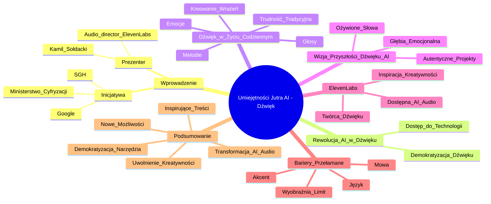

# Lekcje wideo - 4. Zainspiruj świat swoim dźwiękiem

# 💡 Diagram

___

# 🗒️ Notatka

# Notatki i Podsumowanie Prezentacji Wideo: "Umiejętności Jutra AI"

## Wprowadzenie

Prezentacja Kamila Sołdackiego (Audio director z `ElevenLabs`), z inicjatywy "Umiejętności Jutra AI" (Google, SGH, Ministerstwo Cyfryzacji), koncentruje się na **rewolucji, jaką sztuczna inteligencja (AI) wprowadza w dziedzinie dźwięku**.  Szczególny nacisk położono na możliwości oferowane przez `ElevenLabs`, podkreślając, jak **AI audio demokratyzuje dostęp do zaawansowanych narzędzi dźwiękowych**. Dzięki temu każdy może tworzyć wyjątkowe i angażujące doświadczenia dźwiękowe.

## Dźwięk w Codziennym Życiu

- Dźwięki nieustannie nam towarzyszą: **głosy, melodie, emocje zawarte w barwie głosu**.
- AI audio otwiera przed nami nowe perspektywy, umożliwiając nie tylko odbiór, ale i **aktywne kreowanie fascynujących wrażeń słuchowych**.
    - Coś, co dotychczas było **trudno osiągalne lub wymagało znacznych nakładów czasu i pracy**, staje się dostępne.

## Wizja Przyszłości Dźwięku z AI

- **Wyobraź sobie świat, w którym każde słowo nabiera życia.**
- **Każdy projekt dźwiękowy brzmi autentycznie i naturalnie.**
- **Każda opowieść zyskuje głębię i rezonans emocjonalny.**

## `ElevenLabs` - Dźwiękowe Marzenia na Wyciągnięcie Ręki

- `ElevenLabs` urzeczywistnia wizję **powszechnie dostępnej i potężnej sztucznej inteligencji audio**.
- **Każdy może stać się twórcą niezwykłych kompozycji dźwiękowych.**
- **Technologia inspiruje do kreatywności, która z kolei inspiruje innych.**

## Bariery Przełamane z `ElevenLabs`

- **Jedynym ograniczeniem staje się Twoja wyobraźnia.**
- **Z `ElevenLabs` znikają bariery związane z:**
    - **Mową**
    - **Językiem**
    - **Akcentem**

## Podsumowanie

Prezentacja "Umiejętności Jutra AI" z Kamilem Sołdackim akcentuje **transformacyjną moc AI audio w procesie tworzenia dźwięku**.  `ElevenLabs` prezentowane jest jako **narzędzie demokratyzujące dostęp do zaawansowanych technologii dźwiękowych**. Umożliwia ono tworzenie bogatych i emocjonujących doświadczeń dźwiękowych każdemu, niezależnie od umiejętności technicznych czy dostępnych zasobów.  Kluczowym przesłaniem jest **uwolnienie kreatywności i wyobraźni w sferze dźwięku**. W tym nowym paradygmacie, ludzka pomysłowość staje się jedynym limitem, w przeciwieństwie do dotychczasowych ograniczeń technologicznych, językowych czy akcentowych.  `ElevenLabs` zachęca do eksploracji nowatorskich możliwości i generowania inspirujących treści dźwiękowych.

___

# 🔉 Transcript
File: Lekcje wideo - 4. Zainspiruj świat swoim dźwiękiem.mp4 
[00:00:01] (Na ekranie pojawia się napis "Umiejętności Jutra AI" wraz z logami Google, SGH i Ministerstwa Cyfryzacji.)
[00:00:05] Nasze, czyli Twoje
[00:00:08] (Na ekranie pojawia się podpis z imieniem i nazwiskiem prezentera: Kamil Sołdacki, Audio director + ElevenLabs.)
[00:00:08] i Twoje, no i moje codzienne życie
[00:00:11] to w dużej mierze dźwięki.
[00:00:13] Głosy, melodie, emocje ukryte w tonie wypowiedzi.
[00:00:17] Dzięki AI audio, mamy teraz możliwość nie tylko słuchania, ale też kreowania niesamowitych doświadczeń dźwiękowych, które wcześniej wydawały się nieosiągalne.
[00:00:27] A na pewno wymagały ogromnego nakładu czasu i pracy.
[00:00:31] Wyobraź sobie świat, w którym każde słowo ożywa.
[00:00:35] Każdy projekt brzmi autentycznie, a każda historia nabiera głębi i emocji.
[00:00:41] ElevenLabs nie tylko spełnia te marzenia, ale sprawia, że każdy z Was może stać się twórcą wyjątkowych doświadczeń dźwiękowych.
[00:00:50] Dziękuję za wspólną podróż przez świat dźwięków.
[00:00:54] Teraz Twoja kolej, aby wykorzystać te technologie i stworzyć coś, co inspiruje innych.
[01:01:30] Pamiętaj, ogranicza Cię tylko Twoja wyobraźnia, bo dzięki ElevenLabs już na pewno nie mowa, język, czy akcent.
[01:10:07] Do zobaczenia.
[01:12:01] (Na ekranie pojawia się napis "Umiejętności Jutra AI" wraz z logami Google, SGH i Ministerstwa Cyfryzacji.)

___
# 🏷️ Tags
#Umiejętności_Jutra_AI #Google #SGH #Ministerstwo_Cyfryzacji #Kamil_Sołdacki #Audio_director #ElevenLabs #AI #sztuczna_inteligencja #AI_audio #dźwięk #rewolucja_dźwięku #dostęp_do_narzędzi_dźwiękowych #doświadczenia_dźwiękowe #wrażenia_słuchowe #kreowanie_dźwięku #przyszłość_dźwięku #autentyczność #naturalność #głębia_emocjonalna #kompozycje_dźwiękowe #kreatywność #inspiracja #bariery_dźwiękowe #mowa #język #akcent #transformacja_dźwięku #technologie_dźwiękowe #uwolnienie_kreatywności #wyobraźnia #ograniczenia_technologiczne #nowatorskie_możliwości #treści_dźwiękowe #głos #melodia #emocje #ton_wypowiedzi #słuchanie #projekty_dźwiękowe #historia #twórca_dźwięku
