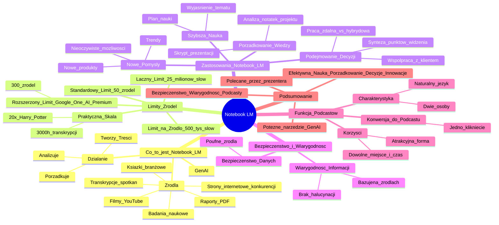

# Lekcje wideo - 1. Wstęp

# 💡 Diagram

___

# 🗒️ Notatka

# Notatki i Podsumowanie Wideo o Notebook LM

## Wprowadzenie

Prezentacja Cezarego Jaroniego, Product Marketing Managera w Google, przedstawia **Notebook LM** jako jedno z najważniejszych odkryć 2024 roku według magazynu Time. Celem wideo jest wyjaśnienie, czym jest Notebook LM, jak działa i jakie są jego zastosowania.

## Co to jest Notebook LM?

- **Notebook LM** to **GenAI** (Generative AI - Generatywna Sztuczna Inteligencja), oparty na źródłach dostarczonych przez użytkownika.
- **Działanie:** Uporządkowuje, analizuje i tworzy treści tekstowe oraz audio na podstawie wybranych źródeł.
- **Źródła:** Potrafi przetwarzać różnorodne materiały, w tym:
    - Badania naukowe
    - Raporty w formacie PDF
    - Książki branżowe
    - Strony internetowe konkurencji
    - Transkrypcje spotkań
    - Filmy z YouTube

## Limity Źródeł

- **Standardowy Limit:** Do **50 źródeł** jednocześnie.
- **Limit na Źródło:** Do **500 tysięcy słów** na źródło.
- **Łączny Limit:** Do **25 milionów słów** łącznie we wszystkich źródłach.
- **Praktyczna Skala:** Możliwość analizy esencji z ponad **3000 godzin transkrypcji spotkań** lub przetworzenia serii książek **20 razy dłuższych niż seria o Harrym Potterze**.
- **Rozszerzony Limit (Google One AI Premium):** Dla subskrybentów **Google One AI Premium** (z Gemini Advanced) limit źródeł wzrasta do **300**.

## Zastosowania Notebook LM

Notebook LM stworzono, aby **lepiej rozumieć informacje**, co znajduje szerokie zastosowanie w różnych dziedzinach:

### 1. Szybsza i Skuteczniejsza Nauka

- **Problem:** Czasochłonność słuchania wykładów, przeglądania książek i czytania trudnych artykułów naukowych.
- **Rozwiązanie z Notebook LM:** Po przesłaniu materiałów do Notebooka, można poprosić go o:
    - **Wyjaśnienie tematu w prosty sposób, z przykładami.**
    - **Przygotowanie planu nauki na określony czas (np. dwa tygodnie).**

### 2. Porządkowanie i Przypominanie Wiedzy

- **Problem:** Trudność w uporządkowaniu i przypomnieniu informacji z notatek, dokumentów roboczych i raportów.
- **Rozwiązanie z Notebook LM:** Po dostarczeniu materiałów źródłowych, Notebook tworzy:
    - **Dopracowany skrypt prezentacji z najważniejszymi tematami, tezami, argumentami i danymi liczbowymi.**
    - **Analizę notatek z projektu, pomagającą zrozumieć przyczyny zmian koncepcji.**

### 3. Lepsze Podejmowanie Decyzji i Formułowanie Opinii

- **Problem:** Trudność w podejmowaniu decyzji w złożonych kwestiach, brak jasnej opinii.
- **Rozwiązanie z Notebook LM:** Po wprowadzeniu analiz, raportów i dokumentów dotyczących tematu, Notebook:
    - **Przygotowuje syntezę punktów widzenia.**
    - **Wspomaga podejmowanie przemyślanych decyzji.**
- **Przykładowe Tematy Decyzyjne:**
    - Praca zdalna vs. praca hybrydowa
    - Współpraca z konkretnym klientem

### 4. Poszukiwanie i Odkrywanie Nowych Pomysłów i Perspektyw

- **Problem:** Brak nowych pomysłów, trudność w dostrzeganiu trendów i możliwości.
- **Rozwiązanie z Notebook LM:** Po dodaniu notatek z burzy mózgów, badań rynku i analiz konkurencji, Notebook:
    - **Wskazuje trendy.**
    - **Generuje pomysły na nowe produkty.**
    - **Odkrywa nieoczywiste możliwości.**

## Bezpieczeństwo i Wiarygodność Informacji

- **Bezpieczeństwo Danych:** Źródła użytkownika pozostają **bezpieczne i poufne.**
- **Wiarygodność Informacji:** Notebook LM bazuje **wyłącznie na dostarczonych źródłach**, co eliminuje problem halucynacji i generowania nieprawdziwych informacji.

## Funkcja Podcastów

- **Konwersja do Podcastu:** Każdy wynik pracy Notebook LM można **jednym kliknięciem przekształcić w podcast.**
- **Charakterystyka Podcastu:**
    - Prowadzony przez **dwie osoby** dyskutujące na dany temat.
    - **Naturalny język**, bez sztuczności i robotycznego brzmienia.
- **Korzyści z Podcastów:**
    - Atrakcyjniejsza forma nauki i przygotowania.
    - Możliwość słuchania **w dowolnym miejscu i czasie** (spacer 🚶, dojazd do pracy, siłownia 💪).

## Podsumowanie

Notebook LM to potężne narzędzie **GenAI** od Google, które rewolucjonizuje pracę z informacjami. Umożliwia **efektywną naukę, porządkowanie wiedzy, podejmowanie decyzji i generowanie innowacyjnych pomysłów** poprzez analizę dużych ilości różnorodnych źródeł. Kluczowe cechy to **bezpieczeństwo danych, wiarygodność informacji (brak halucynacji) oraz funkcja konwersji wyników do formatu podcastu.** Notebook LM jest prezentowany jako narzędzie, które prezenter ceni w swojej pracy, co podkreśla jego użyteczność i potencjał. Prezentacja zachęca do praktycznego przetestowania możliwości Notebook LM.

___

# 🔉 Transcript
File: Lekcje wideo - 1. Wstęp.mp4 
[00:00:05] Cześć.
[00:00:06] (Na ekranie widoczny jest Cezary Jaroni, Product Marketing Manager w Google).
[00:00:06] Uśmiecham się szeroko, bo za chwilę opowiem wam o czymś, co od jakiegoś czasu uwielbiam w swojej pracy.
[00:00:11] To Notebook LM.
[00:00:12] Jeden z najważniejszych wynalazków 2024 roku według magazynu Time.
[00:00:17] Co to właściwie jest i jak działa?
[00:00:20] Notebook LM to GenAI, który bazuje na źródłach, które mu dasz.
[00:00:23] Co to znaczy?
[00:00:24] Notebook może porządkować, analizować oraz tworzyć treści tekstowe oraz treści audio na podstawie wybranych przez ciebie źródeł.
[00:00:33] Niech to będą badania naukowe, raporty w PDF-ie, książki branżowe, strony internetowe konkurencji, transkrypcje spotkań czy nawet filmy na YouTube.
[00:00:43] W zasadzie, dopóki mieścisz się w limicie 50 źródeł, które obejmuje do 500 tysięcy słów per źródło, to te 50 źródeł naraz i 25 milionów słów możesz spokojnie promptować.
[00:00:57] Czy 25 milionów słów to dużo?
[00:01:00] Czy to wystarczy?
[00:01:01] No, jeżeli chcesz wyciągnąć w trzech punktach esencję z ponad 3000 godzin transkrypcji spotkań zespołu, wystarczy.
[00:01:09] Jeżeli chcesz zadać pytanie dotyczące serii książek 20 razy dłuższych niż cała seria Harrego Pottera, spokojnie.
[00:01:16] Notebook LM da radę.
[00:01:18] Bo Notebook LM został stworzony do tego, żeby lepiej rozumieć rzeczy.
[00:01:22] Niezależnie od tego, czy chcemy przeanalizować naszą konkurencję, czy poznać zawiłości fizyki kwantowej.
[00:01:28] Ale potrafi też o wiele więcej.
[00:01:31] I jeżeli chodzi jeszcze o źródła, to jeśli macie subskrypcję Google One AI Premium, czyli macie Gemini Advanced, możecie wrzucić do Notebooka do 300 źródeł zamiast do 50.
[00:01:42] Do czego możemy i do czego zazwyczaj używa się Notebooka LM?
[00:01:46] Po pierwsze, możemy uczyć się szybciej i skuteczniej.
[00:01:50] Zamiast słuchania godzin wykładów, wertowania książek i siedzenia nad trudnymi artykułami naukowymi, możemy je wrzucić do Notebooka i poprosić: wytłumacz mi to prosto, z przykładami.
[00:02:01] I możemy poprosić o przedstawienie sensownego planu nauki na dwa tygodnie.
[00:02:05] Raz, dwa, trzy i zrobione.
[00:02:08] Po drugie, możemy uporządkować nam i innym to, co już wiemy lub co chcemy sobie przypomnieć.
[00:02:14] Przesyłamy jakiś materiał źródłowy, niech to będą notatki ze spotkań, dokumenty robocze i raporty branżowe, a Notebook tworzy na przykład dopracowany skrypt prezentacji z najważniejszymi tematami, tezami, argumentami i liczbami.
[00:02:29] Mamy to.
[00:02:30] Można prezentować przed zespołem na spokojnie.
[00:02:33] Inne zastosowanie?
[00:02:34] Jeżeli masz notatki na przykład z rocznej pracy nad nowym projektem i nie pamiętasz, dlaczego trzy razy zmieniacie koncepcję tego projektu, wrzuć notatki z pracy nad tym projektem i sprawdź, dlaczego tak się działo.
[00:02:47] Po trzecie, lepsze podejmowanie decyzji i wyrabianie sobie opinii na dany temat.
[00:02:52] Nie wiesz, co sądzić w jakimś temacie, na przykład: praca zdalna czy raczej praca hybrydowa?
[00:02:57] Rozwinąć współpracę z tym czy może z jakimś innym klientem?
[00:03:02] Wrzuć analizy, raporty i dokumenty związane z tym tematem, a Notebook przygotuje ci syntezę punktów widzenia i pozwoli podjąć przemyślaną decyzję.
[00:03:11] Po czwarte, możemy szukać i odkrywać nowe pomysły i perspektywy.
[00:03:16] Dodajemy notatki z burzy mózgów, badania rynku, analizy konkurencji.
[00:03:20] Notebook może wskazać trendy, pomysły na nowe produkty oraz jakieś nieoczywiste możliwości.
[00:03:26] Wszystko to Notebook robi na twoich źródłach, które nie wychodzą na zewnątrz, więc są bezpieczne.
[00:03:33] A w twoich źródłach, a więc bez halucynacji i bez ściemy.
[00:03:37] Ale, ale.
[00:03:38] Jest coś jeszcze.
[00:03:39] Dowolny efekt pracy Notebooka LM możecie jednym kliknięciem zamienić w podcast.
[00:03:44] Prawdziwy podcast, gdzie dwie osoby rozmawiają na wskazany temat.
[00:03:48] Nie wykładają, nie mówią sztucznym robotycznym językiem.
[00:03:51] Nie wierzycie?
[00:03:52] No to posłuchajcie tego fragmentu.
[00:03:55] (Na ekranie widoczny jest podgląd podcastu w Studio).
[00:03:55] Welcome to the Deep Dive.
[00:03:57] Ready to explore something exciting?
[00:03:59] Oh, absolutely.
[00:04:00] Today, we're going to dive into artificial intelligence.
[00:04:03] I was gonna say, it's all over the news these days.
[00:04:05] It really is.
[00:04:06] O ile przyjemniej uczyć się, przygotowuje do spotkania czy szuka rozwiązań, gdy można posłuchać takiego podcastu na spacerze, dojeżdżając do pracy, na siłowni, w zasadzie gdzie chcecie.
[00:04:19] I za to właśnie uwielbiam Notebooka LM.
[00:04:21] No dobrze, ale dosyć już gadania.
[00:04:24] Zróbmy coś.
[00:04:25] Zobaczmy, jak wygląda i jak działa Notebook LM.
[00:04:28] (Na ekranie ponownie widoczny jest logotyp Umiejętności Jutra AI).

___
# 🏷️ Tags
#Notebook_LM #GenAI #Generative_AI #sztuczna_inteligencja #źródła #dane #analiza #przetwarzanie_tekstu #przetwarzanie_audio #badania_naukowe #raporty_PDF #książki_branżowe #strony_internetowe #transkrypcje_spotkań #YouTube #limit_źródeł #limit_słów #Google_One_AI_Premium #Gemini_Advanced #nauka #wykłady #artykuły_naukowe #plan_nauki #porządkowanie_wiedzy #notatki #dokumenty_robocze #skrypt_prezentacji #argumenty #dane_liczbowe #analiza_projektu #podejmowanie_decyzji #opinie #praca_zdalna #praca_hybrydowa #współpraca #klienci #synteza_punktów_widzenia #nowe_pomysły #perspektywy #burza_mózgów #badania_rynku #analiza_konkurencji #trendy #nowe_produkty #bezpieczeństwo_danych #poufność #wiarygodność_informacji #halucynacje #podcast #konwersja_do_podcastu #język_naturalny #efektywna_nauka #innowacyjne_pomysły #Cezary_Jaroni #Product_Marketing_Manager #Google #Time_Magazine
