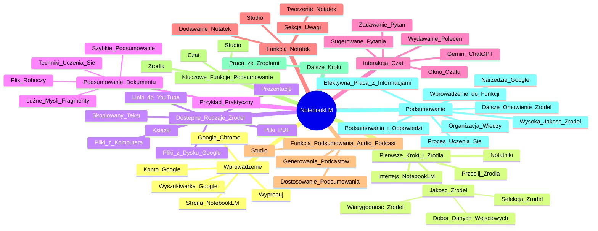

# Lekcje wideo - 2. Funkcjonalności NotebookLM

# 💡 Diagram

___

# 🗒️ Notatka

# NotebookLM - Szczegółowe Notatki i Podsumowanie Transkrypcji Wideo

## Wprowadzenie do NotebookLM

W tym materiale wideo poznasz **NotebookLM**, narzędzie zaprojektowane, aby zrewolucjonizować sposób pracy z informacjami.  Pierwszym krokiem jest uruchomienie **przeglądarki Google Chrome** i przejście do wyszukiwarki **Google**. Następnie, w polu wyszukiwania, wpisz frazę **"Notebook LM"**.  Kolejno, otwórz stronę `notebooklm.google.com` i kliknij przycisk **"Wypróbuj"**.  Na koniec, zaloguj się na swoje **konto Google** (lub utwórz je, jeśli jeszcze go nie posiadasz).

## Pierwsze Kroki w NotebookLM i Źródła

Po pomyślnym zalogowaniu, zostaniesz przeniesiony do interfejsu **NotebookLM**.  Osoby, które korzystały już z tego narzędzia, zobaczą listę swoich **notatników** (projektów). Nowi użytkownicy natomiast,  zostaną powitani ekranem **"Prześlij źródła"**.  **Źródła** stanowią fundament pracy z NotebookLM, ponieważ to na ich podstawie narzędzie generuje odpowiedzi.  Przykładowe **źródła** to: plany marketingowe, materiały edukacyjne, notatki z badań, transkrypcje spotkań czy dokumenty sprzedażowe.

**Jakość źródeł ma kluczowe znaczenie**. Pamiętaj, że efektywność NotebookLM bezpośrednio zależy od jakości dostarczonych danych wejściowych.  Zwróć szczególną uwagę na **selekcję źródeł** i ocenę ich wiarygodności.  Podczas wyboru **źródeł**, warto zadać sobie następujące pytania:

- Czy ufam temu konkretnemu źródłu lub autorowi?
- Czy jakość prezentowanych danych i opinii jest wystarczająco wysoka?

**Właściwy dobór danych wejściowych to podstawa sukcesu** w efektywnej współpracy z NotebookLM.

## Dostępne Rodzaje Źródeł

Możesz przesłać następujące typy **źródeł**:

- Pliki z komputera
- Pliki z Dysku Google
- Książki
- Skopiowany tekst
- Prezentacje
- Pliki **PDF**
- **Linki do YouTube**

## Przykład Praktyczny - Podsumowanie Dokumentu

W prezentowanym przykładzie wykorzystano plik roboczy, zawierający **techniki, porady i wnioski z badań naukowych dotyczące procesu uczenia się**.  Dokument ten został opisany jako **zbiór luźnych myśli i fragmentów typu \"kopiuj-wklej\"**.  Po dodaniu dokumentu do NotebookLM, narzędzie w zaledwie **kilka sekund** wygenerowało **zwięzłe i zrozumiałe podsumowanie**.

## Interakcja poprzez Czat w NotebookLM

Bezpośrednio pod wygenerowanym podsumowaniem znajduje się okno **czatu**, przypominające interfejsy znane z **Gemini** czy **ChatGPT**.  W tym miejscu możesz **zadawać pytania** i **wydawać polecenia**, odnoszące się do przesłanych **źródeł**.  Interesującą funkcją jest fakt, że NotebookLM **sugeruje pytania**, które możesz zadać w kontekście załączonych **źródeł**. Jest to szczególnie przydatne, gdy brakuje Ci czasu lub inspiracji do rozpoczęcia interakcji.

Przykładowe zapytanie w **czacie**:

> \"Poproszę o dwie proste, sprawdzone techniki zapamiętywania oraz propozycję tygodniowego planu nauki, opartego na tych technikach.\"

NotebookLM sprawnie generuje odpowiedź na tak postawione pytanie.

## Funkcja Notatek w NotebookLM

Na podstawie odpowiedzi uzyskanych w **czacie**, możesz z łatwością **dodać notatkę**.  Masz również możliwość tworzenia **nowych notatek**, opartych na własnych przemyśleniach i spostrzeżeniach.  **Swoboda tworzenia notatek jest pełna**, co pozwala na elastyczne organizowanie myśli i szybki dostęp do kluczowych informacji.  Wszystkie utworzone notatki znajdziesz w sekcji **\"Uwagi\"** w **Studio**, umieszczonym po prawej stronie interfejsu.

## Funkcja Podsumowania Audio (Podcast) w Studio

W **Studio** dostępna jest również funkcja generowania **podcastów** na bazie załączonych **źródeł**.  Możesz **dostosować podsumowanie audio**,  wydając instrukcje, na przykład wskazując, na czym ma się ono skupić.

## Kluczowe Funkcje NotebookLM - Podsumowanie

**NotebookLM oferuje trzy główne funkcje:**

1. **Źródła**: Stanowią podstawę pracy i dane wejściowe dla narzędzia.
2. **Czat**: Umożliwia interakcję z NotebookLM poprzez zadawanie pytań i wydawanie poleceń.
3. **Studio**: Pozwala na generowanie podcastów oraz przeglądanie i dodawanie notatek.

## Dalsze Kroki

W kolejnej części materiału planowane jest **szczegółowe omówienie pracy ze źródłami w NotebookLM**.

## Podsumowanie

NotebookLM to narzędzie Google, które wspiera efektywną pracę z informacjami, wykorzystując przesłane **źródła**.  Kluczowym aspektem jest wybór **źródeł** o wysokiej jakości, ponieważ na ich podstawie NotebookLM tworzy podsumowania i odpowiedzi na pytania.  Narzędzie oferuje funkcje **czatu**, **notatek** oraz generowania podsumowań audio (podcastów), ułatwiając organizację wiedzy i proces uczenia się.  Ten materiał wideo stanowi wprowadzenie do podstawowych funkcji NotebookLM i zapowiada dalsze, pogłębione  omówienie  pracy ze **źródłami** w kolejnych materiałach.

___

# 🔉 Transcript
File: Lekcje wideo - 2. Funkcjonalności NotebookLM.mp4 
[00:00:05] Okej, zróbmy to.
[00:00:07] Zobaczmy jak wygląda Notebook LM i jakie są jego podstawowe funkcje.
[00:00:11] (Ekran przeglądarki Google Chrome. Wyszukiwarka Google.)
[00:00:11] Otwieramy wyszukiwarkę.
[00:00:13] (W polu wyszukiwania wpisany tekst "Notebooks".)
[00:00:13] Wpisujemy Notebook LM.
[00:00:15] (Strona internetowa notebooklm.google.com z hasłem "Pracuj sprawniej, nie ciężej".)
[00:00:15] Otwieramy stronę i klikamy wypróbuj.
[00:00:19] Proste.
[00:00:20] (Strona internetowa NotebookLM. Nagłówek "Witamy w NotebookLM".)
[00:00:20] Jeżeli mamy konto Google, to logujemy się na nie, a jeżeli nie mamy, no to potrzebujemy je stworzyć.
[00:00:26] Również szybka akcja, więc to nie powinno być problemem.
[00:00:31] (Okno przeglądarki NotebookLM. Nagłówek "Witamy w NotebookLM". Poniżej notatniki: "Introduction to NotebookLM", "Mastering Memory Techniques", "Westward Mushrooms", "Mugifier Documents".)
[00:00:31] Jesteśmy teraz w Notebook LM.
[00:00:33] Jeżeli tak jak ja już coś tam robiliście, to zobaczycie notatniki, czyli takie foldery, projekty, w zasadzie działki w ramach których pracujemy nad jakimś tematem.
[00:00:43] Natomiast jeżeli jesteście tam po raz pierwszy, to zobaczycie od razu ekran prześlij źródła.
[00:00:48] (Okno "Dodaj źródła NotebookLM". Tekst: "Źródła pozwalają usłudze NotebookLM generować odpowiedzi na podstawie informacji, które są dla Ciebie najważniejsze. Przykłady mogą tu być plany marketingowe, materiały do nauki, notatki z badań, transkrypcje spotkań, dokumenty sprzedaży itp." Przycisk "Prześlij źródła". Opcje: "Dysk Google", "Link", "Wklej tekst".)
[00:00:48] Dlaczego zaczynamy od źródeł?
[00:00:51] Bo to podstawa naszej pracy z Notebook LM.
[00:00:54] Pamiętajcie, że Notebook LM jest tak dobry jak jakość waszych danych, dlatego skupcie się na selekcji źródeł zadając sobie pytanie, czy ufam temu konkretnemu źródłu lub autorowi.
[01:05] Czy jakość prezentowanych danych i poglądów jest wystarczająco dobra.
[01:10] Odpowiedni dobór danych wejściowych jest kluczem do sukcesu we współpracy z Notebookiem.
[01:16] A jakie źródła możemy przesłać?
[01:18] (Okno "Wybierz jeden lub więcej plików". Plik "Ton komunikacji marki X.pdf".)
[01:18] Mogą być to pliki z komputera.
[01:21] (Okno "Dodaj źródła NotebookLM". Tekst: "Źródła pozwalają usłudze NotebookLM generować odpowiedzi na podstawie informacji, które są dla Ciebie najważniejsze. Przykłady mogą tu być plany marketingowe, materiały do nauki, notatki z badań, transkrypcje spotkań, dokumenty sprzedaży itp." Przycisk "Prześlij źródła". Opcje: "Dysk Google", "Link", "Wklej tekst".)
[01:21] Pliki z dysku Google, książki, skopiowany tekst, prezentacje, PDF-y czy linki do YouTube.
[01:29] Spróbujmy zrobić teraz prosty przykład na jednym dokumencie.
[01:32] (Okno "Wybierz elementy". Plik "10 najciekawszych technik...". Plik "Nauka - różne dziedziny". Plik "Biblioteka promocji...". Plik "Fazy procesu pamięci...". Pliki dokumentów Google.)
[01:32] Dodałem tutaj plik roboczy, gdzie zgromadziłem trochę różnych technik, porad i wniosków z badań naukowych dotyczących uczenia się.
[01:41] Jak wiadomo, każdy ma swój sposób.
[01:43] Każda książka mówi trochę co innego.
[01:46] Ja zebrałem to co w jakiś sposób do mnie trafiało, sprawdzało się i było polecane przez innych.
[01:52] No ale umówmy się, jest to raczej zbiór luźnych myśli i wycinków, no takich kopiuj wklej.
[01:58] I teraz, gdy załączymy to do notebooka, zamiast przebijać się przez to przez długi czas, w ciągu kilku sekund Notebook LM daje mi na środku podsumowanie tego dokumentu.
[02:09] (Okno NotebookLM. Tytuł pliku "10 Technik Doskonałej Pamięci". Tekst podsumowania. Poniżej okno czatu.)
[02:09] Zobaczmy co nam napisał.
[02:12] Okej, wygląda to jasno i klarownie.
[02:15] Poniżej widzimy czat podobny do Gemini czy ChatGPT, gdzie możemy dopytywać i wydawać polecenia.
[02:23] Ciekawostka.
[02:23] Notebook LM poniżej w tym oknie czatu podpowiada pytania, które możemy zadać w kontekście przesłanych źródeł.
[02:30] Więc w ogóle jest to bardzo przydatne, kiedy czas nas goni lub nie mamy pomysłu od czego zacząć.
[02:37] Dopytam jeszcze o dwie rzeczy.
[02:38] (Wpisany tekst w oknie czatu: "Poproszę o dwie, proste sprawdzone techniki zapamiętywania i propozycję jak może wyglądać mój tygodniowy plan nauki czegokolwiek w oparciu o te techniki.")
[02:38] Poproszę o dwie proste sprawdzone techniki zapamiętywania i propozycję jak mógłby wyglądać mój tygodniowy plan nauki czegokolwiek w oparciu o te techniki.
[02:47] (Wygenerowana odpowiedź. Tekst: "Oto dwie sprawdzone techniki zapamiętywania i propozycja tygodniowego planu nauki z wykorzystaniem tych technik." i dalszy tekst.)
[03:03] Super.
[03:04] Co teraz możemy z tym zrobić?
[03:06] Kolejna funkcja Notebook LM to notatki.
[03:09] (Przycisk "Zapisz w notatce". Przycisk "Dodaj notatkę".)
[03:09] Na podstawie tego co otrzymaliśmy, możemy dodać sobie notatkę albo możemy stworzyć nową notatkę w oparciu o własne spostrzeżenia.
[03:17] (Okno "Notatka". Pole do wpisania tekstu.)
[03:17] Mamy tutaj pełną dowolność.
[03:19] Dzięki temu nic nam nie zginie.
[03:20] Żadna myśl nam nie ucieknie i łatwo będzie nam do niej wrócić.
[03:25] (Sekcja "Uwagi" po prawej stronie. "Nowa notatka". "Techniki Efektywnego Zapamiętywania".)
[03:25] Wszystkie notatki znajdziemy po prawej w części Studio w sekcji uwagi.
[03:31] (Sekcja "Podsumowanie audio" po prawej stronie. Przycisk "Wygeneruj".)
[03:31] W Studio możemy też generować no właśnie podcast na podstawie załączonego źródła lub załączonych źródeł.
[03:37] (Okno "Dostosuj podsumowanie audio". Tekst: "Na czym powinny skupić się hosty AI?" i opcje do wyboru.)
[03:37] Możemy też go dostosować wydając konkretne instrukcje, na przykład sugerując na czym powinien się skupić.
[03:43] Okej.
[03:44] Podsumujmy.
[03:46] Trzy podstawowe rzeczy, które warto znać w Notebooku LM.
[03:49] Po pierwsze źródła, od których zaczynamy pracę i na których bazujemy.
[03:53] Po drugie czat, w którym prowadzimy interakcję z notebookiem, a po trzecie Studio, w którym możemy generować podcasty albo przeglądać lub dodawać notatki.
[04:03] To tak w telegraficznym skrócie.
[04:05] W kolejnej lekcji wejdziemy jeszcze głębiej w pracę nad źródłami w Notebooku LM.
[04:09] (Ekran z logiem "Umiejętności Jutra AI".)

___
# 🏷️ Tags
#NotebookLM
#Google_Chrome
#Google
#notatnik
#źródła
#selekcja_źródeł
#wiarygodność_źródeł
#dane_wejściowe
#pliki_z_komputera
#Dysk_Google
#książki
#skopiowany_tekst
#prezentacje
#PDF
#linki_do_YouTube
#techniki_uczenia_się
#podsumowanie_dokumentu
#czat
#Gemini
#ChatGPT
#pytania
#polecenia
#sugestie_pytań
#notatki
#Uwagi
#Studio
#podcast
#podsumowanie_audio
#interakcja
#konto_Google
