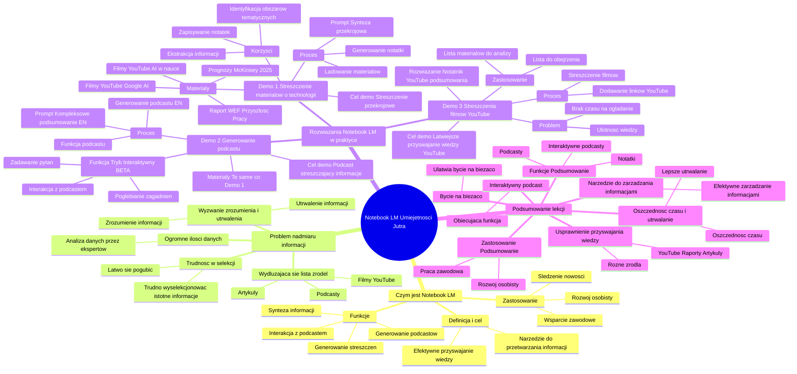

# Lekcje wideo - 3. Jak być na bieżąco z informacjami

# 💡 Diagram

___

# 🗒️ Notatka

# Notatki i podsumowanie lekcji "Umiejętności Jutra" o Notebook LM

## Wprowadzenie

Ten dokument zawiera szczegółowe notatki oraz kompleksowe podsumowanie lekcji wideo "Umiejętności Jutra" poświęconej narzędziu **Notebook LM**. Celem lekcji jest przedstawienie, w jaki sposób Notebook LM może wspierać użytkowników w śledzeniu nowości z różnych dziedzin, zarówno w kontekście zawodowym, jak i osobistym. Prezentację poprowadzili Michał Domagała i Cezary Jaroni.

## Czym jest Notebook LM i jakie jest jego zastosowanie?

- Notebook LM to narzędzie wspomagające efektywne przetwarzanie i przyswajanie informacji z różnorodnych źródeł.
- Umożliwia **syntezę kluczowych informacji** pochodzących z linków do filmów, artykułów, newsletterów i raportów.
- Pozwala na **generowanie streszczeń** lub **angażujących podcastów** na podstawie dostarczonych materiałów.
- Użytkownik ma możliwość **interakcji z wygenerowanym podcastem**, co pozwala na dogłębne eksplorowanie wybranych zagadnień.

## Problem nadmiaru informacji i związane z nim wyzwania

- W dzisiejszym świecie eksperci z każdej branży muszą regularnie analizować **ogromne ilości danych**.
- Lista źródeł informacji (filmy na `YouTube`, podcasty, artykuły) **stale się wydłuża**, co utrudnia orientację.
- W obliczu natłoku danych **łatwo się pogubić** i **trudno wyselekcjonować naprawdę istotne informacje**.
- Wyzwaniem jest nie tylko odnalezienie kluczowych informacji, ale również ich **zrozumienie i utrwalenie**.

## Rozwiązanie: Notebook LM w praktyce – monitorowanie nowości

### Demo 1: Streszczenie materiałów o technologii ("Początek roku w technologii")

- **Cel demo:** Prezentacja możliwości Notebook LM w zakresie generowania przekrojowego podsumowania różnorodnych materiałów na dany temat.
- **Wykorzystane materiały:**
    - Raport Światowego Forum Ekonomicznego dotyczący przyszłości pracy.
    - Prognozy McKinsey na rok 2025.
    - Filmy z `YouTube` analizujące rolę AI w nauce oraz perspektywę Google na rozwój AI.
- **Proces:**
    1. Materiały załadowano do notatnika Notebook LM o nazwie "Początek roku w technologii".
    2. Użyto **promptu** (uprzednio przygotowanego): "Przeanalizuj załączone materiały i stwórz przekrojową syntezę zawierającą wartościowe informacje. Wyszczególnij obszary tematyczne oraz najistotniejsze wnioski dla każdego z nich."
    3. Notebook LM wygenerował **notatkę** z przekrojowym podsumowaniem, uwzględniającą obszary tematyczne i wnioski.
- **Korzyści:**
    - **Ekstrakcja najważniejszych informacji** z różnych tematów.
    - **Identyfikacja kluczowych obszarów tematycznych** (np. przyszłość technologii, AI, rynek pracy, etyczne regulacje AI).
    - Możliwość **zapisywania notatek** i **wykorzystywania ich w przyszłości**.

### Demo 2: Generowanie podcastu z materiałów ("Podcast – podsumowanie informacji")

- **Cel demo:** Demonstracja funkcji generowania podcastu, który streszcza informacje z wielu źródeł.
- **Wykorzystane materiały:** Identyczne jak w Demo 1 (raporty i filmy z `YouTube`).
- **Proces:**
    1. Wykorzystano funkcję generowania podcastu w Notebook LM.
    2. Dodano **wskazówkę** (`prompt`): "Analize the attached materials and create a comprehensive summary. Focus on all major topics covered. Do not focus just on one topic." (Prompt w języku angielskim, ponieważ podcasty są aktualnie generowane tylko w tym języku).
    3. Notebook LM wygenerował **podcast w języku angielskim**, podsumowujący kluczowe informacje z załączonych źródeł.
- **Funkcja "Tryb Interaktywny BETA":**
    - Nowa funkcja umożliwiająca **interakcję z wygenerowanym podcastem**.
    - Pozwala na **zadawanie dodatkowych pytań** i **pogłębianie wybranych zagadnień** w formie dialogu z podcastem.

### Demo 3: Streszczenia filmów z `YouTube` ("YouTube podsumowania")

- **Cel demo:** Pokazanie, jak Notebook LM może ułatwić przyswajanie wiedzy z filmów na `YouTube`, oszczędzając czas i wspierając zapamiętywanie informacji.
- **Problem:** Brak czasu na oglądanie wszystkich interesujących filmów i ulotność pozyskanej z nich wiedzy.
- **Rozwiązanie:** Utworzenie notatnika "YouTube podsumowania" w Notebook LM.
- **Proces:**
    1. Do notatnika dodawane są linki do **filmów z `YouTube`**, które interesują użytkownika.
    2. Notebook LM może pomóc w **streszczeniu treści filmów**, umożliwiając szybsze zapoznanie się z ich zawartością i efektywniejsze zapamiętanie kluczowych informacji.
- **Praktyczne zastosowanie:** Wykorzystanie notatnika jako "listy do obejrzenia" lub "listy materiałów do przeanalizowania".

## Podsumowanie lekcji

- Notebook LM to **narzędzie wspierające efektywne zarządzanie informacjami**.
- Ułatwia **bycie na bieżąco** z nowościami z różnych dziedzin poprzez **automatyczne podsumowywanie i syntezę danych**.
- Oferuje funkcje **generowania notatek, podcastów oraz interaktywnych podcastów**.
- Usprawnia **przyswajanie wiedzy** z różnorodnych źródeł, w tym filmów na `YouTube`, raportów i artykułów.
- Pozwala na **oszczędność czasu** i **lepsze utrwalanie informacji**.
- Jest przydatny zarówno w **pracy zawodowej**, jak i w **rozwoju osobistym**.
- **Funkcja interaktywnego podcastu** stanowi nową, obiecującą możliwość pogłębiania wiedzy.

## Konkluzja

Notebook LM prezentuje się jako **wartościowe narzędzie** dla osób, które chcą efektywnie zarządzać informacjami i być na bieżąco z nowościami w dynamicznie zmieniającym się świecie. Prezentacja praktycznych zastosowań ilustruje, w jaki sposób Notebook LM może być wykorzystany w codziennej pracy i nauce.

___

# 🔉 Transcript
File: Lekcje wideo - 3. Jak być na bieżąco z informacjami.mp4 
[00:00:00] (Białe tło z pionową czarną kreską po lewej stronie.)
[00:00:01] (Na białym tle pojawia się napis: "Umiejętności", a pod nim: "Jutra".)
[00:00:02] (Na prawo od napisu pojawia się logo AI w gradientowych odcieniach niebieskiego i fioletowego. Pod spodem znajduje się napis: "Organizator Google", "Partner Edukacyjny SGH", "Patronat Honorowy Minister Cyfryzacji".)
[00:00:05] (Dwóch mężczyzn siedzi za biurkiem, przed nimi rośliny doniczkowe, a za nimi ściana i zielona roślina doniczkowa.)
[00:00:05] Michał Domagała: Cześć. Witamy w kolejnej lekcji o Notebook LM.
[00:00:09] Michał Domagała: Do tej pory dowiedzieliście się czym jest to narzędzie, jakie ma funkcje i jak z nich korzystać z lekcji z Cezarym.
[00:00:16] Michał Domagała: Teraz przechodzimy już do praktyki.
[00:00:19] Michał Domagała: Pokażemy jak notebook pomaga w byciu na bieżąco z nowinkami zarówno w waszej specjalizacji jak i zupełnie poza nią.
[00:00:26] Cezary Jaroni: Okej, to może zacznijmy od pracy na własnym podwórku.
[00:00:29] Cezary Jaroni: Aby być ekspertami w naszych branżach, musimy regularnie śledzić nowości.
[00:00:33] Cezary Jaroni: Co mówią eksperci, co pojawia się w analizach rynkowych czy w mediach.
[00:00:37] Cezary Jaroni: No to jest ogromna ilość informacji, a lista źródeł do przejrzenia, takich jak właśnie filmy na YouTubie, podcasty czy artykuły, ciągle rośnie.
[00:00:44] Cezary Jaroni: No i łatwo się w tym pogubić.
[00:00:46] Michał Domagała: To prawda, a tym bardziej wyłapać to co naprawdę jest dla nas ważne.
[00:00:51] Michał Domagała: Co dopiero wszystko zrozumieć, a jeszcze do tego zapamiętać.
[00:00:55] Michał Domagała: A co gdyby wszystkie te informacje, o których mówiliśmy były podane w formie jednego przejrzystego streszczenia albo angażującego podcastu?
[00:01:04] Michał Domagała: Możecie dodać do Notebook LM linki do filmów, artykułów, newsletterów czy raportów.
[00:01:10] Michał Domagała: Narzędzie stworzy dla was syntezę najważniejszych informacji, a jeśli chcecie skupi się wyłącznie na wskazanych tematach, a nawet pozwoli wam wchodzić w interakcję z wygenerowanym podcastem, aby pogłębić wybrane zagadnienia.
[00:01:24] Cezary Jaroni: Okej, ale to sprawdźmy to już w praktyce.
[00:01:26] Cezary Jaroni: Na potrzeby demo zdecydowaliśmy, że pokażemy ciekawe materiały, które pojawiały się na początku tego roku i pod koniec zeszłego.
[00:01:33] Cezary Jaroni: I zebraliśmy je w notatniku, który nazwaliśmy początek roku w technologii.
[00:01:37] Cezary Jaroni: Ale oczywiście możecie takie podsumowania robić w momencie dziennym, tygodniowym, dwutygodniowym czy miesięcznym i jakkolwiek potrzebujecie.
[00:01:45] Cezary Jaroni: Więc wchodzimy do naszego dedykowanego notatnika początek roku w technologii.
[00:01:50] (Ekran Notebook LM. Po lewej stronie lista źródeł, po prawej okno studia i ustawień, w środku notatki.)
[00:01:50] Cezary Jaroni: Załączyłem tutaj raport z jednej strony Światowego Forum Ekonomicznego o przyszłości pracy, przewidywania McKinsey na 2025 rok oraz filmy z YouTuba, które omawiają rolę AI w nauce oraz perspektywę Google na rozwój sztucznej inteligencji.
[00:02:09] Cezary Jaroni: Chcę zrozumieć najważniejsze wnioski.
[00:02:11] Cezary Jaroni: Początek, chciałbym uzyskać takie przekrojowe podsumowanie wszystkich załączonych tematów, wspomniane obszary i główne wnioski.
[00:02:18] Cezary Jaroni: Wykorzystam do tego następujący prompt, który wcześniej sobie przygotowałem.
[00:02:23] (Cezary Jaroni wpisuje tekst w okno czatu.)
[00:02:26] Cezary Jaroni: W prompcie proszę o przeanalizowanie załączonych materiałów i stworzenie przekrojowej syntezy z wartościowymi informacjami.
[00:02:33] Cezary Jaroni: Wyszczególnienie obszarów tematycznych oraz najciekawszych wniosków per obszar tematyczny.
[00:02:42] (Trwa generowanie notatki.)
[00:02:52] Cezary Jaroni: Dostajemy odpowiedź i korzyści jakie z tego mamy to mam wyciągnięte najważniejsze informacje przekrojowo przez tematy tak jak przyszłość technologii sztucznej inteligencji perspektywy na rynek pracy.
[00:03:07] Cezary Jaroni: Przemiana w sektorze technologicznym kwestie regulacyjne i etyczne związane z AI.
[00:03:11] Cezary Jaroni: Czyli to są tematy, które pojawiały się w tych materiałach.
[00:03:14] Cezary Jaroni: No i teraz mogę zapisać je w notatce i wracać do nich, kiedy będę potrzebował.
[00:03:31] (Cezary przesuwa okno Notebook LM.)
[00:03:33] Cezary Jaroni: I idziemy dalej.
[00:03:34] Cezary Jaroni: Znacie oczywiście funkcjonalność podcastów to tutaj naszym jest case'em będzie konwersja kilku innych właśnie materiałów na YouTubie plus raportów w jeden podcast, który chcemy, żeby streścił nam podsumowanie informacji, no właśnie z tego danego okresu.
[00:03:51] Cezary Jaroni: Generując podcast notebook, może chcecie się skupić na jednym z wielu omawianych tematów dlatego dla pewności możemy zapisać we wskazówkach, że generując podcast ma bazować na wszystkich źródłach i zrobić taki overview wszystkich najważniejszych informacji.
[00:04:06] Cezary Jaroni: Co ważne, podcasty są generowane na ten moment jedynie po angielsku, więc w taki sposób zadam prompt aby podcast był dostosowany.
[00:04:18] (Okno studia, w okienku czatu wpisany tekst: "Analize the attached materials and create a comprehensive summary. Focus on all major topics covered. Do not focus just on one topic.".)
[00:04:25] Cezary Jaroni: Rzucam i to jest dokładnie to co mówiłem, czyli chcę, żeby przeanalizował te załączone informacje i przygotował takie kompleksowe podsumowanie i chciałbym, żeby skupił się na wszystkich tematach poruszanych w tych źródłach.
[00:04:35] Cezary Jaroni: Żebym nie skupiał się tylko na jednym temacie.
[00:04:41] (Generowanie podcastu.)
[00:04:43] Cezary Jaroni: Okej.
[00:04:44] Cezary Jaroni: Mamy już wygenerowany podcast, sprawdźmy.
[00:04:46] (Włącza się wygenerowany podcast w języku angielskim.)
[00:05:27] Cezary Jaroni: Okej.
[00:05:28] Cezary Jaroni: Ale teraz co w sytuacji kiedy chcecie się o coś dopytać albo co w sytuacji, gdy jednak podcast nie pokrył wszystkich źródeł, które mam załączyliście.
[00:05:38] Cezary Jaroni: I uwaga, tutaj jest ta nowa funkcja notebooka, która pozwala wam jakby wdzwonić się do studia podcastowego i zadać jakieś dodatkowe pytanie.
[00:05:46] Cezary Jaroni: No to przetestujmy ją.
[00:05:49] (Wybiera opcję "Tryb Interaktywny BETA".)
[00:07:00] Cezary Jaroni: więc tutaj staraliśmy się wam pokazać takie najważniejsze pomysły na to jak można pozostać na bieżąco, ale być może wciąż jeszcze zastanawiacie się jak są inne sposoby być na bieżąco.
[00:07:13] Cezary Jaroni: Podzielę się z wami jeszcze jednym pomysłem.
[00:07:16] Cezary Jaroni: Jeżeli oglądacie regularnie filmy na YouTubie, to być może natrafiacie na następujące wyzwania.
[00:07:21] Cezary Jaroni: Z jednej strony nie ma czasu, żeby to wszystko obejrzeć, co was interesuje, z drugiej strony wiedza ulatuje.
[00:07:26] Cezary Jaroni: Jeżeli utożsamiacie się z tymi wyzwaniami, pokażę wam jak Notebook pomaga mi je osobiście zaadresować i przyswajać więcej wiedzy, która jest szansa, że zostanie ze mną na dłużej.
[00:07:45] (Cezary Jaroni klika w nowy przycisk w przeglądarce i wraca do okna programu NotebookLM.)
[00:01:50] Cezary Jaroni: Załączyłem tutaj raport z jednej strony Światowego Forum Ekonomicznego o przyszłości pracy, przewidywanie McKinsey na 2025 rok oraz filmy z YouTuba, które omawiają rolę AI w nauce oraz perspektywę Google na rozwój sztucznej inteligencji.
[00:02:09] Cezary Jaroni: Chcę zrozumieć najważniejsze wnioski.
[00:02:11] Cezary Jaroni: Początek, chciałbym uzyskać takie przekrojowe podsumowanie wszystkich załączonych tematów, wspomniane obszary i główne wnioski.
[00:02:19] Cezary Jaroni: Wykorzystam do tego następujący prompt, który wcześniej sobie przygotowałem.
[00:02:23] (Cezary Jaroni wpisuje tekst w okno czatu.)
[00:02:26] Cezary Jaroni: W prompcie proszę o przeanalizowanie załączonych materiałów i stworzenie przekrojowej syntezy z wartościowymi informacjami.
[00:02:33] Cezary Jaroni: Poproszę również o wyszczególnienie obszarów tematycznych oraz najciekawszych wniosków per obszar tematyczny.
[00:02:42] (Trwa generowanie notatki.)
[00:03:32] (Cezary Jaroni przesuwa okno Notebook LM.)
[00:03:34] Cezary Jaroni: I idziemy dalej.
[00:03:34] Cezary Jaroni: Znacie oczywiście funkcjonalność podcastów to tutaj naszym jest case'em będzie konwersja kilku innych właśnie materiałów na YouTubie plus raportów w jeden podcast, który chcemy, żeby streścił nam podsumowanie informacji, no właśnie z tego danego okresu.
[00:03:51] Cezary Jaroni: Generując podcast notebook, może chcecie się skupić na jednym z wielu omawianych tematów dlatego dla pewności możemy zapisać we wskazówkach, że generując podcast ma bazować na wszystkich źródłach i zrobić taki overview wszystkich najważniejszych informacji.
[00:04:06] Cezary Jaroni: Co ważne, podcasty są generowane na ten moment jedynie po angielsku, więc w taki sposób zadam prompt aby podcast był dostosowany.
[00:04:18] (Okno studia, w okienku czatu wpisany tekst: "Analize the attached materials and create a comprehensive summary. Focus on all major topics covered. Do not focus just on one topic.".)
[00:04:25] Cezary Jaroni: Rzucam i to jest dokładnie to co mówiłem, czyli chcę, żeby przeanalizował te załączone informacje i przygotował takie kompleksowe podsumowanie i chciałbym, żeby skupił się na wszystkich tematach poruszanych w tych źródłach.
[00:04:35] Cezary Jaroni: Żebym nie skupiał się tylko na jednym temacie.
[00:04:41] (Generowanie podcastu.)
[00:04:43] Cezary Jaroni: Okej.
[00:04:44] Cezary Jaroni: Mamy już wygenerowany podcast, sprawdźmy.
[00:04:46] (Włącza się wygenerowany podcast w języku angielskim.)
[00:05:27] Cezary Jaroni: Okej.
[00:05:28] Cezary Jaroni: Ale teraz co w sytuacji kiedy chcecie się o coś dopytać albo co w sytuacji, gdy jednak podcast nie pokrył wszystkich źródeł, które mam załączyliście.
[00:05:38] Cezary Jaroni: I uwaga, tutaj jest ta nowa funkcja notebooka, która pozwala wam jakby wdzwonić się do studia podcastowego i zadać jakieś dodatkowe pytanie.
[00:05:46] Cezary Jaroni: No to przetestujmy ją.
[00:05:49] (Wybiera opcję "Tryb Interaktywny BETA".)
[00:07:00] Cezary Jaroni: więc tutaj staraliśmy się wam pokazać takie najważniejsze pomysły na to jak można pozostać na bieżąco.
[00:07:12] Cezary Jaroni: A być może wciąż jeszcze zastanawiacie się jak są inne sposoby być na bieżąco.
[00:07:14] Cezary Jaroni: Podzielę się z wami jeszcze jednym pomysłem.
[00:07:16] Cezary Jaroni: Jeżeli oglądacie regularnie filmy na YouTubie, to być może natrafiacie na następujące wyzwania.
[00:07:21] Cezary Jaroni: Z jednej strony nie ma czasu, żeby to wszystko obejrzeć, co was interesuje, z drugiej strony wiedza ulatuje.
[00:07:27] Cezary Jaroni: Jeżeli utożsamiacie się z tymi wyzwaniami, pokażę wam jak Notebook pomaga mi je osobiście zaadresować i przyswajać więcej wiedzy, która jest szansa, że zostanie ze mną na dłużej.
[00:07:44] (Cezary Jaroni klika w nowy przycisk w przeglądarce i wraca do okna programu NotebookLM.)
[00:07:45] Cezary Jaroni: Wchodzę sobie do notebooka.
[00:07:47] Cezary Jaroni: I to mam taki notatnik YouTube podsumowania.
[00:07:50] Cezary Jaroni: To jest oczywiście poglądowy notatnik, który przygotowałem na potrzeby tego demu, osobisty notatnik jest na moim prywatnym koncie.
[00:07:58] Cezary Jaroni: I teraz do takiego notebooka wrzucamy filmy, które nas na bieżąco interesują, które są dla nas ciekawe.
[00:08:03] Cezary Jaroni: Trochę możemy to potraktować być może jako taką listę do obejrzenia albo listę rzeczy z którymi chcemy się zapoznać.
[00:08:10] Cezary Jaroni: I znowu
[00:08:10] (Ekran Notebook LM. Po lewej stronie lista źródeł, po prawej okno studia i ustawień, w środku notatki.)
[00:08:10] Cezary Jaroni:

___
# 🏷️ Tags
#Notebook_LM #Umiejętności_Jutra #Michał_Domagała #Cezary_Jaroni #efektywne_przetwarzanie_informacji #synteza_informacji #streszczenia #podcasty #nadmiar_informacji #analiza_danych #selekcja_informacji #rozumienie_informacji #utrwalanie_informacji #monitorowanie_nowości #streszczenie_materiałów #technologia #Światowe_Forum_Ekonomiczne #przyszłość_pracy #McKinsey #AI #sztuczna_inteligencja #YouTube #notatka #ekstrakcja_informacji #rynek_pracy #etyczne_regulacje_AI #generowanie_podcastu #Tryb_Interaktywny_BETA #interakcja_z_podcastem #pogłębianie_wiedzy #YouTube_podsumowania #lista_do_obejrzenia #zarządzanie_informacjami #bycie_na_bieżąco #automatyczne_podsumowywanie #rozwój_osobisty #praca_zawodowa #wartościowe_narzędzie #prompt
