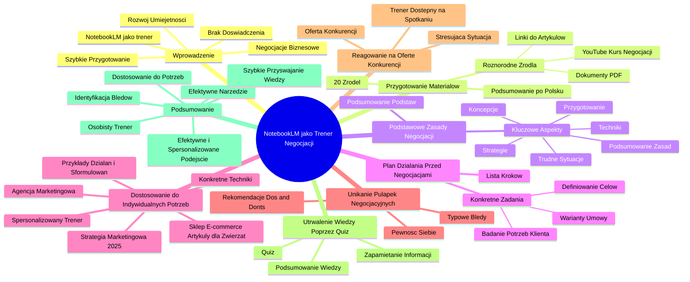

# Lekcje wideo - 4. NotebookLM jako osobisty doradca

# 💡 Diagram

___

# 🗒️ Notatka

# Notatki i Podsumowanie Wideo: NotebookLM jako Osobisty Trener Negocjacji

## Wprowadzenie

To podsumowanie wideo pokazuje, jak **NotebookLM** może służyć jako osobisty trener, wspierając rozwój umiejętności, w tym **negocjacji**. Film demonstruje, jak to narzędzie pomaga przygotować się do ważnych negocjacji biznesowych, nawet bez wcześniejszego doświadczenia czy długotrwałych szkoleń.

## Przygotowanie Materiałów w NotebookLM

- Użytkownik, menedżer firmy, przygotowuje się do negocjacji dużej umowy z klientem.
- Zamiast przeszukiwać internet w poszukiwaniu ogólnych i rozproszonych informacji, menedżer korzysta z **NotebookLM**.
- Do **NotebookLM** dodano **20 różnorodnych źródeł** o negocjacjach, w tym:
    - Linki do artykułów
    - Dokumenty PDF
    - Nagrania wideo z kursu negocjacji z `YouTube` (kilka godzin materiału w języku angielskim)
- **NotebookLM** generuje **zwięzłe podsumowanie** wszystkich materiałów **po polsku**.

## Podstawowe Zasady Negocjacji

- Użytkownik zadaje **NotebookLM** pytanie na czacie: "Jestem menedżerem i przygotowuję się do spotkania z klientem w sprawie współpracy. Przygotuj zrozumiałe podsumowanie kursów i materiałów o negocjacjach."
- **NotebookLM** generuje **zwięzłe podsumowanie podstaw negocjacji**, wskazując kluczowe aspekty:
    - **Przygotowanie do negocjacji**
    - **Strategie negocjacyjne**
    - **Techniki negocjacyjne**
    - **Koncepcje do zastosowania podczas spotkania**
    - **Radzenie sobie w trudnych sytuacjach**
    - **Krótkie podsumowanie kluczowych zasad**

## Plan Działania Przed Negocjacjami

- Użytkownik prosi o bardziej szczegółowe informacje, pytając: "Stwórz listę najważniejszych kroków z konkretnymi zadaniami, które powinienem wykonać przed spotkaniem, aby przygotować się do negocjacji."
- **NotebookLM** tworzy **listę zadań** do wykonania przed negocjacjami, prezentując szczegółowy plan działania:
    - **Zdefiniowanie celów negocjacyjnych**
    - **Dogłębne zbadanie potrzeb klienta**
    - **Przygotowanie różnych wariantów umowy**

## Dostosowanie do Indywidualnych Potrzeb

- Użytkownik wciela się w rolę menedżera agencji marketingowej negocjującego współpracę z dużym sklepem internetowym (e-commerce z artykułami dla zwierząt 🐕).
- Zadaje pytanie: "Przygotuj podsumowanie, które odniesie wiedzę do moich konkretnych potrzeb. Prowadzę agencję marketingową i przygotowuję się do negocjacji z właścicielem sklepu e-commerce z artykułami dla zwierząt 🐕. Chcemy ustalić warunki kompleksowej strategii marketingowej na 2025 rok. Wskaż najważniejsze techniki negocjacyjne, które mogę zastosować, wraz z przykładami konkretnych działań i sformułowań na spotkanie."
- **NotebookLM** **dostosowuje rekomendacje** do indywidualnej sytuacji użytkownika.
- Narzędzie proponuje **konkretne techniki negocjacyjne** oraz **przykłady pytań i propozycji** do wykorzystania w trakcie spotkania.
- **NotebookLM** działa jak **spersonalizowany trener negocjacji**.

## Unikanie Potencjalnych Pułapek Negocjacyjnych

- Użytkownik pyta: "Zapytajmy teraz Notebooka, na co uważać w negocjacjach, czego unikać i na co zwracać uwagę, aby wynegocjować korzystne warunki dla mojej agencji."
- **NotebookLM** generuje **listę rekomendacji "Do's and Don'ts"** przed spotkaniem z klientem.
- Narzędzie wskazuje **typowowe błędy**, których należy unikać.
- Ta wiedza ma zwiększyć **pewność siebie** przed rozpoczęciem negocjacji.

## Reagowanie na Ofertę Konkurencji

- Scenariusz: Podczas spotkania klient przedstawia **zanonimizowaną ofertę konkurencji**, która wydaje się bardziej atrakcyjna.
- Użytkownik pyta **NotebookLM**, jak zareagować w tej stresującej sytuacji.
- **NotebookLM** udziela odpowiedzi, pełniąc funkcję **trenera negocjacji dostępnego nawet w trakcie spotkania**.

## Utrwalenie Wiedzy poprzez Quiz

- Na koniec użytkownik prosi **NotebookLM** o **zwięzłe podsumowanie wiedzy z kursu w formie quizu**, aby skuteczniej zapamiętać i zastosować informacje.

## Podsumowanie

**NotebookLM** okazuje się **efektywnym narzędziem** wspomagającym przygotowanie do negocjacji. Umożliwia szybkie przyswajanie wiedzy z różnorodnych źródeł, dostosowanie jej do konkretnych potrzeb i scenariuszy, a także pomaga w identyfikacji potencjalnych błędów i trudnych sytuacji. Działa jako **osobisty trener negocjacji**, dostępny na każdym etapie przygotowań, a nawet podczas samego spotkania. Narzędzie to wspiera **efektywne i spersonalizowane** podejście do nauki i rozwijania umiejętności negocjacyjnych.

___

# 🔉 Transcript
File: Lekcje wideo - 4. NotebookLM jako osobisty doradca.mp4 
[00:00:05] Poprzedniej lekcji pokazaliśmy jak notebooklem może pomóc wam być na bieżąco z nowinkami w waszej branży.
[00:00:11] Teraz zobaczycie jak wykorzystać go jako takiego osobistego trenera, który może wspierać waszą naukę i rozwój umiejętności w takim dostosowanej do waszych potrzeb sposób.
[00:00:21] Załóżmy, że przed wami ważne negocjacje z klientem w sprawie dużej umowy.
[00:00:26] Nie mamy jednak doświadczenia w negocjacjach ani czasu na długie szkolenie.
[00:00:31] Wydaje się, że już coś potrafimy, ale brakuje nam podstaw teoretycznych i znajomości chociażby najistotniejszych technik negocjacyjnych.
[00:00:40] Jak przygotować się efektywnie do nadchodzących spotkań, korzystając z notebooklem?
[00:00:45] Możemy oczywiście przeszukać internet w poszukiwaniu materiałów, ale znalezione treści są rozproszone, często zbyt ogólne, no i trudne trochę do odniesienia do naszej prywatnej sytuacji.
[00:00:55] A zapoznanie się z nimi może zajmować dużo czasu.
[00:00:58] Zamiast tego, zwrócimy je do notebooklem i zobaczymy co to narzędzie może dla nas zrobić.
[01:05] Przejdziemy teraz do notatnika, który już wcześniej przygotowaliśmy.
[01:09] Ekran: Wyświetla się strona internetowa notebook.google.com. Widoczny jest notatnik Kurs negocjacje. Po lewej stronie widać listę źródeł. Po prawej stronie znajduje się sekcja Studio z podsumowaniem audio.
[01:10] I dodaliśmy do niego, jak widzicie 20 różnych źródeł po krótkim researchu w internecie.
[01:16] To jak widzicie, linki do artykułów, dokumenty, PDF oraz filmy z ogólnodostępnego kursu negocjacji, który znaleźliśmy na YouTubie.
[01:26] Co ważne to kilka godzin nagrania w dodatku w zupełności po angielsku.
[01:32] Dodatkowo zamkniemy sobie nasze Studio z uwagi na to, że będziemy pracować na tekście, żeby tutaj mieć lepszy widok.
[01:35] Ekran: Zamknięty panel studio.
[01:39] I jak widzicie notebook już przygotował takie krótkie podsumowanie wszystkich wgranych do niego materiałów, co ważne w języku polskim.
[01:48] Ale przejdźmy już teraz do konkretów i konkretnych pytań.
[01:52] Ekran: Pole chat z wpisanym tekstem Jestem menadżerem firmy i przygotowuję się do spotkania z klientem na temat współpracy. Przygotuj podsumowanie kursów i materiałów dotyczących negocjacji w łatwy do zrozumienia sposób.
[01:56] Jestem menadżerem firmy i przygotowuję się do spotkania z klientem na temat współpracy, przygotuj podsumowanie kursów i materiałów dotyczących negocjacji w łatwy do zrozumienia sposób.
[02:10] Ekran: NotebookLM wygenerował podsumowanie w odpowiedzi na zadane pytanie.
[02:20] Jak możecie zobaczyć Notebook zwięźle podsumował podstawy negocjacji, wskazując kluczowe elementy.
[02:28] Widzimy tam przygotowanie do procesu negocjacji, strategie negocjacyjne i techniki.
[02:34] A także ważne koncepcje, które moglibyśmy na przykład zastosować właśnie na takim spotkaniu, jak sobie radzić z trudnymi sytuacjami oraz takie krótkie podsumowanie.
[02:45] To jest świetna baza do dalszych działań, ale kontynuujmy naszą konwersację.
[02:50] Wyciągajmy bardziej konkretne informacje i wprowadźmy kolejny prompt.
[02:53] Ekran: Wyświetla się pole tekstowe Zaccznij pisać... oraz wpisany prompt Stwórz listę najważniejszych kroków z konkretnymi zadaniami, które powinienem wykonać przed spotkaniem z klientem, aby przygotować się do negocjacji.
[02:56] To co może być dla nas ważne to jak najlepsze przygotowanie się do tego spotkania.
[03:01] Dlatego poprosimy go o to, aby stworzył listę takich najważniejszych kroków z konkretnymi zadaniami dla nas, które powinniśmy wykonać przed spotkaniem z klientem, aby przygotować się do negocjacji.
[03:14] Ekran: NotebookLM wygenerował odpowiedź w postaci listy zadań, co zrobić przed negocjacjami.
[03:25] Super, widzimy listę kilku takich najważniejszych kroków z konkretnymi zadaniami taki szczegółowy plan działania od zdefiniowania określenia naszych celów.
[03:38] Przeprowadzenia też badania klienta, z którym będziemy się spotykać po przygotowanie jakiś wariantów do zapisania w umowie.
[03:46] To już konkretne kroki, które możemy wdrożyć, ale kontynuujmy dyskusję z notebookiem dalej.
[03:54] Ekran: Ponownie wyświetla się mężczyzna z prawej strony ekranu. Po lewej stronie pojawia się okno z otwartą stroną notebooklm.
[03:54] Teraz skupmy się na dostosowaniu tej wiedzy do konkretnego przypadku.
[03:58] Wcielmy się w rolę menadżera agencji marketingowej, który negocjuje współpracę z dużym sklepem internetowym.
[04:05] Ekran: Wyświetla się okno przeglądarki ze stroną notebook.google.com.
[04:06] Wprowadzamy nasz prompt, który przygotowaliśmy już wcześniej.
[04:09] Przygotuj podsumowanie odnoszące wiedzę do moich indywidualnych potrzeb. Prowadzę agencję marketingową i przygotowuję się do negocjacji z klientem właścicielem sklepu e-commerce z artykułami dla zwierząt. Chcemy ustalić szczegóły współpracy w zakresie realizacji kompleksowej strategii marketingowej na 2025 rok.
[04:29] Wskaż najważniejsze techniki negocjacje, które mogę wykorzystać wraz z przykładami konkretnych działań i sformułowań do wykorzystania podczas spotkania.
[04:40] Ekran: Wyświetla się podsumowanie wygenerowane przez NotebookLM w odpowiedzi na zadane pytanie.
[04:51] Okej, widzimy, że Notebook dostosował rekomendacje do naszej sytuacji.
[04:56] Proponuje konkretne techniki negocjacyjne, ale też przykłady pytań czy propozycji, które możemy zaproponować klientowi i to tak jakbyśmy mieli takiego indywidualnego trenera negocjacji.
[05:07] No i wykorzystajmy to w dalszym przygotowaniu.
[05:11] Ekran: Nadal wyświetla się okno NotebookLM.
[05:13] Zapytajmy teraz Notebooka o to na co uważać w negocjacjach, czego unikać, na co zwracać uwagę, aby wynegocjować korzystne warunki dla mojej agencji.
[05:34] Ekran: Wyświetla się podsumowanie wygenerowane przez NotebookLM w odpowiedzi na zadane pytanie.
[05:38] Widzimy już taką listę rekomendacji, Do's and Don'ts przed spotkaniem z klientem.
[05:41] Narzędzie to podpowiada takie typowe błędy, jakich powinniśmy unikać i powinny zostać w naszej pamięci w szczególności przed samym spotkaniem.
[05:54] To cenna wiedza, która myślę, że może zwiększyć naszą pewność siebie.
[05:59] Możemy tą rozmowę kontynuować dalej i tutaj dodamy nieco dramaturgii.
[06:07] Wyobraźmy sobie, że jesteśmy na spotkaniu z naszym potencjalnym klientem i nagle w sytuacji w której zupełnie się tego nie spodziewaliśmy w momencie w którym przedstawiliśmy już na przykład swoją ofertę.
[06:20] Klient zdecydował się, żeby pokazać nam zanonimizowaną ofertę konkurencji, która jego zdaniem jest korzystniejsza.
[06:28] Myślę, że taka sytuacja mogłaby się zdarzyć, no i teraz pytanie.
[06:31] Jesteśmy zestresowani, w emocjach, jak zareagować i co zrobić.
[06:35] Zapytajmy o to naszego trenera od negocjacji, którego tak naprawdę możemy mieć również ze sobą na naszym spotkaniu.
[06:40] Ekran: Okno NotebookLM nadal jest widoczne.
[06:41] I tak prezentuje się wygenerowana odpowiedź.
[06:41] Myślę, że tutaj już w kontekście personalizacji tego doświadczenia z notebookiem wykonaliśmy dobre, dobre ćwiczenia, ale na koniec pobawmy się nieco formą.
[07:49] Spróbujmy teraz całą tą wiedzę, którą mamy zebraną w tym notatniku ze wszystkich źródeł, jak najlepiej zapamiętać i wykorzystać właściwie do tego notebooka.
[08:01] Ekran: Okno NotebookLM nadal jest widoczne.
[08:01] Przygotowaliśmy w tym celu ostatni prompt, w którym poprosimy go o coś zupełnie innego, mianowicie o zwięzłe podsumowanie naszej wiedzy z kursu, które będziemy chcieli, aby notebook przygotował w formie quizu.

___
# 🏷️ Tags
#NotebookLM #negocjacje #osobisty_trener #umiejętności #przygotowanie #biznes #materiały #źródła #artykuły #PDF #wideo #YouTube #podsumowanie #język_polski #zasady_negocjacji #strategie_negocjacyjne #techniki_negocjacyjne #plan_działania #cele_negocjacyjne #potrzeby_klienta #warianty_umowy #indywidualne_potrzeby #agencja_marketingowa #sklep_internetowy #e-commerce #artykuły_dla_zwierząt #strategia_marketingowa #rekomendacje #spersonalizowany_trener #pułapki_negocjacyjne #błędy #pewność_siebie #oferta_konkurencji #stres #quiz #wiedza #efektywne_narzędzie #przyswajanie_wiedzy #scenariusze #trudne_sytuacje #efektywne_podejście #personalizacja
