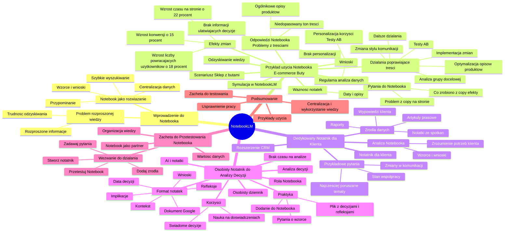

# Lekcje wideo - 5. Efektywne zarządzanie wiedzą

# 💡 Diagram

___

# 🗒️ Notatka

# Notatki i Podsumowanie Transkrypcji Wideo o Notebooku

## Wprowadzenie do Notebooka i Organizacji Wiedzy

* **Problem rozproszonej wiedzy:** Informacje (notatki, dokumenty, maile 📧, pliki, screenshoty 🖼️) są rozproszone i trudno dostępne.
* **Trudność w odzyskiwaniu informacji:** Przekopywanie się przez różne źródła danych jest czasochłonne, utrudnia odtworzenie szczegółów z przeszłości.
* **`Notebook` jako rozwiązanie:**
    * Centralizacja danych w jednym miejscu.
    * Błyskawiczne wyszukiwanie potrzebnych informacji.
    * Wykrywanie wzorców i podpowiadanie wniosków.
    * Przypominanie zapomnianych informacji.

## Przykład Użycia `Notebooka`: Optymalizacja Treści E-commerce dla Sklepu Obuwniczego

* **Scenariusz:** Praca nad stroną internetową sklepu z butami 👟, problem z treściami na stronie, które wydają się znajome z przeszłości.
* **Symulacja pracy z `Notebookiem`:**
    * Otwarcie notatnika "`Optymalizacja Treści E-commerce: Buty`" w `NotebookLM`.
    * Załączony dokument symulujący zapiski z projektu.
    * **Pytanie do `Notebooka`:** "Dlaczego mieliśmy problem z copy na stronie? Na czym on polegał?"
* **Odpowiedź `Notebooka`:**
    * **Problemy z treściami:**
        * Niedopasowany ton treści do grupy docelowej (zbyt formalny i ogólnikowy).
        * Brak personalizacji i uwzględnienia potrzeb konkretnych grup (biegacze 🏃, młode matki 👩‍👧‍👦).
        * Zbyt ogólnikowe opisy produktów, brak podkreślenia korzyści (trwałość, design, technologie ⚙️).
        * Brak informacji ułatwiających decyzję (opinie, porady dotyczące rozmiaru).
    * **Konsekwencja:** Nieskuteczne treści, brak zaangażowania klientów i niskie konwersje.
* **Dalsze Pytanie do `Notebooka`:** "Co zrobiliśmy z copy na stronie i jakie były tego efekty?"
* **Odpowiedź `Notebooka` - Działania Poprawiające Treści:**
    1. **Analiza grupy docelowej:** Wywiady z klientami, segmentacja (młodzi profesjonaliści, biegacze 🏃, rodzice 👨‍👩‍👧‍👦).
    2. **Zmiana stylu komunikacji:** Personalizacja, język korzyści, przykłady zastosowań.
    3. **Optymalizacja opisów produktów:** Sekcje "`kluczowe korzyści`", "`specyfikacje`", "`kto będzie zadowolony`", opinie klientów.
    4. **Testy A/B:** Porównanie różnych wersji treści.
    5. **Implementacja zmian:** Wdrożenie na stronę, szkolenie marketingu.
    6. **Dalsze działania:** Analiza danych, monitoring, dynamiczne dostosowanie treści.
* **Efekty zmian:**
    * Wzrost konwersji o 15% (segment 25-34 lata).
    * Wzrost średniego czasu spędzonego na stronie o 22%.
    * Wzrost liczby powracających użytkowników o 18%.
* **Wnioski:** Personalizacja, korzyści, testy A/B poprawiły skuteczność komunikacji i wyniki. Regularna analiza danych jest kluczowa 🔑.
* **Odzyskiwanie wiedzy:** `Notebook` pomaga odzyskać wiedzę z przeszłości, o której mogliśmy zapomnieć.
* **Ważność notatek:** Dobre notatki z datami i opisami (co poszło dobrze/źle, dlaczego) ułatwiają `Notebookowi` wyszukiwanie wzorców.

## Rozwinięcie Użycia `Notebooka`: Dedykowany Notatnik dla Klienta

* **Stworzenie dedykowanego notatnika dla klienta:** Dodanie notatek ze spotkań, raportów, artykułów prasowych, wypowiedzi klienta.
* **Przykładowe pytania:**
    * Jakie są trzy najczęściej poruszane tematy przez klienta?
    * Jak określić stan współpracy z klientem?
    * Jakie zmiany w komunikacji mogłyby przynieść lepsze efekty?
* **Analiza `Notebooka`:** Wyszukiwanie wzorców i wniosków z różnych źródeł, lepsze zrozumienie potrzeb klienta.
* **Rozszerzenie CRM:** `Notebook` jako zaawansowane narzędzie CRM.

## Osobisty Notatnik do Analizy Decyzji i Refleksji

* **Analiza własnych decyzji:** Wykorzystanie `Notebooka` do refleksji nad decyzjami i motywacjami w czasie.
* **Osobiste notatki/dziennik:** Prowadzenie osobistych notatek, szczególnie w biznesie, gdzie decyzje mają długofalowe skutki.
* **Problem braku czasu na analizę:**  Mało osób ma czas na szczegółową analizę starych notatek.
* **Rola `Notebooka`:** Pomoc w wyciąganiu wniosków z osobistych zapisków.
* **Prosty format notatek:** Dokument Google, data decyzji, kontekst (projekt, decyzja), refleksje, wnioski, implikacje.
* **Korzyści:** Nauka na własnych doświadczeniach, podejmowanie bardziej świadomych decyzji.
* **Praktyka:** Stworzenie prostego pliku z decyzjami i refleksjami, dodanie do `Notebooka`, zadawanie pytań o wzorce myślenia i działania.
* **Połączenie AI i notatek:** Niesamowite efekty w organizacji i podejmowaniu decyzji.

## Zachęta do Przetestowania `Notebooka`

* **Kluczowa organizacja wiedzy:** Szczególnie ważne przy zarządzaniu wieloma projektami i klientami.
* **Wezwanie do działania:** Przetestowanie `Notebooka`, stworzenie roboczego notatnika dla klienta/projektu, dodanie źródeł, zadawanie pytań.
* **Wartość danych:** Wyciągnięcie wartości z posiadanych danych.
* **`Notebook` jako partner:** Narzędzie do wyszukiwania i partner w organizacji pracy.

## Podsumowanie

`NotebookLM` to narzędzie, które pomaga w organizacji i wykorzystywaniu posiadanej wiedzy poprzez centralizację rozproszonych informacji. Umożliwia szybkie wyszukiwanie, analizę wzorców i wyciąganie wniosków z notatek, dokumentów i innych źródeł.  Przykłady użycia obejmują optymalizację treści e-commerce, zarządzanie relacjami z klientami poprzez dedykowane notatniki, oraz analizę własnych decyzji i refleksji za pomocą osobistego dziennika.  `NotebookLM` może znacząco usprawnić pracę, pomagając w podejmowaniu lepszych decyzji i efektywniejszym zarządzaniu wiedzą. Zachęca się do przetestowania narzędzia i odkrycia jego potencjału w praktyce.

___

# 🔉 Transcript
File: Lekcje wideo - 5. Efektywne zarządzanie wiedzą.mp4 
[00:00:05] Teraz pokażemy wam, jak notebook może pomóc w organizacji i wykorzystywaniu wiedzy, którą już posiadacie.
[00:00:13] Dokładnie.
[00:00:13] Pomyślcie o tym jak przechowujecie informacje: notatki ze spotkań, dokumenty, raporty, maile, pliki na dysku, a nawet screenshot na telefonie.
[00:00:22] To wszystko stanowi zaplecze waszej pamięci.
[00:00:24] Sięgamy po te dane, kiedy potrzebujemy odtworzyć coś konkretnego.
[00:00:28] Na przykład, co uzgodniliśmy z klientem pół roku temu.
[00:00:31] Problem pojawia się jednak, gdy te informacje są rozproszone i trudno je znaleźć.
[00:00:36] Przekopywanie się przez maile, pliki i aplikacje jest czasochłonne.
[00:00:41] Notebook pozwala zebrać te dane w jednym miejscu i błyskawicznie znaleźć to, czego szukacie.
[00:00:46] Co więcej, może wychwytywać wzorce, podpowiadać wnioski i przypominać rzeczy, o których już sami zapomnieliście.
[00:00:54] No dobrze, to standardowo, pokażmy to na przykładzie.
[00:00:57] Wyobraźmy sobie, że pracujemy nad stroną internetową dla sklepu z butami.
[01:02] Pojawia się jednak problem z treściami na stronie, ale wydają się znajome.
[01:06] Podobna sytuacja wydarzyła się jakieś dwa lata temu, ale szczegółów już nie pamiętamy.
[01:11] Na potrzeby lekcji przygotowaliśmy symulację, jak może wyglądać praca takim projektem.
[01:17] (Ekran pokazuje stronę notebook.google.com. Strona posiada tytuł "Witamy w NotebookLM" oraz sekcję "Moje notatniki". W sekcji "Moje notatniki" znajdują się 4 kafelki z notatnikami: "Optymalizacja Treści E-commerce: Buty", "Remote Work: A Review of Research", "Kurs negocjacje" i "YT podsumowania" )
[01:17] Otwieramy notatnik, do którego załączyliśmy dokument symulujący pracę właśnie nad takim projektem.
[01:20] (Ekran pokazuje stronę notebook.google.com/notebook/google. Strona posiada tytuł "Optymalizacja Treści E-commerce: Buty" i zawiera sekcje: "Źródła", "Czat", "Studio" i "Uwagi". W sekcji "Czat" widoczny jest wykres i tekst: "Optymalizacja Treści E-commerce: Buty" oraz tekst: "Dokument opisuje projekt optymalizacji strony e-commerce z obuwiem. Głównym celem było zwiększenie konwersji, co osiągnięto poprzez zmianę tonu komunikacji na bardziej personalny i skupiający się na korzyściach produktu. Przeprowadzono analizę grupy docelowej, testy A/B oraz wprowadzono zmiany w opisach produktów. Rezultatem był 15% wzrost konwersji, a także wzrost zaangażowania użytkowników. Projekt obejmował pracę wielu specjalistów i wykorzystał narzędzia analityczne." )
[01:24] Wrzuciliśmy tam wymyślone zapiski, jakie mogłyby się pojawić przy tej pracy.
[01:28] W docelowym przypadku mogły to być oczywiście nasze stare notatki i maile z tamtego okresu.
[01:34] No to teraz promptujemy i pytamy dlaczego mieliśmy problem z copy na stronie?
[01:38] Na czym on polegał?
[01:44] (Po chwili ekran pokazuje odpowiedź Notebooka: "Problemy z treściami na stronie internetowej sklepu obuwniczego wynikały z kilku czynników: Niedoasowanie tonu treści: Treści były zbyt formalne i ogólnikowe, co nie angażowało klientów. Brakujeło spersonalizowanego podejścia, które odzwierciedlałoby potrzeby konkretnych grup docelowych, takich jak biegacze czy młode matki. Zbyt ogólnikowe opisy produktów: Opisy produktów nie podkreślały kluczowych korzyści, takich jak trwałość, nowoczesny design czy unikalne technologie. Brakowało jasnych informacji, które ułatwiłyby klientom podjęcie decyzji zakupowej, np. opinii klientów lub porad dotyczących rozmiaru. W konsekwencji, treści nie były skuteczne w przyciąganiu i angażowaniu klientów, a tym samym nie wspierały konwersji. Dopiero po analizie grupy docelowej, zmianie stylu komunikacji, optymalizacji opisów produktów i testach A/B udało się poprawić skuteczność treści na stronie." )
[01:44] Notebook wskazuje, że problem wynikał z niedopasowania tonu treści do grupy docelowej oraz zbyt ogólnikowych opisów produktów.
[01:52] No to chcemy ten problem zgłębić dalej i pytamy się, co zrobiliśmy z copy na stronie i jakie były tego efekty.
[02:03] (Po chwili ekran pokazuje odpowiedź Notebooka: "W celu poprawy pupularności treści na stronie sklepu obuwniczego, podjęto serię działań: 1) Po zidentyfikowaniu problemów, takich jak niedpasowany ton i zbyt ogólnikowe opisy produktów, zespół projektowy skupił się na zmianach mających na celu zwiększenie konwersji i zaangażowania klientów. 2) Otwartość na korektę: 3) Analiza grupy docelowej: Przeprowadzono analizę rynku i wywiady z klientami, aby lepiej zrozumieć ich potrzeby i oczekiwania. Zidentyfikowano kluczowe segmenty klientów, takie jak młodzi profesjonaliści, biegacze i rodzice z małymi dziećmi. Dodano przykłady zastosowań produktów w codziennych sytuacjach. 4) Optymalizacja opisów produktów: Każdy opis zawierał sekcje "kluczowe korzyści", "specyfikacje techniczne" oraz "kto będzie zadowolony z tego produktu". Dodano opinie i oceny klientów, aby zwiększyć wiarygodność. 5) Testy A/B: 6) Implementacja zmian: Wszystkie zmiany zostały wprowadzone na stronie, a zespół marketingowy przeszkolony, aby utrzymać spójność w komunikacji. 7) Dalsze działania: Wprowadzono regularną analizę danych i opinii klientów w celu aktualizacji treści, monitoringu efektywności co kwartał oraz eksperymentowania z dynamicznym dostosowaniem treści na podstawie danych użytkowników. Efekty wprowadzonych zmian: Wzrost konwersji o 15% wśród segmentu użytkowników 25-34 lata. Średni czas spędzony na stronie wzrósł o 22%. Wzrost liczby powracających użytkowników o 18%. Podsumowując, dzięki personalizacji treści skupieniu na korzyściach produktów oraz wykorzystania testów A/B udało się znacznie poprawić skuteczność komunikacji na stronie, co przełożyło się na wzrost konwersji i zaangażowania klientów. Dodatkowo, regularna analiza danych i opinii klientów pozwala na ciągłe doskonalenie treści." )
[02:03] Okej, dostajemy odpowiedź, że przeanalizowaliśmy grupę docelową, zmieniliśmy styl komunikacji, zoptymalizowaliśmy opisy produktów, wykonaliśmy testy A/B, przy czym wersja B zwiększyła konwersję o 15% i zaimplementowaliśmy te zmiany.
[02:17] Więc widzimy, że te efekty doprowadziły do wzrostu właśnie konwersji, średni czas spędzony na stronie wzrósł, a liczba powracających klientów też wzrosła.
[02:25] W ten sposób możemy odzyskać wiedzę, której sami mogliśmy już nie pamiętać.
[02:29] I teraz uwaga.
[02:31] Oczywiście, żeby takie działanie było możliwe, musimy mieć notatki z danego okresu, najlepiej z oznaczonymi datami.
[02:37] Widać też, że im lepiej będziemy opisywać co poszło dobrze, co poszło źle i dlaczego na danym projekcie czy w decyzji, notebook może nam w przyszłości lepiej pomóc wyszukiwać wzorce.
[02:49] Rozwinięciem tego use case'a jest stworzenie dedykowanego notatnika dla klienta.
[02:55] Jeśli możemy stworzyć dedykowany notatnik, to dodajmy do niego notatki ze spotkań, raporty, artykuły prasowe związane z danym klientem czy też uwzględniające wypowiedzi danego klienta.
[03:06] Następnie możemy zadawać takie pytania jak: jakie są trzy najczęściej poruszane tematy przez danego klienta, albo jak można określić stan naszej współpracy z klientem, jakie zmiany w komunikacji mogłyby przynieść lepsze efekty.
[03:21] Notebook przeanalizuje te wszystkie źródła i wskaże jakieś wzorce czy wnioski, które mogą lepiej rozumieć potrzeby tego klienta.
[03:28] Możemy o tym pomyśleć jako o takim rozszerzeniu zaawansowanego CRM-a.
[03:32] To tylko jeden z przykładów jak notebook może ułatwić wam pracę.
[03:35] Organizacja wiedzy jest kluczowa, zwłaszcza gdy zarządzacie wieloma projektami lub klientami.
[03:41] Dlatego chcemy zachęcić was do przetestowania tej funkcji.
[03:44] Stwórzcie roboczy notatnik dla jednego ze swoich klientów lub projektów.
[03:49] Dodajcie kilka źródeł i zacznijcie zadawać pytania.
[03:53] Zobaczycie jak wiele wartości można wyciągnąć z danych, które już posiadacie.
[03:57] Notebook to nie tylko narzędzie do wyszukiwania informacji, ale także wasz swego rodzaju partner w organizacji pracy.
[04:04] Kolejnym bardzo ciekawym zastosowaniem będzie wykorzystanie go do analizy własnych decyzji, refleksji i motywacji w czasie.
[04:12] Oczywiście, do tego potrzebne jest prowadzenie takich osobistych notatek, czy moglibyśmy to nazwać dziennika.
[04:19] To byłoby cenne szczególnie w biznesie, gdzie każda decyzja może mieć jakieś długofalowe skutki.
[04:25] No Michał, ile osób faktycznie ma czas, żeby po miesiącach czy po tygodniach wracać do takich swoich notatek i szczegółowo je potem analizować.
[04:33] Prawdopodobnie niewiele.
[04:36] I właśnie tutaj notebook może zrobić dla was różnicę.
[04:38] Wystarczy, że zbieracie swoje zapiski w jednym prostym pliku, na przykład w dokumencie Google.
[04:45] Dodacie go do źródeł w notatniku, a narzędzie pomoże wam wyciągnąć wnioski, które normalnie mogłyby wam umknąć.
[04:52] Teraz oczywiście, jakość wniosków będzie zależało od jakości danych, więc jeżeli zdecydujecie się prowadzić takie zapiski, zadbajcie o porządek.
[05:00] Prosty format wystarczy.
[05:01] Zapisujcie datę każdej decyzji i dodajcie kontekst, na przykład co to był za projekt, czy co to była za decyzja, jakie były wasze osobiste refleksje, jakie były wnioski, może jakie były implikacje.
[05:13] Dzięki notebookowi możemy nie tylko odzyskiwać wiedzę z przeszłości, ale także lepiej ją analizować i porządkować.
[05:21] To świetne narzędzie do nauki na własnych doświadczeniach i podejmowania bardziej świadomych decyzji.
[05:27] I jeśli jeszcze nie prowadzicie takich osobistych notatek, spróbujcie stworzyć prosty plik, tak jak zachęcaliśmy się wcześniej, w którym będziecie zapisywać swoje decyzje i refleksje.
[05:37] Dodajcie go do notebooka i zadawajcie pytania, które pozwolą wam zobaczyć wzorce w swoim myśleniu i działaniu.
[05:43] I ta prosta praktyka w połączeniu z AI może przynieść wam niesamowite efekty w organizacji i podejmowaniu decyzji.
[05:51] Spróbujcie i przekonajcie się sami.

___
# 🏷️ Tags
#notebook
#organizacja_wiedzy
#rozproszona_wiedza
#odzyskiwanie_informacji
#centralizacja_danych
#wyszukiwanie_informacji
#wykrywanie_wzorcow
#podpowiadanie_wnioskow
#przypominanie_informacji
#e-commerce
#sklep_obuwniczy
#optymalizacja_tresci
#NotebookLM
#copywriting
#grupa_docelowa
#personalizacja
#jezyk_korzysci
#opisy_produktow
#testy_A/B
#konwersja
#zaangazowanie_klientow
#analiza_danych
#wzrost_konwersji
#czas_na_stronie
#powracajacy_uzytkownicy
#notatki
#dedykowany_notatnik
#zarzadzanie_relacjami_z_klientami
#CRM
#analiza_decyzji
#refleksje
#osobisty_dziennik
#AI
#zarzadzanie_projektami
#wiedza
#wyszukiwanie
#partner_w_pracy
#decyzje
#doswiadczenie
#wzorce_myslenia
#dzialanie
