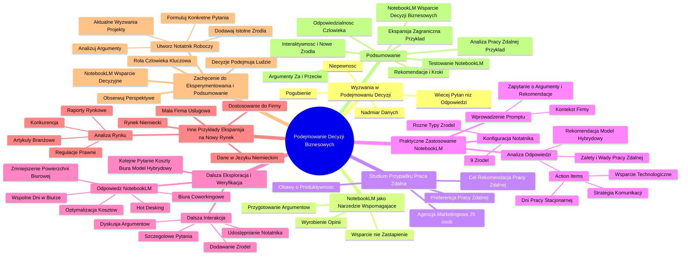

# Lekcje wideo - 6. Lepsze podejmowanie decyzji z NotebookLM

# 💡 Diagram

___

# 🗒️ Notatka

# Notatki i Podsumowanie Transkrypcji Wideo: NotebookLM i Podejmowanie Decyzji Biznesowych

## Wprowadzenie do Wyzwań w Podejmowaniu Decyzji

* Podejmowanie decyzji, szczególnie w biznesie, jest często skomplikowane z powodu **niepewności**.
* Dostęp do dużej ilości danych, raportów i opinii może prowadzić do **pogubienia** i generować **więcej pytań niż odpowiedzi**.

## NotebookLM jako Narzędzie Wspomagające Podejmowanie Decyzji

* **NotebookLM** to narzędzie, które może **wspierać** proces podejmowania decyzji biznesowych.
* **Nie podejmuje decyzji za użytkownika**, lecz pomaga w **wyrobieniu sobie opinii**.
* Umożliwia **przygotowanie argumentów** za i przeciw, co ułatwia prezentację decyzji zespołowi lub wspólnikom.

## Studium Przypadku: Decyzja o Pracy Zdalnej z NotebookLM

* **Scenariusz:** 25-osobowa agencja marketingowa rozważa powrót z pracy zdalnej do biura.
    * Zespół preferuje pracę zdalną.
    * Pojawiają się obawy dotyczące **potencjalnego negatywnego wpływu na produktywność**.
* **Cel:** Wykorzystanie NotebookLM do analizy argumentów za i przeciw pracy zdalnej oraz sformułowanie rekomendacji.

### Praktyczne Zastosowanie NotebookLM

1. **Konfiguracja Notatnika w NotebookLM:**
    * Dodano **9 źródeł** (raporty, artykuły naukowe, badania) poświęconych pracy zdalnej.
    * Wybrane źródła są różnorodne, w tym **anglojęzyczne**.
    * Dla celów demonstracyjnych ograniczono się do 9 źródeł, z możliwością rozszerzenia ich liczby.
2. **Wprowadzenie Promptu (Zapytania):**
    * Prompt uwzględnia **kontekst firmy**:
        * Praca zespołu ma charakter nieregularny, zazwyczaj w godzinach 9:00-17:00.
        * Pracownicy wyrażają preferencję pracy zdalnej.
        * Istnieją obawy o wpływ pracy zdalnej na produktywność.
    * **Zapytanie do NotebookLM:** "Przedstaw argumenty za i przeciw pracy zdalnej oraz zaproponuj rekomendację dla mojej firmy."
3. **Analiza Odpowiedzi NotebookLM:**
    * NotebookLM wygenerował **listę zalet i wad pracy zdalnej**, dostosowaną do specyfiki opisanej firmy.
    * Zaproponował **rekomendację**, wskazując na **model pracy hybrydowej** jako rozwiązanie.
    * Przedstawił **\"action items\"** (kroki do podjęcia) - konkretne działania, które pomogą w podjęciu decyzji dotyczącej pracy zdalnej:
        * Ustalenie dni pracy stacjonarnej w biurze.
        * Opracowanie skutecznej strategii komunikacji wdrożenia modelu hybrydowego.
        * Zapewnienie odpowiedniego wsparcia technologicznego dla pracy zdalnej.
    * Wskazówki zostały oparte na dostarczonych **badaniach i artykułach**.

### Dalsza Eksploracja Tematu i Weryfikacja Sugestii NotebookLM

* **Kolejne Pytanie:** Jak zredukować koszty utrzymania biura i usprawnić organizację pracy w modelu hybrydowym? (przy założeniu konieczności ponoszenia kosztów biura).
* **Odpowiedź NotebookLM:**
    * Propozycja strategii optymalizacji kosztów i usprawnienia pracy w modelu hybrydowym.
    * **Konkretne sugestie:**
        * Zmniejszenie powierzchni biurowej.
        * Wykorzystanie przestrzeni biur coworkingowych.
        * Wdrożenie systemu **hot deskingu** (współdzielenia biurek).
        * Ustalenie strategii wspólnych dni pracy w biurze dla całego zespołu.
* **Możliwości Dalszej Interakcji:**
    * Zadawanie NotebookLM kolejnych, szczegółowych pytań.
    * Dyskutowanie z argumentami przedstawionymi przez narzędzie.
    * Dodawanie nowych źródeł informacji.
    * Wykorzystanie notatnika NotebookLM do **dyskusji z zespołem/wspólnikami** (poprzez udostępnianie notatnika).

## Inne Przykłady Zastosowania NotebookLM: Ekspansja na Nowy Rynek

* **Przykład:** Mała firma usługowa planuje wejście na rynek niemiecki.
* **Zastosowanie NotebookLM:**
    * Analiza **raportów rynkowych**, **regulacji prawnych**, **artykułów branżowych** oraz **działań konkurencji**.
    * **Gromadzenie danych w języku niemieckim** i **przekształcanie** ich w uporządkowaną formę.
    * Odniesienie zebranych danych do **specyfiki i informacji o własnej firmie**.

## Zachęcenie do Eksperymentowania i Podsumowanie Kluczowych Punktów

* **Zachęta:** Utworzenie własnego notatnika roboczego w NotebookLM dla bieżących wyzwań i projektów.
    * Dodawanie istotnych źródeł.
    * Formułowanie konkretnych pytań.
    * Analizowanie i weryfikowanie argumentów.
    * Obserwacja ewolucji perspektywy i sposobu myślenia.
* **Ważne Podkreślenie:** NotebookLM stanowi **wsparcie decyzyjne**, lecz **ostateczne decyzje podejmują ludzie**.
* **Kluczowa rola czynnika ludzkiego** w procesie podejmowania decyzji biznesowych.

## Podsumowanie

Niniejsza transkrypcja wideo prezentuje **NotebookLM** jako narzędzie wspomagające podejmowanie decyzji biznesowych w warunkach nadmiaru informacji i wszechobecnej niepewności. Na przykładzie analizy decyzji o pracy zdalnej w agencji marketingowej, zademonstrowano, w jaki sposób NotebookLM może ułatwić analizę argumentów za i przeciw, generowanie rekomendacji oraz sugerowanie konkretnych kroków implementacyjnych. Podkreślono interaktywny charakter narzędzia, umożliwiający zadawanie dodatkowych pytań i wzbogacanie analizy o nowe źródła. Przedstawiono również alternatywny przykład zastosowania NotebookLM – analizę rynku w kontekście ekspansji zagranicznej.  Podsumowując, nagranie wideo zachęca do praktycznego przetestowania możliwości NotebookLM, akcentując, że jest to narzędzie wspomagające, a finalna odpowiedzialność za decyzje spoczywa zawsze na człowieku.

___

# 🔉 Transcript
File: Lekcje wideo - 6. Lepsze podejmowanie decyzji z NotebookLM.mp4 
[00:00:05] Teraz zajmiemy się wyzwaniem, które dotyczy nas wszystkich.
[00:00:10] Podejmowaniem decyzji.
[00:00:12] Decyzje, szczególnie te biznesowe są często obarczone niepewnością.
[00:00:16] Gdy mamy do dyspozycji mnóstwo danych, artykułów, raportów, opinii i tak dalej, łatwo się pogubić.
[00:00:21] Czasami zamiast rozwiązania dostajemy jeszcze większą ilość pytań.
[00:00:26] W takich sytuacjach NotebookLM może być niezastąpionym wsparciem.
[00:00:31] Narzędzie nie podejmuje decyzji za was, ale może wam pomóc wyrobić sobie opinię.
[00:00:36] A dodatkowo możecie użyć notebooka do przygotowania argumentów w taki sposób, aby łatwiej było przedstawić decyzję zespołowi albo wspólnikom.
[00:00:45] Ale koniec tego opowiadania.
[00:00:47] Pokażmy to na przykładzie, gdzie spróbujemy odpowiedzieć na pytanie, czy w naszej firmie powinniśmy wrócić do biura i zapomnieć o pracy zdalnej.
[00:00:54] Okej, załóżmy w takim razie na potrzeby tej lekcji, że jesteśmy właścicielami 25osobowej agencji marketingowej.
[00:01:03] Nasz zespół składa się z grafików, marketingowców, specjalistów od SEO, developerów oraz sprzedawców.
[00:01:10] Zespół chciałby w pełni pracować zdalnie, ale słyszeliśmy różne opinie, że to może negatywnie wpływać na produktywność naszej firmy, naszej agencji.
[00:01:19] Co robimy w takiej sytuacji?
[00:01:21] Screen: notebooklm.google.com
[00:01:21] Przejdziemy teraz do notatnika w NotebookLM, którego przygotowałem wcześniej i do którego dodaliśmy dziewięć źródeł znalezionych przeze mnie w takim krótkim researchu.
[00:01:32] Screen: Remote Work: A Review of Research and Best Practices.
[00:01:32] Wydawały mi się sensowne.
[00:01:33] Jak widzicie, to różne raporty, artykuły naukowe, również te w języku angielskim oraz wyniki badań naukowych.
[00:01:41] Może być ich oczywiście znacznie więcej, ale dla tego przykładu ograniczymy się tylko i wyłącznie do tych dziewięciu.
[00:01:48] Następnie wprowadzamy prompt, który tutaj już zawiera ten kontekst, o którym wspominałem przed chwilą.
[00:01:57] Natomiast poprosimy notebooka, aby uwzględniając to, że nasz zespół pracuje nieregularnie, ale zazwyczaj w godzinach 9:0017:00, pracownicy chcieliby móc pracować w pełni zdalnie.
[00:02:10] Słyszałem, że może to źle wpływać na produktywność zespołu.
[00:02:14] I prosimy notebooka: przedstaw wszystkie za i przeciw pracy zdalnej i podaj rekomendację dla mojej firmy.
[00:02:25] Czekając na odpowiedź możemy też ukryć sobie Studio z uwagi na to, że nie będziemy korzystali z podcastu.
[00:02:48] Otrzymaliśmy odpowiedź i tutaj warto zwrócić uwagę, że prompt, który wprowadziliśmy był wyjątkowo szczegółowy i dotyczył konkretnie naszej firmy, sytuacji naszego zespołu.
[00:03:00] Notebook przedstawił nam różne argumenty, zalety oraz wady za pracą zdalną dla naszej firmy, a także zaprezentował rekomendacje, gdzie jedną z nich jest rozważenie modelu pracy hybrydowej.
[00:03:16] To co również widzimy to różne action items, różne aktywności, które powinniśmy wykonać teraz, aby lepiej odpowiedzieć sobie na to pytanie.
[00:03:25] Zdefiniuj dni wspólnej pracy w biurze, zadbaj o odpowiednią komunikację całego procesu, zapewnij wsparcie technologiczne.
[00:03:32] Te wszystkie elementy znajdują się tutaj na podstawie właśnie tych różnych badań, artykułów, które wprowadziliśmy oraz różne wskazówki.
[00:03:39] No i co robimy z tym dalej?
[00:03:40] Czyli jesteśmy zadowoleni z tej odpowiedzi?
[00:03:42] No to zależy oczywiście od naszych potrzeb i tego, jakich informacji i jak skomplikowanych informacji tak naprawdę poszukujemy.
[00:03:49] Ale jeżeli chcielibyśmy pogłębić ten temat i na przykład schallengeować notebooka pod kątem tej pracy hybrydowej, dodajmy do niego kolejne pytanie.
[00:04:14] Decydując się na hybrydowy model pracy nadal będę musiał opłacać biuro.
[00:04:15] Jak mogę zmniejszyć koszty biura i usprawnić system pracy?
[00:04:31] W odpowiedzi na nasze pytanie NotebookLM zaproponował konkretną strategię redukcji kosztów wykorzystania biura i usprawnienia pracy.
[00:04:39] Możemy, na przykład zgodnie z jego sugestią zmniejszyć przestrzeń biurową, której potrzebujemy lub korzystać z biur współdzielonych.
[00:04:49] Podobnie możemy zrobić z ilością biurek w naszym zespole, wprowadzić tak zwane hot deski, czyli współdzielenie tych biurek.
[00:04:56] Możemy też, na przykład zastosować strategię wspólnych dni w biurze dla całego zespołu, w których tylko i wyłącznie się widzimy.
[00:05:03] To tylko kilka z tych aspektów, które, które widzimy w dość długiej odpowiedzi.
[00:05:08] I możemy dalej dopytywać notebooka o kolejne rzeczy, odbijać te argumenty, które zaproponował.
[00:05:15] Dodawać kolejne źródła, na których chcemy bazować.
[00:05:18] Możemy też wykorzystać to do dalszej dyskusji z zespołem czy wspólnikami, na przykład dzieląc się z nimi tym konkretnym notatnikiem.
[00:05:25] Ale nasza wiedza jest już uporządkowana na tym etapie w jakimś stopniu.
[00:05:30] Jest dopasowana do naszej sytuacji.
[00:05:32] No i oczywiście łatwiejsza do przemyślenia.
[00:05:35] I to tylko jeden z wielu przykładów takiego zastosowania NotebookLM.
[00:05:39] Wyobraźcie sobie, że w ten sam sposób możecie na przykład przygotować się do podjęcia decyzji o wejściu na nowy rynek.
[00:05:47] W jaki sposób?
[00:05:48] Jeżeli jesteś właścicielem, na przykład małej firmy usługowej, która chce wejść na rynek zagraniczny, na przykład w Niemczech, chcesz zrozumieć potencjał tego rynku, konkurencję i potrzeby lokalnych klientów.
[00:06:00] NotebookLM może pomóc ci w analizie raportów rynkowych, przepisów, artykułów i przykładów działań konkurencji.
[00:06:08] Narzędzie może nawet zebrać dane w języku niemieckim, a następnie przetłumaczyć je i przedstawić w uporządkowanej, zwięzłej formie.
[00:06:16] Co więcej, odnieść to do informacji na temat swojej firmy.
[00:06:21] I co, na koniec?
[00:06:30] Spróbujcie sami.
[00:06:31] Stwórzcie roboczy notatnik dotyczący jednego z waszych aktualnych wyzwań czy projektów.
[00:06:35] Dodajcie źródła, zadawajcie pytania, odbijajcie argumenty.
[00:06:40] Zobaczcie jak i czy, czy i jak zmienia wam to perspektywę.
[00:06:47] A na koniec, pamiętajcie, NotebookLM to tylko i wyłącznie wsparcie.
[00:06:51] Ale decyzje zawsze należą do was.
[00:06:55] To człowiek jest kluczowy w procesie podejmowania decyzji.

___
# 🏷️ Tags
#podejmowanie_decyzji #decyzje_biznesowe #niepewność #dane #raporty #opinie #NotebookLM #wsparcie_decyzyjne #argumenty_za_i_przeciw #praca_zdalna #agencja_marketingowa #produktywność #konfiguracja_notatnika #źródła #raporty #artykuły_naukowe #badania #prompt #kontekst_firmy #rekomendacja #model_pracy_hybrydowej #action_items #kroki_do_podjęcia #badania #artykuły #koszty_utrzymania_biura #optymalizacja_kosztów #przestrzeń_biurowa #biura_coworkingowe #hot_desking #współdzielenie_biurek #ekspansja_na_nowy_rynek #rynek_niemiecki #regulacje_prawne #działania_konkurencji #analiza_rynkowa #wsparcie #czynnik_ludzki
