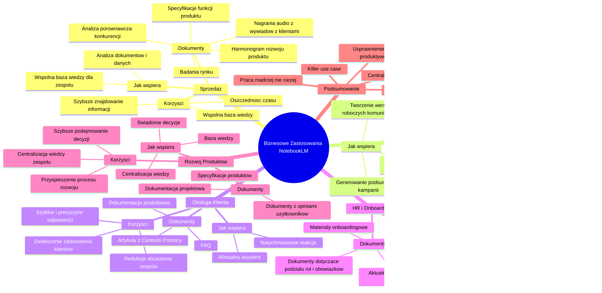

# Lekcje wideo - 7. Pomysły na wykorzystanie NotebookLM w działalności firmy

# 💡 Diagram

___

# 🗒️ Notatka

# NotebookLM - Biznesowe Zastosowania: Szczegółowe Notatki i Podsumowanie

## Wprowadzenie

Niniejsza prezentacja omawia **biznesowe zastosowania narzędzia NotebookLM**, koncentrując się na pięciu głównych obszarach, w których NotebookLM może przynieść korzyści firmom. Celem jest przedstawienie, w jaki sposób NotebookLM może usprawnić pracę i zwiększyć efektywność w różnych działach przedsiębiorstwa poprzez lepsze wykorzystanie dostępnej wiedzy.

## 5 Głównych Obszarów Zastosowania NotebookLM

Prezentacja skupia się na pięciu kluczowych obszarach biznesowych, w których NotebookLM może okazać się szczególnie przydatny:

1. **Sprzedaż**
2. **Marketing**
3. **Obsługa Klienta**
4. **HR i Onboarding**
5. **Rozwój Produktów**

## 1. Sprzedaż

### Korzyści z NotebookLM w Sprzedaży:

- **Szybsze znajdowanie informacji:** NotebookLM tworzy wspólną bazę wiedzy, umożliwiając zespołowi sprzedaży błyskawiczny dostęp do potrzebnych danych.
- **Oszczędność czasu:** Dzięki szybkiemu dostępowi do informacji, zespół sprzedaży może poświęcić więcej czasu na **kontakt z klientami** i budowanie relacji.

### Jak NotebookLM wspiera Sprzedaż?

- Analiza dokumentów i danych w celu szybkiego dotarcia do kluczowych informacji.
- Stworzenie **wspólnej bazy wiedzy** dla zespołu sprzedaży.

### Przykładowe Dokumenty do Dodania do NotebookLM:

- Harmonogram rozwoju produktu
- Specyfikacje funkcji produktu
- Analiza porównawcza konkurencji
- Nagrania audio z wywiadów z klientami
- Badania rynku

## 2. Marketing

### Korzyści z NotebookLM w Marketingu:

- **Dogłębne zrozumienie trendów rynkowych i działań konkurencji:** NotebookLM ułatwia analizę danych rynkowych i konkurencyjnych.
- **Automatyczne generowanie wersji roboczych komunikatów i raportów z kampanii:**  Znacząco usprawnia tworzenie treści marketingowych i podsumowań.
- **Efektywniejsze planowanie strategii marketingowej:** Wspomaga opracowywanie skutecznych strategii marketingowych.

### Jak NotebookLM wspiera Marketing?

- Analiza trendów i zachowań konkurencji.
- Tworzenie wersji roboczych komunikatów marketingowych.
- Generowanie podsumowań kampanii.
- Opracowywanie strategii marketingowych.

### Przykładowe Dokumenty do Dodania do NotebookLM:

- Wyniki badań rynkowych
- Analiza segmentacji klientów
- Plany rozwoju produktów
- Strategie działań marketingowych

## 3. Obsługa Klienta

### Korzyści z NotebookLM w Obsłudze Klienta:

- **Szybkie i precyzyjne odpowiedzi na pytania klientów:** NotebookLM umożliwia błyskawiczne wyszukiwanie odpowiedzi w dokumentacji.
- **Zwiększenie zadowolenia klientów:** Sprawne rozwiązywanie problemów klientów podnosi ich satysfakcję.
- **Redukcja obciążenia zespołu obsługi klienta:** Automatyzacja odpowiedzi na typowe pytania zmniejsza obciążenie pracowników.

### Jak NotebookLM wspiera Obsługę Klienta?

- Pełni rolę **wirtualnego asystenta**, udzielając precyzyjnych odpowiedzi z odniesieniem do wprowadzonych źródeł.
- Umożliwia natychmiastowe reakcje na zapytania klientów.

### Przykładowe Dokumenty do Dodania do NotebookLM:

- Artykuły z Centrum Pomocy
- FAQ (Najczęściej Zadawane Pytania)
- Dokumentacja produktowa

## 4. HR i Onboarding

### Korzyści z NotebookLM w HR i Onboardingu:

- **Sprawne i efektywne wdrożenie nowych pracowników:** NotebookLM ułatwia nowym pracownikom zapoznanie się z dokumentacją firmy.
- **Interakcja z dokumentami onboardingowymi:** Nowi pracownicy mogą w interaktywny sposób korzystać z materiałów wprowadzających.

### Jak NotebookLM wspiera HR i Onboarding?

- Ułatwia nowym pracownikom wdrożenie się w nowe obowiązki.
- Umożliwia interaktywną pracę z dokumentami onboardingowymi.

### Przykładowe Dokumenty do Dodania do NotebookLM:

- Materiały związane z onboardingiem
- Aktualne prezentacje dla zespołów
- Dokumenty dotyczące podziału ról i obowiązków

## 5. Rozwój Produktów

### Korzyści z NotebookLM w Rozwoju Produktów:

- **Centralizacja wiedzy zespołu produktowego:** NotebookLM tworzy centralne repozytorium wiedzy dla zespołu.
- **Szybsze podejmowanie decyzji opartych na danych:** Ułatwia dostęp do danych i informacji niezbędnych do podejmowania decyzji.
- **Przyspieszenie procesu rozwoju produktów:** Lepsza organizacja informacji usprawnia proces rozwoju.

### Jak NotebookLM wspiera Rozwój Produktów?

- Organizuje informacje w formie **bazy wiedzy**, wspierając zespół w zarządzaniu procesem rozwoju produktów.
- Pomaga scentralizować wiedzę zespołu.
- Umożliwia podejmowanie świadomych decyzji.

### Przykładowe Dokumenty do Dodania do NotebookLM:

- Specyfikacje produktów
- Dokumentacja projektowa
- Dokumenty z opiniami użytkowników

## Podsumowanie i Konkluzja

NotebookLM to narzędzie, które może znacząco **usprawnić pracę i zwiększyć produktywność** w różnych obszarach biznesowych. Dzięki centralizacji wiedzy i ułatwieniu dostępu do informacji, NotebookLM pomaga zespołom pracować **mądrzej, a nie ciężej**. Zachęcamy do rozważenia **`killer use case`** dla NotebookLM w Państwa organizacji i rozpoczęcia wykorzystywania tego narzędzia w celu efektywniejszego wykorzystania wiedzy firmowej.

Głównym przesłaniem prezentacji jest potencjał NotebookLM do transformacji sposobu, w jaki firmy zarządzają wiedzą i wykorzystują ją do osiągania lepszych wyników w sprzedaży, marketingu, obsłudze klienta, HR i rozwoju produktów.

___

# 🔉 Transcript
File: Lekcje wideo - 7. Pomysły na wykorzystanie NotebookLM w działalności firmy.mp4 
[00:00:05] Teraz wspólnie z Michałem omówimy bardziej biznesowe use case'y NotebookLM.
[00:00:10] I choć może być ich bardzo dużo, my skupimy się na pięciu głównych obszarach, które, w których każdy z was może znaleźć coś dla siebie.
[00:00:17] (Ekran: Prezentacja tytułowa: 5 głównych obszarów. 1. Sprzedaż, 2. Marketing, 3. Obsługa klienta, 4. HR i onboarding, 5. Rozwój produktów. Logo Google i SGH w rogu ekranu).
[00:00:17] Te obszary to: sprzedaż, marketing, obsługa klienta, rozwijanie produktów oraz HR i onboarding.
[00:00:24] Zacznijmy od sprzedaży, jako jednego z najważniejszych aspektów prowadzenia biznesu.
[00:00:30] W jaki sposób NotebookLM może wam w nim pomóc?
[00:00:33] Wystarczy, że dodacie do narzędzia na przykład harmonogram rozwoju produktu i specyfikację jego funkcji, analizę porównawczą konkurencji, nagrania audio z wywiadów z klientami czy badania rynku.
[00:00:46] NotebookLM może utworzyć w jednej chwili wspólną bazę wiedzy, która pomoże waszemu zespołowi sprzedaży szybciej znajdować informacje, a dzięki temu poświęcać więcej czasu na to, co ważne, jak na przykład kontakt z klientami.
[00:01:01] (Ekran: Prezentacja tytułowa: Marketing. Korzyści: Lepsze zrozumienie trendów rynkowych i działań konkurencji. Automatyczne generowanie roboczych wersji komunikatów i raportów z kampanii. Usprawnione planowanie strategii marketingowej. Dodaj do NotebookLM: Wyniki badań rynkowych. Analiza podziału klientów na segmenty. Plany rozwoju produktów. Strategia działań marketingowych. NotebookLM analizuje wprowadzone dane i pomaga tworzyć strategie, raporty oraz analizy rynkowe. Logo Google i SGH w rogu ekranu).
[00:01:01] Ale sprzedaży tak naprawdę nie ma bez marketingu i w tym też NotebookLM może wam pomóc.
[00:01:06] Na przykład poprzez analizę trendów i zachowań konkurencji, oraz tworzenie roboczych wersji komunikatów i podsumowy kampanii.
[00:01:14] Jak?
[00:01:14] Dodajcie po prostu wyniki badań rynkowych, analizę podziału klientów na segmenty oraz plany rozwoju produktów i działań marketingowych.
[00:01:22] Dzięki temu możecie znacznie sprawniej opracować nawet całą marketingową strategię dla swojej firmy.
[00:01:29] Wspomnieliśmy już o sprzedaży i marketingu, dlatego warto poruszyć teraz obszar będący w pewnym sensie na ich styku, czyli obsługę klienta.
[00:01:37] (Ekran: Prezentacja tytułowa: Obsługa klienta. Korzyści: Szybka i dokładna odpowiedź na pytania klientów. Zwiększenie zadowolenia klientów dzięki szybkiemu rozwiązywaniu problemów. Redukcja obciążenia zespołu obsługi klienta. Dodaj do NotebookLM: Artykuły z Centrum Pomocy. FAQ (najczęściej zadawane pytania). Dokumentacje produktową. NotebookLM pełni rolę virtualnego asystenta, który udziela precyzyjnych odpowiedzi z odniesieniem do wprowadzonych źródeł. Logo Google i SGH w rogu ekranu).
[00:01:38] NotebookLM może pomóc waszym klientom szybko znaleźć odpowiedź na typowe pytania i zwiększyć ich poziom zadowolenia z waszego produktu czy usługi.
[00:01:48] Wystarczy, że dodacie do narzędzia artykuły z Centrum Pomocy, sekcję najczęściej zadawanych pytań i dokumentację produktową, a NotebookLM jak virtualny asystent, może pomóc udzielić wam natychmiastowej i precyzyjnej odpowiedzi na pojawiające się pytania klientów z odniesieniem do konkretnych źródeł.
[00:02:09] A co, jeśli chcecie usprawnić proces szkolenia waszych pracowników?
[00:02:13] Wystarczy, że dodacie informacje związane z onboardingiem, czy najnowsze prezentacje dla zespołów, albo dokumenty dotyczące podziału ról i obowiązków.
[00:02:23] Notebook może pomóc nowo zatrudnionym osobom szybko i skutecznie wdrożyć się w nowe obowiązki, umożliwiając im interakcję z tymi dokumentami.
[00:02:31] (Ekran: Prezentacja tytułowa: Rozwój produktów. Korzyści: Centralizacja wiedzy zespołu produktowego. Szybsze podejmowanie decyzji opartych na rzetelnych danych. Przyspieszenie rozwoju produktów dzięki lepszej organizacji. Dodaj do NotebookLM: Specyfikacje produktów. Dokumentacje projektową. Dokument z opiniami użytkowników. NotebookLM organizuje informacje w formie bazy wiedzy, wspierając zespół w lepszym zarządzaniu procesem rozwoju produktów. Logo Google i SGH w rogu ekranu).
[00:02:31] I teraz czas na nasz piąty, ostatni obszar, czyli rozwijanie produktów.
[00:02:36] NotebookLM może pomóc zespołom produktowym w scentralizowaniu ich wiedzy, podejmowaniu świadomych decyzji oraz przyspieszaniu rozwoju produktów.
[00:02:44] Dodajcie specyfikacje produktów, dokumenty projektowe i raporty z opiniami użytkowników, aby stworzyć swego rodzaju repozytorium, taką bazę wiedzy zespołu produktowego.
[00:02:57] W tej lekcji skupiliśmy się na możliwościach wykorzystania NotebookLM w różnych obszarach biznesowych.
[00:03:02] Omówiliśmy jak Notebook może pomóc wam usprawnić pracę i zwiększyć produktywność oraz efektywność firmy.
[00:03:09] Zastanówcie się teraz, jaki może być wasz killer use case dla Notebooka i gdzie już dziś możecie wykorzystać to narzędzie w swojej organizacji, aby pracować sprawniej, a nie ciężej, wykorzystując 100% wiedzy dostępnej w waszej firmie.
[00:03:24] (Ekran końcowy: Umiejętności Jutra AI. Organizator: Google. Partner Edukacyjny: SGH. Patronat Honorowy: Minister Cyfryzacji).

___
# 🏷️ Tags
#NotebookLM #biznesowe_zastosowania #sprzedaż #marketing #obsługa_klienta #HR #onboarding #rozwój_produktów #efektywność #produktywność #baza_wiedzy #wspólna_baza_wiedzy #kontakt_z_klientami #trendy_rynkowe #analiza_konkurencji #komunikaty_marketingowe #raporty_z_kampanii #strategia_marketingowa #satysfakcja_klienta #wirtualny_asystent #dokumentacja #materiały_onboardingowe #specyfikacje_produktów #dokumentacja_projektowa #opinie_użytkowników #killer_use_case #SGH #google
