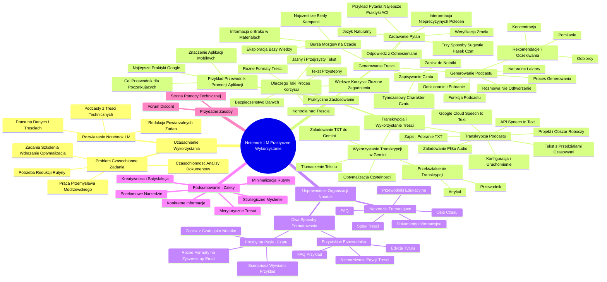

# Lekcje wideo - 8. NotebookLM w pracy z klientami

# 💡 Diagram

___

# 🗒️ Notatka

# Notatki i Podsumowanie Lekcji „Umiejętności Jutra” - Praktyczne Wykorzystanie Notebook LM

## Wprowadzenie

Ta lekcja z serii „Umiejętności Jutra” koncentruje się na praktycznym zastosowaniu narzędzia **Notebook LM** w codziennej pracy, szczególnie w kontekście wsparcia klientów i analizy dokumentów. Przemysław Modrzewski z Google (Measurement & Growth Lead, CEE) dzieli się swoim doświadczeniem i prezentuje sposoby wykorzystania Notebook LM do zwiększenia efektywności i produktywności.

## Uzasadnienie Wykorzystania Notebook LM

### Problem: Czasochłonne i Odtwórcze Zadania

- Przemysław Modrzewski w Google zajmuje się merytorycznym wsparciem kluczowych klientów w obszarze analityki i narzędzi reklamowych Google.
- Jego praca obejmuje:
    - Prowadzenie szkoleń dla klientów.
    - Wdrażanie zespołów w nowe rozwiązania.
    - Wsparcie w optymalizacji kampanii reklamowych.
- Te zadania wiążą się z:
    - Licznymi spotkaniami.
    - Koniecznością przekazywania wiedzy o dobrych praktykach.
    - Analizą wewnętrznej dokumentacji technicznej.
    - Analizą danych i formułowaniem rekomendacji optymalizacyjnych.
- Analiza dokumentacji technicznej i opracowywanie rekomendacji w oparciu o dobre praktyki jest **czasochłonne, nużące i powtarzalne**.
- Istnieje potrzeba ograniczenia czasu poświęcanego na rutynowe czynności i skoncentrowania się na analizie danych oraz interakcji z klientami.

### Rozwiązanie: Notebook LM

- **Notebook LM** okazał się optymalnym narzędziem do redukcji powtarzalnych zadań.
- Umożliwia pracę na załadowanych danych i treściach.
- Potrafi przekształcić złożone treści techniczne w **przystępny podcast**.

## Praktyczne Zastosowanie Notebook LM – Przykład Przewodnika po Promocji Aplikacji Mobilnych

### Scenariusz Użycia

- Celem jest przygotowanie **przystępnego przewodnika dla początkujących** dotyczącego promocji aplikacji mobilnych.
- Aplikacje mobilne zyskują na znaczeniu w biznesie.
- Wiele firm poszukuje wiedzy na temat skutecznej promocji aplikacji.
- Zamierzenie: Dostarczenie klientom **najlepszych praktyk** i sprawdzonych rozwiązań w zakresie promocji aplikacji w ekosystemie Google.

### Wykorzystanie Notebook LM do Generowania Treści

1. **Zadawanie pytań w języku naturalnym**:
    - Notebook LM umożliwia zadawanie pytań dotyczących przesłanych dokumentów.
    - **Trzy sposoby zadawania pytań**:
        - Sugestie pytań po prawej stronie interfejsu.
        - Wpisywanie własnych pytań w pasku na dole ekranu.
        - Czat (dostępny po kliknięciu przycisku „wyświetl czat” w lewym dolnym rogu).
    - Przykład pytania: „wygeneruj listę najlepszych praktyk w zakresie tworzenia kampanii do promocji aplikacji” (ACI - app campaigns for install).
    - Notebook LM efektywnie interpretuje nawet **nieprecyzyjne polecenia** (mieszanka języków, akronimy).
    - Odpowiedź zawiera **listę najlepszych praktyk** z odniesieniami do dokumentów źródłowych (numery w szarych owalach).
    - **Weryfikacja źródła**: Kliknięcie numeru referencyjnego otwiera panel z przewodnikami po źródłach i podświetla konkretne odniesienie w dokumencie.

2. **Generowanie pomysłów (Burza Mózgów) na stronie czatu**:
    - Przykład zapytania: „burza mózgów w zakresie najczęstszych błędów podczas tworzenia kampanii do promocji aplikacji”.
    - Eksploracja bazy wiedzy bez ryzyka odwoływania się do nieznanych źródeł.
    - System informuje, gdy zapytanie wykracza poza zakres dostarczonych materiałów.

3. **Zapisywanie i Wykorzystanie Czatu**:
    - Strona czatu ma charakter **tymczasowy** (dane znikają po zamknięciu lub odświeżeniu przeglądarki).
    - **Zapisywanie rozmowy**: Należy kliknąć „zapisz do notatki”, aby zachować historię czatu.

4. **Generowanie Podcastu**:
    - Funkcja podcastu jest dostępna w prawym górnym rogu interfejsu.
    - Możliwość określenia **rekomendacji i oczekiwań** dotyczących treści podcastu:
        - Na czym rozmówcy mają się skoncentrować?
        - Jakie tematy pominąć?
        - Określenie grupy odbiorców.
    - Kliknięcie „generuj” inicjuje proces tworzenia podcastu, który trwa kilka minut.
    - Podcast można **odsłuchać w interfejsie lub pobrać** jako plik audio.
    - Podcast ma formę **rozmowy między dwoma gospodarzami**, omawiającej kluczowe aspekty dokumentów, a nie jest dosłownym odtworzeniem treści.
    - Lektorzy w podcaście brzmią **naturalnie i wyrażają emocje**.

### Transkrypcja Podcastu i Dalsze Wykorzystanie Treści

1. **Transkrypcja Podcastu z Google Cloud Speech to Text**:
    - **Utworzenie projektu i obszaru roboczego w Google Cloud**.
    - Aktywacja **API Speech to Text** w konsoli Google Cloud.
    - Załadowanie pliku podcastu (audio) z komputera lub Dysku Google.
    - Konfiguracja ustawień i uruchomienie transkrypcji.
    - Google Cloud przetwarza dźwięk na tekst.
    - Transkrypcja jest prezentowana z podziałem na przedziały czasowe.
    - Możliwość **zapisania i pobrania transkrypcji** w formacie TXT.

2. **Wykorzystanie Transkrypcji w Gemini**:
    - Załadowanie pliku TXT z transkrypcją do Gemini.
    - **Tłumaczenie tekstu** na wybrany język.
    - **Przekształcenie transkrypcji** w:
        - Przewodnik dla początkujących.
        - Artykuł.
    - Optymalizacja tekstu w celu zwiększenia **czytelności** (transkrypcja rozmowy nie jest idealna do czytania).

### Dlaczego Taki Proces? Korzyści

- **Jasny i przejrzysty tekst** bazujący na łatwej w odbiorze rozmowie.
- **Tekst przystępny** dla osób bez specjalistycznej wiedzy o promocji aplikacji.
- **Kontrola nad treścią**: Materiał oparty wyłącznie na dostarczonych dokumentach.
- **Bezpieczeństwo danych**: Treści generowane tylko na podstawie wybranych dokumentów.
- **Kluczowa informacja**: Możliwość zaznaczenia w zapytaniu do AI, aby korzystała tylko z określonego tekstu.
- **Możliwość generowania różnorodnych formatów treści**: Artykuł, przewodnik krok po kroku, itp.
- Im bardziej złożone zagadnienia, tym **większe korzyści** płyną z takiego podejścia.

## Usprawnienie Organizacji Notatek w Formatach Strukturalnych

### Narzędzia Formatujące w Notebook LM

- Ułatwiają tworzenie:
    - FAQ (Najczęściej Zadawane Pytania).
    - Przewodników edukacyjnych.
    - Osi czasu.
    - Spisów treści.
    - Dokumentów informacyjnych.

### Dwa Sposoby Formatowania

1. **Przyciski dostępne w górnej części przewodnika po notatniku**:
    - Dostępne opcje: FAQ, przewodnik edukacyjny, spis treści, oś czasu, dokument informacyjny.
    - Przykład: Kliknięcie przycisku **FAQ** generuje notatkę w formacie FAQ dotyczącą promocji aplikacji.
    - Notatki generowane przez AI są **niemożliwe do edycji w zakresie treści**, ale można modyfikować tytuł.

2. **Formułowanie próśb o określone formaty na pasku czatu**:
    - Przykład zapytania: „scenariusz wywiadu między reporterem a ekspertem w dziedzinie promocji aplikacji”.
    - Zapisanie odpowiedzi z czatu jako notatki (opcja „Zapisz do notatki”).
    - Możliwość tworzenia **różnych formatów** na życzenie (np. e-mail do klienta z dobrymi praktykami).

## Podsumowanie i Zalety Notebook LM

- **Przełomowe narzędzie**: Notebook LM znacząco skraca czas pracy.
- Dostarcza **konkretnych informacji**.
- Umożliwia koncentrację na **strategicznym myśleniu** i długofalowym wsparciu klientów.
- Pozwala na tworzenie **merytorycznych treści** na zadany temat.
- Minimalizuje powtarzalne, czasochłonne i monotonne zadania.
- Zwiększa kreatywność i satysfakcję z wykonywanej pracy.

## Przydatne Zasoby

- **Strona pomocy technicznej Notebook LM**: Informacje o funkcjach i aktualizacjach.
- **Forum na platformie Discord**: Cenne źródło informacji i wsparcia społeczności.

## Zakończenie

Zachęcamy do eksperymentowania z Notebook LM i wykorzystania narzędzi AI w celu podniesienia efektywności pracy. Warto skupić się na kreatywnych aspektach pracy, minimalizując udział rutynowych czynności.

---

**Podsumowanie:**

Lekcja „Umiejętności Jutra” prezentuje praktyczne zastosowanie narzędzia Notebook LM, demonstrując, w jaki sposób Przemysław Modrzewski z Google wykorzystuje je do optymalizacji swojej pracy. Notebook LM wspiera analizę dokumentów, generowanie różnorodnych treści (podcasty, przewodniki, FAQ), transkrypcję audio oraz tworzenie notatek w różnych formatach. Kluczowe korzyści to oszczędność czasu, kontrola nad treścią, opcja tworzenia wielu wariantów materiałów i możliwość skupienia się na strategicznych aspektach pracy. Narzędzie to stanowi przełom, pozwalając na minimalizację odtwórczych zadań i stymulację kreatywności. Lekcja stanowi zachętę do eksploracji Notebook LM i wykorzystania AI w celu zwiększenia efektywności i satysfakcji z pracy.

___

# 🔉 Transcript
File: Lekcje wideo - 8. NotebookLM w pracy z klientami.mp4 
[00:00:00] (Pojawia się czarny pionowa kreska na białym tle)
[00:00:01] (Na ekranie pojawia się napis "Umiejętności Jutra" z logiem AI)
[00:00:05] (Mężczyzna siedzi przy biurku z laptopem, za nim znajduje się ściana z logo google)
[00:00:05] (Na dole pojawia się podpis Przemysław Modrzewski, Measurement & Growth Lead, CEE, Google)
[00:00:06] Witaj na lekcji dotyczącej praktycznego wykorzystania narzędzia Notebook LM w codziennych obowiązkach.
[00:00:12] W tej lekcji opowiem wam jak korzystam z niego przy pracy z moimi klientami.
[00:00:17] Jak już wiesz z poprzednich lekcji Notebook LM może szybko podsumowywać złożone dokumenty, odpowiedzieć na konkretne pytania dotyczące ich treści, a nawet przekształcić je w briefingi, przewodniki do nauki lub podcasty.
[00:00:32] Zanim opowiem wam o pomyśle wykorzystania notebooka, to muszę wyjaśnić skąd zrodziła się u mnie potrzeba częstego wykorzystania tego narzędzia.
[00:00:40] W Google moim zadaniem jest wsparcie merytoryczne największych klientów w zakresie analityki i efektywnego wykorzystania narzędzi reklamowych w ekosystemie Google.
[00:00:51] Bardzo często prowadzę szkolenia dla klientów, ale też pomagam wdrażać zespoły w zakresie nowych rozwiązań i wspieram procesy optymalizacji działań reklamowych.
[00:01:00] Takie zadania wymagają wielu spotkań, ale też przekazywania wiedzy w zakresie dobrych praktyk i rozwiązań jakie wypracowaliśmy wewnątrz Google.
[00:01:09] To wymaga ode mnie często wielu godzin analiz wewnętrznych dokumentów technicznych dotyczących usług i narzędzi oraz analiz tego co działa dla konkretnej firmy.
[00:01:18] No i na to wszystko trzeba nałożyć bardzo ważną część mojej pracy, czyli rekomendowania działań optymalizacyjnych na podstawie danych.
[00:01:27] W moim przypadku akurat analiza danych i konkretnych działań marketingowych jest tym co lubię i czuję, że mnie rozwija.
[00:01:34] Ale już analiza dokumentów technicznych i tworzenie rekomendacji z dobrymi praktykami jest dla mnie to praca nie tylko czasochłonna, ale dość nużąca i raczej małowórcza, a raczej bardziej odtwórcza.
[00:01:47] Co jeszcze bardziej mnie tak naprawdę męczy.
[00:01:49] Zatem od razu jak pojawiła się możliwość wykorzystywania sztucznej inteligencji w pracy, pomyślałem, że to może być właśnie dobry moment na ograniczenie czasu poświęconego na odtwórcze aktywności, a skupienie się na analizach i wyciągania wniosków z danych oraz praca bezpośrednio z zespołami po stronie moich klientów.
[00:02:09] W tym procesie Notebook LM okazał się dla mnie najlepszym narzędziem.
[00:02:13] Nie tylko operuje w obrębie danych i treści, które prześlę, ale też potrafi zmienić trudne techniczne i skomplikowane treści na łatwy w odbiorze i przyjazny podcast.
[00:02:24] No dobra, ale pewnie zapytacie jak wykorzystać podcast w pracy z klientami.
[00:02:29] Jak wykorzystać te funkcje do tworzenia przyjaznych dokumentów dla moich klientów.
[00:02:34] Nie jest to w ogóle trudne i zrobimy teraz to sobie dosłownie w parę minut.
[00:02:39] Będziemy pracować na moim przykładzie, gdzie zaplanowałem przygotowanie przyjaznego przewodnika dla początkujących w zakresie promocji aplikacji mobilnych.
[00:02:49] Jak pewne wiesz, świat aplikacji mobilnych jest coraz istotniejszy dla biznesu i większość dużych firm, ale też coraz częściej średnich posiada aplikację mobilną.
[00:03:00] Jest to trend marketingowy za którym wszyscy gonią, bo aplikacja mobilna jest wielokrotnie bardziej efektywnym kanałem marketingowym w zakresie sprzedaży niż strona internetowa.
[00:03:11] No ale cały czas niewiele firm wie jak tworzyć efektywne kampanie marketingowe do promowania aplikacji.
[00:03:18] I tutaj wchodzę ja.
[00:03:21] Zatem planuję wyposażyć moich klientów w najlepsze praktyki i sprawdzone rozwiązania do rozpoczęcia prowadzenia efektywnych kampanii promocji aplikacji w Google.
[00:03:32] (Na ekranie wyświetla się strona notebooklm.google z napisem "Think Smarter, Not Harder")
[00:03:32] (Następnie wyświetla się strona Google Ads Help)
[00:03:45] (Na ekranie wyświetlają się strony z dokumentacją Google Cloud)
[00:03:57] (Na ekranie wyświetla się plik PDF z listą nazw, zamazane)
[00:04:11] (Na ekranie wyświetla się strona notebooklm.google z napisem "Think Smarter, Not Harder")
[00:04:11] (Następnie wyświetla się strona NotebookLM)
[00:04:21] (Następnie wyświetla się okno "Dodaj źródła")
[00:04:25] (Następnie wyświetla się okno "Commdocs" z listą plików)
[00:04:29] (Następnie wyświetla się okno "Dodaj źródła")
[00:04:30] (Następnie wyświetla się strona NotebookLM z listą dokumentów)
[00:04:40] (Na ekranie wyświetla się strona NotebookLM)
[00:04:40] Jedną z najlepszych cech Notebook LM jest to, że pozwala zadawać pytania w języku naturalnym dotyczące przesłanych dokumentów.
[00:04:49] Pytania można zadawać na trzy różne sposoby.
[00:04:52] Możesz kliknąć jedno z sugerowanych pytań, po prawej stronie przewodnika po notatniku.
[00:04:58] Możesz zacząć wpisywać własne pytania na pasku na dole strony.
[00:05:03] No i trzeci trzecie wyjście, możesz kliknąć wyświetl czat w lewym dolnym rogu strony, aby przejść do strony czatu i wpisać pytanie w pasku.
[00:05:12] Na przykład ja od razu chcę wygenerować listę najlepszych praktyk w zakresie tworzenia kampanii do promocji aplikacji.
[00:05:19] Po prostu pytamy narzędzie w prosty sposób o możliwość utworzenia pewnego podsumowania danych dokumentów.
[00:05:26] Zwróćcie uwagę, że moje polecenie jest napisane bardzo powiedzmy to niechlujnie.
[00:05:32] Mieszanka polskiego i angielskiego i dodatkowo jeszcze akronim ACI, co oznacza to jest skrót od app campaigns for install.
[00:05:41] Jednak jak jasno widać nasz notatnik poradził sobie z tym całkiem nieźle i podał obszerną listę najlepszych praktyk tworzenia kampanii do promocji aplikacji.
[00:06:01] Są one pokazane jako małe cyfry w szarych owalach obok informacji.
[00:06:08] Po najechaniu kursorem lub kliknięciu numerku pojawia się nam konkretne miejsce w dokumencie.
[00:06:13] Na przykład klikniemy numer trzy i kiedy klikam ten numer referencyjny w odpowiedzi po lewej stronie otwiera się przewodnik po źródłach, pokazując mi konkretne odniesienie do tego stwierdzenia w odpowiedzi.
[00:06:27] Konkretna lokalizacja jest wtedy podświetlona.
[00:06:30] Jest to bardzo użyteczna opcja, która pozwala weryfikować źródło informacji w łatwy sposób.
[00:06:37] Oprócz zadawania pytań, możesz poprosić też sztuczną inteligencję o generowanie pomysłów na stronie czatu.
[00:06:45] Jako przykład poprośmy sztuczną inteligencję o burzę mózgów w zakresie najczęstszych błędów podczas tworzenia kampanii do promocji aplikacji.
[00:06:53] Bum, wpisujemy i gotowe.
[00:06:57] W ten sposób możemy eksplorować naszą bazę wiedzy w dowolny sposób bez obawy, że sztuczna inteligencja posłuży się jakimiś nieznanymi nam zasobami.
[00:07:07] Z kolei jeśli zapytamy o zagadnienia, których nie ma w materiałach to notatnik także nam o tym powie.
[00:07:14] (Na ekranie pojawia się okno z potwierdzeniem "czy na pewno chcesz wyczyścić historię czatów")
[00:07:14] Zwróć uwagę, że strona czatu jest tymczasowa.
[00:07:18] Po zamknięciu lub odświeżeniu przeglądarki czat nam zniknie.
[00:07:22] Jeśli chcesz go więc zachować jakąkolwiek rozmowę, zapisz dane wyjściowe jako notatki, klikając zapisz do notatki.
[00:07:32] Na górze z prawej strony znajduje się funkcja podcastu.
[00:07:39] Możemy od razu rozpocząć tworzenie podcastu albo spróbować dodać swoje zalecenia i oczekiwania co do treści naszej rozmowy.
[00:07:55] Na przykład na czym mają się skupić rozmówcy?
[00:08:00] A jakie tematy na przykład pomijać.
[00:08:02] Można też wskazać jakąś konkretną grupę odbiorców, do której ten podcast będzie kierowany.
[00:08:10] Jeśli dodamy już rekomendacje, co nie jest obowiązkowe, wystarczy następnie nacisnąć przycisk generuj i po kilku minutach materiał zostanie utworzony.
[00:08:24] No i podcast jest gotowy.
[00:08:27] Możemy go od razu przesłuchać w interfejsie albo pobrać go jako plik w formacie audio.
[00:08:34] Warto tutaj pamiętać, że podcast nie obejmuje wszystkich treści z naszych załadowanych źródeł.
[00:08:40] Zamiast tego jest to rozmowa między dwoma gospodarzami omawiającymi kluczowe punkty dokumentów, które wysłaliśmy.
[00:08:50] Głosy są niezwykle ludzkie i emocjonalne.
[00:09:01] (Mężczyzna siedzi przy biurku z laptopem, za nim znajduje się ściana z logo google)
[00:09:01] No to co?
[00:09:02] Spróbujmy teraz w takim razie wygenerować podcast z naszych dokumentów.
[00:09:05] (Wyświetla się strona NotebookLM, włączona funkcja podcastu)
[00:09:11] (Na ekranie wyświetla się strona Google Cloud)
[00:09:13] Teraz to co musimy zrobić za pierwszym razem to stworzyć projekt i obszar roboczy w chmurze Google.
[00:09:22] W takim właśnie projekcie będziemy później uruchamiać różne narzędzia i trzymać dane.
[00:09:28] Nie jest to wcale trudne, ale warto przejść na spokojnie przez pomoc Google Cloud i zapoznać się z zasadami działania struktury konta i zarządzaniem swoimi zasobami w chmurze.
[00:09:39] Jeśli już mamy utworzony obszar roboczy w projekcie, musimy uruchomić w naszej konsoli API dotyczące narzędzia Speech to text, a następnie załadować nasz utworzony wcześniej podcast w formacie pliku audio.
[00:10:00] Możemy skorzystać albo z pliku bezpośrednio z komputera albo załadować plik z dysku Google i jeżeli taki plik przechowujemy już w chmurze.
[00:10:13] Następnie pozostaje nam jeszcze kilka prostych ustawień i możemy rozpocząć transkrypcję.
[00:10:31] Google Cloud i model sztucznej inteligencji potrzebuje trochę czasu aby przerobić cały ten nasz materiał, audio na tekst, ale jak już to zrobi to dostaniemy odpowiednią informację w interfejsie i nasza transkrypcja będzie widoczna w podziale na przedziały czasowe.
[00:10:50] Na końcu cały tekst możemy zapisać i pobrać w formacie tekstowym TXT na nasz dysk komputera.
[00:11:03] W ten sposób mam pełną transkrypcję w formacie tekstowym i możemy ją dalej wykorzystywać do tworzenia treści na bazie transkrypcji właśnie tego naszego podcastu.
[00:11:14] Aby taką transkrypcję dobrze wykorzystać w formie pisanej, musimy go trochę jednak podrasować.
[00:11:21] Po prostu żeby się ten tekst łatwo czytało.
[00:11:25] Transkrypcja rozmowy nie jest jednak najwygodniejsza do czytania.
[00:11:31] W tym celu posłużymy się właśnie Gemini, gdzie załaduję plik tekstowy i będę mógł go wykorzystywać na wiele sposobów.
[00:11:43] Przede wszystkim nasz tekst możemy po prostu przetłumaczyć na wybrany język, prawda?
[00:11:51] Ale ciągle będzie to po prostu wywiad w formie pisemnej dlatego pójdę dalej i z tekstu zlecę stworzenie przewodnika dla początkujących albo artykułu czy artykuły, które będzie można po prostu przeczytać w wygodny sposób.
[00:12:28] (Na ekranie wyświetla się strona Gemini)
[00:14:19] (Mężczyzna siedzi przy biurku z laptopem, za nim znajduje się ściana z logo google)
[00:14:19] I teraz może paść pytanie, dlaczego wykonałem całą tą omawianą przez nas pracę tylko po to, żeby stworzyć tekst, który mógłby zostać wygenerowany bezpośrednio przez czat sztucznej inteligencji.
[00:14:43] Zrobiłem to dokładnie w ten sposób, bo dzięki takiemu zabiegowi osiągnąłem kilka rzeczy.
[00:14:48] Przede wszystkim mamy jasny i przejrzysty tekst na podstawie łatwej do przyswojenia rozmowy.
[00:14:53] Tekst jest przyjazny dla każdej osoby niespecjalizującej się w kampaniach promocji aplikacji.
[00:14:59] Po drugie zawartość jest w pełni kontrolowana przeze mnie, bo treść została stworzona na podstawie dodanych przeze mnie wcześniej materiałów.
[00:15:09] To daje mi pewność, że treść jest w pełni bezpieczna, bo stworzona tylko na podstawie dokumentów, które wybrałem.
[00:15:15] I tutaj ważna informacja.
[00:15:17] Należy pamiętać, żeby przy tworzeniu artykułu podkreślić, aby sztuczna inteligencja korzystała tylko z podanego tekstu, a nie dodawała nic od siebie.
[00:15:28] No i po trzecie mając dobrą bazę, możemy tworzyć różne warianty treści.
[00:15:34] Na przykład ja stworzyłem artykuł, ale dodatkowo też przewodnik krok po kroku dla początkujących na podstawie mojej transkrypcji.
[00:15:41] Obie te wersje możemy wysłać klientowi według jego preferencji.
[00:15:46] Oczywiście to tylko przykład, ale im bardziej skomplikowane zagadnienia tym ten sposób będzie lepiej działał.
[00:15:52] A właściwie to będą lepiej widoczne benefity płynące z takiego podejścia.
[00:15:57] Mam nadzieję, że ten przykład wam się spodobał i że zrobicie sobie na jego podstawie własne eksperymenty.
[00:16:03] No a może po prostu ten przykład będzie dobrym zaczynem do innych pomysłów jak wykorzystać narzędzia AI do bardziej efektywnej pracy, a w szczególności minimalizowania powtarzalnych czasochłonnych czy żmudnych zadań.
[00:16:16] Życie zawodowe powinno być twórcze, bo my jako ludzie jesteśmy z natury twórczy i im mniej czasu będziemy poświęcać na nudne czynności dla naszego mózgu, tym bardziej kreatywni i tym samym i szczęśliwsi będziemy.
[00:16:27] Okej, może wystarczy tego filozofowania, bo mamy jeszcze parę innych rzeczy do omówienia na tej lekcji.
[00:16:35] (Mężczyzna siedzi przy biurku z laptopem, za nim znajduje się ściana z logo google)
[00:16:35] Warto powiedzieć, że Notebook LM to nie tylko narzędzie, które służy do generowania wniosków z dokumentów czy treści.
[00:16:43] Może ono również pomóc w uporządkowaniu notatek w formatach strukturalnych.
[00:16:47] Niektóre nowe narzędzia formatujące w przewodniku po notatniku ułatwiają tworzenie często zadawanych pytań, przewodników do nauki lub osi czasu bezpośrednio w notatniku.
[00:17:11] Można to zrobić na dwa sposoby.
[00:17:14] Pierwszym z nich jest wybranie jednego z pięciu ustawionych przycisków u góry przewodnika po notatniku.
[00:17:21] FAQ, przewodnik do nauki, spis treści, oś czasu i dokument informacyjny.
[00:17:28] Wypróbujmy to w naszym przykładzie, klikając przycisk FAQ.
[00:17:31] Jak widać stworzyło to nową notatkę na naszej stronie notatek z niebieską etykietą zapisana odpowiedź.
[00:17:38] (Na ekranie wyświetla się strona NotebookLM ze stworzoną notatką)
[00:17:38] Wewnątrz tej notatki znajduje się wyselekcjonowany FAQ dotyczący naszego tematu dotyczącego promocji aplikacji.
[00:17:45] (Na ekranie wyświetla się mężczyzna)
[00:17:45] Podobnie jak w przypadku innych notatek generowanych przez sztuczną inteligencję, nie możemy edytować treści tej notatki, ale możemy edytować tytuł, więc ja zmienię ten tytuł po prostu na FAQ.
[00:17:50] (Na ekranie wyświetla się strona NotebookLM ze zmienionym tytułem notatki)
[00:17:50] Ale co, jeśli chcemy sformatowaną notatkę, która nie jest jednym z pięciu przycisków wymienionych w przewodniku po notatniku?
[00:17:57] Zawsze możemy poprosić o określone formaty na pasku na dole w czacie.
[00:18:00] Poprośmy na przykład o scenariusz wywiadu między reporterem a ekspertem w dziedzinie promocji aplikacji.
[00:18:06] (Na ekranie wyświetla się strona NotebookLM z wygenerowanym scenariuszem)
[00:18:06] Wpisując to zapytanie w pasku czatu, przenosimy się na stronę czatu.
[00:18:10] Możemy przewinąć do dołu tego bloku odpowiedzi i kliknąć Zapisz do notatki, aby utworzyć sformatowaną notatkę.
[00:18:19] (Na ekranie wyświetla się strona NotebookLM z zapisaną notatką)
[00:18:21] Tak to właśnie wygląda po zmianie nazwy nowej notatki.
[00:18:22] Ten proces zapisuje notatki w taki sam sposób jak odpowiedzi.
[00:18:35] (Mężczyzna siedzi przy biurku z laptopem, za nim znajduje się ściana z logo google)
[00:18:35] Zachęcam do proszenia o różne formaty.
[00:18:39] Szczególnie na przykład podoba mi się prośba o e-mail do klienta z dobrymi praktykami dotyczącymi promocji aplikacji.
[00:18:48] (Mężczyzna siedzi przy biurku z laptopem, za nim znajduje się ściana z logo google)
[00:18:48] Zwróć uwagę ile mamy możliwości interakcji ze stworzoną przez nas bazą wiedzy.
[00:18:53] Jeśli naprawdę będzie ona wysokiej jakości, to tworzenie treści dotyczących odpowiednich zagadnień w konkretnym obszarze, nie tylko skróci czas naszej pracy, ale pozwala na tworzenie bardzo konkretnych i merytorycznych treści na zadany temat.
[00:19:12] Jak dla mnie to jest totalny game changer i wykorzystanie sztucznej inteligencji w taki sposób wydatnie skraca mój czas pracy, wyposaża mnie w konkretne informacje i pozwala na skupienie się na bardziej strategicznym myśleniu i wspieraniu moich klientów w planowaniu długoterminowej strategii rozwoju biznesu.
[00:19:31] Na koniec zachęcam do zapoznania się ze stroną pomocy technicznej, która jest pełna informacji o tym jak korzystać z narzędzia jakim jest Notebook LM.
[00:19:37] Jest to szczególnie pomocne w przypadku aktualizacji nowych funkcji.
[00:19:41] Jest też dostępne forum na platformie Discord i jest to kolejne dobre źródło informacji.
[00:19:51] To tyle z mojej strony.
[00:19:54] Dziękuję wam bardzo za uwagę i do zobaczenia na kolejnych lekcjach naszego kursu.
[00:20:00] (Na ekranie pojawia się napis "Umiejętności Jutra" z logiem AI)

___
# 🏷️ Tags
#Notebook_LM #AI #Umiejętności_Jutra #Przemysław_Modrzewski #Google #Measurement_Growth_Lead #CEE #wsparcie_klientów #analiza_dokumentów #efektywność #produktywność #szkolenia #wdrażanie_zespołów #optymalizacja_kampanii #rekomendacje_optymalizacyjne #dokumentacja_techniczna #czasochłonne_zadania #odtwórcze_zadania #rutynowe_czynności #dane #interakcja_z_klientami #podcast #promocja_aplikacji_mobilnych #aplikacje_mobilne #najlepsze_praktyki #ekosystem_Google #język_naturalny #sugestie_pytań #czat #ACI #app_campaigns_for_install #nieprecyzyjne_polecenia #akronimy #weryfikacja_źródła #burza_mózgów #baza_wiedzy #zapisywanie_rozmowy #transkrypcja_podcastu #Google_Cloud_Speech_to_Text #API_Speech_to_Text #konsola_Google_Cloud #plik_audio #ustawienia_transkrypcji #przedziały_czasowe #format_TXT #Gemini #tłumaczenie_tekstu #przewodnik_dla_początkujących #artykuł #czytelność #jasny_tekst #przejrzysty_tekst #tekst_przystępny #bezpieczeństwo_danych #różnorodne_formaty_treści #formaty_strukturalne #FAQ #przewodniki_edukacyjne #oś_czasu #spis_treści #dokumenty_informacyjne #notatnik #scenariusz_wywiadu #reporter #ekspert #e-mail_do_klienta #konkretne_informacje #strategiczne_myślenie #merytoryczne_treści #monotonne_zadania #kreatywność #satysfakcja_z_pracy #strona_pomocy_technicznej #forum_Discord #aktualizacje #społeczność #optymalizacja_pracy #warianty_materiałów #minimalizacja_zadań #stymulacja_kreatywności #Google_Ads #Google_Cloud
