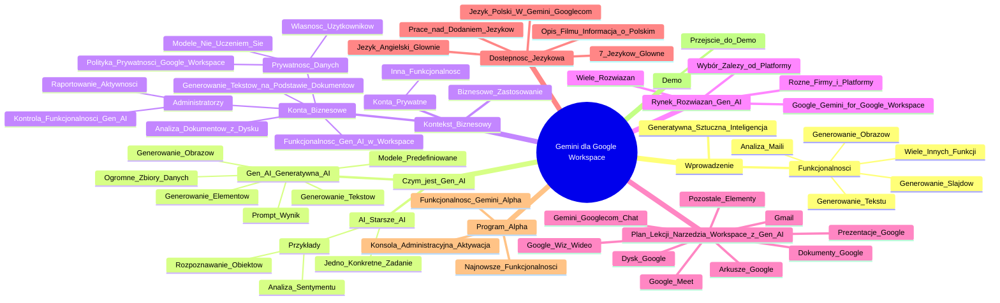

# Lekcje wideo - 1. Wstęp

# 💡 Diagram

___

# 🗒️ Notatka

# Gemini dla Google Workspace - Szczegółowe Notatki i Podsumowanie

## Wprowadzenie do Gemini dla Google Workspace (00:00:05 - 00:00:20)

*   Prezentacja wprowadza temat **Gemini dla Google Workspace**.
*   Omówienie dodatkowych możliwości **generatywnej sztucznej inteligencji (Gen AI)** w kontekście biznesowym.
*   Skoncentrowanie się na rozwiązaniach Google Workspace rozszerzonych o funkcje Gemini.
*   Funkcjonalności Gemini obejmują:
    *   Generowanie tekstu
    *   Analizę maili
    *   Generowanie slajdów
    *   Generowanie obrazów
    *   Wiele innych funkcji

## Czym jest Gen AI? (00:00:37 - 00:01:31)

*   **AI (sztuczna inteligencja)** jest rozwijana od lat.
    *   Starsze modele AI koncentrowały się na uczeniu **jednego konkretnego zadania**.
    *   Przykłady starszego AI:
        *   Rozpoznawanie obiektów na obrazach.
        *   Analiza sentymentu komentarzy (pozytywny/negatywny).
*   **Gen AI (generatywna sztuczna inteligencja)** oferuje dodatkowe możliwości:
    *   Generowanie dużej ilości **tekstów wysokiej jakości**.
    *   Generowanie **obrazów**.
    *   Generowanie **wielu innych elementów**.
*   Gen AI działa dzięki **modelom predefiniowanym**, które zostały wytrenowane na **ogromnych zbiorach danych**.
*   Użytkownik, poprzez **prompt**, wykorzystuje wzorce z danych, aby uzyskać oczekiwany wynik.

## Gemini dla Google Workspace - Kontekst Biznesowy (00:01:41 - 00:02:42)

*   Prezentacja skupia się na **biznesowym zastosowaniu Gemini dla Google Workspace**.
*   **Konta prywatne** również mogą aktywować licencję Gemini, ale funkcjonalność jest inna.
*   **Konta biznesowe** Google Workspace z Gemini oferują:
    *   Funkcjonalność Gen AI we wszystkich aplikacjach Workspace (Gmail, Dysk, Google Meet 🤝, Slajdy, Arkusze, itp.).
    *   Dostęp dla **administratorów** do:
        *   Pełnego **raportowania** aktywności w organizacji.
        *   **Kontroli** funkcjonalności Gen AI.
    *   **Gwarancję prywatności danych**:\
        *   Dane użytkowników stanowią **wyłącznie ich własność**.
        *   Modele Gemini **nie uczą się na danych użytkowników**.
        *   Dane są chronione **polityką prywatności Google Workspace**.
*   Możliwość wykorzystania Gemini do analizy dokumentów z Dysku i generowania tekstów na ich podstawie.

## Rynek Rozwiązań Gen AI (00:03:02 - 00:03:18)

*   Na rynku dostępnych jest **wiele rozwiązań Gen AI** od różnych firm i dla różnych platform.
*   Wybór rozwiązania Gen AI zależy od **platformy, na której pracuje organizacja**.
*   Prezentacja koncentruje się na **rozwiązaniu Google - Gemini for Google Workspace**.

## Plan Lekcji - Narzędzia Workspace z Gen AI (00:03:25 - 00:03:57)

*   Plan prezentacji obejmuje omówienie narzędzi Workspace z dostępną funkcjonalnością Gen AI:
    *   **Gmail**
    *   **Dysk Google**
    *   **Dokumenty Google**
    *   **Arkusze Google**
    *   **Prezentacje Google**
    *   **Google Meet** 🤝
    *   **Google Wiz** (nowa aplikacja do tworzenia wideo 🎬)
    *   **Gemini Googlecom** (pełnowymiarowy chat 💬 z Gemini)
    *   Pozostałe elementy

## Dostępność Językowa (00:03:57 - 00:04:28)

*   Gemini w większości aplikacji Workspace jest dostępny głównie w **języku angielskim**.
*   Obecnie dostępnych jest **siedem głównych języków** w większości funkcji.
*   Trwają prace nad **dodaniem kolejnych języków, w tym języka polskiego**.
*   **Język polski jest już dostępny w aplikacji Gemini Googlecom**.
*   Informacja o dostępności języka polskiego w pozostałych aplikacjach zostanie umieszczona **w opisie filmu**.

## Program Alpha (00:04:44 - 00:05:02)

*   Funkcjonalność Gemini prezentowana w filmie jest dostępna w ramach programu **Alpha**.
*   Dostęp do programu Alpha można aktywować w **konsoli administracyjnej Google Workspace**.
*   Program Alpha zapewnia dostęp do **najnowszych funkcjonalności Gemini**.

## Przejście do Demo (00:05:02)

*   Następuje przejście do demonstracji funkcjonalności Gemini w poszczególnych aplikacjach Workspace.

## Podsumowanie

Prezentacja dotyczy **Gemini dla Google Workspace**, narzędzia wykorzystującego generatywną sztuczną inteligencję w aplikacjach Google Workspace dla firm. Omówiono różnicę między starszym AI a Gen AI, podkreślając zdolność Gen AI do generowania tekstu i obrazów. Skupiono się na biznesowym aspekcie Gemini w Google Workspace, akcentując funkcjonalności dla kont biznesowych, kontrolę administratorów i ochronę prywatności danych. Przedstawiono plan prezentacji, obejmujący przegląd integracji Gemini z aplikacjami takimi jak Gmail, Dysk, Dokumenty, Arkusze, Prezentacje, Meet 🤝 i Wiz 🎬, a także pełnowymiarowy chat 💬 Gemini Googlecom. Zwrócono uwagę na obecną dostępność językową, głównie angielską, z językiem polskim dostępnym w Gemini Googlecom, i zapowiedziano dalsze rozszerzanie wsparcia językowego. Wspomniano o programie Alpha, umożliwiającym wcześniejszy dostęp do najnowszych funkcji Gemini. Prezentacja stanowi wprowadzenie do praktycznego wykorzystania Gemini w środowisku Google Workspace dla biznesu.

___

# 🔉 Transcript
File: Lekcje wideo - 1. Wstęp.mp4 
[00:00:05] Cześć.
[00:00:06] Dzisiaj opowiem wam o Gemini dla Google Workspace.
[00:00:11] Będziemy rozmawiali o dodatkowych możliwościach użycia generatywnej sztucznej inteligencji w waszym codziennym biznesowym życiu.
[00:00:20] Skupimy się na rozwiązaniach Google Workspace dla organizacji rozszerzonych o funkcjonalności Gemini, które pozwolą wam zarówno na generowanie dodatkowego tekstu, analizę maili, generowanie slajdów, obrazów i wielu, wielu, wielu innych elementów.
[00:00:37] Zanim do tego przejdziemy, zacznijmy od tego czym jest Gen AI.
[00:00:41] Bo o AI, o sztucznej inteligencji wszyscy już pewnie słyszeli.
[00:00:45] I AI jest technologią, która już jest rozwijana od wielu, wielu lat, polegała głównie na tym żeby nauczyć konkretny model jednego zadania.
[00:00:55] No i w ten sposób modele były w stanie przykładowo rozpoznać co się znajduje na obrazie.
[00:01:01] Czy były w stanie rozpoznać, czy dany komentarz jest komentarzem pozytywnym, czy negatywnym.
[00:01:06] To jest takie stare AI.
[00:01:08] Dzisiejsze AI nazywane Gen AI daje wam dodatkowo możliwości generowania ogromnej ilości tekstów w dobrej jakości, obrazów i wielu innych elementów.
[00:01:21] A to dzięki temu, że mamy modele predefiniowane, które były nauczone na ogromnej, ogromnej ilości danych.
[00:01:31] I teraz wykorzystując wzorce znajdujące się w tych danych, wy zadając konkretny prompt, będziecie w stanie uzyskać wynik, którego oczekujecie.
[00:01:41] Będziemy tutaj rozmawiali o Gemini dla Google Workspace biznesowego, tak jak wcześniej wspomniałem.
[00:01:48] Na prywatnych kontach oczywiście też możecie aktywować sobie licencję Gemini'ową, możecie też używać tych rozwiązań, natomiast tam funkcjonalność będzie trochę inna, więc to dziś, żeby było jasne rozmawiamy o biznesie.
[00:02:03] Na tych kontach biznesowych, oprócz tego, że otrzymujecie funkcjonalność Gen AI'ową we wszystkich znanych przez was aplikacjach jak Gmail, Dysk, Google Meet, slajdy, sheetsy i tak dalej to dodatkowo wasi administratorzy uzyskują dostęp zarówno do pełnego raportowania co się dzieje w organizacji, do kontroli funkcjonalności Gen AI'owej, ale też macie pewność, że wszystkie dane, których będziecie używać w ramach tego rozwiązania są objęte polityką prywatności, którą podpisywaliście przy aktywacji Google Workspace dla swojej organizacji.
[00:02:42] Czyli wasze dane są tylko wasze, nasze modele na nich się kompletnie nie uczą, ale nadal macie możliwość wykorzystywania Gemini'a do tego, żeby chociażby odczytać dokumenty z waszego dysku, przeanalizować je i na ich podstawie wygenerować sobie jakiś tekst.
[00:03:02] Na rynku znajdziecie ogrom rozwiązań Gen AI'owych tworzonych przez różne firmy dla różnych platform.
[00:03:11] Więc w zależności od tego na czym wasza organizacja pracuje, możecie dobrać dla siebie idealne rozwiązania.
[00:03:18] Natomiast dzisiaj skupimy się na rozwiązaniu googlowym, czyli Gemini for Google Workspace.
[00:03:25] Plan na te lekcje jest taki, że przejdziemy po kolei przez wszystkie narzędzia Workspace'owe, w których dzisiaj Gen AI jest już dostępny.
[00:03:36] Zaczniemy od Gmaila, przejdziemy przez Dysk, dokumenty, arkusze, prezentacje, Google Meet, Google Wiz, który jest nową aplikacją do tworzenia wideo, przejdziemy przez pełnowymiarowe Gemini Googlecom, gdzie możecie chatować z Gemini'em i dodatkowo przez pozostałe elementy, które też mogą wam się przydać.
[00:03:57] Zobaczycie, że w większości tych aplikacji będzie dostępny Gemini w języku angielskim.
[04:05] Na dzień dzisiejszy tych takich głównych języków dostępnych w większości miejsc jest siedem.
[04:10] Natomiast pracujemy nad tym, żeby jak najszybciej dostarczyć dodatkowe języki, w tym polski.
[04:17] Dzisiaj polski jest dostępny w aplikacji Gemini Googlecom, czyli w pełnowymiarowym czacie, w którym zobaczycie też później wam opowiem.
[04:28] Jeżeli już pojawi się polski w pozostałych aplikacjach, to pod tym filmem w opisie umieścimy wam komentarz, tak więc oglądając ten film, zerknij na dół i zobacz czy tam ewentualnie nie ma już informacji o tym, że język się pojawił.
[04:44] Dodatkowo zobaczycie, że funkcjonalność, której dzisiaj używam jest w programie Alpha.
[04:49] Możecie taki dostęp alpha odpalić sobie z poziomu konsoli administracyjnej i to da wam już dzisiaj dostęp do najświeższych funkcjonalności, które wypuszczamy.
[05:01] No to co?
[05:02] Przejdźmy teraz do demo i po kolei przez każdą aplikację.

___
# 🏷️ Tags
#Gemini
#Google_Workspace
#Gen_AI
#sztuczna_inteligencja
#generatywna_sztuczna_inteligencja
#tekst
#obrazy
#modele_predefiniowane
#prompt
#kontekst_biznesowy
#konta_prywatne
#konta_biznesowe
#administrator
#raportowanie
#kontrola
#prywatność_danych
#polityka_prywatności
#Gmail
#Dysk_Google
#Dokumenty_Google
#Arkusze_Google
#Prezentacje_Google
#Google_Meet
#Google_Wiz
#Gemini_Googlecom
#język_angielski
#język_polski
#program_Alpha
#konsola_administracyjna
#demo
#rozpoznawanie_obiektów
#analiza_sentymentu
