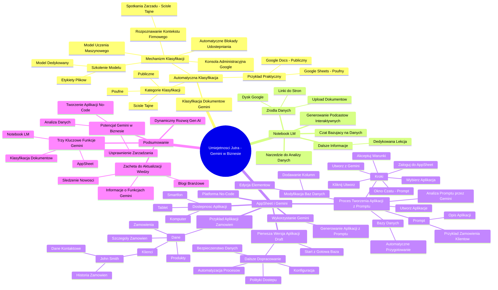

# Lekcje wideo - 10. Inne funkcje

# 💡 Diagram

___

# 🗒️ Notatka

# Umiejętności Jutra - Gemini w Biznesie

## Wprowadzenie

Niniejsza prezentacja wideo omawia zastosowanie narzędzia Gemini w kontekście biznesowym, w ramach inicjatywy "Umiejętności Jutra". Mówca, Kacper Ptasiński, przedstawia zaawansowane funkcje Gemini, które rozszerzają możliwości omawiane w podstawowych lekcjach. Podkreśla on wszechstronność Gemini i zachęca do dalszego eksplorowania tematu poprzez linki dostępne pod filmem.

## Klasyfikacja Dokumentów z Gemini

- **Automatyczna Klasyfikacja Dokumentów:** Gemini umożliwia automatyczną klasyfikację dokumentów w oparciu o analizę ich treści.
    - Kategorie klasyfikacji: **publiczne**, **poufne**, **ściśle tajne**.
- **Przykład Praktyczny:**
    - Dokument Google Docs zawierający informacje ogólne jest automatycznie klasyfikowany przez Gemini jako "Publiczny".
    - Dokument Google Sheets z tabelą danych zostaje oznaczony jako "Poufny", co świadczy o rozpoznaniu informacji wrażliwych.
- **Mechanizm Klasyfikacji:**
    - Klasyfikacja dokumentów opiera się na **modelu uczenia maszynowego**, a nie na przypadkowych algorytmach.
    - **Konsola Administracyjna Google:** Administratorzy mają możliwość stworzenia dedykowanego modelu klasyfikacji, dostosowanego do potrzeb organizacji.
    - **Szkolenie Modelu:** Model jest uczony na zbiorze plików zgromadzonych na Dysku Google organizacji.
    - W procesie szkolenia, administratorzy przypisują plikom etykiety (publiczny, poufny, ściśle tajny), aby model uczył się rozpoznawać różne kategorie dokumentów.
    - **Model Dedykowany dla Organizacji:** Po odpowiednim przeszkoleniu na reprezentatywnych danych, model staje się spersonalizowany i dedykowany konkretnej organizacji.
    - **Rozpoznawanie Kontekstu Firmowego:** Model jest w stanie rozpoznawać kontekst dokumentów specyficzny dla danej firmy, na przykład identyfikując dokumenty ze spotkań zarządu jako ściśle tajne.
    - **Automatyczne Blokady Udostępniania:** Istnieje możliwość automatycznego blokowania udostępniania dokumentów oznaczonych jako ściśle tajne poza strukturę organizacji.

## Notebook LM

- **Narzędzie Notebook LM:** Kolejnym narzędziem Workspace, które zostanie omówione, jest **Notebook LM**, przeznaczone do zaawansowanej analizy danych.
- **Źródła Danych:** Notebook LM umożliwia analizę danych pochodzących z różnorodnych źródeł:
    - Linki do stron internetowych.
    - Dokumenty przesyłane bezpośrednio do narzędzia (upload).
    - Dokumenty z Dysku Google (podlinkowanie).
- **Czat Bazujący na Danych:** Po zaimportowaniu danych z wybranych źródeł, użytkownik uzyskuje dostęp do interaktywnego czatu.
    - Czat generuje odpowiedzi **wyłącznie w oparciu o dostarczone dokumenty i źródła danych**, co zapewnia precyzję i kontekstualność informacji.
- **Generowanie Podcastów Interaktywnych:** Notebook LM oferuje funkcję generowania interaktywnych podcastów, co rozszerza możliwości prezentacji i analizy danych.
- **Dalsze Informacje:** Szczegółowe informacje dotyczące narzędzia Notebook LM są dostępne w dedykowanej lekcji, do której obejrzenia zachęcamy.

## AppSheet i Gemini

- **AppSheet:** AppSheet to platforma Google **no-code**, umożliwiająca tworzenie aplikacji bez konieczności pisania kodu.
    - **No-code:**  Tworzenie aplikacji odbywa się bez programowania, za pomocą interfejsu graficznego.
- **Wykorzystanie Gemini w AppSheet:** Gemini integruje się z AppSheet, wspierając proces tworzenia aplikacji na różne sposoby.
- **Generowanie Aplikacji na Podstawie Opisu (Promptu):** Jedną z kluczowych funkcji jest możliwość generowania aplikacji na podstawie opisu tekstowego, czyli `promptu`.
    - **Proces Tworzenia Aplikacji z Promptu:**
        1. Zaloguj się do AppSheet.
        2. Kliknij przycisk "Utwórz".
        3. Wybierz opcję "Aplikacja".
        4. Wybierz "Utwórz z Gemini".
        5. Zaakceptuj warunki korzystania z usługi.
        6. Otworzy się okno czatu, w którym można wprowadzić `prompt`.
    - **Prompt:** W oknie czatu wprowadź opis aplikacji, na przykład: "Chciałbym aplikację do śledzenia elektronicznych zamówień od klientów."
    - **Analiza Promptu przez Gemini:** Gemini analizuje wprowadzony `prompt` i generuje wstępną propozycję struktury aplikacji, dopasowaną do opisu.
    - **Bazy Danych:** Gemini automatycznie przygotowuje struktury baz danych, które stanowią fundament tworzonej aplikacji.
    - **Modyfikacja Baz Danych:** Użytkownik ma możliwość modyfikacji zaproponowanych baz danych, dodając lub edytując kolumny i elementy.
    - **Utworzenie Aplikacji:** Po zatwierdzeniu struktury baz danych, kliknięcie przycisku "Utwórz" inicjuje proces generowania kompletnej aplikacji.
- **Dostępność Aplikacji:** Utworzona aplikacja jest responsywna i dostępna na różnorodnych urządzeniach:
    - Smartfon.
    - Komputer.
    - Tablet.
- **Pierwsza Wersja Aplikacji (Draft):** Aplikacja wygenerowana przez Gemini stanowi **pierwszy draft**, czyli wersję roboczą.
    - **Dalsze Dopracowanie:** Konieczne jest dalsze dopracowanie i konfiguracja aplikacji w zakresie:
        - Ustawień konfiguracyjnych.
        - Bezpieczeństwa danych.
        - Polityk dostępu.
        - Automatyzacji procesów.
    - **Start z Gotową Bazą:**  Zaletą jest rozpoczęcie pracy z działającą aplikacją, zamiast startowania od zera i pustego projektu.
- **Przykład Aplikacji do Śledzenia Zamówień:** Przykładowa aplikacja do śledzenia zamówień zawiera predefiniowane dane, takie jak:
    - Produkty.
    - Zamówienia.
    - Szczegóły zamówień.
    - Klienci (np. przykładowy klient: John Smith, z danymi kontaktowymi i historią zamówień).

## Podsumowanie

- **Trzy Kluczowe Funkcje Gemini:** Prezentacja skupiła się na trzech zaawansowanych funkcjach Gemini w środowisku Workspace: automatycznej klasyfikacji dokumentów, Notebook LM i AppSheet.
- **Potencjał Gemini w Biznesie:** Gemini oferuje szereg narzędzi, które mogą znacząco usprawnić zarządzanie dokumentami, analizę danych oraz proces tworzenia aplikacji bez kodowania, co przekłada się na efektywność biznesową.
- **Dynamiczny Rozwój Gen AI:** Dziedzina Gen AI (generatywnej sztucznej inteligencji) charakteryzuje się dynamicznym rozwojem i ciągłymi innowacjami.
- **Zachęta do Aktualizacji Wiedzy:**  Zaleca się regularne śledzenie nowości, blogów branżowych oraz oficjalnych informacji o nowych funkcjach Gemini i Gen AI, które będą systematycznie udostępniane.

___

# 🔉 Transcript
File: Lekcje wideo - 10. Inne funkcje.mp4 
[00:00:00] Ekran: Białe tło.
[00:00:01] Ekran: Tytuł "Umiejętności Jutra" z logo AI obok. Pod spodem loga Google, SGH oraz Ministerstwo Cyfryzacji.
[00:00:05] Ekran: Mężczyzna siedzi przy biurku z laptopem i rośliną. W tle półki z dekoracjami i logo Google.
[00:00:05] Kacper Ptasiński: Jak widzicie, Gemini może być przydatne naprawdę w wielu, wielu różnych aspektach waszego życia biznesowego.
[00:00:12] Kacper Ptasiński: I to, co wam pokazałem w ramach tych lekcji, to oczywiście jest nie wszystko.
[00:00:17] Kacper Ptasiński: Gemini dzisiaj ma jeszcze parę innych elementów, które możecie wykorzystywać.
[00:00:22] Kacper Ptasiński: Natomiast o nich tylko tutaj wspomnę, jak będziecie zainteresowani, na pewno znajdziecie więcej informacji w linkach, które umieścimy poniżej.
[00:00:32] Kacper Ptasiński: Pierwsza rzecz.
[00:00:33] Kacper Ptasiński: Możecie w ramach Gemini dokonywać klasyfikacji dokumentów, czyli wskazywać, które dokumenty są dla was publiczne, które są poufne, a które są ściśle tajne.
[00:00:46] Kacper Ptasiński: Widzieliście, że jak dzisiaj tworzyliśmy różnego typu dokumenty, jak przykładowo, zobaczmy ten dokument, w którym coś pisaliśmy.
[00:00:48] Ekran: Podzielony na dwie części: po lewej stronie prezenter, po prawej stronie ekran komputera z otwartą zakładką Admin.
[00:00:51] Ekran: Pokazuje otwarty dokument w Google Docs z tekstem w języku angielskim. W górnej części dokumentu widoczny napis "Public".
[00:00:55] Ekran: Pokazuje dokument Google Docs z napisem "Public" w górnej części.
[01:00:00] Kacper Ptasiński: Zobaczcie, że tutaj automatycznie na górze została przypisana etykieta publiczny.
[01:01:01] Kacper Ptasiński: To oznacza, że Gemini rozpoznało, że w tym dokumencie nie mam nic poufnego, tajnego, więc to jest dokument, który ewentualnie mógłbym udostępnić na zewnątrz organizacji.
[01:11:3] Ekran: Pokazuje otwarty dokument Google Sheets z tabelą. W górnej części dokumentu widoczny napis "Confidential".
[01:12:08] Kacper Ptasiński: Zobaczmy, że jak w tym dokumencie generowaliśmy tabelę, to mamy etykietę confidential, czyli już były zawarte informacje, które zostały sklasyfikowane jako poufne i już powinniśmy się z nimi obchodzić w bardziej rygorystyczny sposób.
[01:29:03] Kacper Ptasiński: Taka klasyfikacja nie bierze się znikąd.
[01:33:03] Ekran: Otwarta zakładka Admin w przeglądarce Google Chrome.
[01:35:02] Kacper Ptasiński: W konsoli administracyjnej, wasi administratorzy mają możliwość stworzenia specjalnego modelu, który nauczą na waszych plikach, czyli
[01:44:05] Kacper Ptasiński: przejdą przez wasze pliki, które macie zgromadzone na Dysku Google.
[01:48:08] Kacper Ptasiński: I każdy z nich pooznaczają taką etykietą szkoleniową, zaznaczając: ten plik jest poufny, ten plik jest publiczny, ten plik jest ściśle tajny.
[01:59:07] Kacper Ptasiński: Jak zrobią to dla wystarczającej ilości plików, w tym momencie wygeneruje się model, który będzie działał specjalnie dla waszej organizacji i który na przyszłość rozpozna, że w każdym jednym dokumencie, w którym na przykład piszecie o spotkaniu zarządu i o tym, jakie informacje tam były zawarte, to że taki dokument w kontekście waszej firmy jest dokumentem ściśle tajnym i automatycznie możecie narzucić blokady, że on nie może być udostępniany nigdzie poza organizację.
[02:33:02] Kacper Ptasiński: Drugim z narzędzi, które będziecie mogli wykorzystać przy Workspace jest narzędzie Notebook LM, czyli narzędzie, które będziecie mogli wykorzystać do tego, aby przeanalizować zakresy danych, które tutaj umieścicie.
[02:36:08] Ekran: Otwarta strona w przeglądarce, notebooklm.google.
[02:39:09] Kacper Ptasiński: Możecie do niego wrzucić zarówno linki do stron internetowych, jak i dokumenty, jak i podlinkować dokumenty z waszego dysku i później macie dostęp po umieszczeniu tych wszystkich źródeł do czata, który będzie wam odpowiadał tylko i wyłącznie bazując na tych dokumentach.
[03:09:04] Kacper Ptasiński: Lub możecie też to wykorzystać do generowania chociażby interaktywnego podcastu.
[03:14:04] Kacper Ptasiński: W innej lekcji znajdziecie więcej informacji, jak używać Notebook LM. Bardzo polecam ją obejrzeć.
[03:21:09] Kacper Ptasiński: Trzeci element, o którym warto wspomnieć, to jest rozwiązanie AppSheet.
[03:27:09] Kacper Ptasiński: W ramach rozwiązania AppSheet, które jest googlowym rozwiązaniem no-code do tworzenia aplikacji. To oznacza, że nie potrzebujecie kodować, żeby tworzyć aplikacje.
[03:38:09] Kacper Ptasiński: Możecie wykorzystać Gemini do paru rzeczy.
[03:41:09] Kacper Ptasiński: Jedną z nich jest chociażby generowanie aplikacji na bazie promptu, więc jak tylko zalogujemy się do AppSheet, po lewej stronie kliknąć przycisk utwórz.
[03:51:03] Kacper Ptasiński: Wybrać aplikację i wybrać utwórz z Gemini.
[03:57:03] Kacper Ptasiński: Wybierając tą opcję dostaniemy najpierw prośbę o akceptację warunków. Zaakceptujemy.
[04:05:03] Kacper Ptasiński: I w kolejnym kroku pojawi nam się czat.
[04:09:03] Kacper Ptasiński: Jeżeli teraz chciałbym wygenerować aplikację, która ma śledzić moje zamówienia, mogę napisać tak:
[04:26:03] Kacper Ptasiński: Chciałbym aplikację, która będzie śledziła elektroniczne zamówienia od moich klientów.
[04:31:00] Kacper Ptasiński: Klikam wyślij. Gemini przeanalizuje mojego prompta.
[04:38:04] Kacper Ptasiński: Przygotuje mi bazy danych, które powinny być utworzone pod spodem dla tej aplikacji.
[04:44:03] Kacper Ptasiński: Mogę z tego punktu te bazy zmodyfikować, dodać kolejne kolumny, kolejne elementy.
[04:49:03] Kacper Ptasiński: Jeżeli uważam, że one są okej, klikam create, utwórz.
[04:55:03] Kacper Ptasiński: I w ten sposób zostanie utworzona aplikacja, którą moi pracownicy będą mogli używać zarówno na telefonie, na komputerze, czy na tablecie.
[05:07:03] Kacper Ptasiński: Oczywiście, tak jak w wypadku wiców, czy w wypadku tworzenia slajdów i innych elementów, pamiętajcie, że to jest pierwszy draft.
[05:16:03] Kacper Ptasiński: I sami powinniście pójść krok dalej i dopracować tą aplikację kolejnymi konfiguracjami, tak żeby miała zachowane pełne bezpieczeństwo, pełne polityki, pełne automatyzacje, które was interesują, ale już nie startujecie od zera, tylko startujecie od aplikacji, która wygląda, tak jak za chwilkę zobaczycie.
[05:41:03] Kacper Ptasiński: Mamy przykładowo tutaj aplikacje i zobaczcie, mamy umieszczone jakieś informacje o produktach. Mamy przykładowe zamówienia.
[05:51:03] Kacper Ptasiński: Mamy przykładowe szczegóły i przykładowych klientów wygenerowanych, klikając na Johna Smitha.
[05:58:03] Kacper Ptasiński: Widzę jego przykładowy adres email, numer telefon, numer telefonu i zamówienie, które John złożył i wchodząc teraz w niego widzę pod jaki adres, za jaką kwotę, w jakiej ilości, mogę wejść głębiej i zobaczyć, że okej, zamówił 10 sztuk tego produktu za taką kwotę.
[06:17:07] Kacper Ptasiński: Więc już widzicie, że macie bardzo fajne miejsce do rozpoczęcia dalszej pracy.
[06:23:04] Kacper Ptasiński: I to są trzy przykłady, które warto dodatkowo rozważyć, się z nimi zapoznać, ale pamiętajcie, że Gen AI jest dzisiaj najszybciej rozwijającą się dziedziną w technologii.
[06:37:03] Kacper Ptasiński: Więc bardzo zachęcam do śledzenia wszystkich newsów, bloga i informacji na temat nowych rzeczy, które zdecydowanie i na pewno będziemy za chwilę wypuszczać.
[06:49:00] Ekran: Tytuł "Umiejętności Jutra" z logo AI obok. Pod spodem loga Google, SGH oraz Ministerstwo Cyfryzacji.

___
# 🏷️ Tags
#Umiejętności_Jutra #Gemini #Biznes #Kacper_Ptasiński #Automatyczna_Klasyfikacja_Dokumentów #Dokumenty #Publiczne #Poufne #Ściśle_Tajne #Google_Docs #Google_Sheets #Model_Uczenia_Maszynowego #Konsola_Administracyjna_Google #Dysk_Google #Etykiety #Model_Dedykowany #Kontekst_Firmowy #Automatyczne_Blokady_Udostępniania #Notebook_LM #Analiza_Danych #Linki #Strony_Internetowe #Upload #Podlinkowanie #Czat #Podcasty_Interaktywne #AppSheet #No-code #Aplikacje #Prompt #Bazy_Danych #Draft #Ustawienia_Konfiguracyjne #Bezpieczeństwo_Danych #Polityki_Dostępu #Automatyzacja_Procesów #Śledzenie_Zamówień #Gen_AI #Generatywna_Sztuczna_Inteligencja #Workspace #Google #SGH #Ministerstwo_Cyfryzacji
