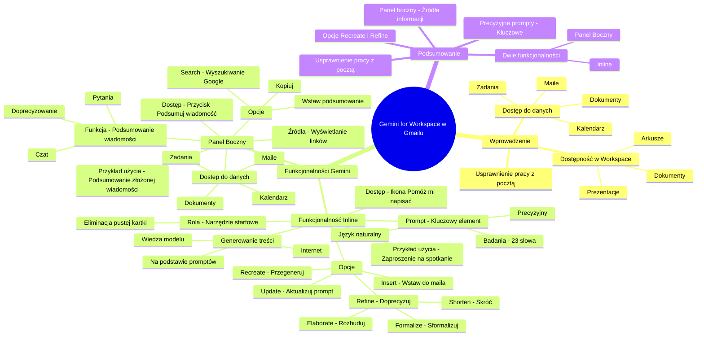

# Lekcje wideo - 2. Gmail

# 💡 Diagram

___

# 🗒️ Notatka

# Umiejętności Jutra: Gemini for Workspace w Gmailu - Notatki i Podsumowanie

## Wprowadzenie

Prezentacja omawia wykorzystanie **Gemini for Workspace** w aplikacji Gmail. Gemini oferuje nowe funkcjonalności, które mają na celu usprawnienie pracy z pocztą elektroniczną 📧. Te same funkcjonalności będą dostępne również w innych aplikacjach Workspace, takich jak Dokumenty, Arkusze i Prezentacje. Kluczową zasadą działania jest dostęp do danych użytkownika (maili, dokumentów, kalendarza 📅, zadań 📝) zarówno w Gmailu, jak i w pozostałych aplikacjach pakietu Workspace.

## Funkcjonalności Gemini w Gmailu

W Gmailu dostępne są dwie główne funkcjonalności Gemini:

1. **Funkcjonalność Inline (wbudowana)**:
    - Dostępna bezpośrednio w oknach tworzenia i edycji wiadomości.
    - Ikona ołówka ✏️ z gwiazdką ⭐ z opisem \"Help me write\" (Pomóż mi napisać).
    - Umożliwia generowanie treści maili na podstawie **promptów**.
    - Wykorzystuje wiedzę, na której model był uczony, oraz treści dostępne w internecie 🌐.
    - **Ważne**: Gemini nie jest \"magicznym oknem\". Wymaga precyzyjnych `promptów`.
    - Stanowi formę programowania komputera za pomocą języka naturalnego, alternatywną dla tradycyjnych języków programowania.
    - Im bardziej szczegółowy `prompt`, tym lepszy rezultat.
    - Badania wskazują, że `prompty` zawierające powyżej 23 słów są najbardziej efektywne.
    - Możliwość **recreate** (przegenerowania) wiadomości na podstawie tego samego `prompta` – za każdym razem generowany jest inny wynik.
    - Opcja **refine** (doprecyzowania) – zmiana stylu wiadomości poprzez wybór jednej z opcji:
        - **Formalize** (sformalizuj) –  język staje się poważniejszy.
        - **Elaborate** (rozbuduj) – dodawanie dodatkowych informacji.
        - **Shorten** (skróć) – skrócenie wiadomości.
    - Możliwość edycji `promptu` i **update** (aktualizacji) wygenerowanej treści.
    - Przycisk **Insert** (wstaw) –  umożliwia wstawienie wygenerowanej treści do okna maila, gdzie można ją dalej modyfikować.
    - Gemini pełni rolę narzędzia startowego –  pomaga rozpocząć pisanie, eliminując problem \"pustej kartki\".

    ### Przykład użycia funkcjonalności Inline

    - **Prompt**: \"Potrzebuję zaprosić mój zespół na coroczne spotkanie podsumowujące.\"
    - Gemini generuje krótki mail na podstawie `promptu`.
    - Możliwość wykorzystania opcji **refine** (np. dodanie agendy).
    - Po wstawieniu maila (**Insert**) można go edytować i dostosować (np. dodać datę 📅 i godzinę 🕰️).

2. **Panel Boczny (Side panel)**:
    - Uruchamiany przyciskiem \"Podsumuj tą wiadomość\" w otwartej wiadomości.
    - Umożliwia **podsumowanie** złożonych, wielowątkowych wiadomości.
    - Dostępny w formie czatu –  pozwala na zadawanie pytań, prośby o doprecyzowanie tematów czy podsumowanie danych.
    - Ma dostęp do maili, dokumentów, kalendarza 📅 i zadań 📝 użytkownika.
    - Wyświetla **źródła**, z których Gemini korzystało, generując odpowiedź (linki do maili, plików) –  szczególnie przydatne przy złożonych zapytaniach angażujących wiele źródeł.
    - Dostępne opcje: wstawienie podsumowania do maila, skopiowanie, wyszukiwanie Google (**Search**) –  odwołanie do wiedzy z internetu 🌐.

    ### Przykład użycia Panelu Bocznego

    - Otwarcie złożonej wiadomości.
    - Kliknięcie przycisku \"Podsumuj tą wiadomość\".
    - Wyświetlenie podsumowania w panelu bocznym.
    - Prezentacja źródeł, na których bazowało podsumowanie.

## Podsumowanie

Gemini for Workspace w Gmailu wprowadza dwie główne funkcjonalności: **inline** – generowanie treści maili za pomocą `promptów`, oraz **side panel** –  do podsumowywania wiadomości i interakcji w formie czatu 💬. Obie funkcjonalności mają na celu usprawnienie i przyspieszenie pracy z pocztą elektroniczną 📧, traktując Gemini jako narzędzie wspomagające, a nie zastępujące ludzką kreatywność i proces edycji. Kluczowe dla efektywnego wykorzystania narzędzia jest formułowanie precyzyjnych `promptów`, aby osiągnąć oczekiwane rezultaty. Gemini oferuje opcje **recreate** i **refine** dla wygenerowanych treści, co umożliwia ich dostosowanie do indywidualnych potrzeb. Panel boczny dodatkowo ułatwia zrozumienie złożonych wątków mailowych i weryfikację źródeł informacji.

___

# 🔉 Transcript
File: Lekcje wideo - 2. Gmail.mp4 
[00:00:00] (Ekran wyświetla białe tło z pionową czarną linią po lewej stronie)
[00:00:05] (Na ekranie pojawia się tekst "Umiejętności Jutra" w kolorze czarnym oraz logo AI w tle. W dolnej części ekranu widoczne są loga organizacji: Google, SGH oraz Ministerstwa Cyfryzacji)
[00:00:05] Na początek Gmail.
[00:00:07] Zaczynamy od możliwości Gemini for Workspace w ramach Gmaila.
[00:00:12] I przy okazji tego produktu zobaczycie też pewną prawidłowość.
[00:00:16] Będziecie mieli dostęp na przestrzeni różnych produktów, szczególnie takich jak dokumenty, arkusze, prezentacje i paru innych.
[00:00:23] Zarówno funkcjonalność, którą my nazywamy inline i wtedy mamy funkcjonalność taką dostępną w ramach różnych kontrolek w danej aplikacji.
[00:00:32] Przykładowo w Gmailu, jak klikniemy utwórz nowego maila, będziemy mogli kliknąć wygeneruj wiadomość i wygenerować ją za pomocą prompta.
[00:00:41] Ta funkcjonalność inline'owa pozwoli wam na generowaniu treści bezpośrednio z wiedzy, na której ten model był uczony, lub treściach z internetu.
[00:00:52] Natomiast zobaczycie też na przestrzeni tych wszystkich aplikacji taki panel boczny, side panel, w ramach którego będziecie mogli w formie już bardziej czatowej prosić o doprecyzowanie jakiś konkretnych tematów, podsumowanie danych i innych elementów i side panel ma dostęp zarówno do waszych maili, jak i dokumentów, waszego kalendarza, czy chociażby waszych zadań.
[00:01:19] I ta prawidłowość co do dostępu do danych będzie identyczna w pozostałych aplikacjach, o których będziemy mówić w ramach tej lekcji.
[00:01:27] Zacznijmy od Gmaila, od funkcjonalności inline'owej i zobaczmy jak możemy w Gmailu poradzić sobie wykorzystując Gemini.
[00:01:37] (Ekran przedstawia widok skrzynki odbiorczej Gmaila na komputerze)
[00:01:38] Pierwszy punkt.
[00:01:39] Chcemy utworzyć nową wiadomość.
[00:01:42] (Ekran przedstawia widok okna nowej wiadomości w Gmailu na komputerze)
[00:01:42] Aby utworzyć nową wiadomość, klikam utwórz i w okienku, które mi się wyświetliło, widzicie, że tutaj na dole pojawia się ikona takiego ołówka z gwiazdką.
[00:01:54] To jest ikona Gemini, która będzie dostępna w wielu aplikacjach i jest określona opisem Help me write, czyli pomóż mi napisać.
[00:02:04] Klikając na nią wyświetli się okienko proszące nas o wpisanie promptu.
[00:02:11] Pamiętajcie, że to okienko to nie jest magiczne okno, w które jak cokolwiek wpiszecie, to Gemini zrozumie wasze myśli i intencje i wygeneruje wam za każdym razem idealną wiadomość czy content, którego oczekujecie.
[00:02:27] Nie, tak to nie działa.
[00:02:29] W dalszym ciągu programujecie komputer, tylko dzisiaj programujecie komputer nie używając już skomplikowanych języków programowania, ale używając języka, który znacie na co dzień.
[00:02:42] Dzięki temu jesteście w stanie o wiele łatwiej osiągnąć oczekiwane wyniki, tylko pamiętajcie, żeby w ramach tego prompta dokładnie opisać czego oczekujecie, w jakiej formie, jakim językiem napisane, w jakim formacie powinno ewentualnie się wyświetlić.
[00:03:02] Im więcej dacie szczegółów, tym lepszy będziecie mieli efekt końcowy.
[00:03:07] Na potrzeby dzisiejszego demo i tych lekcji, ja będę głównie używał krótkich promptów, żeby oszczędzić czas.
[00:03:15] Natomiast nasze wewnętrzne badania pokazują, że prompty powyżej 23 słów mają najlepszą skuteczność.
[00:03:23] Więc spędźcie chwilę czasu, jeżeli coś będzie się generowało nie tak jak chcecie, spróbujcie zredefiniować prompt, spróbujcie napisać trochę więcej informacji, więcej szczegółów i powinniście uzyskać o wiele lepszą jakość odpowiedzi.
[00:03:39] Zacznijmy od tego maila.
[00:03:40] Przykładowo chciałbym zaprosić mój zespół na spotkanie podsumowujące cały rok.
[00:03:57] (Mężczyzna wpisuje tekst w oknie tworzenia nowej wiadomości)
[00:04:00] Potrzebuję zaprosić mój zespół na coroczne spotkanie podsumowujące.
[00:04:06] (Mężczyzna klika przycisk "Utwórz")
[00:04:06] (Ekran wyświetla widok okna nowej wiadomości z uzupełnioną treścią. Po prawej stronie widoczny jest pasek boczny Gemini)
[00:04:07] Widzicie, że na bazie tego wygenerował mi się krótki mail.
[00:04:10] Krótki, bo prompt, który zawarłem nie daje za wiele informacji.
[00:04:15] Widzimy tutaj, że możemy na dole przegenerować tą wiadomość, wykorzystując recreate i wtedy wiadomość zostanie wygenerowana ponownie na bazie tego samego promptu, dając nam inny efekt, inne słowa zostaną użyte, może będzie dłuższa, może krótsza.
[00:04:31] To jest za każdym razem, można powiedzieć, losowe i inne.
[00:04:37] Po prawej stronie mamy natomiast przycisk refine, który pozwoli nam zmienić wygląd tego maila na inny.
[00:04:44] Mamy tutaj przycisk do sformalizowania wiadomości, żeby użyć być może bardziej poważnych słów.
[00:04:51] Mamy przycisk, który nam pozwoli rozbudować tą wiadomość o dodatkowe informacje, czy mamy przycisk, który pozwoli tą wiadomość skrócić, jeżeli przykładowo byłaby za długa.
[00:05:01] Możemy też u góry wrócić do okienka promptowania i tutaj dodać dodatkowe szczegóły, jak na przykład przygotuj wstępną agendę.
[00:05:17] (Mężczyzna klika przycisk "Update")
[00:05:17] (Ekran przedstawia widok okna nowej wiadomości z uzupełnioną treścią. Po prawej stronie widoczny jest pasek boczny Gemini)
[00:05:21] Zobaczycie, że na bazie tego wygenerował mi się krótki mail.
[00:05:27] (Widok mężczyzny na tle ekranu)
[00:05:27] Czy to jest mail, który ja osobiście bym użył i wysłał do mojego zespołu?
[00:05:31] Pewnie nie.
[00:05:32] Ale zobaczcie, że mam już wygenerowaną strukturę maila, większość słów, poprawny opis.
[00:05:41] (Mężczyzna klika przycisk "Insert")
[00:05:41] (Ekran powraca do widoku skrzynki odbiorczej Gmaila)
[00:05:41] (Mężczyzna klika przycisk "Wyślij")
[00:05:41] W momencie, kiedy wcisnę insert, to zostanie wstawione już do okienka, w którym teraz mogę dokonać moich własnych poprawek, poprawić agendę, dopisać może datę, godzinę, dopisać jakieś dodatkowe elementy i wtedy jestem gotowy do wysyłki.
[00:05:56] Więc traktujcie Gemini jako narzędzie, które będzie wam pomagało wystartować z punktu, gdzie macie już przygotowany content i w tym momencie wy go tylko poprawiacie, a nie musicie zaczynać od pustej kartki i od zera wymyślać jak to powinno być skonstruowane.
[00:06:15] Idziemy dalej.
[00:06:17] Kolejna funkcjonalność będzie dla was dostępna po wejściu w wiadomość.
[00:06:21] (Mężczyzna klika w wiadomość o nazwie "Project Security Incorporating Security into Google Workspace Projects")
[00:06:23] (Ekran przedstawia widok okna wybranej wiadomości w Gmailu na komputerze)
[00:06:24] Jeżeli ta wiadomość byłaby bardziej złożona, wielowątkowa, być może i chcielibyście szybko podsumować to co się tutaj w niej dzieje, możecie kliknąć u góry przycisk podsumuj tą wiadomość.
[00:06:38] Spowoduje to uruchomienie po raz pierwszy tego paska bocznego po prawej stronie i tu zobaczycie podsumowanie tego co się w tej wiadomości znajduje.
[00:06:48] Zobaczycie poniżej z jakich źródeł Gemini korzystało do tego, żeby tą wiadomość wam wygenerować i tu możecie kliknąć, żeby tego maila otworzyć i zobaczyć jak to wygląda.
[00:06:58] W wypadku tego konkretnego zapytania, które ma nam podsumować wiadomość, którą mamy właśnie uruchomioną, może to niewiele znaczy.
[00:07:07] Ale jak będziecie przykładowo zadawać pytanie, które do wygenerowania odpowiedzi zaangażuje trzy maile i pięć plików z waszego dysku, to te linki do źródeł są bardzo przydatne do tego, żeby zlokalizować i zweryfikować poziom informacji, który tutaj został dostarczony.
[00:07:26] Poniżej zobaczycie też ikonkę do wstawienia tej wiadomości bezpośrednio w maila, do jej skopiowania, czy do powtórzenia searcha za pomocą wyszukiwania Google.
[00:07:40] I w tym momencie już odwołujemy się do wiedzy z internetu, to też będzie miało znaczenie przy bardziej otwartych pytaniach, które będziecie budować.
[00:07:50] Idziemy dalej.
[00:07:50] Kolejna funkcjonalność będzie dla was dostępna po wejściu w wiadomość.
[00:07:51] Przykładem tu mamy wiadomość od Amelii.
[00:07:52] Jeżeli ta wiadomość byłaby bardziej złożona, wielowątkowa być może i chcielibyście szybko podsumować to co się tutaj w niej dzieje, możecie kliknąć u góry przycisk podsumuj tą wiadomość.
[00:08:00] Spowoduje to uruchomienie po raz pierwszy tego paska bocznego po prawej stronie i tu zobaczycie podsumowanie tego co się w tej wiadomości znajduje.
[00:08:15] Zobaczycie poniżej z jakich źródeł Gemini korzystało do tego, żeby tą wiadomość wam wygenerować i tu możecie kliknąć, żeby tego maila otworzyć i zobaczyć jak to wygląda.
[00:08:25] (Mężczyzna klika w okno tworzenia nowej wiadomości)
[00:08:25] (Ekran przedstawia widok okna nowej wiadomości w Gmailu na komputerze)

___
# 🏷️ Tags
#Gemini_for_Workspace #Gmail #umiejętności_jutra #prezentacja #poczta_elektroniczna #funkcjonalności #dane_użytkownika #dokumenty #arkusze #prezentacje #kalendarz #zadania #funkcjonalność_inline #okno_tworzenia #edycja_wiadomości #ołówek_z_gwiazdką #Help_me_write #Pomóż_mi_napisać #prompt #wiedza #internet #magiczne_okno #programowanie #język_naturalny #szczegółowy_prompt #recreate #przegenerowanie #refine #doprecyzowanie #Formalize #sformalizuj #Elaborate #rozbuduj #Shorten #skróć #update #aktualizacja #Insert #wstaw #narzędzie_startowe #pusta_kartka #zespół #coroczne_spotkanie #agenda #data #godzina #panel_boczny #side_panel #Podsumuj_tą_wiadomość #podsumowanie #czat #źródła #linki_do_maili #pliki #Search #wyszukiwanie_Google #wątki_mailowe #kreatywność #proces_edycji #efektywne_wykorzystanie #indywidualne_potrzeby #weryfikacja_źródeł #AI #Google #SGH #Ministerstwo_Cyfryzacji #skrzynka_odbiorcza #utwórz_nową_wiadomość #wygeneruj_wiadomość #kontrola #treści_z_internetu #doprecyzowanie_tematów #krótkie_prompty #skuteczność #redefiniowanie_promptu #jakość_odpowiedzi #struktura_maila #poprawny_opis #własne_poprawki #przygotowany_content #bardziej_złożona_wiadomość #wielowątkowa_wiadomość #Project_Security #Incorporating_Security_into_Google_Workspace_Projects #Amelia
